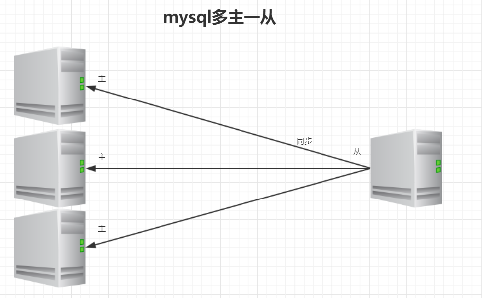
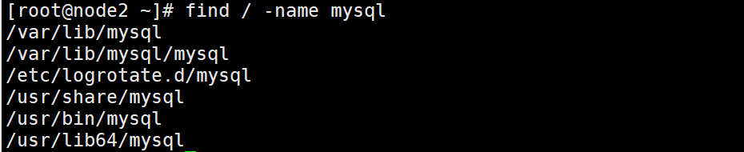

# 1、Oracle数据库

## 1、Oracle入门

### 1、Oracle介绍

#### 一、数据库的版本

​	Oracle 8及8i:i表示的internet,向网络发展，过渡版本，只有一张vcd。8i是过渡性产品。

​	Oracle9i：是之前使用最广泛版本，8i的升级版。1CD

​	Oracle10g:700M过渡性产品,其中g表示的是网格计算。以平面网格，以中心查找。

​	Oracle11g:完整性产品,最新版本2G。

​	Oracle12c:the world's first database designed for the cloud

#### 二、用户

​	1)、sys 超级管理员 bjmsb

​	2)、system 普通管理员 bjmsb

​	3)、scott 普通的用户 tiger

#### 三、实例 -->数据库

#### 四、数据库实例名 统一使用orcl

### 2、Oracle安装

#### 1、Oracle的服务

oracle安装后会启动七个服务

当oracle安装完成之后，会出现如下服务，其中OracleServiceORCL和OracleOraDb11g_home1TNSListener是最关键的服务，如果安装完成之后发现只有两个服务，那意味着安装过程中存在问题，所以需要将oracle完整删除。

Oracle 11g服务详细介绍及哪些服务是必须开启的？
安装oracle 11g R2中的方法成功安装Oracle 11g后，共有7个服务，这七个服务的含义分别为：
1. Oracle ORCL VSS Writer Service：Oracle卷映射拷贝写入服务，VSS（Volume Shadow Copy Service）能够让存储基础设备（比如磁盘，阵列等）创建高保真的时间点映像，即映射拷贝（shadow copy）。它可以在多卷或者单个卷上创建映射拷贝，同时不会影响到系统的系统能。（非必须启动）
2. OracleDBConsoleorcl：Oracle数据库控制台服务，orcl是Oracle的实例标识，默认的实例为orcl。在运行Enterprise Manager（企业管理器OEM）的时候，需要启动这个服务。（非必须启动）
3. OracleJobSchedulerORCL：Oracle作业调度（定时器）服务，ORCL是Oracle实例标识。（非必须启动）
4. OracleMTSRecoveryService：服务端控制。该服务允许数据库充当一个微软事务服务器MTS、COM/COM+对象和分布式环境下的事务的资源管理器。（非必须启动）
5.  OracleOraDb11g_home1ClrAgent：Oracle数据库.NET扩展服务的一部分。 （非必须启动）
6. **OracleOraDb11g_home1TNSListener：监听器服务，服务只有在数据库需要远程访问的时候才需要。**
   **必须启动，下面会有详细详解）。**
7.  **OracleServiceORCL：数据库服务(数据库实例)，是Oracle核心服务该服务，是数据库启动的基础， 只**
   **有该服务启动，Oracle数据库才能正常启动。(必须启动)**

那么在开发的时候到底需要启动哪些服务呢？
对新手来说，要是只用Oracle自带的sql*plus的话，只要启动OracleServiceORCL即可，要是使用PL/SQL Developer等第三方工具的话，OracleOraDb11g_home1TNSListener服务也要开启。OracleDBConsoleorcl是进入基于web的EM必须开启的，其余服务很少用。
注：ORCL是数据库实例名，默认的数据库是ORCL，你可以创建其他的，即OracleService+数据库名

1、所有的服务改成"手动"
2、启动两个
	1)、监听服务：OracleOraDb10g_home1TNSListener
	 	监听客户端的连接
	2)、数据库服务：OracleServiceORCL
		命名规则：OracleService+实例名

#### 2、账户管理

使用scott用户登录,第一次登录的时候会显示账户锁定，需要将账户解锁：

1)使用DBA登录：
运行命令行工具
	sqlplus /nolog;
 	conn sys/bjmsb@orcl as sysdba;

2)解锁命令：
 	alter user scott account unlock|lock;

3)测试：
	conn scott/tiger@orcl;
要求重新输入密码，确认你自己的密码即可，建议学习的时候简单即可

#### 3、常用命令

sqlplus
	sqlplus /nolog：命令行进入
	conn scott/tiger@orcl：连接到数据库
	show user：显示用户
	set linesize 150：调格式：行字符
	set pagesize 20：调格式：列字符
	passw：改密码
	conn sys/abc123456@orcl as sysdba
	**select * from emp where ename=‘&ename’**

alter user scott account unlock
	统一密码：tiger

#### 4、工具

Pl/sql连接常见问题

### 3、SQL

结构化查询语言 (Structured Query Language)，具有定义、查询、更新和控制等多种功能，是关系数据库的标准语言。

#### 1、SQL分类：

​	数据操纵语言DML Data Manipulation Language :
​	SELECT INSERT UPDATE DELETE     针对的对象是表里面的数据

​	数据定义语言DDL Data definition language :
​	CREATE ALTER DROP RENAME TRUNCATE      针对的是表结构

​	数据控制语言DCL Data Control Language :
​	GRANT REVOKE   针对用户访问或权限控制
Transaction:commit rollback savepoint

#### 2、常用

Select * from tab;//查看用户下的所有表
Select * from user_tables;//详细查询当前用户下的所有表

desc 表名； //查看表结构

查看所有表：select table_name from user_tables;
查看表结构：describe dept;(或者desc dept;)

emp表      雇员表(employee)
Empno: 雇员工号 Ename: 雇员名字
Job:工作。（秘书、销售、经理、分析员、保管）
Mgr(manager):经理的工号 Hiredate:雇用日期
Sal: 工资 Comm: 津贴 Deptno: 所属部门号

dept表        部门表（department）
Deptno:部门号 Dname:部门名字 Loc: 地址

salgrade表           一个公司是有等级制度，用此表表示一个工资的等级
Grade:等级 losal:最低工资 hisal:最高工资

bonus表             奖金表：表示一个雇员的工资及奖金。
Ename:雇员名字， job:工作，
sal: 工资 comm:津贴

#### 3、添加注释

为表添加注释
comment on table emp is ‘雇员表';
为列添加注释
comment on column emp.Empno is '雇员工号';                                                                                                                                    --：Oracle的注释

### 4、学习

Select-from-where句型
SELECT [DISTINCT] {*,column alias,..}FROM table alias
Where 条件表达式

```sql
-- 查询雇员中部门编号为10的员工
select empno,ename,job from emp where deptno=10;
-- distinct 去重
select distinct deptno from emp;
-- 在查询过程中给列添加别名，同时也可以给表添加别名,给列起别名可以加as，也可以不加，别名存在空格要加双引号
select e.empno as 雇员编号;e.ename as 雇员名称;e.job as 雇员工作 from emp e where e.deptno=10;
-- 查询所有字段，使用*，真实环境不会使用
select * from emp；
```

alias
Column alias
Column “alias”
Column as alias

```sql
-- 检索单个列
select col from tableName;
-- 检索多个列
select  col1, col2,col3  from tableName;
-- 检索所有列
select  *  from tableName;
-- 使用通配符的优点：书写方便、可以检索未知列
-- 使用通配符的缺点：降低检索的性能
-- 给检索出的列起个别名
select job  "gong zuo"   from emp;
select job  as  "gong zuo"   from emp;
```

#### 1、表别名

```sql
Select e.*  from emp e;
Select e.empno,e.deptno from emp e;
```

注意只查询固定列数据的时候，建议不要使用 *
效率低！

#### 2、distinct

distinct必须放在开头
多字段
每个字段不一样才去重

#### 3、语法

##### 1、条件比较

```sql
/*
＝，！＝,<>，<,>,<=,>=,any,some,all
is null,is not null
between x and y
in（list），not  in（list）
exists（sub－quer y）
like  _ ,%,escape ‘\‘   _\% escape ‘\’
*/
-- =
select * from emp where deptno= 20;
-- ！=
select * from emp where deptno != 20;
-- <>不等于 ：=赋值语句
select * from emp where deptno<> 20;
-- <
select sal from emp where sal<1500;
-- >
select sal from emp where sal>1500;
--<=
select sal from emp where sal<=1500;
-- >=
select sal from emp where sal>=1500;
-- any取其中任意一个
select sal from emp where sal> any (1500,2000,3000);
-- some跟any是同一个效果，只要大于其中某一个值就会成立
select sal from emp where sal> some (1500,2000,3000);
-- all 大于所有值才会成立
select sal from emp where sal> all (1500,2000,3000);
-- is null,在sql语法中，null表示一个特殊的含义，null也不等于mull，不能使用=或!=判断，需要is，或is not来判断
select*from emp where comm is null;
-- is not null
select*from emp where comm is not null;
-- between x and y 包含xy的值
select sal from emp where sal between 1500 and 3000;
select sal from emp where sal>=1500 and sal<=3000;
-- 需要进行某些值的等值判断的时候可以使用in和not in
-- in（list），
select * from emp where deptno in(10,20);
-- 可是用and 和or这样的关键字，and相当于是与操作，or相当于是或操作
-- and和or可能出现在同一个sql语句中，此时需要注意and和or的优先级
-- and 的优先级要高于or，所以一定要将or的相关操作用（）括起来，提高优先级
select * from emp where deptno = 10 or deptno = 20;
-- not in（list）
select * from emp where deptno not in(10,20);
select * from emp where deptno != 10 and deptno !=20;

/*exists（sub－query）,当exists中的子查询语句能查到对应结果的时候，
意味着条件满足,为true，没有结果为false
相当于双层for循环
--现在要查询部门编号为10和20的员工，要求使用exists实现
*/

select * from emp where deptno = 10 or deptno = 20;
--通过外层循环来规范内层循环
select *
  from emp e
 where exists (select deptno
          from dept d
         where (d.deptno = 10 or d.deptno = 20)
           and e.deptno = d.deptno)
/*
模糊查询：
like  _ ,%,escape ‘\‘   _\% escape ‘\’

在like的语句中，需要使用占位符或者通配符

_,某个字符或者数字仅出现一次
%，任意字符出现任意次数

escape,使用转义字符,可以自己规定转义字符

使用like的时候要慎重，因为like的效率比较低
使用like可以参考使用索引，但是要求不能以%开头
涉及到大文本的检索的时候，可以使用某些框架 luence，solr，elastic search
*/
-- 查询名字以S开头的用户
select * from emp where ename like('S%')
-- 查询名字以S开头且倒数第二个字符为T的用户
select * from emp where ename like('S%T_');
select * from emp where ename like('S%T%');
-- 查询名字中带%的用户
select * from emp where ename like('%-%%') escape('-');

```

##### 2、排序

```sql
/*
order by进行排序操作
默认情况下完成的是升序的操作，
asc:是默认的排序方式，表示升序
desc：降序的排序方式

排序是按照自然顺序进行排序的
如果是数值，那么按照从大到小
如果是字符串，那么按照字典序排序

在进行排序的时候可以指定多个字段，而且多个字段可以使用不同的排序方式

每次在执行order by的时候相当于是做了全排序，思考全排序的效率
会比较耗费系统的资源，因此选择在业务不太繁忙的时候进行
*/
                                                  
select * from emp order by sal;
select * from emp order by sal desc;
select * from emp order by ename;
select * from emp order by sal desc,ename asc;

```

##### 3、计算字段

```sql
-- 使用计算字段
-- 1、字符串连接符
select 'my name is '||ename name from emp;
select concat('my name is ',ename) from emp;
-- 2、计算所有员工的年薪
select ename,(e.sal+e.comm)*12 from emp e;

-- null是比较特殊的存在，null做任何运算都还是为null，因此要将空进行转换
-- 引入函数nvl，
-- nvl(arg1,arg2),如果arg1是空，那么返回arg2，如果不是空，则返回原来的值
select ename,(e.sal+nvl(e.comm,0))*12  from emp e;

-- dual是oracle数据库中的一张虚拟表，没有实际的数据，可以用来做测试
select 100+null from dual;


```

##### 4、集合操作

```sql
-- A
select * from emp where deptno =30;
-- B
select * from emp where sal >1000; 
-- 并集，将两个集合中的所有数据都进行显示，但是不包含重复的数据
select * from emp where deptno =30 union
select * from emp where sal >1000;
-- 全集，将两个集合的数据全部显示，不会完成去重的操作
select * from emp where deptno =30 union all
select * from emp where sal >1000;
-- 交集，两个集合中交叉的数据集，只显示一次
select * from emp where deptno =30 intersect 
select * from emp where sal >1000;
-- 差集,包含在A集合而不包含在B集合中的数据，跟A和B的集合顺序相关
select * from emp where deptno =30 minus 
select * from emp where sal >1000;
```

## 2、Oracle函数

### 1、SQL函数

函数一般是在数据上执行的，它给数据的转换和处理提供了方便。只是将取出的数据进行处理，不会改变数据库中的值。

Sql函数可以分为组函数和单行函数。
组函数又被称作聚合函数，用于对多行数据进行操作，并返回一个单一的结果，组函数仅可用于选择列表或查询的having子句

单行函数对单个数值进行操作，并返回一个值。

单行函数的分类：字符、数字、日期、转换、其他

### 2、单行函数

 输入一个值，输出一个值

#### 1、字符

```sql
-- 字符函数
-- concat：表示字符串的连接  等同于||
select concat('my name is ', ename) from emp;
-- 将字符串的首字母大写
select initcap(ename) from emp;
-- 将字符串全部转换为大写
select upper(ename) from emp;
-- 将字符串全部转换为小写
select lower(ename) from emp;
-- 填充字符串
select lpad(ename,10,'*') from emp;
select rpad(ename,10,'*') from emp;
-- 去除空格
select trim(ename) from emp;
select ltrim(ename) from emp;
select rtrim(ename) from emp;
-- 查找指定字符串的位置
select instr('ABABCDEF','A') from emp;
-- 查看字符串的长度
select length(ename) from emp;
-- 截取字符串的操作
select substr(ename,0,2) from emp;
-- 替换操作
select replace('ababefg','ab','hehe') from emp;
```

#### 2、数字

```sql
--数值函数
--给小数进行四舍五入操作，可以指定小数部分的位数
select round(123.123,2) from dual;
select round(123.128,2) from dual;
select round(-123.128,2) from dual;

--截断数据,按照位数去进行截取，但是不会进行四舍五入的操作
select trunc(123.128,2) from dual;
--取模操作
select mod(10,4) from dual;
select mod(-10,4) from dual;
--向上取整
select ceil(12.12) from dual;
--向下取整
select floor(13.99) from dual;
--取绝对值
select abs(-100) from dual;
--获取正负值
select sign(-100) from dual;
--x的y次幂
select power(2,3) from dual;
```

#### 3、日期

```sql
-- 日期函数
select sysdate from dual;
select current_date from dual;
-- add_months,添加指定的月份
select add_months(hiredate,2),hiredate from emp;
-- 返回输入日期所在月份的最后一天
select last_day(sysdate) from dual;
-- 两个日期相间隔的月份
select months_between(sysdate,hiredate) from emp;
-- 	返回四舍五入的第一天
select sysdate 当时日期,
round(sysdate) 最近0点日期,
round(sysdate,'day') 最近星期日,
round(sysdate,'month') 最近月初,
round(sysdate,'q') 最近季初日期, 
round(sysdate,'year') 最近年初日期 from dual;
-- 返回下周的星期几
select next_day(sysdate,'星期一') from dual;
-- 提取日期中的时间
select 
extract(hour from timestamp '2001-2-16 2:38:40 ' ) 小时,
extract(minute from timestamp '2001-2-16 2:38:40 ' ) 分钟,
extract(second from timestamp '2001-2-16 2:38:40 ' ) 秒,
extract(DAY from timestamp '2001-2-16 2:38:40 ' ) 日,
extract(MONTH from timestamp '2001-2-16 2:38:40 ' ) 月,
extract(YEAR from timestamp '2001-2-16 2:38:40 ' ) 年
 from dual;
-- 返回日期的时间戳
select localtimestamp from dual;
select current_date from dual;
select current_timestamp from dual;
-- 给指定的时间单位增加数值
select
trunc(sysdate)+(interval '1' second), -- 加1秒(1/24/60/60)
trunc(sysdate)+(interval '1' minute), -- 加1分钟(1/24/60)
trunc(sysdate)+(interval '1' hour), -- 加1小时(1/24)
trunc(sysdate)+(INTERVAL '1' DAY),  -- 加1天(1)
trunc(sysdate)+(INTERVAL '1' MONTH), -- 加1月
trunc(sysdate)+(INTERVAL '1' YEAR), -- 加1年
trunc(sysdate)+(interval '01:02:03' hour to second), -- 加指定小时到秒
trunc(sysdate)+(interval '01:02' minute to second), -- 加指定分钟到秒
trunc(sysdate)+(interval '01:02' hour to minute), -- 加指定小时到分钟
trunc(sysdate)+(interval '2 01:02' day to minute) -- 加指定天数到分钟
from dual;

```

#### 4、转换

```sql
/*

转换函数
     在oracle中存在数值的隐式转换和显式转换
     隐式转换: 指的是字符串可以转换为数值或者日期
     显式转换：to_char: 当由数值或者日期转成字符串的时候，必须要规定格式
*/
select '999'+10 from dual;
-- date ：to_char
select to_char(sysdate,'YYYY-MI-SS HH24:MI:SS') from dual;
-- number : to_char
select to_char(123.456789,'9999') from dual;
select to_char(123.456789,'0000.00') from dual;
select to_char(123.456789,'$0000.00') from dual;
select to_char(123.456789,'L0000.00') from dual;
select to_char(123456789,'999,999,999,999') from dual;
-- to_date:转换之后都是固定的格式
select to_date('2019/10/10 10:10:10','YYYY-MM-DD HH24:MI:SS') from dual;
-- to_number:转成数字
select to_number('123,456,789','999,999,999') from dual;

```

#### 5、其他

```sql

-- 条件函数
--decode,case when

-- 给不同部门的人员涨薪，10部门涨10%，20部门涨20%，30部门涨30%
select ename,sal,deptno,decode(deptno,10,sal*1.1,20,sal*1.2,30,sal*1.3) from emp;
select ename,
       sal,
       deptno,
       case deptno
         when 10 then
          sal * 1.1
         when 20 then
          sal * 1.2
         when 30 then
          sal * 1.3
       end
  from emp;
```

### 3、案例

#### 1、嵌套案例

```sql
-- 显示没有上级管理的公司首脑
select ename,nvl(to_char(mgr),'boss') from emp where mgr is null;
-- 显示员工雇佣期满6个月后下一个星期五的日期
select hiredate,next_day(add_months(hiredate,6),'星期五') from emp;
```

#### 2、条件案例

```sql
------------------------------

create table test(
   id number(10) primary key,
   type number(10) ,
   t_id number(10),
   value varchar2(5)
);
insert into test values(100,1,1,'张三');
insert into test values(200,2,1,'男');
insert into test values(300,3,1,'50');

insert into test values(101,1,2,'刘二');
insert into test values(201,2,2,'男');
insert into test values(301,3,2,'30');

insert into test values(102,1,3,'刘三');
insert into test values(202,2,3,'女');
insert into test values(302,3,3,'10');

select * from test;
/*
需求
将表的显示转换为
姓名      性别     年龄
--------- -------- ----
张三       男        50
*/
-- 条件行转列
select decode(type, 1, value) 姓名,
       decode(type, 2, value) 性别,
       decode(type, 3, value) 年龄
  from test;
  -- 合并，过滤空值
select min(decode(type, 1, value)) 姓名,
       min(decode(type, 2, value)) 性别,
       min(decode(type, 3, value)) 年龄
  from test group by t_id; 
```

### 4、组函数（聚合函数）

```sql
/*
组函数,一般情况下，组函数都要和groupby组合使用
组函数一般用于选择列表或者having条件判断
常用的组函数有5个
avg()  平均值,只用于数值类型的数据
min()  最小值，适用于任何类型
max()  最大值，适用于任何类型
count() 记录数,处理的时候会跳过空值而处理非空值
    count一般用来获取表中的记录条数，获取条数的时候可以使用*或者某一个具体的列
       甚至可以使用纯数字来代替，但是从运行效率的角度考虑，建议使用数字或者某一个具体的列
       而不要使用*
       
sum()   求和，只适合数值类型的数据
*/
select avg(sal) from emp;
select min(sal) from emp;
select max(sal) from emp;
select count(sal) from emp;
select sum(sal) from emp;
-- group by,按照某些相同的值去进行分组操作
-- group进行分组操作的时候，可以指定一个列或者多个列，但是当使用了groupby 之后，
-- 选择列表中只能包含组函数的值或者group by 的普通字段

-- 求每个部门的平均薪水
select avg(sal) from emp group by deptno;
-- 求平均新书大于2000的部门
select avg(sal),deptno from emp where sal is not null group by deptno having avg(sal) >2000 order by avg(sal);

select count(10000) from emp;
-- 部门下雇员的工资>2000 人数
select deptno,count(1) from emp where sal>2000 group by deptno
-- 部门薪水最高
select deptno,max(sal) from emp group by deptno;
-- 部门里面 工龄最小和最大的人找出来,知道姓名
select deptno,min(hiredate),max(hiredate) from emp group by deptno;
select ename, deptno
  from emp e
 where hiredate in (select min(hiredate) from emp group by deptno)
    or hiredate in (select max(hiredate) from emp group by deptno)

select * from emp

select mm2.deptno, e1.ename, e1.hiredate
  from emp e1,
       (select min(e.hiredate) mind, max(e.hiredate) maxd, e.deptno
          from emp e
         group by e.deptno) mm2
 where (e1.hiredate = mm2.mind
    or e1.hiredate = mm2.maxd)
    and e1.deptno = mm2.deptno;
```

### 5、Sql语句执行过程

​	读取from子句中的基本表、视图的数据，[执行笛卡尔积操作]。
选取满足where子句中给出的条件表达式的元组
按group子句中指定列的值分组，同时提取满足Having子句中组条件表达式的那些组
按select子句中给出的列名或列表达式求值输出
Order by子句对输出的目标表进行排序。

## 3、多表查询（关联查询，重点）

### 1、92语法

SELECT  table1.column, table2.column

FROM   table1, table2

WHERE  table1.column1 = table2.column2;

在 WHERE 子句中写入连接条件
	当多个表中有重名列时，必须在列的名字前加上表名作为前缀连接的类型：
	等值连接 -- Equijoin
	非等值连接 -- Non-equijoin
	外连接 -- Outer join
	自连接 -- Self join

数据来自于多张表 ,92表连接
注意: 明确引用同名的列，必须使用表名 或者别名区分
一、迪卡尔积
	select 字段列表 from 表1,表2,表3....
二、等值连接: 取关系列相同的记录
	select 字段列表 from 表1,表2,表3....
	where 表1.列=表2.列 and 表1.列=表3.列
三、非等值连接：取关系列不同的记录 != > < >=  <= between and
	select 字段列表 from 表1,表2,表3....
	where 表1.列!=表2.列 and 表1.列!=表3.列
四、自连接:(特殊的等值连接) 列来自于同一张表,不同角度看待表
	select 字段列表 from 表1 e,表1 m
	where e.列1=m.列2
五、外连接: 在等值基础上，确保 一张表(主表)的记录都存在 从表满足则匹配，不满足补充null
	1、左外: 主表在左边
	2、右外: 主表在右边

```sql
/*
select t1.c1,t2.c2 from t1,t2 where t1.c3 = t2.c4
在进行连接的时候，可以使用等值连接，可以使用非等值连接

*/
-- 查询雇员的名称和部门的名称
select ename,dname from emp,dept where emp.deptno = dept.deptno;
-- 查询雇员名称以及自己的薪水等级
select e.ename,e.sal,sg.grade from emp e,salgrade sg where e.sal between sg.losal and sg.hisal;

-- 等值连接，两个表中包含相同的列名
-- 非等值连接，两个表中没有相同的列名，但是某一个列在另一张表的列的范围之中
-- 外连接
select * from emp;
select * from dept;
-- 需要将雇员表中的所有数据都进行显示,利用等值连接的话只会把关联到的数据显示，
-- 没有关联到的数据不会显示，此时需要外连接
-- 分类：左外连接（把左表的全部数据显示）和右外连接（把右表的全部数据显示）
select * from emp e,dept d where e.deptno = d.deptno；-- 等值连接
select * from emp e,dept d where e.deptno = d.deptno(+);-- 左外连接
select * from emp e,dept d where e.deptno(+) = d.deptno;-- 右外连接
-- 自连接,将一张表当成不同的表来看待，自己关联自己
-- 将雇员和他经理的名称查出来
select e.ename,m.ename from emp e,emp m where e.mgr = m.empno;
-- 笛卡尔积,当关联多张表，但是不指定连接条件的时候，会进行笛卡尔积，
-- 关联后的总记录条数为M*n，一般不要使用
select * from emp e,dept d;
```

### 2、99语法

为了连接n个表，至少n-1个连接条件

sql1992的语法规则暴露了这样的缺点：语句过滤条件和表连接的条件都放到了where子句中 。当条件过多时，联结条件多，过滤条件多时，就容易造成混淆。
SQL1999修正了整个缺点，把联结条件，过滤条件分开来。

```sql
--关联查询

-- 92的表连接语法有什么问题？？？？
-- 在92语法中，多张表的连接条件会方法where子句中，同时where需要对表进行条件过滤
-- 因此，相当于将过滤条件和连接条件揉到一起，太乱了，因此出现了99语法


-- 99语法
/*
CROSS　JOIN
NATURAL JOIN
USING子句
ON子句
LEFT OUTER JOIN
RIGHT OUTER JOIN
FULL OUTER JOIN
Inner join
*/
-- cross join 等同于92语法中的笛卡儿积，尽量少用
select * from emp cross join dept;
-- natural join  相当于是等值连接，但是注意，不需要写连接条件，会从两张表中找到相同的列做连接
-- 当两张表中不具有相同的列名的时候，会进行笛卡儿积操作,自然连接跟92语法的自连接没有任何关系
select * from emp e natural join dept d ;
select * from emp e natural join salgrade sg;
-- on子句，可以添加任意的连接条件，
-- 添加连接条件 相当于92语法中的等值连接
select * from emp e join dept d on e.deptno = d.deptno;
-- 相当于92语法中的非等值连接，
select * from emp e join salgrade sg on e.sal between sg.losal and sg.hisal;
-- left outer join ,会把左表中的全部数据正常显示，右表没有对应的数据直接显示空即可
select * from emp e left outer join dept d on e.deptno = d.deptno;
select * from emp e,dept d where e.deptno = d.deptno(+);
-- right outer join ,会把右表中的全部数据正常显示，左表中没有对应的记录的话显示空即可
select * from emp e right outer join dept  d on e.deptno = d.deptno;
select * from emp e,dept d where e.deptno(+) = d.deptno;
-- full outer join ,相当于左外连接和右外连接的合集
select * from emp e full outer join dept d on e.deptno = d.deptno;
-- inner outer join，两张表的连接查询，只会查询出有匹配记录的数据
select * from emp e inner join dept d on e.deptno = d.deptno;
select * from emp e join dept d on e.deptno = d.deptno;
-- using,除了可以使用on表示连接条件之外，也可以使用using作为连接条件,此时连接条件的列不再归属于任何一张表
select deptno from emp e join dept d using(deptno);
select e.deptno,d.deptno from emp e join dept d on e.deptno = d.deptno;

-- 总结:两种语法的SQL语句没有任何限制，再公司中可以随意使用，但是建议使用99语法，不要使用92语法，SQL显得清楚明了

-- 检索雇员名字、所在单位、薪水等级
select e.ename, d.loc, sg.grade
  from emp e
  join dept d
    on e.deptno = d.deptno
  join salgrade sg
    on e.sal between sg.losal and sg.hisal;

```

### 3、子查询

理解子查询的关键在于把子查询当作一张表来看待。外层的语句可以把内嵌的子查询返回的结果当成一张表使用。
子查询要用括号括起来
将子查询放在比较运算符的右边(增强可读性)

```sql
/*
子查询：
    嵌套再其他sql语句中的完整sql语句，可以称之为子查询
分类：
    单行子查询
    多行子查询
*/


-- 案例
-- 单行子查询  比较运算符
-- 子查询返回一行记录  使用单行记录比较运算符
-- 有哪些人的薪水是在整个雇员的平均薪水之上的
-- 1、先求平均薪水
select avg(e.sal) from emp e;
-- 2、把所有人的薪水与平均薪水比较
select * from emp e where e.sal > (select avg(e.sal) from emp e); 

-- 多行子查询  in  some  all
-- 子查询返回多行行记录  使用集合比较运算符
-- 我们要查在雇员中有哪些人是经理人
-- 1、查询所有的经理人编号
select distinct e.mgr from emp e;
-- 2、再雇员表中过滤这些编号即可
select * from emp e where e.empno in (select distinct e.mgr from emp e);

-- 在From子句中使用子查询
-- 每个部门平均薪水的等级
-- 1、先求出部门的平均薪水
select e.deptno,avg(e.sal) from emp e group by e.deptno; 
-- 2、跟薪水登记表做关联，求出平均薪水的等级
select t.deptno, sg.grade
  from salgrade sg
  join (select e.deptno, avg(e.sal) vsal from emp e group by e.deptno) t
    on t.vsal between sg.losal and sg.hisal;

/*
1、求平均薪水最高的部门的部门编号
2、求部门平均薪水的等级
3、求部门平均的薪水等级
4、求薪水最高的前5名雇员
5、求薪水最高的第6到10名雇员
*/
-- 1、求平均薪水最高的部门的部门编号
-- 求部门的平均薪水
select e.deptno,avg(e.sal) from emp e group by e.deptno;
-- 求平均薪水最高的部门
select max(t.vsal) from (select e.deptno,avg(e.sal) vsal from emp e group by e.deptno) t
-- 求部门编号
select t.deptno
  from (select e.deptno, avg(e.sal) vsal from emp e group by e.deptno) t
 where t.vsal =
       (select max(t.vsal)
          from (select e.deptno, avg(e.sal) vsal from emp e group by e.deptno) t);
          
-- 2、求部门平均薪水的等级
-- 求部门每个人的薪水等级
select e.deptno, sg.grade
  from emp e
  join salgrade sg
    on e.sal between sg.losal and sg.hisal;
    
-- 3、求部门平均的薪水等级
-- 按照部门求平均等级
select t.deptno, avg(t.grade)
  from (select e.deptno, sg.grade
          from emp e
          join salgrade sg
            on e.sal between sg.losal and sg.hisal) t
 group by t.deptno;
 
-- 限制输出，limit，mysql中用来做限制输出的，但是oracle中不是
-- 在oracle中，如果需要使用限制输出和分页的功能的话，必须要使用rownum，
-- 但是rownum不能直接使用，需要嵌套使用

-- 4、求薪水最高的前5名雇员
select *
  from (select * from emp e order by e.sal desc) t1
 where rownum <= 5
  
 select * from emp e  where rownum <=5 order by e.sal desc
 
-- 5、求薪水最高的第6到10名雇员
select t1.*,rownum
  from (select * from emp e order by e.sal desc) t1
 where rownum <= 10

-- 分页 
-- 使用rownum的时候必须要再外层添加嵌套，此时才能将rownum作为其中的一个列，然后再进行限制输出
 select *
   from (select t1.*, rownum rn
           from (select * from emp e order by e.sal desc) t1
          where rownum <= 10) t
  where t.rn >  5
    and t.rn <= 10;


select *
  from (select t1.*, rownum rn
          from (select * from emp e order by e.sal desc) t1) t
 where t.rn > 5
   and t.rn <= 10;
```

## 4、行转列

```sql
create table tmp(rq varchar2(10),shengfu varchar2(5));

insert into tmp values('2005-05-09','胜');
insert into tmp values('2005-05-09','胜');
insert into tmp values('2005-05-09','负');
insert into tmp values('2005-05-09','负');
insert into tmp values('2005-05-10','胜');
insert into tmp values('2005-05-10','负');
insert into tmp values('2005-05-10','负');

/*
          胜 负
2005-05-09 2 2
2005-05-10 1 2

*/

select rq,decode(shengfu,'胜',1),decode(shengfu,'负',2) from tmp;

select rq,
       count(decode(shengfu, '胜', 1)) 胜,
       count(decode(shengfu, '负', 2)) 负
  from tmp
 group by rq;


create table STUDENT_SCORE
(
  name    VARCHAR2(20),
  subject VARCHAR2(20),
  score   NUMBER(4,1)
);
insert into student_score (NAME, SUBJECT, SCORE) values ('张三', '语文', 78.0);
insert into student_score (NAME, SUBJECT, SCORE) values ('张三', '数学', 88.0);
insert into student_score (NAME, SUBJECT, SCORE) values ('张三', '英语', 98.0);
insert into student_score (NAME, SUBJECT, SCORE) values ('李四', '语文', 89.0);
insert into student_score (NAME, SUBJECT, SCORE) values ('李四', '数学', 76.0);
insert into student_score (NAME, SUBJECT, SCORE) values ('李四', '英语', 90.0);
insert into student_score (NAME, SUBJECT, SCORE) values ('王五', '语文', 99.0);
insert into student_score (NAME, SUBJECT, SCORE) values ('王五', '数学', 66.0);
insert into student_score (NAME, SUBJECT, SCORE) values ('王五', '英语', 91.0);


/*
姓名   语文  数学  英语
王五    89    56    89
*/
-- 至少使用4中方式下写出
-- decode
select ss.name,
       max(decode(ss.subject, '语文', ss.score)) 语文,
       max(decode(ss.subject, '数学', ss.score)) 数学,
       max(decode(ss.subject, '英语', ss.score)) 英语
  from student_score ss group by ss.name
-- case when
select ss.name,
       max(case ss.subject
             when '语文' then
              ss.score
           end) 语文,
       max(case ss.subject
             when '数学' then
              ss.score
           end) 数学,
       max(case ss.subject
             when '英语' then
              ss.score
           end) 英语
  from student_score ss
 group by ss.name;
-- join
select ss.name,ss.score from student_score ss where ss.subject='语文';
select ss.name,ss.score from student_score ss where ss.subject='数学';
select ss.name,ss.score from student_score ss where ss.subject='英语';

select ss01.name, ss01.score 语文, ss02.score 数学, ss03.score 英语
  from (select ss.name, ss.score
          from student_score ss
         where ss.subject = '语文') ss01
  join (select ss.name, ss.score
          from student_score ss
         where ss.subject = '数学') ss02
    on ss01.name = ss02.name
  join (select ss.name, ss.score
          from student_score ss
         where ss.subject = '英语') ss03
    on ss01.name = ss03.name;

-- union all
select t.name,sum(t.语文),sum(t.数学),sum(t.英语) from (select ss01.name,ss01.score 语文,0 数学,0 英语 from student_score ss01 where ss01.subject='语文' union all
select ss02.name,0 语文,ss02.score 数学,0 英语 from student_score ss02 where ss02.subject='数学' union all
select ss03.name,0 语文,0 数学,ss03.score 英语 from student_score ss03 where ss03.subject='英语') t group by t.name
```

## 5、视图

视图(view)，也称虚表, 不占用物理空间，这个也是相对概念，因为视图本身的定义语句还是要存储在数据字典里的。视图只有逻辑定义。每次使用的时候, 只是重新执行SQL.
视图是从一个或多个实际表中获得的，这些表的数据存放在数据库中。那些用于产生视图的表叫做该视图的基表。一个视图也可以从另一个视图中产生。
视图的定义存在数据库中，与此定义相关的数据并没有再存一份于数据库中。通过视图看到的数据存放在基表中。
视图看上去非常象数据库的物理表，对它的操作同任何其它的表一样。当通过视图修改数据时，实际上是在改变基表中的数据；相反地，基表数据的改变也会自动反映在由基表产生的视图中。由于逻辑上的原因，有些Oracle视图可以修改对应的基表，有些则不能（仅仅能查询）。


视图分为简单视图和复杂视图

简单视图，由一个表创建而成，没有函数和分组，可以DML操作

复杂视图：由一个或多个表创建而成，存在函数和分组，有时可以DML操作

视图基于两张及以上的表，无法做DML操作

对试图的增删改就是对基表的增删改。

只读视图不能做DML

with check option：增删改的操作必须满足视图定义的约束。

```sql
/*
CREATE [OR REPLACE] VIEW view
[(alias[, alias]...)]
AS subquery
[WITH READ ONLY];

*/
-- 如果普通用户第一次创建视图，提示没有权限，要使用管理员去修改权限
grant create view to scott;

-- 创建视图
create view v_emp as select * from emp where deptno = 30;
-- 视图的使用
select * from v_emp;
-- 向视图中添加数据,执行成功之后，需要提交事务，绿色表示提交事务，让数据生效，红色表示回滚事务，让数据恢复原状态
insert into v_emp(empno,ename) values(1111,'zhangsan');
select * from emp;

-- 如果定义的视图是非只读视图的话，可以通过视图向表中插入数据，如果是只读视图，则不可以插入数据
create view v_emp2 as select * from emp with read only;
select * from v_emp2;
-- 只读视图只提供查询的需求，无法进行增删改操作
insert into v_emp2(empno,ename) values(1234,'lisi');
-- 删除视图
drop view v_emp2;
-- 当删除视图中的数据的时候，如果数据来源于多个基表，则此时不能全部进行删除，只能删除一个表中的数据

-- 我们要求平均薪水的等级最低的部门，它的部门名称是什么，我们完全使用子查询
-- 1、求平均薪水
select e.deptno,avg(e.sal) from emp e group by e.deptno;
-- 2、求平均薪水的等级
select t.deptno,sg.grade gd
  from salgrade sg
  join (select e.deptno, avg(e.sal) vsal from emp e group by e.deptno) t
    on t.vsal between sg.losal and sg.hisal;
-- 3、求平均薪水的等级最低的部门
select min(t.gd) from (select t.deptno,sg.grade gd
  from salgrade sg
  join (select e.deptno, avg(e.sal) vsal from emp e group by e.deptno) t
    on t.vsal between sg.losal and sg.hisal) t
-- 4、求平均薪水的等级最低的部门的部门名称

select d.dname, d.deptno
  from dept d
  join (select t.deptno, sg.grade gd
          from salgrade sg
          join (select e.deptno, avg(e.sal) vsal from emp e group by e.deptno) t
            on t.vsal between sg.losal and sg.hisal) t
    on t.deptno = d.deptno
 where t.gd =
       (select min(t.gd)
          from (select t.deptno, sg.grade gd
                  from salgrade sg
                  join (select e.deptno, avg(e.sal) vsal
                         from emp e
                        group by e.deptno) t
                    on t.vsal between sg.losal and sg.hisal) t);
-- 查看sql语句能够发现，sql中有很多的重复的sql子查询，可以通过视图将重复的语句给抽象出来
-- 创建视图
create view v_deptno_grade as select t.deptno, sg.grade gd
          from salgrade sg
          join (select e.deptno, avg(e.sal) vsal from emp e group by e.deptno) t
            on t.vsal between sg.losal and sg.hisal;
-- 使用视图替换

select d.dname, d.deptno
  from dept d
  join v_deptno_grade t
    on t.deptno = d.deptno
 where t.gd =
       (select min(t.gd)
          from v_deptno_grade t);
```

## 6、权限管理

### 1、用户管理

1、创建用户
语法：create user username identified by password红色字体为用户名密码。
create user bjmsb identified by bjmsb;
2、查看用户是否创建
SQL>select username from dba_users;

使用管理员账号创建用户
Sys
system

### 2、用户授权

账户授权语法：
grant privileges [ON object_name] to username
权限privileges授予用户username
SQL>grant create session to John;
--授权：连接权限
 登录：
SQL>conn John/johnpsw@test;
将scott用户的emp表所有权限授予John，则使用下列命令：
SQL>grant all on scott.emp to John;
elect * from scott.emp
如果要收回授予用户John的scott用户表emp的所有权限，使用下列SQL语句：SQL>revoke all on scott.emp from John;

### 3、创建用户

Create user 用户名 identified by 密码
链接登录
Grant create session to 用户名
授予表的权限
Grant all on scott.emp to 用户名
收回权限
Revoke all on scott.emp from 用户名

### 4、修改用户密码

将John用户的口令修改为 newpsw。
	 SQL> alter user John identified by newpsw;
删除用户
	使用drop user删除用户，关键字cascade删除用户模式中包含的数据对象。删除用户John，并同时删除John拥有的所有表、索引等对象。
切换为system账户登录：
	SQL> conn system/test123@test
删除John操作：
	SQL> drop user John cascade;
测试John是否存在
	SQL> conn John/newpsw@test;

查看自己权限：select * from user_sys_privs;

### 5、GRANT

1.GRANT 赋于权限
常用的系统权限集合有以下三个:
	CONNECT(基本的连接), RESOURCE(程序开发), DBA(数据库管理)
常用的数据对象权限有以下五个:
	ALL ON 数据对象名, SELECT ON 数据对象名, UPDATE ON 数据对象名,DELETE ON 数据对象名, INSERT ON 数据对象名, ALTER ON 数据对象名GRANT CONNECT, RESOURCE TO 用户名;
	GRANT SELECT ON 表名 TO 用户名;
	GRANT SELECT, INSERT, DELETE ON表名 TO 用户名1, 用户名2;

2.REVOKE 回收权限
	REVOKE CONNECT, RESOURCE FROM 用户名;
	EVOKE SELECT ON 表名 FROM 用户名;
	REVOKE SELECT, INSERT, DELETE ON 表名 FROM 用户名1, 用户名2;
3.删除用户
	drop user 用户名 cascade
4、设置用户密码登录后失效，并要求修改密码
	alter user 用户名 password expire;
5、账户锁定和解锁
	alter user 用户名 account lock; （锁定）
	alter user 用户名 account unlock;（解锁）

select * from user_tables；查看创建的表。

系统权限表：dba_sys_privs, dba_roles

查看所有对象权限：select distinct privilege from dba_tab_privs;

查看用户系统权限：select * from user_sys_privs;

查看所有系统权限：select * from system_privilege _privs;

## 7、序列

解决ID冲突的问题

使用序列装入内存可以提高访问效率

序列存在裂缝

回滚，系统异常，多表同时使用一个序列

```sql
-- 在oracle中如果需要完成一个列的自增操作，必须要使用序列
/*
create sequence seq_name
  increment by n  每次增长几
  start with n    从哪个值开始增长
  maxvalue n|nomaxvalue 10^27 or -1  最大值
  minvalue n|no minvalue  最小值
	cycle|nocycle           是否有循环
	cache n|nocache          是否有缓存
默认缓存20个
*/
create sequence my_sequence
increment by 2
start with 1

-- 如何使用？
-- 注意，如果创建好序列之后，没有经过任何的使用，那么不能获取当前的值，必须要先执行nextval之后才能获取当前值
-- dual是oracle中提供的一张虚拟表，不表示任何意义，在测试的时候可以随意使用
-- 查看当前序列的值
select my_sequence.currval from dual;
-- 获取序列的下一个值
select my_sequence.nextval from dual;

insert into emp(empno,ename) values(my_sequence.nextval,'hehe');

select * from emp;
-- 修改序列
alter sequence my_sequence
-- 一旦使用不能修改起始值
-- 最大值大于等于起始值，最小值小于等于起始值，缓存的个数必须小于循环的次数
-- ‘&name’：动态录入
```

## 8、DML：数据库操作语言

### 1、增 insert

```sql
/*
插入操作：
  元组值的插入
  查询结果的插入

*/
-- 最基本的插入方式
-- insert into tablename values(val1,val2,....) 如果表名之后没有列，那么只能将所有的列都插入
-- insert into tablename(col1,col2,...) values(val1,val2,...) 可以指定向哪些列中插入数据

insert into emp values(2222,'haha','clerk',7902,to_date('2019-11-2','YYYY-MM-dd'),1000,500,10);
select * from emp;
-- 向部分列插入数据的时候，不是想向哪个列插入就插入的，要遵循创建表的时候定义的规范
insert into emp(empno,ename) values(3333,'wangwu')

-- 创建表的其他方式
-- 复制表同时复制表数据，不会复制约束
create table emp2 as select * from emp;
-- 复制表结构但是不复制表数据，不会复制约束
create table emp3 as select * from emp where 1=2;
-- 如果有一个集合的数据，把集合中的所有数据都挨条插入的话，效率如何？一般在实际的操作中，很少一条条插入，更多的是批量插入
```

### 2、删  delete

```sql
/*
删除操作：
 delete from tablename where condition

*/
-- 删除满足条件的数据
delete from emp2 where deptno = 10;
-- 把整张表的数据全部清空
delete from emp2;
-- truncate ,跟delete有所不同，delete在进行删除的时候经过事务，而truncate不经过事务，一旦删除就是永久删除，不具备回滚的操作
-- 效率比较高，但是容易发生误操作，所以不建议使用
truncate table emp2
```

### 3、改 updata

```sql
/*
修改操作：
   update tablename set col = val1,col2 = val2 where condition;
   可以更新或者修改满足条件的一个列或者多个列
*/
-- 更新单列
update emp set ename = 'heihei' where ename = 'hehe';
-- 更新多个列的值
update emp set job='teacher',mgr=7902 where empno = 15;
```

### 4、总结

```sql
/*
增删改是数据库的常用操作，在进行操作的时候都需要《事务》的保证， 也就是说每次在pl/sql中执行sql语句之后都需要完成commit的操作
事务变得非常关键：
    最主要的目的是为了数据一致性
    如果同一份数据，在同一个时刻只能有一个人访问，就不会出现数据错乱的问题，但是在现在的项目中，更多的是并发访问
    并发访问的同时带来的就是数据的不安全，也就是不一致
    如果要保证数据的安全，最主要的方式就是加锁的方式，MVCC
    
    事务的延申：
        最基本的数据库事务
        声明式事务
        分布式事务
    为了提高效率，有可能多个操作会在同一个事务中执行，那么就有可能部分成功，部门失败，基于这样的情况就需要事务的控制。
    select * from emp where id = 7902 for update
    select * from emp where id = 7902 lock in share mode.
    
    如果不保证事务的话，会造成脏读，不可重复读，幻读。
*/
```

## 9、事务（transaction）

事务（Transaction）是一个操作序列。这些操作要么都做，要么都不做，是一个不可分割的工作单位，是数据库环境中的逻辑工作单位。
事务是为了保证数据库的完整性
事务不能嵌套
在oracle中，没有事务开始的语句。一个Transaction起始于一条DML(Insert、Update和Delete )语句，结束于以下的几种情况：
	用户显式执行Commit语句提交操作或Rollback语句回退。
	当执行DDL(Create、Alter、Drop)语句事务自动提交。
	用户正常断开连接时，Transaction自动提交。
	系统崩溃或断电时事务自动回退。

Commit表示事务成功地结束，此时告诉系统，数据库要进入一个新的正确状态，该事务对数据库的所有更新都以交付实施。每个Commit语句都可以看成是一个事务成功的结束，同时也是另一个事务的开始。

Rollback表示事务不成功的结束，此时告诉系统，已发生错误，数据库可能处在不正确的状态，该事务对数据库的更新必须被撤销，数据库应恢复该事务到初始状态。每个Rollback语句同时也是另一个事务的开始。
一旦执行了commit语句，将目前对数据库的操作提交给数据库（实际写入DB），以后就不能用rollback进行撤销。

执行一个 DDL ，dcl语句或从 SQL*Plus正常退出，都会自动执行commit命令。
	savepoint test01
	rollback to test01

### 1、事务的ACID属性

事务四大特征：原子性，一致性，隔离性和持久性。
1、原子性（Atomicity）
 一个原子事务要么完整执行，要么干脆不执行。这意味着，工作单元中的每项任务都必须正确执行。如果有任一任务执行失败，则整个工作单元或事务就会被终止。即此前对数据所作的任何修改都将被撤销。如果所有任务都被成功执行，事务就会被提交，即对数据所作的修改将会是永久性的。

2、一致性（Consistency）
 一致性代表了底层数据存储的完整性。它必须由事务系统和应用开发人员共同来保证。事务系统通过保证事务的原子性，隔离性和持久性来满足这一要求; 应用开发人员则需要保证数据库有适当的约束(主键，引用完整性等)，并且工作单元中所实现的业务逻辑不会导致数据的不一致(即，数据预期所表达的现实业务情况不相一致)。例如，在一次转账过程中，从某一账户中扣除的金额必须与另一账户中存入的金额相等。支付宝账号100 你读到余额要取，有人向你转100 但是事物没提交（这时候你读到的余额应该是100，而不是200） 这种就是一致性

3、隔离性（Isolation）
 隔离性意味着事务必须在不干扰其他进程或事务的前提下独立执行。换言之，在事务或工作单元执行完毕之前，其所访问的数据不能受系统其他部分的影响。

4、持久性（Durability）
 持久性表示在某个事务的执行过程中，对数据所作的所有改动都必须在事务成功结束前保存至某种物理存储设备。这样可以保证，所作的修改在任何系统瘫痪时不至于丢失。

### 2、状态

提交或回滚前数据的状态

​	以前的数据可恢复
​	当前的用户可以看到DML操作的结果
​	其他用户不能看到DML操作的结果
​	被操作的数据被锁住,其他用户不能修改这些数据

提交后数据的状态

​	数据的修改被永久写在数据库中.
​	数据以前的状态永久性丢失.
​	所有的用户都能看到操作后的结果.
​	记录锁被释放,其他用户可操作这些记录.                                                                                                                          

​	语句将放弃所有的数据修改
​		修改的数据被回退.
​		恢复数据以前的状态.
​		行级锁被释放.

### 3、Oracle事务

```sql
-- 事务：表示操作集合，不可分割，要么全部成功，要么全部失败

-- 事务的开始取决于一个DML语句
/*
事务的结束
  1、正常的commit（使数据修改生效）或者rollback（将数据恢复到上一个状态）
  2、自动提交，但是一般情况下要将自动提交进行关闭，效率太低
  3、用户关闭会话之后，会自动提交事务
  4、系统崩溃或者断电的时候回回滚事务，也就是将数据恢复到上一个状态
*/
insert into emp(empno,ename) values(2222,'zhangsan');
-- commit;
-- rollback;
select * from emp;

-- savepoint  保存点
-- 当一个操作集合中包含多条SQL语句，但是只想让其中某部分成功，某部分失败，此时可以使用保存点
-- 	此时如果需要回滚到某一个状态的话使用 rollback to sp1;
delete from emp where empno = 1111;
delete from emp where empno = 2222;
savepoint sp1;
delete from emp where empno = 1234;
rollback to sp1;
commit;
/*
事务的四个特性：ACID
  原子性：表示不可分割，一个操作集合要么全部成功，要么全部失败，不可以从中间做切分
  一致性：最终是为了保证数据的一致性，当经过N多个操作之后，数据的状态不会改变（转账）
          从一个一致性状态到另一个一致性状态，也就是数据不可以发生错乱
  隔离性：各个事务之间相关不会产生影响，（隔离级别）
          严格的隔离性会导致效率降低，在某些情况下为了提高程序的执行效率，需要降低隔离的级别
          隔离级别：
            读未提交
            读已提交
            可重复读
            序列化
          数据不一致的问题：
            脏读
            不可重复读
            幻读
  持久性：所有数据的修改都必须要持久化到存储介质中，不会因为应用程序的关闭而导致数据丢失

  四个特性中，哪个是最关键的？
     所有的特性中都是为了保证数据的一致性，所以一致性是最终的追求
     事务中的一致性是通过原子性、隔离性、持久性来保证的

     锁的机制：
     为了解决在并发访问的时候，数据不一致的问题，需要给数据加锁
     加锁的同时需要考虑《粒度》的问题：
         操作的对象
            数据库
            表
            行
     一般情况下，锁的粒度越小，效率越高，粒度越大，效率越低 
            在实际的工作环境中，大部分的操作都是行级锁  

*/
```

### 4、mysql事务测试

1、打开mysql的命令行，将自动提交事务给关闭

```sql
--查看是否是自动提交 1表示开启，0表示关闭
select @@autocommit;
--设置关闭
set autocommit = 0;
```

2、数据准备

```sql
--创建数据库
create database tran;
--切换数据库 两个窗口都执行
use tran;
--准备数据
 create table psn(id int primary key,name varchar(10)) engine=innodb;
--插入数据
insert into psn values(1,'zhangsan');
insert into psn values(2,'lisi');
insert into psn values(3,'wangwu');
commit;
```

3、测试事务

```sql
--事务包含四个隔离级别：从上往下，隔离级别越来越高，意味着数据越来越安全
read uncommitted; 	--读未提交
read commited;		--读已提交
repeatable read;	--可重复读
(seariable)			--序列化执行，串行执行
-- 产生数据不一致的情况：
脏读:读到未提交的数据
不可重复读:同一事物，两次查询结果不一致
幻读：插入和删除数据产生
```

| 隔离级别 | 异常情况 | 异常情况   | 异常情况 |
| -------- | -------- | ---------- | -------- |
| 读未提交 | 脏读     | 不可重复读 | 幻读     |
| 读已提交 |          | 不可重复读 | 幻读     |
| 可重复读 |          |            | 幻读     |
| 序列化   |          |            |          |

4、测试1：脏读 read uncommitted

```sql
set session transaction isolation level read uncommitted;
A:start transaction;
A:select * from psn;
B:start transaction;
B:select * from psn;
A:update psn set name='msb';
A:selecet * from psn
B:select * from psn;  -- 读取的结果msb。产生脏读，因为A事务并没有commit，读取到了不存在的数据
A:commit;
B:select * from psn; -- 读取的数据是msb,因为A事务已经commit，数据永久的被修改
```

5、测试2：当使用read committed的时候，就不会出现脏读的情况了，当时会出现不可重复读的问题

```sql
set session transaction isolation level read committed;
A:start transaction;
A:select * from psn;
B:start transaction;
B:select * from psn;
-- 执行到此处的时候发现，两个窗口读取的数据是一致的
A:update psn set name ='zhangsan' where id = 1;
A:select * from psn;
B:select * from psn;
-- 执行到此处发现两个窗口读取的数据不一致，B窗口中读取不到更新的数据
A:commit;
A:select * from psn;--读取到更新的数据
B:select * from psn;--也读取到更新的数据
-- 发现同一个事务中多次读取数据出现不一致的情况
```

6、测试3：当使用repeatable read的时候(按照上面的步骤操作)，就不会出现不可重复读的问题，但是会出现幻读的问题

```sql
set session transaction isolation level repeatable read;
A:start transaction;
A:select * from psn;
B:start transaction;
B:select * from psn;
-- 此时两个窗口读取的数据是一致的
A:insert into psn values(4,'sisi');
A:commit;
A:select * from psn;--读取到添加的数据
B:select * from psn;--读取不到添加的数据
B:insert into psn values(4,'sisi');--报错，无法插入数据
-- 此时发现读取不到数据，但是在插入的时候不允许插入，出现了幻读，设置更高级别的隔离级别即可解决
```

总结：

​	现在学习的是数据库级别的事务，需要掌握的就是事务的隔离级别和产生的数据不一致的情况

后续会学习声明式事务及事务的传播特性以及分布式事务

## 10、常用数据类型

① number(x,y) ：数字类型 ，最长x位，y位小数
② varchar2（maxlength）：变长字符串,这个参数的上限是32767字节
声明方式如下VARCHAR2（L），L为字符串长度，没有缺省值，作为变量最大32767个字节
③ char(max_length) 定长字符串 最大2000字节
④ DATE:日期类型 (只能精确到秒。)
⑤ TIMESTAMP:时间戳 (精确到微秒)
⑥ long：长字符串，最长2GB
了解类型
① CLOB：最大长度4G -->大对象很少使用:如果存在大对象，一般的解决方案存入文件地址
 （地址为程序所在应用服务器的相对路径）。
② BLOB：存二进制文件

[本地文档：Oracle——Java数据类型](D:\IT\Java\node\java-master\java-master\database\note\oracle-java数据类型.docx)

ORACLE常用数据类型

| 数据类型        | 含义                                                         |
| --------------- | ------------------------------------------------------------ |
| Varchar2（n）   | 变长字符串，存储空间等与实际空间的数据大小，最大为4K，长度以字节为单位指定（注意中文字符） |
| Char(n)         | 定长字符串，存储空间大小固定                                 |
| Number(p,s)     | 整数或小数 ，p是精度（所有数字位的个数，最大38），s是刻度范围（小数点右边的数字位个数，最大127） |
| Date /timestamp | 年、月、日、时、分、秒                                       |


## 11、数据库的对象

| 对象名称        | 描述                                                         |
| --------------- | ------------------------------------------------------------ |
| 表Table         | 基本的数据存储对象，以行和列的形式存在，列也就是字段，行也就是记录 |
| 约束 Constraint | 执行数据校验，保证了数据完整性的                             |
| 视图 View       | 一个或者多个表数据的逻辑显示                                 |
| 索引 Iedex      | 用于提高查询的性能                                           |
| 序列  Sequence  | 自增序列                                                     |

1、数据库对象的命名规则

必须以字母开头
可包括数字和三个特殊字符（# _ $）
不要使用oracle的保留字
同一用户下的对象不能同名

## 12、DDL

### 1、表的创建

标准的建表语法：
CREATE TABLE [schema.]table
column datatype [DEFAULT expr] , …
;
在创建新表时，指定的表名必须不存在，否则将出错。
使用默认值：当插入行时如果不给出值，dbms将自动采用默认值。
在用Create语句创建基本表时，最初只是一个空的框架，用户可
使用insert命令把数据插入表中。

使用子查询创建表的语法
CREATE TABLE table [column(, column...)]
S subquery;
新表的字段列表必须与子查询中的字段列表匹配
字段列表可以省略
create table emp2   as   select * from emp;

```sql
/*

CREATE TABLE [schema.]table
  (column datatype [DEFAULT expr] , …
	);

*/

-- 设计要求：建立一张用来存储学生信息的表，表中的字段包含了学生的学号、姓名、年龄、入学日期、年级、班级、email等信息，
-- 并且为grade指定了默认值为1，如果在插入数据时不指定grade得值，就代表是一年级的学生

create table student
(
stu_id number(10),
name varchar2(20),
age number(3),
hiredate date,
grade varchar2(10) default 1,
classes varchar2(10),
email varchar2(50)
);
insert into student values(20191109,'zhangsan',22,to_date('2019-11-09','YYYY-MM-DD'),'2','1','123@qq.com');
insert into student(stu_id,name,age,hiredate,classes,email) values(20191109,'zhangsan',22,to_date('2019-11-09','YYYY-MM-DD'),'1','123@qq.com');

select * from student;
-- 正规的表结构设计需要使用第三方工具 powerdesigner
```

### 2、表结构的修改

在基本表建立并使用一段时间后，可以根据实际需要对基本表的结构进行修改
增加新的列用“alter table … add …”语句
alter table emp add address varchar(20)
新增加的类不能定义为“not null”, 基本表在增加一列后，原有元组在新增加的列上的
 值都定义为空值。
删除原有的列用“alter table … drop…”语句，语法格式：alter table 表名 drop column 列名
alter table emp drop column address
修改字段“alter table...modify...”
alter table emp modify( job varchar(50))

在基本表不需要时，可以使用“drop table”语句撤消。在一个基本表撤消后，所有的数据都丢弃。所有相关的索引被删除
drop table emp cascade constraints
可以使用RENAME语句改变表名（视图），要求必须是表（视图）的所有者
RENAME old_name TO new_name

```sql

-- 再添加表的列的时候，不能允许设置成not null
alter table student add address varchar2(100);
alter table student drop column address;
alter table student modify(email varchar2(100));
-- 重新命名表
rename student to stu;

-- 删除表
/*
在删除表的时候，经常会遇到多个表关联的情况，多个表关联的时候不能随意删除，需要使用级联删除
cascade:如果A,B,A中的某一个字段跟B表中的某一个字段做关联，那么再删除表A的时候，需要先将表B删除
set null:再删除的时候，把表的关联字段设置成空
*/
 drop table stu;
```

### 3、约束 constraint

当我们创建表的时候，同时可以指定所插入数据的一些规则，比如说某个字段不能为空值，某个字段的值（比如年龄）不能小于零等等，这些规则称为约束。约束是在表上强制执行的数据校验规则.
racle 支持下面五类完整性约束:
NOT NULL                        非空
UNIQUE Key                     唯一键
PRIMARY KEY                   主键
FOREIGN KEY                   外键
CHECK                               自定义检查约束

```sql

 -- 创建表的时候可以给表中的数据添加数据校验规则，这些规则称之为约束
 /*
 约束分为五大类
 not null: 非空约束，插入数据的时候某些列不允许为空
 unique key:唯一键约束，可以限定某一个列的值是唯一的，唯一键的列一般被用作索引列。
 primary key:主键：非空且唯一，任何一张表一般情况下最好有主键，用来唯一的标识一行记录，
 foreign key:外键，当多个表之间有关联关系（一个表的某个列的值依赖与另一张表的某个值）的时候，需要使用外键
 check约束:可以根据用户自己的需求去限定某些列的值
 */
 -- 个人建议：再创建表的时候直接将各个表的约束条件添加好，如果包含外键约束的话，最好先把外键关联表的数据优先插入
 
 insert into emp(empno,ename,deptno) values(9999,'hehe',50);
 
 create table student
(
stu_id number(10) primary key,
name varchar2(20) not null,
age number(3) check(age>0 and age<126),
hiredate date,
grade varchar2(10) default 1,
classes varchar2(10),
email varchar2(50) unique,
deptno number(2)
);

insert into student(stu_id,name,age,hiredate,classes,email,deptno) values(20191109,'zhansgan',111,to_date('2019-11-09','YYYY-MM-DD'),'1','12443@qq.com',10);
-- 约束的添加和撤销
/*
可增加或删除约束，但不能直接修改
alter table tablename
增加
add constraint con_name unique(col)
删除
drop constraint com_name [cascade]
*/
alter table student add constraint fk_0001 foreign key(deptno) references dept(deptno);

```

## 13、索引

索引是为了加快对数据的搜索速度而设立的。索引是方案（schema）中的一个数据库对象,与表独立存放.
索引的作用：在数据库中用来加速对表的查询,通过使用快速路径访问方法快速定位数据,减少了磁盘的I/O
Sql中的索引是非显示索引，也就是在索引创建以后，在用户撤销它之前不会在用到该索引的名字，但是索引在用户查询时会自动起作用。
索引的创建有两种情况
	自动: 当在表上定义一个PRIMARY KEY 或者UNIQUE 约束条件时,Oracle数据库自动创建一个对应的唯一索引.
	手动: 用户可以创建索引以加速查询

局部性原理（时间和空间）和磁盘预读

开发中使用索引的要点：
1. 索引改善检索操作的性能，但降低数据插入、修改和删除的性能。在执行这些操作时，DBMS必须动态地更新索引。
2. 索引数据可能要占用大量的存储空间。
3. 并非所有的数据都适合于索引。唯一性不好的数据（如省）从索引的到的好处不比具有更多可能值的数据（如姓名）从索引得到的好处多。
4. 索引用于数据过滤和数据排序。如果你经常以某种特定的顺序排序数据，则该数据可能是索引的备选。
5. 可以在索引中定义多个列（如省加城市），这样的索引只在以省加城市的顺序排序时有用。如果想按城市排序，则这种索引没有用处。

效率影响：回表    覆盖索引     组合索引  最左匹配     数据量

```sql
-- 索引：加快数据的检索
-- 在一列或者多列上创建索引.CREATE INDEX index ON table (column[, column]...);
-- 创建索引
create index i_ename on emp(ename);
-- 删除索引
/*
通过DROP INDEX 命令删掉一个索引.
DROP INDEX index;
删掉 UPPER_LAST_NAME_IDX 索引.
DROP INDEX upper_last_name_idx;
*/
drop index i_ename;
select * from emp where ename = 'SMITH';
```

## 14、数据库设计——数据库设计三范式

### 1、第一范式：列不可分。

​	第一范式(确保每列保持原子性)
​	第一范式是最基本的范式。如果数据库表中的所有字段值都是不可分解的原子值，就说明该数据库表满足了第一范式。
​	第一范式的合理遵循需要根据系统的实际需求来定。比如某些数据库系统中需要用到“地址”这个属性，本来直接将“地址”属性设计成一个数据库表的字段就行。但是如果系统经常会访问“地址”属性中的“城市”部分，那么就非要将“地址”这个属性重新拆分为省份、城市、详细地址等多个部分进行存储，这样在对地址中某一部分操作的时候将非常方便。这样设计才算满足了数据库的第一范式，如下表所示。

关系数据库的几种设计范式介绍
1、第一范式（1NF）
 	在任何一个关系数据库中，第一范式（1NF）是对关系模式的基本要求，不满足第一范式（1NF）的数据库就不是关系数据库。
	 所谓第一范式（1NF）是指数据库表的每一列都是不可分割的基本数据项，同一列中不能有多个值，即实体中的某个属性不能有多个值或者不能有重复的属性。如果出现重复的属性，就可能需要定义一个新的实体，新的实体由重复的属性构成，新实体与原实体之间为一对多关系。在第一范式（1NF）中表的每一行只包含一个实例的信息。例如，对于图3-2中的员工信息表，不能将员工信息都放在一列中显示，也不能将其中的两列或多列在一列中显示；员工信息表的每一行只表示一个员工的信息，一个员工的信息在表中只出现一次。简而言之，第一范式就是无重复的列。

​	所谓第一范式（1NF）是指数据库表的每一列都是不可分割的基本数据项，同一列中不能有多个值，即实体中的某个属性不能有多个值或者不能有重复的属性。如果出现重复的属性，就可能需要定义一个新的实体，新的实体由重复的属性构成，新实体与原实体之间为一对多关系。在第一范式（1NF）中表的每一行只包含一个实例的信息。
​	在任何一个关系数据库中，第一范式（1NF）是对关系模式的基本要求，不满足第一范式（1NF）的数据库就不是关系数据库。

### 2、第二范式： 不能部分依赖

​	第二范式(确保表中的每列都和主键相关)
​	第二范式在第一范式的基础之上更进一层。第二范式需要确保数据库表中的每一列都和主键相关，而不能只与主键的某一部分相关（主要针对联合主键而言）。也就是说在一个数据库表中，一个表中只能保存一种数据，不可以把多种数据保存在同一张数据库表中。

​	第二范式（2NF）是在第一范式（1NF）的基础上建立起来的，即满足第二范式（2NF）必须先满足第一范式（1NF）。第二范式（2NF）要求数据库表中的每个实例或行必须可以被唯一地区分。为实现区分通常需要为表加上一个列，以存储各个实例的唯一标识。如图3-2员工信息表中加上了员工编号（emp_id）列，因为每个员工的员工编号是唯一的，因此每个员工可以被唯一区分。这个唯一属性列被称为主关键字或主键、主码。
​	第二范式（2NF）要求实体的属性完全依赖于主关键字。所谓完全依赖是指不能存在仅依赖主关键字一部分的属性，如果存在，那么这个属性和主关键字的这一部分应该分离出来形成一个新的实体，新实体与原实体之间是一对多的关系。为实现区分通常需要为表加上一个列，以存储各个实例的唯一标识。简而言之，第二范式就是非主属性非部分依赖于主关键字

​	第二范式（2NF）是在第一范式（1NF）的基础上建立起来的，即满足第二范式（2NF）必须先满足第一范式（1NF）。第二范式（2NF）要求数据库表中的每个实例或行必须可以被惟一的区分。为实现区分通常需要为表加上一个列，以存储各个实例的惟一标识。要求实体的属性完全依赖于主关键字。
 	不能部分依赖。即：一张表存在组合主键时，其他非主键字段不能部分依赖。

### 3、第三范式：不能存在传递依赖

​	第三范式需要确保数据表中的每一列数据都和主键直接相关，而不能间接相关。
​	比如在设计一个订单数据表的时候，可以将客户编号作为一个外键和订单表建立相应的关系。而不可以在订单表中添加关于客户其它信息（比如姓名、所属公司等）的字段。如下面这两个表所示的设计就是一个满足第三范式的数据库表。

​	满足第三范式（3NF）必须先满足第二范式（2NF）。简而言之，第三范式（3NF）要求一个数据库表中不包含已在其它表中已包含的非主关键字信息。
​	在第二范式的基础上，数据表中如果不存在非关键字段对任一候选关键字段的传递函数依赖则符合第三范式。
​	不能存在传递依赖。即：除主键外，其他字段必须依赖主键。

# 2、JDBC

## 1、介绍

​	JDBC(Java Database Connectivity)是基于JAVA语言访问数据库的一种技术。
​	JDBC（Java Data Base Connectivity,java数据库连接）是一种用于执行SQL语句的Java API，可以为多种关系数据库提供统一访问，它由一组用Java语言编写的类和接口组成。JDBC提供了一种基准，据此可以构建更高级的工具和接口，使数据库开发人员能够编写数据库应用程序，同时，JDBC也是个商标名。
JDBC的设计思想：由SUN公司(JCP)提供访问数据库的接口，由数据库厂商提供对这些接口的实现，程序员编程时都是针对接口进行编程的。
​	JDBC包括一套JDBC的API和一套程序员和数据库厂商都必须去遵守的规范。
​		java.sql包：提供访问数据库基本的功能
​		javax.sql包：提供扩展的功能
​	数据库中间件
​	JDBC可以做些什么？
​		连接到数据库
​		在Java app中执行SQL命令
​		处理结果。

jdbc: java database connectivity
一、职责
	1、java: 客户端 :接收数据、拼接sql 、发送sql、分析结果、返回结果browser
	2、db: 服务器 :接收sql, 分析处理，返回结果给java

面向接口编程 java.sql

二、面向接口编程 java.sql.*
1、java.sql.Driver : -->驱动
2、java.sql.Connection -->连接
3、java.sql.Statement -->静态处理块
      java.sql.PreparedStatement -->预处理块
4、java.sql.ResultSet -->结果集
5、java.sql.ResultSetMetaData -->结果集元数据

## 2、JDBC访问数据库的过程

|            |                          |
| ---------- | ------------------------ |
| 驱动管理器 | 作用：加载jdbc程序       |
| 连接数据库 | 作用：建立与数据库的连接 |
| Sql语句    | 作用：发送sql语句        |
| 结果集     | 作用：得到查询结果       |

## 3、JDBC 的常用接口

Java.sql.DriverManager用来装载驱动程序，并且为创建新的数据库联接提供支持。
Java.sql.Connection完成对某一指定数据库的联接
Java.sql.Statement在一个给定的连接中作为SQL执行声明的容器，他包含了两个重要的子类型。
Java.sql.PreparedSatement用于执行预编译的sql声明
Java.sql.CallableStatement用于执行数据库中存储过程的调用
Java.sql.ResultSet对于给定声明取得结果的途径

## 4、具体过程


	

### 1、连接查询

```java
//如果需要建议连接，java中提供了一套标准，数据库厂商来进行实现，包含实现子类，实子类的jar文件再哪？
//一般情况下存放在安装目录下
public class JDBCTest {
    public static void main(String[] args) throws Exception {

        //1、加载驱动:
        /*
        * 当执行了当前代码之后，会返回一个Class对象，再此对象的创建过程中，会调用具体类的静态代码块
        * */
       Class.forName("oracle.jdbc.driver.OracleDriver");
       
        //2、建立连接
        //第一步中已经经driver对象初测到了drivermanager中，所以此时可以直接通过DriverManager来获取数据库的连接
        /*
        * 需要输入连接数据库的参数
        * url:数据库的地址
        * username:用户名
        * password:密码
        *
        * */
        Connection connection = DriverManager.getConnection("jdbc:oracle:thin:@localhost:1521:orcl", "scott", "tiger");
        
        //3、测试连接是否成功
        System.out.println(connection);
        
        //4、定义sql语句
        //只要填写正常执行的sql语句即可
        String sql = "select * from emp";
        
        //5、准备静态处理块对象，将sql语句放置到静态处理块中,理解为sql语句放置对象
        /*
        * 在执行sql语句的过程中，需要一个对象来存放sql语句，将对象进行执行的时候调用的是数据库的服务，数据库会从当前对象中
        * 拿到对应的sql语句进行执行
        *
        * */
        Statement statement = connection.createStatement();
        
        //6、执行sql语句,返回值对象是结果集合
        /*
        * 将结果放到resultset中，是返回结果的一个集合
        * 需要经过循环迭代才能获取到其中的每一条记录
        *
        * 静态处理块 Statement
        * statement在执行的时候可以选择三种方式：
        * 1、execute:任何SQL语句都可以执行
        * 2、executeQueryL只能执行查询语句
        * 3、executeUpdate，只能执行DML语句
        * ddl --> execute(String sql)
		* dml --> executeUpdate(String sql)
		* select -->executeQuer y(String sql)
        * */
        ResultSet resultSet = statement.executeQuery(sql);
       
        //7、循环处理
        //使用while循环，有两种获取具体值的方式，第一种通过下表索引编号来获取，从1开始，第二种是通过列名来获取，哪种好？推荐使用列名，列明一般不会发生修改
        while(resultSet.next()){
            int anInt = resultSet.getInt(1);
            System.out.println(anInt);
            String ename = resultSet.getString("ename");
            System.out.println(ename);
            System.out.println("-----------------");
        }
       
        //8、关闭连接
        statement.close();
        connection.close();
    }
}
```

### 2、DDL

```java
/*
* 当执行DDL语句的时候，不会返回对应的结果
* */
public class CreateTable {
    public static void main(String[] args) throws Exception {
        Class.forName("oracle.jdbc.driver.OracleDriver");
        Connection connection = DriverManager.getConnection("jdbc:oracle:thin:@localhost:1521:orcl", "scott", "tiger");
        Statement statement = connection.createStatement();
        String sql = "create table psn(id number(10) primary key,name varchar2(10))";
        boolean execute = statement.execute(sql);
        System.out.println(execute);
        statement.close();
        connection.close();
    }
}
```

```java
public class CreateSeq {
    public static void main(String[] args) throws Exception{
        Class.forName("oracle.jdbc.driver.OracleDriver");
        Connection connection = DriverManager.getConnection("jdbc:oracle:thin:@localhost:1521:orcl", "scott", "tiger");
        String sql = "create sequence seq_1 increment by 1 start with 1";
        Statement statement = connection.createStatement();
        boolean execute = statement.execute(sql);
        System.out.println(execute);
        statement.close();
        connection.close();
    }
}
```

### 3、封装

```java
package com.mashibing.util;

import java.sql.*;

public class DBUtil {

    public static final String URL = "jdbc:oracle:thin:@localhost:1521:orcl";
    public static final String USERNAME = "scott";
    public static final String PASSWORD = "tiger";

    static {
        try {
            Class.forName("oracle.jdbc.driver.OracleDriver");
        } catch (ClassNotFoundException e) {
            e.printStackTrace();
        }
    }

    /**
     * 获取数据库连接
     * @return 返回连接对象
     */
    public static Connection getConnection(){
        try {
            return DriverManager.getConnection(URL,USERNAME,PASSWORD);
        } catch (SQLException e) {
            e.printStackTrace();
        }
        return null;
    }

    /*
    * 关闭数据库连接
    * 关闭的重载
    * */
    public static void closeConnection(Connection connection){
        if(connection!=null){
            try {
                connection.close();
            } catch (SQLException e) {
                e.printStackTrace();
            }
        }
    }
    
    public static void closeConnection(Connection connection, Statement statement){
        if (statement!=null){
            try {
                statement.close();
            } catch (SQLException e) {
                e.printStackTrace();
            }
        }
        if(connection!=null){
            try {
                connection.close();
            } catch (SQLException e) {
                e.printStackTrace();
            }
        }
    }

    public static void closeConnection(Connection connection, Statement statement, ResultSet resultSet){
        if (resultSet!=null){
            try {
                resultSet.close();
            } catch (SQLException e) {
                e.printStackTrace();
            }
        }
        if (statement!=null){
            try {
                statement.close();
            } catch (SQLException e) {
                e.printStackTrace();
            }
        }
        if(connection!=null){
            try {
                connection.close();
            } catch (SQLException e) {
                e.printStackTrace();
            }
        }
    }
}
```

### 4、实体类：

```java
package com.mashibing.entity;

import java.util.Date;

public class Emp {
    private Integer empno;
    private String ename;
    private String job;
    private Integer mrg;
    private String hiredate;
    private Double sal;
    private Double comm;
    private Integer deptno;

    public Emp(){

    }

    public Emp(Integer empno, String ename, String job, Integer mrg, String hiredate, Double sal, Double comm, Integer deptno) {
        this.empno = empno;
        this.ename = ename;
        this.job = job;
        this.mrg = mrg;
        this.hiredate = hiredate;
        this.sal = sal;
        this.comm = comm;
        this.deptno = deptno;
    }

    public Integer getEmpno() {
        return empno;
    }

    public void setEmpno(Integer empno) {
        this.empno = empno;
    }

    public String getEname() {
        return ename;
    }

    public void setEname(String ename) {
        this.ename = ename;
    }

    public String getJob() {
        return job;
    }

    public void setJob(String job) {
        this.job = job;
    }

    public Integer getMrg() {
        return mrg;
    }

    public void setMrg(Integer mrg) {
        this.mrg = mrg;
    }

    public String getHiredate() {
        return hiredate;
    }

    public void setHiredate(String hiredate) {
        this.hiredate = hiredate;
    }

    public Double getSal() {
        return sal;
    }

    public void setSal(Double sal) {
        this.sal = sal;
    }

    public Double getComm() {
        return comm;
    }

    public void setComm(Double comm) {
        this.comm = comm;
    }

    public Integer getDeptno() {
        return deptno;
    }

    public void setDeptno(Integer deptno) {
        this.deptno = deptno;
    }

    @Override
    public String toString() {
        return "Emp{" +
                "empno=" + empno +
                ", ename='" + ename + '\'' +
                ", job='" + job + '\'' +
                ", mrg=" + mrg +
                ", hiredate=" + hiredate +
                ", sal=" + sal +
                ", comm=" + comm +
                ", deptno=" + deptno +
                '}';
    }
}
```

### 5、DAO

#### 1、接口

```java
package com.mashibing.dao;

import com.mashibing.entity.Emp;

public interface EmpDao {

    //插入数据
    public void insert(Emp emp);

    //删除数据
    public void delete(Emp emp);

    //修改数据
    public void update(Emp emp);

    //查找数据
    public Emp getEmpByEmpno(Integer empno);

    public Emp getEmpByEname(String name);
}
```

#### 2、实现类

```java
package com.mashibing.dao.impl;

import com.mashibing.dao.EmpDao;
import com.mashibing.entity.Emp;
import com.mashibing.util.DBUtil;

import java.sql.Connection;
import java.sql.ResultSet;
import java.sql.SQLException;
import java.sql.Statement;
import java.text.SimpleDateFormat;
import java.util.Date;

public class EmpDaoImpl implements EmpDao {
    /*
     *
     * 当插入数据的时候，要注意属性类型的匹配
     * 拼接SQL语句
     * 1、Date
     * 2、String类型在拼接sql的时候必须要添加''
     * */
    @Override
    public void insert(Emp emp) {
        Connection connection = null;
        Statement statement = null;
        //捕获异常
        try {
            connection = DBUtil.getConnection();
            //设置事务是否自动提交，true表示自动提交，false表示不是自动提交
//            connection.setAutoCommit(true);
            statement = connection.createStatement();
            //拼接sql语句
            String sql = "insert into emp values(" + emp.getEmpno() + ",'" + emp.getEname() + "','" + emp.getJob() + "',"
                    + emp.getMrg() + ",to_date('" + emp.getHiredate() + "','YYYY-MM-DD')," + emp.getSal() + ","
                    + emp.getComm() + "," + emp.getDeptno() + ")";
            System.out.println(sql);
            //返回值表示受影响的行数
            int i = statement.executeUpdate(sql);
            System.out.println("受影响的行数是：" + i);

        } catch (SQLException e) {
            e.printStackTrace();
        } finally {
            DBUtil.closeConnection(connection, statement);
        }
    }

    @Override
    public void delete(Emp emp) {
        Connection connection = null;
        Statement statement = null;
        try {
            connection = DBUtil.getConnection();
            //设置事务是否自动提交，true表示自动提交，false表示不是自动提交
//            connection.setAutoCommit(true);
            statement = connection.createStatement();
            //拼接sql语句
            String sql = "delete from emp where empno = " + emp.getEmpno();
            System.out.println(sql);
            //返回值表示受影响的行数
            int i = statement.executeUpdate(sql);
            System.out.println("受影响的行数是：" + i);

        } catch (SQLException e) {
            e.printStackTrace();
        } finally {
            DBUtil.closeConnection(connection, statement);
        }
    }

    @Override
    public void update(Emp emp) {
        Connection connection = null;
        Statement statement = null;
        try {
            connection = DBUtil.getConnection();
            //设置事务是否自动提交，true表示自动提交，false表示不是自动提交
//            connection.setAutoCommit(true);
            statement = connection.createStatement();
            //拼接sql语句
            String sql = "update emp set job = '" + emp.getJob() + "' where empno = " + emp.getEmpno();
            System.out.println(sql);
            //返回值表示受影响的行数
            int i = statement.executeUpdate(sql);
            System.out.println("受影响的行数是：" + i);

        } catch (SQLException e) {
            e.printStackTrace();
        } finally {
            DBUtil.closeConnection(connection, statement);
        }
    }

    @Override
    public Emp getEmpByEmpno(Integer empno) {
        Connection connection = null;
        Statement statement = null;
        ResultSet resultSet = null;
        Emp emp = null;
        try {
            connection = DBUtil.getConnection();
            //设置事务是否自动提交，true表示自动提交，false表示不是自动提交
//            connection.setAutoCommit(true);
            statement = connection.createStatement();
            //拼接sql语句
            String sql = "select * from emp where empno = " + empno;
            System.out.println(sql);
            //返回值表示受影响的行数
            resultSet = statement.executeQuery(sql);
            SimpleDateFormat sdf = new SimpleDateFormat("yyyy-MM-dd");
            while (resultSet.next()) {
                emp = new Emp(resultSet.getInt("empno"), resultSet.getString("ename"), resultSet.getString("job"),
                        resultSet.getInt("mgr"), sdf.format(resultSet.getDate("hiredate")), resultSet.getDouble("sal"),
                        resultSet.getDouble("comm"), resultSet.getInt("deptno"));
            }

        } catch (SQLException e) {
            e.printStackTrace();
        } finally {
            DBUtil.closeConnection(connection, statement,resultSet);
        }
        return emp;
    }

    @Override
    public Emp getEmpByEname(String name) {
        Connection connection = null;
        Statement statement = null;
        ResultSet resultSet = null;
        Emp emp = null;
        try {
            connection = DBUtil.getConnection();
            //设置事务是否自动提交，true表示自动提交，false表示不是自动提交
//            connection.setAutoCommit(true);
            statement = connection.createStatement();
            //拼接sql语句
            String sql = "select * from emp where ename = " + name;
            System.out.println(sql);
            //返回值表示受影响的行数
            resultSet = statement.executeQuery(sql);
            SimpleDateFormat sdf = new SimpleDateFormat("yyyy-MM-dd");
            while (resultSet.next()) {
                emp = new Emp(resultSet.getInt("empno"), resultSet.getString("ename"), resultSet.getString("job"),
                        resultSet.getInt("mgr"), sdf.format(resultSet.getDate("hiredate")), resultSet.getDouble("sal"),
                        resultSet.getDouble("comm"), resultSet.getInt("deptno"));
            }

        } catch (SQLException e) {
            e.printStackTrace();
        } finally {
            DBUtil.closeConnection(connection, statement,resultSet);
        }
        return emp;
    }

    public static void main(String[] args) {
        EmpDao empDao = new EmpDaoImpl();
        Emp emp = new Emp(3333, "sisi", "SALES", 1111, "2019-11-09", 1500.0, 500.0, 10);
//        empDao.insert(emp);
//        empDao.delete(emp);
//        empDao.update(emp);
//        Emp emp2 = empDao.getEmpByEmpno(7369);
        //sql注入：没有条件限制，导致所有数据都查出。
        Emp emp2 = empDao.getEmpByEname("SMITH or 1 = 1");
        System.out.println(emp2);
    }
}
```

#### 3、防止sql注入

加预处理快： PreparedStatement

二、预处理块 PreparedStatement
1、特点: 动态sql语句 凡是Statement 能够处理的 PreparedStatement都能处理 ，反之不一定
2、创建: 连接.prepareStatement(String sql)
3、操作
 	1)存在参数，必须填充
	setXxx(int parameterIndex, Xxx x)
	2)、ddl --> execute()
	dml -->executeUpdate()
	elect -->executeQuery()
ps: 参数 指 值，不是用于关键字 和字段上面
 	select -->where sal=?
	insert --> values(?)
	update --> set sal=? where deptno=?
	elete --> where sal=?

创建
	String sql=“select * from emp where ename=?”
	PreparedStatement ps=conn.prepareStatement(sql);
执行
	ps.setInt(1,”SMITH”);
	ResultSet rs=pstmt.executeQuery();
关闭
	ps.close();

```java
package com.mashibing.dao.impl;

import com.mashibing.dao.EmpDao;
import com.mashibing.entity.Emp;
import com.mashibing.util.DBUtil;

import java.sql.*;
import java.text.SimpleDateFormat;

public class EmpDaoImpl2 implements EmpDao {
    /*
     *
     * 当插入数据的时候，要注意属性类型的匹配
     * 1、Date
     * 2、String类型在拼接sql的时候必须要添加''
     * */
    @Override
    public void insert(Emp emp) {
        Connection connection = null;
        PreparedStatement statement = null;
        try {
            connection = DBUtil.getConnection();
            //设置事务是否自动提交，true表示自动提交，false表示不是自动提交
//            connection.setAutoCommit(true);
            String sql = "insert into emp values(?,?,?,?,?,?,?,?)";
            statement = connection.prepareStatement(sql);
            //向问号中添加值
            statement.setInt(1,emp.getEmpno());
            statement.setString(2,emp.getEname());
            statement.setString(3,emp.getJob());
            statement.setInt(4,emp.getMrg());
            //字符串转时间，时间转data
            statement.setDate(5,new java.sql.Date(new SimpleDateFormat("yyyy-MM-DD").parse(emp.getHiredate()).getTime()));
            statement.setDouble(6,emp.getSal());
            statement.setDouble(7,emp.getComm());
            statement.setInt(8,emp.getDeptno());
            //返回值表示受影响的行数
            int i = statement.executeUpdate();
            System.out.println("受影响的行数是：" + i);

        } catch (Exception e) {
            e.printStackTrace();
        } finally {
            DBUtil.closeConnection(connection, statement);
        }
    }

    @Override
    public void delete(Emp emp) {
        Connection connection = null;
        PreparedStatement statement = null;
        try {
            connection = DBUtil.getConnection();
            //设置事务是否自动提交，true表示自动提交，false表示不是自动提交
//            connection.setAutoCommit(true);
            String sql = "delete from emp where empno = ?" ;
            statement = connection.prepareStatement(sql);
            statement.setInt(1,emp.getEmpno());
            //拼接sql语句
            System.out.println(sql);
            //返回值表示受影响的行数
            int i = statement.executeUpdate();
            System.out.println("受影响的行数是：" + i);

        } catch (SQLException e) {
            e.printStackTrace();
        } finally {
            DBUtil.closeConnection(connection, statement);
        }
    }

    @Override
    public void update(Emp emp) {
        Connection connection = null;
        Statement statement = null;
        try {
            connection = DBUtil.getConnection();
            //设置事务是否自动提交，true表示自动提交，false表示不是自动提交
//            connection.setAutoCommit(true);
            statement = connection.createStatement();
            //拼接sql语句
            String sql = "update emp set job = '" + emp.getJob() + "' where empno = " + emp.getEmpno();
            System.out.println(sql);
            //返回值表示受影响的行数
            int i = statement.executeUpdate(sql);
            System.out.println("受影响的行数是：" + i);

        } catch (SQLException e) {
            e.printStackTrace();
        } finally {
            DBUtil.closeConnection(connection, statement);
        }
    }

    @Override
    public Emp getEmpByEmpno(Integer empno) {
        Connection connection = null;
        Statement statement = null;
        ResultSet resultSet = null;
        Emp emp = null;
        try {
            connection = DBUtil.getConnection();
            //设置事务是否自动提交，true表示自动提交，false表示不是自动提交
//            connection.setAutoCommit(true);
            statement = connection.createStatement();
            //拼接sql语句
            String sql = "select * from emp where empno = " + empno;
            System.out.println(sql);
            //返回值表示受影响的行数
            resultSet = statement.executeQuery(sql);
            SimpleDateFormat sdf = new SimpleDateFormat("yyyy-MM-dd");
            while (resultSet.next()) {
                emp = new Emp(resultSet.getInt("empno"), resultSet.getString("ename"), resultSet.getString("job"),
                        resultSet.getInt("mgr"), sdf.format(resultSet.getDate("hiredate")), resultSet.getDouble("sal"),
                        resultSet.getDouble("comm"), resultSet.getInt("deptno"));
            }

        } catch (SQLException e) {
            e.printStackTrace();
        } finally {
            DBUtil.closeConnection(connection, statement,resultSet);
        }
        return emp;
    }

    @Override
    public Emp getEmpByEname(String name) {
        Connection connection = null;
        PreparedStatement pstmt = null;
        ResultSet resultSet = null;
        Emp emp = null;
        try {
            connection = DBUtil.getConnection();
            //设置事务是否自动提交，true表示自动提交，false表示不是自动提交
//            connection.setAutoCommit(true);
            //拼接sql语句
            String sql = "select * from emp where ename = ?";
            pstmt = connection.prepareStatement(sql);
            pstmt.setString(1,name);
            System.out.println(sql);
            //返回值表示受影响的行数
            resultSet = pstmt.executeQuery();
            SimpleDateFormat sdf = new SimpleDateFormat("yyyy-MM-dd");
            while (resultSet.next()) {
                emp = new Emp(resultSet.getInt("empno"), resultSet.getString("ename"), resultSet.getString("job"),
                        resultSet.getInt("mgr"), sdf.format(resultSet.getDate("hiredate")), resultSet.getDouble("sal"),
                        resultSet.getDouble("comm"), resultSet.getInt("deptno"));
            }

        } catch (SQLException e) {
            e.printStackTrace();
        } finally {
            DBUtil.closeConnection(connection, pstmt,resultSet);
        }
        return emp;
    }

    public static void main(String[] args) {
        EmpDao empDao = new EmpDaoImpl2();
        Emp emp = new Emp(3333, "sisi", "SALES", 1111, "2019-11-09", 1500.0, 500.0, 10);
//        empDao.insert(emp);
        empDao.delete(emp);
//        empDao.update(emp);
//        Emp emp2 = empDao.getEmpByEmpno(7369);
        //sql注入
//        Emp emp2 = empDao.getEmpByEname("'SMITH' or 1 = 1");
//        System.out.println(emp2);
    }
}
```

#### 4、批量处理

```java
package com.mashibing.dao.impl;

import com.mashibing.util.DBUtil;

import java.sql.Connection;
import java.sql.PreparedStatement;
import java.sql.SQLException;

public class BatchDaoImpl {
    public static void main(String[] args) {
        //时间测试
        long start = System.currentTimeMillis();
        insertBatch();
        System.out.println(System.currentTimeMillis()-start);
        System.out.println("------------");
        long start2 = System.currentTimeMillis();
        for(int i = 1001;i<2000;i++){
            insertBatch2(i,"msb"+i);
        }
        System.out.println(System.currentTimeMillis()-start2);
    }

    public static void insertBatch(){
        Connection connection = DBUtil.getConnection();
        PreparedStatement pstmt = null;
        String sql = "insert into emp(empno,ename) values (?,?)";
        //准备预处理快对象
        try {
            pstmt = connection.prepareStatement(sql);
            for(int i = 0;i<1000;i++){
                pstmt.setInt(1,i);
                pstmt.setString(2,"msb"+i);
                //向批处理中添加sqk语句
                pstmt.addBatch();
            }
            int[] ints = pstmt.executeBatch();
        } catch (SQLException e) {
            e.printStackTrace();
        }finally {
            DBUtil.closeConnection(connection,pstmt);
        }
    }

    public static void insertBatch2(int i,String name){
        Connection connection = DBUtil.getConnection();
        PreparedStatement pstmt = null;
        String sql = "insert into emp(empno,ename) values (?,?)";
        //准备预处理快对象
        try {
            pstmt = connection.prepareStatement(sql);
            pstmt.setInt(1,i);
            pstmt.setString(2,name);
                //向批处理中添加sql语句
            int j = pstmt.executeUpdate();

        } catch (SQLException e) {
            e.printStackTrace();
        }finally {
            DBUtil.closeConnection(connection,pstmt);
        }
    }
}
```


## 5、常用数据库链接方式

### 1、MySQL：

String Driver="com.mysql.jdbc.Driver";    //驱动程序
String URL="jdbc:mysql://localhost:3306/db_name";    //连接的URL,db_name为数据库名
String Username="username";    //用户名
String Password="password";    //密码
Class.forName(Driver);
Connection con=DriverManager.getConnection(URL,Username,Password);

### 2、Oracle:

String Driver="oracle.jdbc.driver.OracleDriver";    //连接数据库的方法
String URL="jdbc:oracle:thin:@localhost:1521:orcl";    //orcl为数据库的SID
String Username="username";    //用户名
String Password="password";    //密码
Class.forName(Driver) ;    //加载数据库驱动
Connection con=DriverManager.getConnection(URL,Username,Password);

### 3、PostgreSQL:

String Driver="org.postgresql.Driver";    //连接数据库的方法
String URL="jdbc:postgresql://localhost/db_name";    //db_name为数据库名
String Username="username";    //用户名
String Password="password";    //密码
Class.forName(Driver) ;
Connection con=DriverManager.getConnection(URL,Username,Password);

### 4、DB2：

String Driver="com.ibm.dbjdbc.app.DBDriver";    //连接具有DB2客户端的Provider实例
//String Driver="com.ibm.dbjdbc.net.DBDriver";    //连接不具有DB2客户端的Provider实例
String URL="jdbc:db2://localhost:5000/db_name";    //db_name为数据库名
String Username="username";    //用户名
String Password="password";    //密码
Class.forName(Driver) ;

### 5、Microsoft SQL Server :

String Driver="com.microsoft.sqlserver.jdbc.SQLServerDriver";    //连接SQL数据库的方法
String URL="jdbc:sqlserver://localhost:1433;DatabaseName=db_name";    //db_name为数据库名
String Username="username";    //用户名
String Password="password";    //密码
Class.forName(Driver).new Instance();    //加载数据可驱动

## 6、Java SPI机制详解

### 1、什么是SPI？

```
   SPI 全称为 (Service Provider Interface) ，是JDK内置的一种服务提供发现机制。SPI是一种动态替换发现的机制， 比如有个接口，想运行时动态的给它添加实现，你只需要添加一个实现。我们经常遇到的就是java.sql.Driver接口，其他不同厂商可以针对同一接口做出不同的实现，mysql和postgresql都有不同的实现提供给用户，而Java的SPI机制可以为某个接口寻找服务实现。
```


​       如上图所示，接口对应的抽象SPI接口；实现方实现SPI接口；调用方依赖SPI接口。

​       SPI接口的定义在调用方，在概念上更依赖调用方；组织上位于调用方所在的包中，实现位于独立的包中。

​       当服务的提供者提供了一种接口的实现之后，需要在classpath下的META-INF/services/目录里创建一个以服务接口命名的文件，这个文件里的内容就是这个接口的具体的实现类。当其他的程序需要这个服务的时候，就可以通过查找这个jar包（一般都是以jar包做依赖）的META-INF/services/中的配置文件，配置文件中有接口的具体实现类名，可以根据这个类名进行加载实例化，就可以使用该服务了。JDK中查找服务实现的工具类是：java.util.ServiceLoader。

### 2、SPI的用途

​        数据库DriverManager、Spring、ConfigurableBeanFactory等都用到了SPI机制，这里以数据库DriverManager为例，看一下其实现的内幕。

​        DriverManager是jdbc里管理和注册不同数据库driver的工具类。针对一个数据库，可能会存在着不同的数据库驱动实现。我们在使用特定的驱动实现时，不希望修改现有的代码，而希望通过一个简单的配置就可以达到效果。 在使用mysql驱动的时候，会有一个疑问，DriverManager是怎么获得某确定驱动类的？我们在运用Class.forName("com.mysql.jdbc.Driver")加载mysql驱动后，就会执行其中的静态代码把driver注册到DriverManager中，以便后续的使用。

##### Driver实现

```java
package com.mysql.jdbc;

import java.sql.DriverManager;
import java.sql.SQLException;

public class Driver extends NonRegisteringDriver implements java.sql.Driver {
    public Driver() throws SQLException {
    }

    static {
        try {
            DriverManager.registerDriver(new Driver());
        } catch (SQLException var1) {
            throw new RuntimeException("Can't register driver!");
        }
    }
}
```

驱动的类的静态代码块中，调用DriverManager的注册驱动方法new一个自己当参数传给驱动管理器。

##### Mysql DriverManager实现

```java
    /**
     * Load the initial JDBC drivers by checking the System property
     * jdbc.properties and then use the {@code ServiceLoader} mechanism
     */
    static {
        loadInitialDrivers();
        println("JDBC DriverManager initialized");
    }
```

可以看到其内部的静态代码块中有一个`loadInitialDrivers`方法，`loadInitialDrivers`用法用到了上文提到的spi工具类`ServiceLoader`:

```java
private static void loadInitialDrivers() {
        String drivers;
        try {
            drivers = AccessController.doPrivileged(new PrivilegedAction<String>() {
                public String run() {
                    return System.getProperty("jdbc.drivers");
                }
            });
        } catch (Exception ex) {
            drivers = null;
        }
        // If the driver is packaged as a Service Provider, load it.
        // Get all the drivers through the classloader
        // exposed as a java.sql.Driver.class service.
        // ServiceLoader.load() replaces the sun.misc.Providers()

        AccessController.doPrivileged(new PrivilegedAction<Void>() {
            public Void run() {

                ServiceLoader<Driver> loadedDrivers = ServiceLoader.load(Driver.class);
                Iterator<Driver> driversIterator = loadedDrivers.iterator();

                /* Load these drivers, so that they can be instantiated.
                 * It may be the case that the driver class may not be there
                 * i.e. there may be a packaged driver with the service class
                 * as implementation of java.sql.Driver but the actual class
                 * may be missing. In that case a java.util.ServiceConfigurationError
                 * will be thrown at runtime by the VM trying to locate
                 * and load the service.
                 *
                 * Adding a try catch block to catch those runtime errors
                 * if driver not available in classpath but it's
                 * packaged as service and that service is there in classpath.
                 */
                try{
                    while(driversIterator.hasNext()) {
                        driversIterator.next();
                    }
                } catch(Throwable t) {
                // Do nothing
                }
                return null;
            }
        });
    println("DriverManager.initialize: jdbc.drivers = " + drivers);

        if (drivers == null || drivers.equals("")) {
            return;
        }
        String[] driversList = drivers.split(":");
        println("number of Drivers:" + driversList.length);
        for (String aDriver : driversList) {
            try {
                println("DriverManager.Initialize: loading " + aDriver);
                Class.forName(aDriver, true,
                        ClassLoader.getSystemClassLoader());
            } catch (Exception ex) {
                println("DriverManager.Initialize: load failed: " + ex);
            }
        }
```

先查找jdbc.drivers属性的值，然后通过SPI机制查找驱动

```java
public final class ServiceLoader<S>
    implements Iterable<S>
{

    private static final String PREFIX = "META-INF/services/";
```

```java
private boolean hasNextService() {
            if (nextName != null) {
                return true;
            }
            if (configs == null) {
                try {
                    String fullName = PREFIX + service.getName();
                    if (loader == null)
                        configs = ClassLoader.getSystemResources(fullName);
                    else
                        configs = loader.getResources(fullName);
                } catch (IOException x) {
                    fail(service, "Error locating configuration files", x);
                }
            }
            while ((pending == null) || !pending.hasNext()) {
                if (!configs.hasMoreElements()) {
                    return false;
                }
                pending = parse(service, configs.nextElement());
            }
            nextName = pending.next();
            return true;
        }
```

可以看到加载META-INF/services/ 文件夹下类名为文件名（这里相当于Driver.class.getName()）的资源，然后将其加载到虚拟机。

注释有这么一句“Load these drivers, so that they can be instantiated.” 意思是加载SPI扫描到的驱动来触发他们的初始化。即触发他们的static代码块

```java
/**
     * Registers the given driver with the {@code DriverManager}.
     * A newly-loaded driver class should call
     * the method {@code registerDriver} to make itself
     * known to the {@code DriverManager}. If the driver is currently
     * registered, no action is taken.
     *
     * @param driver the new JDBC Driver that is to be registered with the
     *               {@code DriverManager}
     * @param da     the {@code DriverAction} implementation to be used when
     *               {@code DriverManager#deregisterDriver} is called
     * @exception SQLException if a database access error occurs
     * @exception NullPointerException if {@code driver} is null
     * @since 1.8
     */
    public static synchronized void registerDriver(java.sql.Driver driver,
            DriverAction da)
        throws SQLException {

        /* Register the driver if it has not already been added to our list */
        if(driver != null) {
            registeredDrivers.addIfAbsent(new DriverInfo(driver, da));
        } else {
            // This is for compatibility with the original DriverManager
            throw new NullPointerException();
        }

        println("registerDriver: " + driver);

    }
```

将自己注册到驱动管理器的驱动列表中

```java
public class DriverManager {


    // List of registered JDBC drivers
    private final static CopyOnWriteArrayList<DriverInfo> registeredDrivers = new CopyOnWriteArrayList<>();

```

当获取连接的时候调用驱动管理器的连接方法从列表中获取。

```java
  @CallerSensitive
    public static Connection getConnection(String url,
        String user, String password) throws SQLException {
        java.util.Properties info = new java.util.Properties();

        if (user != null) {
            info.put("user", user);
        }
        if (password != null) {
            info.put("password", password);
        }

        return (getConnection(url, info, Reflection.getCallerClass()));
    }
```

```java
 private static Connection getConnection(
        String url, java.util.Properties info, Class<?> caller) throws SQLException {
        /*
         * When callerCl is null, we should check the application's
         * (which is invoking this class indirectly)
         * classloader, so that the JDBC driver class outside rt.jar
         * can be loaded from here.
         */
        ClassLoader callerCL = caller != null ? caller.getClassLoader() : null;
        synchronized(DriverManager.class) {
            // synchronize loading of the correct classloader.
            if (callerCL == null) {
                callerCL = Thread.currentThread().getContextClassLoader();
            }
        }

        if(url == null) {
            throw new SQLException("The url cannot be null", "08001");
        }

        println("DriverManager.getConnection(\"" + url + "\")");

        // Walk through the loaded registeredDrivers attempting to make a connection.
        // Remember the first exception that gets raised so we can reraise it.
        SQLException reason = null;

        for(DriverInfo aDriver : registeredDrivers) {
            // If the caller does not have permission to load the driver then
            // skip it.
            if(isDriverAllowed(aDriver.driver, callerCL)) {
                try {
                    println("    trying " + aDriver.driver.getClass().getName());
                    Connection con = aDriver.driver.connect(url, info);
                    if (con != null) {
                        // Success!
                        println("getConnection returning " + aDriver.driver.getClass().getName());
                        return (con);
                    }
                } catch (SQLException ex) {
                    if (reason == null) {
                        reason = ex;
                    }
                }

            } else {
                println("    skipping: " + aDriver.getClass().getName());
            }

        }

        // if we got here nobody could connect.
        if (reason != null)    {
            println("getConnection failed: " + reason);
            throw reason;
        }

        println("getConnection: no suitable driver found for "+ url);
        throw new SQLException("No suitable driver found for "+ url, "08001");
    }
```

```java
private static boolean isDriverAllowed(Driver driver, ClassLoader classLoader) {
        boolean result = false;
        if(driver != null) {
            Class<?> aClass = null;
            try {
                aClass =  Class.forName(driver.getClass().getName(), true, classLoader);
            } catch (Exception ex) {
                result = false;
            }

             result = ( aClass == driver.getClass() ) ? true : false;
        }

        return result;
    }

```

# 3、反射

## 1、概念

​	JAVA反射机制是在运行状态中，对于任意一个类，都能够知道这个类的所有属性和方法；对于任意一个对象，都能够调用它的任意一个方法和属性；这种动态获取的信息以及动态调用对象的方法的功能称为java语言的反射机制。
​	要想解剖一个类,必须先要获取到该类的字节码文件对象。而解剖使用的就是Class类中的方法.所以先要获取到每一个字节码文件对应的Class类型的对象.

​	Class类的实例表示正在运行的Java应用程序中的类和接口，每个类只会产生一个Class对象，在类加载的时候自动创建

当用户想要获取任何一个Class类有三种方式：
	Object→getClass()
	任何数据类型都有一个静态的class属性
	通过Class.forName()
三种方式的对比：
	第一种已经创建对象，就意味着已经产生了Class类
	第二种需要导入对应的包，依赖太强
	第三种常用，只需要传入一个类的完全限定名即可

## 2、代码

```java
package com.mashibing.reflect;

import com.mashibing.entity.Emp;

import java.sql.SQLOutput;
//推荐第一种和第二种
public class CreateClassObject {
    public static void main(String[] args) throws Exception {
        //1、通过class.forname()来获取Class对象
//        Class clazz = Class.forName("com.mashibing.entity.Emp");
        //2、通过类名.class来获取
//        Class<Emp> clazz = Emp.class;
        //3、通过对象的getClass()来获取
        Class clazz = new Emp().getClass();
        System.out.println(clazz.getPackage());
        System.out.println(clazz.getName());
        System.out.println(clazz.getSimpleName());
        System.out.println(clazz.getCanonicalName());

        //4、如果是一个基本数据类型，那么可以通过Type的方式来获取Class对象
        Class type = Integer.TYPE;
        //？？？
        System.out.println(type.getName());
        System.out.println(type.getCanonicalName());

    }
}
```

## 3、API


```java
package com.mashibing.reflect;

import java.lang.reflect.Constructor;
import java.lang.reflect.Field;
import java.lang.reflect.Method;

public class    ClassAPI {
    public static void main(String[] args) throws Exception{
        Class<?> clazz = Class.forName("com.mashibing.reflect.Student");
       
  //属性 
        //获取成员变量,包括子类及父类，同时只能包含公共的方法
        Field[] fields = clazz.getFields();
        for (Field field : fields) {
            System.out.println(field);
            System.out.println(field.getName());
            System.out.println(field.getType());
            System.out.println(field.getModifiers());
            System.out.println("-----");
        }
        System.out.println("=======================");
       
        //此方法返回的是当前类的所有属性，不仅仅局限于公共访问修饰符，所有的访问修饰符都可以拿到
        Field[] declaredFields = clazz.getDeclaredFields();
        for (Field declaredField : declaredFields) {
            System.out.println(declaredField.getName());
        }
        System.out.println("========================");
        
        //反射在一定程度上破坏了封装性，需要合理使用
        Field address = clazz.getDeclaredField("address");
        //设置该属性是否能被访问，true表示能被访问，破坏了封装性
        address.setAccessible(true);
        System.out.println(address.getName());
        Object o = clazz.newInstance();
        address.set(o,"北京市");
        System.out.println(((Student)o).getAddress());
        System.out.println("===============================");
    
   //方法   
        //获取该对象的普通方法,包含的方法范围是当前对象及父类对象的所有公共方法
        Method[] methods = clazz.getMethods();
        for (Method method : methods) {
            System.out.println(method.getName());
        }
        System.out.println("-----------------------");
       
        //获取当前类中所有的方法，无论什么访问修饰符
        Method[] declaredMethods = clazz.getDeclaredMethods();
        for (Method declaredMethod : declaredMethods) {
            System.out.println(declaredMethod.getName());
        }
        System.out.println("--------------");
        Method add = clazz.getDeclaredMethod("add", int.class, int.class);
        add.setAccessible(true);
        Object o1 = clazz.newInstance();
        add.invoke(o1,123,123);

        System.out.println("----------------------");
     
 //构造方法
        //获取对象的所有构造方法，只能获取公有的改造方法
        Constructor<?>[] constructors = clazz.getConstructors();
        for (Constructor<?> constructor : constructors) {
            System.out.println(constructor.getName());
        }
        System.out.println("--------------");
       
        //获取所有的构造方法，无论是私有还是公有
        Constructor<?>[] declaredConstructors = clazz.getDeclaredConstructors();
        for (Constructor<?> declaredConstructor : declaredConstructors) {
            System.out.println(declaredConstructor.getName());
        }
        
        //如何调用私有的构造方法呢？
        Constructor<?> declaredConstructor = clazz.getDeclaredConstructor(String.class, int.class, String.class);
        declaredConstructor.setAccessible(true);
        Student o2 = (Student)declaredConstructor.newInstance("msb", 23, "java");
        System.out.println(o2);
    }
}
```

```java
package com.mashibing.reflect;

public class Person {
    public String name;
    public int age;

    public Person() {
    }

    public Person(String name, int age) {
        this.name = name;
        this.age = age;
    }

    public String show(){
        return "name:"+name+", age :"+age;
    }
}
package com.mashibing.reflect;

public class Student extends Person{
    public String className;
    private String address;

    public Student(){
        super();
    }

    private Student(String name,int age,String className){
        super(name,age);
        this.className= className;
    }
    public Student(String name,int age,String className,String address){
        super(name,age);
        this.className = className;
        this.address = address;
    }

    public String getClassName() {
        return className;
    }

    public void setClassName(String className) {
        this.className = className;
    }

    public String getAddress() {
        return address;
    }

    public void setAddress(String address) {
        this.address = address;
    }

    private void add(int a,int b){
        System.out.println(a+b);
    }

    @Override
    public String toString() {
        return "Student{" +
                "className='" + className + '\'' +
                ", address='" + address + '\'' +
                ", name='" + name + '\'' +
                ", age=" + age +
                '}';
    }
}
```

## 4、案例

```java
package com.mashibing.reflect;

import com.mashibing.entity.Dept;
import com.mashibing.entity.Emp;
import com.mashibing.util.DBUtil;

import java.lang.reflect.Field;
import java.lang.reflect.Method;
import java.sql.*;
import java.util.ArrayList;
import java.util.Iterator;
import java.util.List;

/*
* 要查询N张表的数据，但是不想写N多的方法，能否写一个方法完成所有表的查询工作
*
* */
public class BaseDaoImpl {
    /**
     * 统一的查询表的方法
     * @param sql       不同的sql语句
     * @param params    sql语句的参数
     * @param clazz     sql语句查询返回的对象
     * @return
     */
    public List getRows(String sql,Object[] params,Class clazz){
        List list = new ArrayList();
        Connection connection = null;
        PreparedStatement pstmt = null;
        ResultSet resultSet = null;

        try {
            //建立连接
            connection = DBUtil.getConnection();
            //创建pstmt对象
            pstmt = connection.prepareStatement(sql);
            //给sql语句填充参数
            if(params!=null){
                for(int i = 0;i<params.length;i++){
                    pstmt.setObject(i+1,params[i]);
                }
            }
            //开始执行查询操作,resultset中有返回的结果，需要讲返回的结果放置到不同的对象中
            resultSet = pstmt.executeQuery();
            //获取结果集合的元数据对象
            ResultSetMetaData metaData = resultSet.getMetaData();
            //判断查询到的每一行记录中包含多少个列
            int columnCount = metaData.getColumnCount();
            //循环遍历resultset
            while(resultSet.next()){
                //创建放置具体结果属性的对象
                Object obj = clazz.newInstance();
                for(int i= 0;i<columnCount;i++){
                    //从结果集合中获取单一列的值
                    Object objValue = resultSet.getObject(i+1);
                    //获取列的名称
                    String columnName = metaData.getColumnName(i+1).toLowerCase();
                    //获取类中的属性
                    Field declaredField = clazz.getDeclaredField(columnName);
                    //获取类中属性对应的set方法
                    Method method = clazz.getMethod(getSetName(columnName),declaredField.getType());
                    if(objValue instanceof Number){
                        Number number = (Number) objValue;
                        String fname = declaredField.getType().getName();
                        if("int".equals(fname)||"java.lang.Integer".equals(fname)){
                            method.invoke(obj,number.intValue());
                        }else if("byte".equals(fname)||"java.lang.Byte".equals(fname)){
                            method.invoke(obj,number.byteValue());
                        }else if("short".equals(fname)||"java.lang.Short".equals(fname)){
                            method.invoke(obj,number.shortValue());
                        }else if("long".equals(fname)||"java.lang.Long".equals(fname)){
                            method.invoke(obj,number.longValue());
                        }else if("float".equals(fname)||"java.lang.Float".equals(fname)){
                            method.invoke(obj,number.floatValue());
                        }else if("double".equals(fname)||"java.lang.Double".equals(fname)){
                            method.invoke(obj,number.doubleValue());
                        }
                    }else{
                        method.invoke(obj,objValue);
                    }
                }
                list.add(obj);
            }
        } catch (Exception e) {
            e.printStackTrace();
        }finally {
            DBUtil.closeConnection(connection,pstmt,resultSet);
        }

        return list;
    }


    public String getSetName(String name){
        return "set"+name.substring(0,1).toUpperCase()+name.substring(1);
    }

    public static void main(String[] args) {
        BaseDaoImpl baseDao = new BaseDaoImpl();
//        List rows = baseDao.getRows("select empno,ename,sal,deptno from emp where deptno =?", new Object[]{10}, Emp.class);
//        for(Iterator it = rows.iterator();it.hasNext();){
//            Emp emp = (Emp) it.next();
//            System.out.println(emp);
//        }
        List rows = baseDao.getRows("select deptno,dname,loc from dept", new Object[]{}, Dept.class);
        for(Iterator it = rows.iterator();it.hasNext();){
            Dept dept = (Dept) it.next();
            System.out.println(dept);
        }
    }
}

```

dept类:

```java
package com.mashibing.entity;

public class Dept {
    private int deptno;
    private String dname;
    private String loc;

    public Dept() {
    }

    public Dept(int deptno, String dname, String loc) {
        this.deptno = deptno;
        this.dname = dname;
        this.loc = loc;
    }

    public int getDeptno() {
        return deptno;
    }

    public void setDeptno(int deptno) {
        this.deptno = deptno;
    }

    public String getDname() {
        return dname;
    }

    public void setDname(String dname) {
        this.dname = dname;
    }

    public String getLoc() {
        return loc;
    }

    public void setLoc(String loc) {
        this.loc = loc;
    }

    @Override
    public String toString() {
        return "Dept{" +
                "deptno=" + deptno +
                ", dname='" + dname + '\'' +
                ", loc='" + loc + '\'' +
                '}';
    }
}
```

## 5、Apache Commons DbUtils

mysql：

```java
package com.mashibing.util;

import java.sql.*;

public class MySQLDBUtil {

    public static final String URL = "jdbc:mysql://localhost:3306/mydb ?serverTimezone=UTC";
    public static final String USERNAME = "root";
    public static final String PASSWORD = "xrdq2002";

    static {
        try {
            Class.forName("com.mysql.cj.jdbc.Driver");
        } catch (ClassNotFoundException e) {
            e.printStackTrace();
        }
    }

    /**
     * 获取数据库连接
     * @return 返回连接对象
     */
    public static Connection getConnection(){
        try {
            return DriverManager.getConnection(URL,USERNAME,PASSWORD);
        } catch (SQLException e) {
            e.printStackTrace();
        }
        return null;
    }

    /*
    * 关闭数据库连接
    * */
    public static void closeConnection(Connection connection){
        if(connection!=null){
            try {
                connection.close();
            } catch (SQLException e) {
                e.printStackTrace();
            }
        }
    }
    public static void closeConnection(Connection connection, Statement statement){
        if (statement!=null){
            try {
                statement.close();
            } catch (SQLException e) {
                e.printStackTrace();
            }
        }
        if(connection!=null){
            try {
                connection.close();
            } catch (SQLException e) {
                e.printStackTrace();
            }
        }
    }

    public static void closeConnection(Connection connection, Statement statement, ResultSet resultSet){
        if (resultSet!=null){
            try {
                resultSet.close();
            } catch (SQLException e) {
                e.printStackTrace();
            }
        }
        if (statement!=null){
            try {
                statement.close();
            } catch (SQLException e) {
                e.printStackTrace();
            }
        }
        if(connection!=null){
            try {
                connection.close();
            } catch (SQLException e) {
                e.printStackTrace();
            }
        }
    }
}
```

Dbutils

```java
package com.mashibing.apacheDBUtil;

import com.mashibing.entity.Emp;
import com.mashibing.util.MySQLDBUtil;
import org.apache.commons.dbutils.QueryRunner;
import org.apache.commons.dbutils.ResultSetHandler;
import org.apache.commons.dbutils.handlers.*;

import java.sql.Connection;
import java.sql.ResultSet;
import java.sql.SQLException;
import java.util.List;
import java.util.Map;
import java.util.Set;

public class DBUtilTest {

    public static Connection connection ;

    public static void testQuery() throws SQLException {
        connection = MySQLDBUtil.getConnection();
        String sql ="select * from emp where empno=?";
        QueryRunner runner = new QueryRunner();
        Emp query = runner.query(connection, sql, new BeanHandler<Emp>(Emp.class), 7369);
        System.out.println(query);
        connection.close();
    }

    public static void testList() throws SQLException {
        connection = MySQLDBUtil.getConnection();
        String sql ="select * from emp";
        QueryRunner runner = new QueryRunner();
        List<Emp> query = runner.query(connection, sql, new BeanListHandler<Emp>(Emp.class));
        for (Emp emp : query) {
            System.out.println(emp);
        }
        connection.close();
    }


    public static void testArray() throws SQLException {
        connection = MySQLDBUtil.getConnection();
        String sql ="select * from emp";
        QueryRunner runner = new QueryRunner();
        Object[] object = runner.query(connection, sql, new ArrayHandler());
        for (Object o : object) {
            System.out.println(o);
        }
        connection.close();
    }

    public static void testArrayList() throws SQLException {
        connection = MySQLDBUtil.getConnection();
        String sql ="select * from emp";
        QueryRunner runner = new QueryRunner();
        List<Object[]> query = runner.query(connection, sql, new ArrayListHandler());
        for (Object[] objects : query) {
            System.out.println(objects[0]+"--"+objects[1]);
        }
        connection.close();
    }

    public static void testMap() throws SQLException {
        connection = MySQLDBUtil.getConnection();
        String sql ="select * from emp";
        QueryRunner runner = new QueryRunner();
        Map<String, Object> query = runner.query(connection, sql, new MapHandler());
        Set<Map.Entry<String, Object>> entries = query.entrySet();
        for (Map.Entry<String, Object> entry : entries) {
            System.out.println(entry.getKey()+"---"+entry.getValue());
        }
        connection.close();
    }

    public static void testSaclarHandler() throws SQLException {
        connection = MySQLDBUtil.getConnection();
        String sql ="select count(*) from emp";
        QueryRunner runner = new QueryRunner();
        Object query = runner.query(connection, sql, new ScalarHandler<>());
        System.out.println(query);
        connection.close();
    }

    /**
     * 自定义handler对象
     * @throws SQLException
     */
    public static void testMyHandler() throws SQLException {
        connection = MySQLDBUtil.getConnection();
        String sql ="select * from emp where empno = ?";
        QueryRunner runner = new QueryRunner();
        Emp emp = runner.query(connection, sql, new ResultSetHandler<Emp>() {
            @Override
            public Emp handle(ResultSet resultSet) throws SQLException {
                if(resultSet.next()){
                    Emp e = new Emp();
                    e.setEmpno(resultSet.getInt("empno"));
                    e.setEname(resultSet.getString("ename"));
                    return e;
                }
                return null;
            }
        },7369);
        System.out.println(emp);
        connection.close();
    }

    public static void insert() throws SQLException {
        String sql = "insert into emp(empno,ename) values(?,?)";
        connection = MySQLDBUtil.getConnection();
        QueryRunner queryRunner = new QueryRunner();
        queryRunner.update(connection,sql,1234,"msb");
        connection.close();
    }

    public static void update() throws SQLException {
        String sql = "update emp set ename=? where empno = ?";
        connection = MySQLDBUtil.getConnection();
        QueryRunner queryRunner = new QueryRunner();
        queryRunner.update(connection,sql,"mashibing",1234);
        connection.close();
    }

    public static void delete() throws SQLException {
        String sql = "delete from emp where empno=?";
        connection = MySQLDBUtil.getConnection();
        QueryRunner queryRunner = new QueryRunner();
        queryRunner.update(connection,sql,1234);
        connection.close();
    }
    public static void main(String[] args) throws SQLException {
      testQuery();
//        testList();
//        testArray();
//        testArrayList();
//testMap();
//testSaclarHandler();
//        testMyHandler();
//        insert();
//        update();
      //  delete();
    }
}
```

# 4、数据库连接池

数据库连接池的目的是为了减少频繁开关连接的时间，提高整个系统的响应能力
通过分析发现应该具备几个属性值
	1、初始大小
	2、每次扩容的大小
	3、连接池的最大个数
	4、空闲连接的死亡时间

各种数据库连接池：
	DBCP
	C3P0
	Druid
	hikariCP

## 1、DBCP，基本不用

最少导3个包

dpcp2-2.7.0，pool2-2.3，logging-1.2

```java
package com.mashibing.pool.dbcp;

import org.apache.commons.dbcp2.BasicDataSource;

import javax.sql.DataSource;
import javax.xml.transform.Result;
import java.sql.Connection;
import java.sql.PreparedStatement;
import java.sql.ResultSet;
import java.sql.SQLException;

public class DBCPTest {
    public static void main(String[] args) {
        //数据库的连接池资源，在之后操作的时候只需要从池中获取即可
        BasicDataSource dataSource = new BasicDataSource();
        dataSource.setDriverClassName("com.mysql.cj.jdbc.Driver");
        dataSource.setUrl("jdbc:mysql://localhost:3306/mydb ?serverTimezone=UTC");
        dataSource.setUsername("root");
        dataSource.setPassword("xrdq2002");

        Connection connection = null;
        PreparedStatement preparedStatement = null;
        ResultSet resultSet = null;

        try {
            connection = dataSource.getConnection();
            String sql = "select * from emp";
            preparedStatement = connection.prepareStatement(sql);
            resultSet = preparedStatement.executeQuery();

            while(resultSet.next()){
                System.out.println(resultSet.getString("ename"));
            }
        } catch (SQLException e) {
            e.printStackTrace();
        }finally {
            try {
                connection.close();
            } catch (SQLException e) {
                e.printStackTrace();
            }
        }
    }
}

```

## 2、C3P0，可能会有

导两个包：c3p0-0.9.5.4         mchange-commons-java-0.2.15

### 1、实例化和配置 ComboPooledDataSource

必须有配置文件，文件名称必须：

 `c3p0.properties` 

```properties
c3p0.driverClass=com.mysql.cj.jdbc.Driver
c3p0.jdbcUrl=jdbc:mysql://localhost:3306/mydb
c3p0.user=root
c3p0.password=xrdq2002
```

`c3p0-config.xml`

JDBC具体有自己的规范，在JDBC4之前必须要填写驱动名称，但之后版本不需要

```xml
<?xml version="1.0" encoding="UTF-8" ?>
<c3p0-config>
    <default-config>
        <property name="driverClass">com.mysql.cj.jdbc.Driver</property>
        <property name="jdbcUrl">
            jdbc:mysql://localhost:3306/mydb?serverTimezone=UTC</property>
        <property name="user">root</property>
        <property name="password">xrdq2002</property>
    </default-config>
</c3p0-config>
```

```java
package com.mashibing.pool.c3p0;

import com.mchange.v2.c3p0.ComboPooledDataSource;

import java.sql.Connection;
import java.sql.PreparedStatement;
import java.sql.ResultSet;
import java.sql.SQLException;

public class C3P0Test {

    public static Connection connection;
    public static ComboPooledDataSource dataSource;

    public static void getConnection(){
        dataSource = new ComboPooledDataSource();

    }

    public static void queryData(){
        try {
            connection = dataSource.getConnection();
            String sql = "select * from emp";
            PreparedStatement ps = connection.prepareStatement(sql);
            ResultSet rs = ps.executeQuery();
            while (rs.next()){
                System.out.println(rs.getString("ename"));

            }
        } catch (SQLException e) {
            e.printStackTrace();
        }finally {
            try {
                connection.close();
            } catch (SQLException e) {
                e.printStackTrace();
            }
        }

    }


    public static void main(String[] args) throws Exception {
        /**
         * 直接在类的方法中设置连接的参数，一般没人使用，不太建议，最好使用配置文件
         */
//        ComboPooledDataSource cpds = new ComboPooledDataSource();
//        cpds.setDriverClass( "com.mysql.cj.jdbc.Driver" ); //loads the jdbc driver
//        cpds.setJdbcUrl( "jdbc:mysql://localhost:3306/mydb" );
//        cpds.setUser("root");
//        cpds.setPassword("xrdq2002");
//        Connection connection = cpds.getConnection();
//        System.out.println(connection);
//        connection.close();
        getConnection();
        queryData();
    }
}
```

### 2、使用 DataSources 工厂类

```java
package com.mashibing.pool.c3p0;

import com.mchange.v2.c3p0.DataSources;

import javax.sql.DataSource;
import java.sql.Connection;
import java.sql.SQLException;
import java.util.HashMap;
import java.util.Map;

public class C3p0Test2 {
    public static void main(String[] args) throws SQLException {
        DataSource ds_unpooled = DataSources.unpooledDataSource("jdbc:mysql://localhost:3306/mydb",
                "root",
                "xrdq2002");
//        DataSource ds_pooled = DataSources.pooledDataSource( ds_unpooled );
        Map overrides = new HashMap();
        overrides.put("maxStatements", "200");         //Stringified property values work
        overrides.put("maxPoolSize", new Integer(50)); //"boxed primitives" also work
        DataSource ds_pooled = DataSources.pooledDataSource( ds_unpooled ,overrides);
        Connection connection = ds_pooled.getConnection();
        System.out.println(connection);
        connection.close();
    }
}

```

### 3、查询 PooledDataSource 的当前状态

```java
package com.mashibing.pool.c3p0;

import com.mchange.v2.c3p0.PooledDataSource;

import javax.naming.InitialContext;
import javax.sql.DataSource;

public class C3p0Test3 {
    public static void main(String[] args) throws Exception {
        // fetch a JNDI-bound DataSource
        InitialContext ictx = new InitialContext();
        DataSource ds = (DataSource) ictx.lookup( "java:comp/env/jdbc/myDataSource" );

// make sure it's a c3p0 PooledDataSource
        if ( ds instanceof PooledDataSource)
        {
            PooledDataSource pds = (PooledDataSource) ds;
            System.err.println("num_connections: "      + pds.getNumConnectionsDefaultUser());
            System.err.println("num_busy_connections: " + pds.getNumBusyConnectionsDefaultUser());
            System.err.println("num_idle_connections: " + pds.getNumIdleConnectionsDefaultUser());
            System.err.println();
        }
        else
            System.err.println("Not a c3p0 PooledDataSource!");
    }
}
```

### 4、配置

#### 1、基础配置

- [acquireIncrement](https://www.mchange.com/projects/c3p0/#acquireIncrement)
- [initialPoolSize （初始池大小）](https://www.mchange.com/projects/c3p0/#initialPoolSize)
- [最大池大小](https://www.mchange.com/projects/c3p0/#maxPoolSize)
- [maxIdleTime](https://www.mchange.com/projects/c3p0/#maxIdleTime)
- [minPoolSize （最小池大小）](https://www.mchange.com/projects/c3p0/#minPoolSize)

## 3、Druid 德鲁伊 Alibaba

导包：druid-1.1.9

```java
package com.mashibing.pool.druid;

import com.alibaba.druid.pool.DruidDataSource;
import com.alibaba.druid.pool.DruidDataSourceFactory;

import javax.sql.DataSource;
import java.io.FileInputStream;
import java.io.FileNotFoundException;
import java.sql.Connection;
import java.util.Properties;

public class DruidTest {
    public static void main(String[] args) throws Exception {
        Properties properties = new Properties();
        FileInputStream fileInputStream = new FileInputStream("src/com/mashibing/pool/druid/druid.properties");
        properties.load(fileInputStream);

        DataSource dataSource = DruidDataSourceFactory.createDataSource(properties);
        Connection connection = dataSource.getConnection();
        System.out.println(connection);
        connection.close();
    }
}
```

配置文件:

```properties
#驱动名称
#driverClassName=com.mysql.jdbc.Driver
#url
url=jdbc:mysql://localhost:3306/mydb?serverTimezone=UTC
#用户名
username=root
#密码
password=xrdq2002
#配置初始化大小、最小、最大
initialSize=5
minIdle=10
maxActive

#配置监控系统拦截的filters：监控统计用的filter:stat日志用的filter:log4j防御sql注入的filter:wall
filters=stat
#配置获取连接等待超时的时间
maxWait=60000
#配置间隔多久才进行一次检测，检测需要关闭的空闲连接，单位是毫秒
timeBetweenEvictionRunsMillis=60000
#配置一个连接在池中最小的生存的时间，单位是毫秒 
minEvictableIdleTimeMillis=600000
maxEvictableIdleTimeMillis=900000
#建议配置为true，不影响性能，并且保证安全性。申请连接的时候检测，如果空闲时间大于timeBetweenEvictionRunsMillis，执行validationQuery检测连接是否有效。
testWhileIdle=true
#申请连接时执行validationQuery检测连接是否有效，做了这个配置会降低性能。
testOnBorrow=false
#归还连接时执行validationQuery检测连接是否有效，做了这个配置会降低性能
testOnReturn=false
#是否缓存preparedStatement，也就是PSCache。PSCache对支持游标的数据库性能提升巨大，比如说oracle。在mysql下建议关闭。
poolPreparedStatements=true
#要启用PSCache，必须配置大于0，当大于0时，poolPreparedStatements自动触发修改为true。在Druid中，不会存在Oracle下PSCache占用内存过多的问题，可以把这个数值配置大一些，比如说100
maxOpenPreparedStatements=20
#asyncInit是1.1.4中新增加的配置，如果有initialSize数量较多时，打开会加快应用启动时间
asyncInit=true
```

## 4、hikariCP 光

导包：HikariCP-3.4.1

slf4j-2.0.0

三种方式

```java
package com.mashibing.pool.HikariCP;

import com.zaxxer.hikari.HikariConfig;
import com.zaxxer.hikari.HikariDataSource;

import java.sql.Connection;
import java.sql.SQLException;

public class HikariCPTest {
    public static void main(String[] args) throws SQLException {
        //第一种
//        HikariConfig config = new HikariConfig();
//        config.setJdbcUrl("jdbc:mysql://localhost:3306/mydb");
//        config.setUsername("root");
//        config.setPassword("xrdq2002");
//
//        HikariDataSource ds = new HikariDataSource(config);
//        Connection connection = ds.getConnection();
//        System.out.println(connection);
//        connection.close();
         //第二种
//        HikariDataSource hikariDataSource = new HikariDataSource();
//        hikariDataSource.setJdbcUrl("jdbc:mysql://localhost:3306/mydb");
//        hikariDataSource.setUsername("root");
//        hikariDataSource.setPassword("xrdq2002");
          //第三种
        HikariConfig config = new HikariConfig("src/com/mashibing/pool/hikariCP/hikariCP.properties");
        HikariDataSource dataSource = new HikariDataSource(config);

        Connection connection = dataSource.getConnection();
        System.out.println(connection);
        connection.close();
    }
}

```

配置：

```properties
dataSourceClassName=com.mysql.cj.jdbc.MysqlXADataSource
dataSource.user=root
dataSource.password=xrdq2002
dataSource.databaseName=mydb
dataSource.portNumber=3306
dataSource.serverName=localhost
```

# 5、MySQL索引

## 1、面试题

1、数据库中最常见的慢查询优化方式是什么？
2、为什么加索引能优化慢查询？
3、你知道哪些数据结构可以提高查询速度？
4、那这些数据结构既然都能优化查询速度，Mysql为何选择使用B+树？

回表：B+树
覆盖索引：普通索引
最左前缀：组合索引
索引下推：

如果没有ICP：联合索引某字段是模糊查询（非左模糊）时，该字段进行条件判断后，后面几个字段不能用来直接条件判断，必须回表后再判断。
启用ICP 后：联合索引某字段是模糊查询（非左模糊）时，该字段进行条件判断后，后面几个字段可以直接条件判断，判断过滤后再回表对不包含在联合索引内的字段条件进行判断。主要优化点是在回表之前过滤，减少回表次数。主要应用：模糊查询（非左模糊）导致索引里该字段后面的字段无序，必须要回表判断，而使用了索引下推，就不需要回表，直接在联合索引树里判断。

## 2、基础知识储备

### 1、局部性原理

时间局部性和空间局部性

### 2、磁盘预读                 (预读的长度一般为页（page）的整数倍)

页是存储器的逻辑块，操作系统往往将主存和磁盘存储区分割为连续的大小相等的块，每个存储块称为一页（在许多操作系统中，页大小通常为4k），主存和磁盘以页为单位交换数据。

## 3、概述

索引是帮助 MySQL 高效获取数据的数据结构
索引存储在文件系统中
索引的文件存储形式与存储引擎有关
索引文件的结构
	hash
	二叉树
	B树
	B+树

### 1、存储文件


1、采用数据库连接池，减少频繁的开关连接

2、优化器：可以查看sql语句的执行计划，可以采用相应的优化点，从而来加快查询

3、InnoDB（磁盘）.MyISAM（磁盘）,memory（内存）

4、不同存储引擎，数据文件和索引文件的存放位置是不同的，因此有了聚簇索引和非聚簇索引，聚簇索引：数据和索引放在一起，InnoDB，非聚簇索引：索引和数据单独一个文件，MyISAM。

5、聚簇索引：数据和索引放在一起，InnoDB。.frm存放的是表结构，.ibd存放的是数据文件和索引，注意：MySQL的innodb存储引擎默认情况下会把所有的文件放在表空间中，不会为每个单独的表保留一份数据文件，如果需要每个表单独使用文件保存，设置如下： set global innodb_file_per_table=on;

6、非聚簇索引：索引和数据单独一个文件，MyISAM。.frm存放的是表结构，.MYI:存放索引数据；.MYD：存放实际数据

### 2、数据结构

网址：

https://www.geeksforgeeks.org
https://www.cs.usfca.edu/~galles/visualization/Algorithms.html
https://visualgo.net/zh

#### 1、哈希表：哈希冲突

哈希表可以完成索引的存储，每次添加索引的时候需要计算指定列的hash值，取模运算后计算出下标，将元素插入下标位置即可。适合场景：等值查找，。

表中的数值是无序数据（范围查找时比较浪费时间，需要逐个进行遍历操作）

在企业中，大部分是范围查询，hash表不是特别合适，hash表在使用时，需要将全部的数据加载到内存，比较耗费内存空间，也不合适，

#### 2、二叉树及其变种

多叉树——>二叉树——>AVL树(平衡树)——>红黑树

在树的结构中，左子树必须小于根节点，右子树必须大于根节点，如果是多叉树的话，从左到右是有序。

AVL树，最高子树和最低子树之差不能超过1，严格意义上的平衡树，在元素插入时，会进行1到N次旋转，严重影响插入性能

红黑树：损失部分查询性能，来提高插入性能，最低最高之差小于两倍即可，在插入时不需要进行N次旋转操作，而且加入了变色特征，来满足插入和查询性能的平衡。

二叉树及其变种都不能支撑索引，树的深度无法控制或插入性能过低。

#### 3、B树

1、B树特点

​	1、所有键值分布在整颗树中

​	2、搜索有可能在非叶子结点结束，在关键字全集内做一次查找,性能逼近二分查找

​	3、每个节点最多拥有m个子树

​	4、根节点至少有2个子树

​	5、分支节点至少拥有m/2颗子树（除根节点和叶子节点外都是分支节点）

​	6、所有叶子节点都在同一层、每个节点最多可以有m-1个key，并且以升序排列


实例图说明：

每个节点占用一个磁盘块，一个节点上有两个升序排序的关键字和三个指向子树根节点的指针，指针存储的是子节点所在磁盘块的地址。两个关键词划分成的三个范围域对应三个指针指向的子树的数据的范围域。以根节点为例，关键字为 16 和 34，P1 指针指向的子树的数据范围为小于 16，P2 指针指向的子树的数据范围为 16~34，P3 指针指向的子树的数据范围为大于 34。 

查找关键字过程：

1、根据根节点找到磁盘块 1，读入内存。【磁盘 I/O 操作第 1 次】

2、比较关键字 28 在区间（16,34），找到磁盘块 1 的指针 P2。

3、根据 P2 指针找到磁盘块 3，读入内存。【磁盘 I/O 操作第 2 次】

4、比较关键字 28 在区间（25,31），找到磁盘块 3 的指针 P2。

5、根据 P2 指针找到磁盘块 8，读入内存。【磁盘 I/O 操作第 3 次】

6、在磁盘块 8 中的关键字列表中找到关键字 28。 

缺点：

1、每个节点都有key，同时也包含data，而每个页存储空间是有限的，如果data比较大的话会导致每个节点存储的key数量变小

2、当存储的数据量很大的时候会导致深度较大，增大查询时磁盘io次数，进而影响查询性能

#### 4、B+树

B+Tree是在BTree的基础之上做的一种优化，变化如下：

​	1、B+Tree每个节点可以包含更多的节点，这个做的原因有两个，第一个原因是为了降低树的高度，第二个原因是将数据范围变为多个区间，区间越多，数据检索越快

​	2、非叶子节点存储key，叶子节点存储key和数据

​	3、叶子节点两两指针相互连接（符合磁盘的预读特性），顺序查询性能更高


**采用B+树的原因：**注意：在B+Tree上有两个头指针，一个指向根节点，另一个指向关键字最小的叶子节点，而且所有叶子节点（即数据节点）之间是一种链式环结构。因此可以对 B+Tree 进行两种查找运算：一种是对于主键的范围查找和分页查找，另一种是从根节点开始，进行随机查找。

**mysql InnoDB--B+Tree,叶子节点直接放置数据**


注意：

1、InnoDB是通过B+Tree结构对主键创建索引，然后叶子节点中存储记录，如果没有主键，那么会选择唯一键，如果没有唯一键，那么会生成一个6位的row_id来作为主键

2、如果创建索引的键是其他字段，那么在叶子节点中存储的是该记录的主键，然后再通过主键索引找到对应的记录,叫做回表

**mysql MyISAM--B+Tree**


## 4、索引分类

​	mysql索引的五种类型：主键索引、唯一索引、普通索引和全文索引、组合索引。通过给字段添加索引可以提高数据的读取速度，提高项目的并发能力和抗压能力。
主键索引
​	主键是一种唯一性索引，但它必须指定为PRIMARY KEY，每个表只能有一个主键。
唯一索引
​	索引列的所有值都只能出现一次，即必须唯一，值可以为空。
普通索引（会出现回表）
​	基本的索引类型，值可以为空，没有唯一性的限制。（覆盖索引）
全文索引,MyISAM支持，Innodb在5.6之后支持
​	全文索引的索引类型为FULLTEXT。全文索引可以在varchar、char、text类型的列上创建
组合索引
​	多列值组成一个索引，专门用于组合搜索（最左匹配原则）考虑空间大小

## 5、Mysql存储引擎

|              | MyISAM     | InnoDB                     |
| ------------ | ---------- | -------------------------- |
| 索引类型     | 非聚簇索引 | 聚簇索引                   |
| 支持事务     | 否         | 是                         |
| 支持表锁     | 是         | 是                         |
| 支持行锁     | 否         | 是                         |
| 支持外键     | 否         | 是                         |
| 支持全文索引 | 是         | 是（5.6后支持）            |
| 适合操作类型 | 大量select | 大量insert、delete、update |

## 6、索引维护

索引在插入新的值的时候，为了维护索引的有序性，必须要维护，在维护索引的时候需要需要分以下集中情况：
1、如果插入一个比较大的值，直接插入即可，几乎没有成本
2、如果插入的是中间的某一个值，需要逻辑上移动后续的元素，空出位置
3、如果需要插入的数据页满了，就需要单独申请一个新的数据页，然后移
部分数据过去，叫做页分裂，此时性能会受影响同时空间的使用率也会降低，除了页分裂之外还包含页合并
尽量使用自增主键作为索引

# 6、MySQL架构

## 1、基本架构


### 1、连接器：

连接器负责跟客户端建立连接，获取权限、维持和管理连接
	用户名密码验证
	查询权限信息，分配对应的权限
	可以使用show processlist查看现在的连接
	如果太长时间没有动静，就会自动断开，通过wait_timeout控制，默认8小时
连接可以分为两类：
	长连接：推荐使用，但是要周期性的断开长连接
	短链接：

### 2、查询缓存

当执行查询语句的时候，会先去查询缓存中查看结果，之前执行过的sql语句及其结果可能以key-value的形式存储在缓存中，如果能找到则直接返回，如果找不到，就继续执行后续的阶段。
但是，不推荐使用查询缓存：
	1、查询缓存的失效比较频繁，只要表更新，缓存就会清空
	2、缓存对应新更新的数据命中率比较低

### 3、分析器

词法分析：Mysql需要把输入的字符串进行识别每个部分代表什么意思
	把字符串 T 识别成 表名 T
	把字符串 ID 识别成 列ID
语法分析：
	根据语法规则判断这个sql语句是否满足mysql的语法，如果不符合就会报错“You have an error in your SQL synta”

### 4、优化器

在具体执行SQL语句之前，要先经过优化器的处理
	当表中有多个索引的时候，决定用哪个索引
	当sql语句需要做多表关联的时候，决定表的连接顺序
	等等
不同的执行方式对SQL语句的执行效率影响很大
	RBO:基于规则的优化
	CBO:基于成本的优化

## 2、日志


### 1、Redo日志—innodb存储引擎的日志文件

​	当发生数据修改的时候，innodb引擎会先将记录写到redo log中，并更新内存，此时更新就算是完成了，同时innodb引擎会在合适的时机将记录操作到磁盘中
​	Redolog是固定大小的，是循环写的过程
​	有了redolog之后，innodb就可以保证即使数据库发生异常重启，之前的记录也不会丢失，叫做crash-safe

### 2、Undo log

​	Undo Log是为了实现事务的原子性，在MySQL数据库InnoDB存储引擎中，还用Undo Log来实现多版本并发控制(简称：MVCC)
​	在操作任何数据之前，首先将数据备份到一个地方（这个存储数据备份的地方称为Undo Log）。然后进行数据的修改。如果出现了错误或者用户执行了ROLLBACK语句，系统可以利用Undo Log中的备份将数据恢复到事务开始之前的状态
注意：undo log是逻辑日志，可以理解为：
​	当delete一条记录时，undo log中会记录一条对应的insert记录
​	当insert一条记录时，undo log中会记录一条对应的delete记录
​	当update一条记录时，它记录一条对应相反的update记录

### 3、binlog—服务端的日志文件

Binlog是server层的日志，主要做mysql功能层面的事情
与redo日志的区别:
	1、redo是innodb独有的，binlog是所有引擎都可以使用的
	2、redo是物理日志，记录的是在某个数据页上做了什么修改，binlog是逻辑日志，记录的是这个语句的原始逻辑
	3、redo是循环写的，空间会用完，binlog是可以追加写的，不会覆盖之前的日志信息

Binlog中会记录所有的逻辑，并且采用追加写的方式
一般在企业中数据库会有备份系统，可以定期执行备份，备份的周期可以自己设置
恢复数据的过程：
	1、找到最近一次的全量备份数据
	2、从备份的时间点开始，将备份的binlog取出来，重放到要恢复的那个时刻	

### 4、数据更新的流程


执行流程：
1、执行器先从引擎中找到数据，如果在内存中直接返回，如果不在内存中，查询后返回
2、执行器拿到数据之后会先修改数据，然后调用引擎接口重新吸入数据
3、引擎将数据更新到内存，同时写数据
到redo中，此时处于prepare阶段，并通知执行器执行完成，随时可以操作
4、执行器生成这个操作的binlog
5、执行器调用引擎的事务提交接口，引擎把刚刚写完的redo改成commit状态，更新完成

### 5、Redo log的两阶段提交

​	先写redo log后写binlog:假设在redo log写完，binlog还没有写完的时候，MySQL进程异常重启。由于我们前面说过的，redo log写完之后，系统即使崩溃，仍然能够把数据恢复回来，所以恢复后这一行c的值是1。但是由于binlog没写完就crash了，这时候binlog里面就没有记录这个语句。因此，之后备份日志的时候，存起来的binlog里面就没有这条语句。然后你会发现，如果需要用这个binlog来恢复临时库的话，由于这个语句的binlog丢失，这个临时库就会少了这一次更新，恢复出来的这一行c的值就是0，与原库的值不同。
​	先写binlog后写redo log:如果在binlog写完之后crash，由于redo log还没写，崩溃恢复以后这个事务无效，所以这一行c的值是0。但是binlog里面已经记录了“把c从0改成1”这个日志。所以，在之后用binlog来恢复的时候就多了一个事务出来，恢复出来的这一行c的值就是1，与原库的值不同。

# 7、mysql执行计划

​       在企业的应用场景中，为了知道优化SQL语句的执行，需要查看SQL语句的具体执行过程，以加快SQL语句的执行效率。

​       可以使用explain+SQL语句来模拟优化器执行SQL查询语句，从而知道mysql是如何处理sql语句的。

​	   官网地址： https://dev.mysql.com/doc/refman/5.5/en/explain-output.html 

 explain extended select * from emp;（已过时）

 explain  select * from emp;（全出）

### 1、执行计划中包含的信息

|    Column     |                    Meaning                     |
| :-----------: | :--------------------------------------------: |
|      id       |            The `SELECT` identifier             |
|  select_type  |               The `SELECT` type                |
|     table     |          The table for the output row          |
|  partitions   |            The matching partitions             |
|     type      |                 The join type                  |
| possible_keys |         The possible indexes to choose         |
|      key      |           The index actually chosen            |
|    key_len    |          The length of the chosen key          |
|      ref      |       The columns compared to the index        |
|     rows      |        Estimate of rows to be examined         |
|   filtered    | Percentage of rows filtered by table condition |
|     extra     |             Additional information             |

**id**

select查询的序列号，包含一组数字，表示查询中执行select子句或者操作表的顺序

id号分为三种情况：

1、如果id相同，那么执行顺序从上到下

```sql
explain select * from emp e join dept d on e.deptno = d.deptno join salgrade sg on e.sal between sg.losal and sg.hisal;
```

2、如果id不同，如果是子查询，id的序号会递增，id值越大优先级越高，越先被执行

```sql
explain select * from emp e where e.deptno in (select d.deptno from dept d where d.dname = 'SALES');
```

3、id相同和不同的，同时存在：相同的可以认为是一组，从上往下顺序执行，在所有组中，id值越大，优先级越高，越先执行

```sql
explain select * from emp e join dept d on e.deptno = d.deptno join salgrade sg on e.sal between sg.losal and sg.hisal where e.deptno in (select d.deptno from dept d where d.dname = 'SALES');
```

**select_type**

主要用来分辨查询的类型，是普通查询还是联合查询还是子查询

| `select_type` Value  |                           Meaning                            |
| :------------------: | :----------------------------------------------------------: |
|        SIMPLE        |        Simple SELECT (not using UNION or subqueries)         |
|       PRIMARY        |                       Outermost SELECT                       |
|        UNION         |         Second or later SELECT statement in a UNION          |
|   DEPENDENT UNION    | Second or later SELECT statement in a UNION, dependent on outer query |
|     UNION RESULT     |                      Result of a UNION.                      |
|       SUBQUERY       |                   First SELECT in subquery                   |
|  DEPENDENT SUBQUERY  |      First SELECT in subquery, dependent on outer query      |
|       DERIVED        |                        Derived table                         |
| UNCACHEABLE SUBQUERY | A subquery for which the result cannot be cached and must be re-evaluated for each row of the outer query |
|  UNCACHEABLE UNION   | The second or later select in a UNION that belongs to an uncacheable subquery (see UNCACHEABLE SUBQUERY) |

```sql
-- sample:简单的查询，不包含子查询和union
explain select * from emp;

-- primary:查询中若包含任何复杂的子查询，最外层查询则被标记为Primary
explain select staname,ename supname from (select ename staname,mgr from emp) t join emp on t.mgr=emp.empno ;

-- union:若第二个select出现在union之后，则被标记为union
explain select * from emp where deptno = 10 union select * from emp where sal >2000;

-- dependent union:跟union类似，此处的depentent表示union或union all联合而成的结果会受外部表影响
explain select * from emp e where e.empno  in ( select empno from emp where deptno = 10 union select empno from emp where sal >2000)

-- union result:从union表获取结果的select
explain select * from emp where deptno = 10 union select * from emp where sal >2000;

-- subquery:在select或者where列表中包含子查询
explain select * from emp where sal > (select avg(sal) from emp) ;

-- dependent subquery:subquery的子查询要受到外部表查询的影响
explain select * from emp e where e.deptno in (select distinct deptno from dept);

-- DERIVED: from子句中出现的子查询，也叫做派生类，
explain select staname,ename supname from (select ename staname,mgr from emp) t join emp on t.mgr=emp.empno ;

-- UNCACHEABLE SUBQUERY：表示使用子查询的结果不能被缓存
 explain select * from emp where empno = (select empno from emp where deptno=@@sort_buffer_size);
 
-- uncacheable union:表示union的查询结果不能被缓存：sql语句未验证
```

**table**

对应行正在访问哪一个表，表名或者别名，可能是临时表或者union合并结果集
		1、如果是具体的表名，则表明从实际的物理表中获取数据，当然也可以是表的别名

​		2、表名是derivedN的形式，表示使用了id为N的查询产生的衍生表

​		3、当有union result的时候，表名是union n1,n2等的形式，n1,n2表示参与union的id

**type**

type显示的是访问类型，访问类型表示我是以何种方式去访问我们的数据，最容易想的是全表扫描，直接暴力的遍历一张表去寻找需要的数据，效率非常低下，访问的类型有很多，效率从最好到最坏依次是：

system > const > eq_ref > ref > fulltext > ref_or_null > index_merge > unique_subquery > index_subquery > range > index > ALL 

一般情况下，得保证查询至少达到range级别，最好能达到ref

```sql
-- all:全表扫描，一般情况下出现这样的sql语句而且数据量比较大的话那么就需要进行优化。
explain select * from emp;

-- index：全索引扫描这个比all的效率要好，主要有两种情况，一种是当前的查询时覆盖索引，即我们需要的数据在索引中就可以索取，或者是使用了索引进行排序，这样就避免数据的重排序
explain  select empno from emp;

-- range：表示利用索引查询的时候限制了范围，在指定范围内进行查询，这样避免了index的全索引扫描，适用的操作符： =, <>, >, >=, <, <=, IS NULL, BETWEEN, LIKE, or IN() 
explain select * from emp where empno between 7000 and 7500;

-- index_subquery：利用索引来关联子查询，不再扫描全表
explain select * from emp where emp.job in (select job from t_job);

-- unique_subquery:该连接类型类似与index_subquery,使用的是唯一索引
 explain select * from emp e where e.deptno in (select distinct deptno from dept);
 
-- index_merge：在查询过程中需要多个索引组合使用，没有模拟出来

-- ref_or_null：对于某个字段即需要关联条件，也需要null值的情况下，查询优化器会选择这种访问方式
explain select * from emp e where  e.mgr is null or e.mgr=7369;

-- ref：使用了非唯一性索引进行数据的查找
 create index idx_3 on emp(deptno);
 explain select * from emp e,dept d where e.deptno =d.deptno;

-- eq_ref ：使用唯一性索引进行数据查找
explain select * from emp,emp2 where emp.empno = emp2.empno;

-- const：这个表至多有一个匹配行，
explain select * from emp where empno = 7369;
 
-- system：表只有一行记录（等于系统表），这是const类型的特例，平时不会出现
```

 **possible_keys** 

​       显示可能应用在这张表中的索引，一个或多个，查询涉及到的字段上若存在索引，则该索引将被列出，但不一定被查询实际使用

```sql
explain select * from emp,dept where emp.deptno = dept.deptno and emp.deptno = 10;
```

**key**

实际使用的索引，如果为null，则没有使用索引，查询中若使用了覆盖索引，则该索引和查询的select字段重叠。

```sql
explain select * from emp,dept where emp.deptno = dept.deptno and emp.deptno = 10;
```

**key_len**

表示索引中使用的字节数，可以通过key_len计算查询中使用的索引长度，在不损失精度的情况下长度越短越好。

```sql
explain select * from emp,dept where emp.deptno = dept.deptno and emp.deptno = 10;
```

**ref**

显示索引的哪一列被使用了，如果可能的话，是一个常数

```sql
explain select * from emp,dept where emp.deptno = dept.deptno and emp.deptno = 10;
```

**rows**

根据表的统计信息及索引使用情况，大致估算出找出所需记录需要读取的行数，此参数很重要，直接反应的sql找了多少数据，在完成目的的情况下越少越好

```sql
explain select * from emp;
```

**extra**

包含额外的信息。

```sql
-- using filesort:说明mysql无法利用索引进行排序，只能利用排序算法进行排序，会消耗额外的位置
explain select * from emp order by sal;

-- using temporary:建立临时表来保存中间结果，查询完成之后把临时表删除
explain select ename,count(*) from emp where deptno = 10 group by ename;

-- using index:这个表示当前的查询时覆盖索引的，直接从索引中读取数据，而不用访问数据表。如果同时出现using where 表名索引被用来执行索引键值的查找，如果没有，表面索引被用来读取数据，而不是真的查找
explain select deptno,count(*) from emp group by deptno limit 10;

-- using where:使用where进行条件过滤
explain select * from t_user where id = 1;

-- using join buffer:使用连接缓存，情况没有模拟出来

-- impossible where：where语句的结果总是false
explain select * from emp where empno = 7469;
```

# 8、mysql的锁机制

### 1、MySQL锁的基本介绍

​	**锁是计算机协调多个进程或线程并发访问某一资源的机制。**在数据库中，除传统的 计算资源（如CPU、RAM、I/O等）的争用以外，数据也是一种供许多用户共享的资源。如何保证数据并发访问的一致性、有效性是所有数据库必须解决的一 个问题，锁冲突也是影响数据库并发访问性能的一个重要因素。从这个角度来说，锁对数据库而言显得尤其重要，也更加复杂。

​	相对其他数据库而言，MySQL的锁机制比较简单，其最 显著的特点是不同的**存储引擎**支持不同的锁机制。比如，MyISAM和MEMORY存储引擎采用的是表级锁（table-level locking）；InnoDB存储引擎既支持行级锁（row-level locking），也支持表级锁，但默认情况下是采用行级锁。 

​	**表级锁：**开销小，加锁快；不会出现死锁；锁定粒度大，发生锁冲突的概率最高，并发度最低。 
​	**行级锁：**开销大，加锁慢；会出现死锁；锁定粒度最小，发生锁冲突的概率最低，并发度也最高。  

​	从上述特点可见，很难笼统地说哪种锁更好，只能就具体应用的特点来说哪种锁更合适！仅从锁的角度 来说：表级锁更适合于以查询为主，只有少量按索引条件更新数据的应用，如Web应用；而行级锁则更适合于有大量按索引条件并发更新少量不同数据，同时又有 并发查询的应用，如一些在线事务处理（OLTP）系统。 

### 2、MyISAM表锁

MySQL的表级锁有两种模式：**表共享读锁（Table Read Lock）**和**表独占写锁（Table Write Lock）**。  

对MyISAM表的读操作，不会阻塞其他用户对同一表的读请求，但会阻塞对同一表的写请求；对 MyISAM表的写操作，则会阻塞其他用户对同一表的读和写操作；MyISAM表的读操作与写操作之间，以及写操作之间是串行的！ 

建表语句：

```sql
CREATE TABLE `mylock` (
  `id` int(11) NOT NULL AUTO_INCREMENT,
  `NAME` varchar(20) DEFAULT NULL,
  PRIMARY KEY (`id`)
) ENGINE=MyISAM DEFAULT CHARSET=utf8;

INSERT INTO `mylock` (`id`, `NAME`) VALUES ('1', 'a');
INSERT INTO `mylock` (`id`, `NAME`) VALUES ('2', 'b');
INSERT INTO `mylock` (`id`, `NAME`) VALUES ('3', 'c');
INSERT INTO `mylock` (`id`, `NAME`) VALUES ('4', 'd');
```

**MyISAM写锁阻塞读的案例：**

​		当一个线程获得对一个表的写锁之后，只有持有锁的线程可以对表进行更新操作。其他线程的读写操作都会等待，直到锁释放为止。

|                           session1                           |                         session2                          |
| :----------------------------------------------------------: | :-------------------------------------------------------: |
|       获取表的write锁定<br />lock table mylock write;        |                                                           |
| 当前session对表的查询，插入，更新操作都可以执行<br />select * from mylock;<br />insert into mylock values(5,'e'); | 当前session对表的查询会被阻塞<br />select * from mylock； |
|                释放锁：<br />unlock tables；                 |          当前session能够立刻执行，并返回对应结果          |

**MyISAM读阻塞写的案例：**

​		一个session使用lock table给表加读锁，这个session可以锁定表中的记录，但更新和访问其他表都会提示错误，同时，另一个session可以查询表中的记录，但更新就会出现锁等待。

|                           session1                           |                           session2                           |
| :----------------------------------------------------------: | :----------------------------------------------------------: |
|        获得表的read锁定<br />lock table mylock read;         |                                                              |
|   当前session可以查询该表记录：<br />select * from mylock;   |   当前session可以查询该表记录：<br />select * from mylock;   |
| 当前session不能查询没有锁定的表<br />select * from person<br />Table 'person' was not locked with LOCK TABLES | 当前session可以查询或者更新未锁定的表<br />select * from mylock<br />insert into person values(1,'zhangsan'); |
| 当前session插入或者更新表会提示错误<br />insert into mylock values(6,'f')<br />Table 'mylock' was locked with a READ lock and can't be updated<br />update mylock set name='aa' where id = 1;<br />Table 'mylock' was locked with a READ lock and can't be updated | 当前session插入数据会等待获得锁<br />insert into mylock values(6,'f'); |
|                  释放锁<br />unlock tables;                  |                       获得锁，更新成功                       |

### 注意:

**MyISAM在执行查询语句之前，会自动给涉及的所有表加读锁，在执行更新操作前，会自动给涉及的表加写锁，这个过程并不需要用户干预，因此用户一般不需要使用命令来显式加锁，上例中的加锁时为了演示效果。**

**MyISAM的并发插入问题**

MyISAM表的读和写是串行的，这是就总体而言的，在一定条件下，MyISAM也支持查询和插入操作的并发执行

|                           session1                           |                           session2                           |
| :----------------------------------------------------------: | :----------------------------------------------------------: |
|   获取表的read local锁定<br />lock table mylock read local   |                                                              |
| 当前session不能对表进行更新或者插入操作<br />insert into mylock values(6,'f')<br />Table 'mylock' was locked with a READ lock and can't be updated<br />update mylock set name='aa' where id = 1;<br />Table 'mylock' was locked with a READ lock and can't be updated |    其他session可以查询该表的记录<br />select* from mylock    |
| 当前session不能查询没有锁定的表<br />select * from person<br />Table 'person' was not locked with LOCK TABLES | 其他session可以进行插入操作，但是更新会阻塞<br />update mylock set name = 'aa' where id = 1; |
|          当前session不能访问其他session插入的记录；          |                                                              |
|                  释放锁资源：unlock tables                   |               当前session获取锁，更新操作完成                |
|           当前session可以查看其他session插入的记录           |                                                              |

 可以通过检查table_locks_waited和table_locks_immediate状态变量来分析系统上的表锁定争夺： 

```sql
mysql> show status like 'table%';
+-----------------------+-------+
| Variable_name         | Value |
+-----------------------+-------+
| Table_locks_immediate | 352   |
| Table_locks_waited    | 2     |
+-----------------------+-------+
--如果Table_locks_waited的值比较高，则说明存在着较严重的表级锁争用情况。
```

**InnoDB锁**

**1、事务及其ACID属性**

事务是由一组SQL语句组成的逻辑处理单元，事务具有4属性，通常称为事务的ACID属性。

原子性（Actomicity）：事务是一个原子操作单元，其对数据的修改，要么全都执行，要么全都不执行。
一致性（Consistent）：在事务开始和完成时，数据都必须保持一致状态。
隔离性（Isolation）：数据库系统提供一定的隔离机制，保证事务在不受外部并发操作影响的“独立”环境执行。
持久性（Durable）：事务完成之后，它对于数据的修改是永久性的，即使出现系统故障也能够保持。

**2、并发事务带来的问题**

相对于串行处理来说，并发事务处理能大大增加数据库资源的利用率，提高数据库系统的事务吞吐量，从而可以支持更多用户的并发操作，但与此同时，会带来一下问题：

**脏读**： 一个事务正在对一条记录做修改，在这个事务并提交前，这条记录的数据就处于不一致状态；这时，另一个事务也来读取同一条记录，如果不加控制，第二个事务读取了这些“脏”的数据，并据此做进一步的处理，就会产生未提交的数据依赖关系。这种现象被形象地叫做“脏读” 

**不可重复读**：一个事务在读取某些数据已经发生了改变、或某些记录已经被删除了！这种现象叫做“不可重复读”。 

**幻读**： 一个事务按相同的查询条件重新读取以前检索过的数据，却发现其他事务插入了满足其查询条件的新数据，这种现象就称为“幻读” 

上述出现的问题都是数据库读一致性的问题，可以通过事务的隔离机制来进行保证。

数据库的事务隔离越严格，并发副作用就越小，但付出的代价也就越大，因为事务隔离本质上就是使事务在一定程度上串行化，需要根据具体的业务需求来决定使用哪种隔离级别

|                         | 脏读 | 不可重复读 | 幻读 |
| :---------------------: | :--: | :--------: | :--: |
|    read uncommitted     |  √   |     √      |  √   |
|     read committed      |      |     √      |  √   |
| repeatable read（默认） |      |            |  √   |
|      serializable       |      |            |      |

 可以通过检查InnoDB_row_lock状态变量来分析系统上的行锁的争夺情况： 

```sql
mysql> show status like 'innodb_row_lock%';
+-------------------------------+-------+
| Variable_name                 | Value |
+-------------------------------+-------+
| Innodb_row_lock_current_waits | 0     |
| Innodb_row_lock_time          | 18702 |
| Innodb_row_lock_time_avg      | 18702 |
| Innodb_row_lock_time_max      | 18702 |
| Innodb_row_lock_waits         | 1     |
+-------------------------------+-------+
--如果发现锁争用比较严重，如InnoDB_row_lock_waits和InnoDB_row_lock_time_avg的值比较高
```

**3、InnoDB的行锁模式及加锁方法**

​		**共享锁（s）**：又称读锁。允许一个事务去读一行，阻止其他事务获得相同数据集的排他锁。若事务T对数据对象A加上S锁，则事务T可以读A但不能修改A，其他事务只能再对A加S锁，而不能加X锁，直到T释放A上的S锁。这保证了其他事务可以读A，但在T释放A上的S锁之前不能对A做任何修改。
​		**排他锁（x）**：又称写锁。允许获取排他锁的事务更新数据，阻止其他事务取得相同的数据集共享读锁和排他写锁。若事务T对数据对象A加上X锁，事务T可以读A也可以修改A，其他事务不能再对A加任何锁，直到T释放A上的锁。

​		mysql InnoDB引擎默认的修改数据语句：**update,delete,insert都会自动给涉及到的数据加上排他锁，select语句默认不会加任何锁类型**，如果加排他锁可以使用select …for update语句，加共享锁可以使用select … lock in share mode语句。**所以加过排他锁的数据行在其他事务种是不能修改数据的，也不能通过for update和lock in share mode锁的方式查询数据，但可以直接通过select …from…查询数据，因为普通查询没有任何锁机制。** 

**InnoDB行锁实现方式**

​		InnoDB行锁是通过给**索引**上的索引项加锁来实现的，这一点MySQL与Oracle不同，后者是通过在数据块中对相应数据行加锁来实现的。InnoDB这种行锁实现特点意味着：只有通过索引条件检索数据，InnoDB才使用行级锁，**否则，InnoDB将使用表锁！**  

1、在不通过索引条件查询的时候，innodb使用的是表锁而不是行锁

```sql
use locktest
select @@autocommit
set autocommit=0；-- 关闭自动提交
set  global autocommit=0；-- 全局关闭
create table tab_no_index(id int,name varchar(10)) engine=innodb;
insert into tab_no_index values(1,'1'),(2,'2'),(3,'3'),(4,'4');
commit -- 手动提交
```

|                           session1                           |                           session2                           |
| :----------------------------------------------------------: | :----------------------------------------------------------: |
| set autocommit=0<br />select * from tab_no_index where id = 1; | set autocommit=0<br />select * from tab_no_index where id =2 |
|      select * from tab_no_index where id = 1 for update      |                                                              |
|                                                              |     select * from tab_no_index where id = 2 for update;      |

session1只给一行加了排他锁，但是session2在请求其他行的排他锁的时候，会出现锁等待。原因是在没有索引的情况下，innodb只能使用表锁。

2、创建带索引的表进行条件查询，innodb使用的是行锁

```sql
create table tab_with_index(id int,name varchar(10)) engine=innodb;
alter table tab_with_index add index id(id);
insert into tab_with_index values(1,'1'),(2,'2'),(3,'3'),(4,'4');
```

|                           session1                           |                           session2                           |
| :----------------------------------------------------------: | :----------------------------------------------------------: |
| set autocommit=0<br />select * from tab_with_indexwhere id = 1; | set autocommit=0<br />select * from tab_with_indexwhere id =2 |
|     select * from tab_with_indexwhere id = 1 for update      |                                                              |
|                                                              |     select * from tab_with_indexwhere id = 2 for update;     |

3、由于mysql的行锁是针对索引加的锁，不是针对记录加的锁，所以虽然是访问不同行的记录，但是依然无法访问到具体的数据

```sql
insert into tab_with_index  values(1,'4');
```

|                           session1                           |                           session2                           |
| :----------------------------------------------------------: | :----------------------------------------------------------: |
|                       set autocommit=0                       |                       set autocommit=0                       |
| select * from tab_with_index where id = 1 and name='1' for update |                                                              |
|                                                              | select * from tab_with_index where id = 1 and name='4' for update<br />虽然session2访问的是和session1不同的记录，但是因为使用了相同的索引，所以需要等待锁 |

### 总结

**对于MyISAM的表锁，主要讨论了以下几点：** 
（1）共享读锁（S）之间是兼容的，但共享读锁（S）与排他写锁（X）之间，以及排他写锁（X）之间是互斥的，也就是说读和写是串行的。  
（2）在一定条件下，MyISAM允许查询和插入并发执行，我们可以利用这一点来解决应用中对同一表查询和插入的锁争用问题。 
（3）MyISAM默认的锁调度机制是写优先，这并不一定适合所有应用，用户可以通过设置LOW_PRIORITY_UPDATES参数，或在INSERT、UPDATE、DELETE语句中指定LOW_PRIORITY选项来调节读写锁的争用。 
（4）由于表锁的锁定粒度大，读写之间又是串行的，因此，如果更新操作较多，MyISAM表可能会出现严重的锁等待，可以考虑采用InnoDB表来减少锁冲突。

**对于InnoDB表，本文主要讨论了以下几项内容：** 
（1）InnoDB的行锁是基于索引实现的，如果不通过索引访问数据，InnoDB会使用表锁。 
（2）在不同的隔离级别下，InnoDB的锁机制和一致性读策略不同。

在了解InnoDB锁特性后，用户可以通过设计和SQL调整等措施减少锁冲突和死锁，包括：

- 尽量使用较低的隔离级别； 精心设计索引，并尽量使用索引访问数据，使加锁更精确，从而减少锁冲突的机会；
- 选择合理的事务大小，小事务发生锁冲突的几率也更小；
- 给记录集显式加锁时，最好一次性请求足够级别的锁。比如要修改数据的话，最好直接申请排他锁，而不是先申请共享锁，修改时再请求排他锁，这样容易产生死锁；
- 不同的程序访问一组表时，应尽量约定以相同的顺序访问各表，对一个表而言，尽可能以固定的顺序存取表中的行。这样可以大大减少死锁的机会；
- 尽量用相等条件访问数据，这样可以避免间隙锁对并发插入的影响； 不要申请超过实际需要的锁级别；除非必须，查询时不要显示加锁；
- 对于一些特定的事务，可以使用表锁来提高处理速度或减少死锁的可能。

# 9、主从复制

## 1、mysql主从复制安装配置

### 1、基础设置准备

```shell
#操作系统：
centos6.5
#mysql版本：
5.7
#两台虚拟机：
node1:192.168.85.111（主）
node2:192.168.85.112（从）
```

### 2、安装mysql数据库

```shell
#详细安装和卸载的步骤参考对应的文档
```

### 3、在两台数据库中分别创建数据库

```sql
--注意两台必须全部执行
create database msb;
```

### 4、在主（node1）服务器进行如下配置：

```shell
#修改配置文件，执行以下命令打开mysql配置文件
vi /etc/my.cnf
#在mysqld模块中添加如下配置信息
log-bin=master-bin #二进制文件名称
binlog-format=ROW  #二进制日志格式，有row、statement、mixed三种格式，row指的是把改变的内容复制过去，而不是把命令在从服务器上执行一遍，statement指的是在主服务器上执行的SQL语句，在从服务器上执行同样的语句。MySQL默认采用基于语句的复制，效率比较高。mixed指的是默认采用基于语句的复制，一旦发现基于语句的无法精确的复制时，就会采用基于行的复制。
server-id=1		   #要求各个服务器的id必须不一样
binlog-do-db=msb   #同步的数据库名称
```

### 5、配置从服务器登录主服务器的账号授权

```sql
--授权操作
set global validate_password_policy=0;
set global validate_password_length=1;
grant replication slave on *.* to 'root'@'%' identified by '123';
--刷新权限
flush privileges;
```

### 6、从服务器的配置

```shell
#修改配置文件，执行以下命令打开mysql配置文件
vi /etc/my.cnf
#在mysqld模块中添加如下配置信息
log-bin=master-bin	#二进制文件的名称
binlog-format=ROW	#二进制文件的格式
server-id=2			#服务器的id
```

### 7、重启主服务器的mysqld服务

```shell
#重启mysql服务
service mysqld restart
#登录mysql数据库
mysql -uroot -p
#查看master的状态
show master status；
```


### 8、重启从服务器并进行相关配置

```shell
#重启mysql服务
service mysqld restart
#登录mysql
mysql -uroot -p
#连接主服务器
change master to master_host='192.168.85.11',master_user='root',master_password='123',master_port=3306,master_log_file='master-bin.000001',master_log_pos=154;
#启动slave
start slave
#查看slave的状态
show slave status\G(注意没有分号)
#两者yes
```

### 9、此时可以在主服务器进行相关的数据添加删除工作，在从服务器看相关的状态	

## 2、mysql主从复制原理

### 0、为什么需要主从复制？

1、在业务复杂的系统中，有这么一个情景，有一句sql语句需要锁表，导致暂时不能使用读的服务，那么就很影响运行中的业务，使用主从复制，让主库负责写，从库负责读，这样，即使主库出现了锁表的情景，通过读从库也可以保证业务的正常运作。

2、做数据的热备

3、架构的扩展。业务量越来越大，I/O访问频率过高，单机无法满足，此时做多库的存储，降低磁盘I/O访问的频率，提高单个机器的I/O性能。

### 1、什么是mysql的主从复制？

​		MySQL 主从复制是指数据可以从一个MySQL数据库服务器主节点复制到一个或多个从节点。MySQL 默认采用异步复制方式，这样从节点不用一直访问主服务器来更新自己的数据，数据的更新可以在远程连接上进行，从节点可以复制主数据库中的所有数据库或者特定的数据库，或者特定的表。

### 2、mysql复制原理

##### 原理：

​		（1）master服务器将数据的改变记录二进制binlog日志，当master上的数据发生改变时，则将其改变写入二进制日志中；		

​		（2）slave服务器会在一定时间间隔内对master二进制日志进行探测其是否发生改变，如果发生改变，则开始一个I/OThread请求master二进制事件

​		（3）同时主节点为每个I/O线程启动一个dump线程，用于向其发送二进制事件，并保存至从节点本地的中继日志中，从节点将启动SQL线程从中继日志中读取二进制日志，在本地重放，使得其数据和主节点的保持一致，最后I/OThread和SQLThread将进入睡眠状态，等待下一次被唤醒。

##### 也就是说：

- 从库会生成两个线程,一个I/O线程,一个SQL线程;
- I/O线程会去请求主库的binlog,并将得到的binlog写到本地的relay-log(中继日志)文件中;
- 主库会生成一个log dump线程,用来给从库I/O线程传binlog;
- SQL线程,会读取relay log文件中的日志,并解析成sql语句逐一执行;

##### 注意：

1--master将操作语句记录到binlog日志中，然后授予slave远程连接的权限（master一定要开启binlog二进制日志功能；通常为了数据安全考虑，slave也开启binlog功能）。
2--slave开启两个线程：IO线程和SQL线程。其中：IO线程负责读取master的binlog内容到中继日志relay log里；SQL线程负责从relay log日志里读出binlog内容，并更新到slave的数据库里，这样就能保证slave数据和master数据保持一致了。
3--Mysql复制至少需要两个Mysql的服务，当然Mysql服务可以分布在不同的服务器上，也可以在一台服务器上启动多个服务。
4--Mysql复制最好确保master和slave服务器上的Mysql版本相同（如果不能满足版本一致，那么要保证master主节点的版本低于slave从节点的版本）
5--master和slave两节点间时间需同步


##### 具体步骤：

1、从库通过手工执行change  master to 语句连接主库，提供了连接的用户一切条件（user 、password、port、ip），并且让从库知道，二进制日志的起点位置（file名 position 号）；    start  slave

2、从库的IO线程和主库的dump线程建立连接。

3、从库根据change  master  to 语句提供的file名和position号，IO线程向主库发起binlog的请求。

4、主库dump线程根据从库的请求，将本地binlog以events的方式发给从库IO线程。

5、从库IO线程接收binlog  events，并存放到本地relay-log中，传送过来的信息，会记录到master.info中

6、从库SQL线程应用relay-log，并且把应用过的记录到relay-log.info中，默认情况下，已经应用过的relay 会自动被清理purge

### 3、mysql主从形式

##### （一）一主一从


##### （二）主主复制


##### （三）一主多从：效率提升


##### （四）多主一从：数据备份



##### （五）联级复制


### 4、mysql主从同步延时分析：

​		mysql的主从复制都是单线程的操作，主库对所有DDL和DML产生的日志写进binlog，由于binlog是顺序写，所以效率很高，slave的sql thread线程将主库的DDL和DML操作事件在slave中重放。DML和DDL的IO操作是随机的，不是顺序，所以成本要高很多，另一方面，由于sql thread也是单线程的，当主库的并发较高时，产生的DML数量超过slave的SQL thread所能处理的速度，或者当slave中有大型query语句产生了锁等待，那么延时就产生了。

​		解决方案：

​		1.业务的持久化层的实现采用分库架构，mysql服务可平行扩展，分散压力。

​		2.单个库读写分离，一主多从，主写从读，分散压力。这样从库压力比主库高，保护主库。

​		3.服务的基础架构在业务和mysql之间加入memcache或者redis的cache层。降低mysql的读压力。

​		4.不同业务的mysql物理上放在不同机器，分散压力。

​		5.使用比主库更好的硬件设备作为slave，mysql压力小，延迟自然会变小。

​		6.使用更加强劲的硬件设备

**mysql5.7之后使用MTS并行复制技术，永久解决复制延时问题------自学**

# 10、mysql读写分离


## 1、读写分离的介绍


​        MySQL读写分离基本原理是让master数据库处理写操作，slave数据库处理读操作。master将写操作的变更同步到各个slave节点。

​		MySQL读写分离能提高系统性能的原因在于：

​		1、物理服务器增加，机器处理能力提升。拿硬件换性能。

​		2、主从只负责各自的读和写，极大程度缓解X锁和S锁争用。

​		3、slave可以配置myiasm引擎，提升查询性能以及节约系统开销。

​		4、master直接写是并发的，slave通过主库发送来的binlog恢复数据是异步。

​		5、slave可以单独设置一些参数来提升其读的性能。

​		6、增加冗余，提高可用性。

## 2、读写分离的配置

##### 1、硬件配置

```
master 192.168.85.11
slave  192.168.85.12
proxy  192，168.85.14
```

##### 2、首先在master和slave上配置主从复制

##### 3、进行proxy的相关配置

```shell
#1、下载mysql-proxy
https://downloads.mysql.com/archives/proxy/#downloads
#2、上传软件到proxy的机器
直接通过xftp进行上传
#3、解压安装包
tar -zxvf mysql-proxy-0.8.5-linux-glibc2.3-x86-64bit.tar.gz
#4、修改解压后的目录
mv mysql-proxy-0.8.5-linux-glibc2.3-x86-64bit mysql-proxy
#5、进入mysql-proxy的目录
cd mysql-proxy
#6、创建目录
mkdir conf
mkdir logs
#7、添加环境变量
#打开/etc/profile文件
vi /etc/profile
#在文件的最后面添加一下命令
export PATH=$PATH:/root/mysql-proxy/bin
#8、执行命令让环境变量生效
source /etc/profile
#9、进入conf目录，创建文件并添加一下内容
vi mysql-proxy.conf
添加内容
[mysql-proxy]
user=root
proxy-address=192.168.85.14:4040
proxy-backend-addresses=192.168.85.11:3306
proxy-read-only-backend-addresses=192.168.85.12:3306
proxy-lua-script=/root/mysql-proxy/share/doc/mysql-proxy/rw-splitting.lua
log-file=/root/mysql-proxy/logs/mysql-proxy.log
log-level=debug
daemon=true
#10、开启mysql-proxy
mysql-proxy --defaults-file=/root/mysql-proxy/conf/mysql-proxy.conf
#11、查看是否安装成功，打开日志文件
cd /root/mysql-proxy/logs
tail -100 mysql-proxy.log
#内容如下：表示安装成功
2019-10-11 21:49:41: (debug) max open file-descriptors = 1024
2019-10-11 21:49:41: (message) proxy listening on port 192.168.85.14:4040
2019-10-11 21:49:41: (message) added read/write backend: 192.168.85.11:3306
2019-10-11 21:49:41: (message) added read-only backend: 192.168.85.12:3306
2019-10-11 21:49:41: (debug) now running as user: root (0/0)

```

##### 4、进行连接

```shell
#mysql的命令行会出现无法连接的情况，所以建议使用客户端
mysql -uroot -p123 -h192.168.85.14 -P 4040
```

## 3、使用amoeba实现mysql读写分离

### 1、什么是amoeba？

​		Amoeba(变形虫)项目，专注 分布式数据库 proxy 开发。座落与Client、DB Server(s)之间。对客户端透明。具有负载均衡、高可用性、sql过滤、读写分离、可路由相关的query到目标数据库、可并发请求多台数据库合并结果。

主要解决：

• 降低 数据切分带来的复杂多数据库结构

• 提供切分规则并降低 数据切分规则 给应用带来的影响

• 降低db 与客户端的连接数

• 读写分离

### 2、为什么要用Amoeba

目前要实现mysql的主从读写分离，主要有以下几种方案：

1、  通过程序实现，网上很多现成的代码，比较复杂，如果添加从服务器要更改多台服务器的代码。

2、  通过mysql-proxy来实现，由于mysql-proxy的主从读写分离是通过lua脚本来实现，目前lua的脚本的开发跟不上节奏，而写没有完美的现成的脚本，因此导致用于生产环境的话风险比较大，据网上很多人说mysql-proxy的性能不高。

3、  自己开发接口实现，这种方案门槛高，开发成本高，不是一般的小公司能承担得起。

4、  利用阿里巴巴的开源项目Amoeba来实现，具有负载均衡、高可用性、sql过滤、读写分离、可路由相关的query到目标数据库，并且安装配置非常简单。国产的开源软件，应该支持，目前正在使用，不发表太多结论，一切等测试完再发表结论吧，哈哈！

### 3、amoeba安装

##### 1、首先安装jdk，直接使用rpm包安装即可

##### 2、下载amoeba对应的版本https://sourceforge.net/projects/amoeba/，直接解压即可

##### 3、配置amoeba的配置文件

**dbServers.xml**

```xml
<?xml version="1.0" encoding="gbk"?>

<!DOCTYPE amoeba:dbServers SYSTEM "dbserver.dtd">
<amoeba:dbServers xmlns:amoeba="http://amoeba.meidusa.com/">

		<!-- 
			Each dbServer needs to be configured into a Pool,
			If you need to configure multiple dbServer with load balancing that can be simplified by the following configu
ration:			 add attribute with name virtual = "true" in dbServer, but the configuration does not allow the element with n
ame factoryConfig			 such as 'multiPool' dbServer   
		-->
		
	<dbServer name="abstractServer" abstractive="true">
		<factoryConfig class="com.meidusa.amoeba.mysql.net.MysqlServerConnectionFactory">
			<property name="connectionManager">${defaultManager}</property>
			<property name="sendBufferSize">64</property>
			<property name="receiveBufferSize">128</property>
				
			<!-- mysql port -->
			<property name="port">3306</property>
			
			<!-- mysql schema -->
			<property name="schema">msb</property>
			
			<!-- mysql user -->
			<property name="user">root</property>
			
			<property name="password">123456</property>
		</factoryConfig>

		<poolConfig class="com.meidusa.toolkit.common.poolable.PoolableObjectPool">
			<property name="maxActive">500</property>
			<property name="maxIdle">500</property>
			<property name="minIdle">1</property>
			<property name="minEvictableIdleTimeMillis">600000</property>
			<property name="timeBetweenEvictionRunsMillis">600000</property>
			<property name="testOnBorrow">true</property>
			<property name="testOnReturn">true</property>
			<property name="testWhileIdle">true</property>
		</poolConfig>
	</dbServer>

	<dbServer name="writedb"  parent="abstractServer">
		<factoryConfig>
			<!-- mysql ip -->
			<property name="ipAddress">192.168.85.11</property>
		</factoryConfig>
	</dbServer>
	
	<dbServer name="slave"  parent="abstractServer">
		<factoryConfig>
			<!-- mysql ip -->
			<property name="ipAddress">192.168.85.12</property>
		</factoryConfig>
	</dbServer>
	<dbServer name="myslave" virtual="true">
		<poolConfig class="com.meidusa.amoeba.server.MultipleServerPool">
			<!-- Load balancing strategy: 1=ROUNDROBIN , 2=WEIGHTBASED , 3=HA-->
			<property name="loadbalance">1</property>
			
			<!-- Separated by commas,such as: server1,server2,server1 -->
			<property name="poolNames">slave</property>
		</poolConfig>
	</dbServer>
</amoeba:dbServers>
```

**amoeba.xml**

```xml
<?xml version="1.0" encoding="gbk"?>

<!DOCTYPE amoeba:configuration SYSTEM "amoeba.dtd">
<amoeba:configuration xmlns:amoeba="http://amoeba.meidusa.com/">

	<proxy>
	
		<!-- service class must implements com.meidusa.amoeba.service.Service -->
		<service name="Amoeba for Mysql" class="com.meidusa.amoeba.mysql.server.MySQLService">
			<!-- port -->
			<property name="port">8066</property>
			
			<!-- bind ipAddress -->
			<!-- 
			<property name="ipAddress">127.0.0.1</property>
			 -->
			
			<property name="connectionFactory">
				<bean class="com.meidusa.amoeba.mysql.net.MysqlClientConnectionFactory">
					<property name="sendBufferSize">128</property>
					<property name="receiveBufferSize">64</property>
				</bean>
			</property>
			
			<property name="authenticateProvider">
				<bean class="com.meidusa.amoeba.mysql.server.MysqlClientAuthenticator">
					
					<property name="user">root</property>
					
					<property name="password">123456</property>
					
					<property name="filter">
						<bean class="com.meidusa.toolkit.net.authenticate.server.IPAccessController">
							<property name="ipFile">${amoeba.home}/conf/access_list.conf</property>
						</bean>
					</property>
				</bean>
			</property>
			
		</service>
		
		<runtime class="com.meidusa.amoeba.mysql.context.MysqlRuntimeContext">
			
			<!-- proxy server client process thread size -->
			<property name="executeThreadSize">128</property>
			
			<!-- per connection cache prepared statement size  -->
			<property name="statementCacheSize">500</property>
			
			<!-- default charset -->
			<property name="serverCharset">utf8</property>
			
			<!-- query timeout( default: 60 second , TimeUnit:second) -->
			<property name="queryTimeout">60</property>
		</runtime>
		
	</proxy>
	
	<!-- 
		Each ConnectionManager will start as thread
		manager responsible for the Connection IO read , Death Detection
	-->
	<connectionManagerList>
		<connectionManager name="defaultManager" class="com.meidusa.toolkit.net.MultiConnectionManagerWrapper">
			<property name="subManagerClassName">com.meidusa.toolkit.net.AuthingableConnectionManager</property>
		</connectionManager>
	</connectionManagerList>
	
		<!-- default using file loader -->
	<dbServerLoader class="com.meidusa.amoeba.context.DBServerConfigFileLoader">
		<property name="configFile">${amoeba.home}/conf/dbServers.xml</property>
	</dbServerLoader>
	
	<queryRouter class="com.meidusa.amoeba.mysql.parser.MysqlQueryRouter">
		<property name="ruleLoader">
			<bean class="com.meidusa.amoeba.route.TableRuleFileLoader">
				<property name="ruleFile">${amoeba.home}/conf/rule.xml</property>
				<property name="functionFile">${amoeba.home}/conf/ruleFunctionMap.xml</property>
			</bean>
		</property>
		<property name="sqlFunctionFile">${amoeba.home}/conf/functionMap.xml</property>
		<property name="LRUMapSize">1500</property>
		<property name="defaultPool">writedb</property>
		
		<property name="writePool">writedb</property>
		<property name="readPool">myslave</property>
		<property name="needParse">true</property>
	</queryRouter>
</amoeba:configuration>
```

##### 4、启动amoeba

```shell
/root/amoeba-mysql-3.0.5-RC/bin/launcher
```

### 4、测试amoeba

```sql
--测试的sql
--在安装amoeba的服务器上登录mysql
mysql -h192.168.85.13 -uroot -p123 -P8066
--分别在master、slave、amoeba上登录mysql
use msb
select * from user;
--在amoeba上插入数据
insert into user values(2,2);
--在master和slave上分别查看表中的数据
select * from user;
--将master上的mysql服务停止，继续插入数据会发现插入不成功，但是能够查询
--将master上的msyql服务开启，停止slave上的mysql，发现插入成功，但是不能够查询
```

# 11、mysql练习题

## 1、表结构

```
–1.学生表 
Student(s_id,s_name,s_birth,s_sex) –学生编号,学生姓名, 出生年月,学生性别 
–2.课程表 
Course(c_id,c_name,t_id) – –课程编号, 课程名称, 教师编号 
–3.教师表 
Teacher(t_id,t_name) –教师编号,教师姓名 
–4.成绩表 
Score(s_id,c_id,s_score) –学生编号,课程编号,分数
```

## 2、测试数据

```sql
--建表
--学生表
CREATE TABLE `Student`(
    `s_id` VARCHAR(20),
    `s_name` VARCHAR(20) NOT NULL DEFAULT '',
    `s_birth` VARCHAR(20) NOT NULL DEFAULT '',
    `s_sex` VARCHAR(10) NOT NULL DEFAULT '',
    PRIMARY KEY(`s_id`)
);
--课程表
CREATE TABLE `Course`(
    `c_id`  VARCHAR(20),
    `c_name` VARCHAR(20) NOT NULL DEFAULT '',
    `t_id` VARCHAR(20) NOT NULL,
    PRIMARY KEY(`c_id`)
);
--教师表
CREATE TABLE `Teacher`(
    `t_id` VARCHAR(20),
    `t_name` VARCHAR(20) NOT NULL DEFAULT '',
    PRIMARY KEY(`t_id`)
);
--成绩表
CREATE TABLE `Score`(
    `s_id` VARCHAR(20),
    `c_id`  VARCHAR(20),
    `s_score` INT(3),
    PRIMARY KEY(`s_id`,`c_id`)
);
--插入学生表测试数据
insert into Student values('01' , '赵雷' , '1990-01-01' , '男');
insert into Student values('02' , '钱电' , '1990-12-21' , '男');
insert into Student values('03' , '孙风' , '1990-05-20' , '男');
insert into Student values('04' , '李云' , '1990-08-06' , '男');
insert into Student values('05' , '周梅' , '1991-12-01' , '女');
insert into Student values('06' , '吴兰' , '1992-03-01' , '女');
insert into Student values('07' , '郑竹' , '1989-07-01' , '女');
insert into Student values('08' , '王菊' , '1990-01-20' , '女');
--课程表测试数据
insert into Course values('01' , '语文' , '02');
insert into Course values('02' , '数学' , '01');
insert into Course values('03' , '英语' , '03');
--教师表测试数据
insert into Teacher values('01' , '张三');
insert into Teacher values('02' , '李四');
insert into Teacher values('03' , '王五');
--成绩表测试数据
insert into Score values('01' , '01' , 80);
insert into Score values('01' , '02' , 90);
insert into Score values('01' , '03' , 99);
insert into Score values('02' , '01' , 70);
insert into Score values('02' , '02' , 60);
insert into Score values('02' , '03' , 80);
insert into Score values('03' , '01' , 80);
insert into Score values('03' , '02' , 80);
insert into Score values('03' , '03' , 80);
insert into Score values('04' , '01' , 50);
insert into Score values('04' , '02' , 30);
insert into Score values('04' , '03' , 20);
insert into Score values('05' , '01' , 76);
insert into Score values('05' , '02' , 87);
insert into Score values('06' , '01' , 31);
insert into Score values('06' , '03' , 34);
insert into Score values('07' , '02' , 89);
insert into Score values('07' , '03' , 98);
```

## 3、测试题

```sql
-- 1、查询"01"课程比"02"课程成绩高的学生的信息及课程分数  
select a.* ,b.s_score as 01_score,c.s_score as 02_score from 
    student a 
    join score b on a.s_id=b.s_id and b.c_id='01'
    left join score c on a.s_id=c.s_id and c.c_id='02' or c.c_id = NULL where b.s_score>c.s_score
-- 2、查询"01"课程比"02"课程成绩低的学生的信息及课程分数 
select a.* ,b.s_score as 01_score,c.s_score as 02_score from 
    student a left join score b on a.s_id=b.s_id and b.c_id='01' or b.c_id=NULL 
     join score c on a.s_id=c.s_id and c.c_id='02' where b.s_score<c.s_score
-- 3、查询平均成绩大于等于60分的同学的学生编号和学生姓名和平均成绩
select b.s_id,b.s_name,ROUND(AVG(a.s_score),2) as avg_score from 
    student b 
    join score a on b.s_id = a.s_id
    GROUP BY b.s_id,b.s_name HAVING ROUND(AVG(a.s_score),2)>=60; 
-- 4、查询平均成绩小于60分的同学的学生编号和学生姓名和平均成绩
        -- (包括有成绩的和无成绩的) 
select b.s_id,b.s_name,ROUND(AVG(a.s_score),2) as avg_score from 
    student b 
    left join score a on b.s_id = a.s_id
    GROUP BY b.s_id,b.s_name HAVING ROUND(AVG(a.s_score),2)<60
    union
select a.s_id,a.s_name,0 as avg_score from 
    student a 
    where a.s_id not in (
                select distinct s_id from score);
-- 5、查询所有同学的学生编号、学生姓名、选课总数、所有课程的总成绩
select a.s_id,a.s_name,count(b.c_id) as sum_course,sum(b.s_score) as sum_score from 
    student a 
    left join score b on a.s_id=b.s_id
    GROUP BY a.s_id,a.s_name;
-- 6、查询"李"姓老师的数量 
select count(t_id) from teacher where t_name like '李%';
-- 7、查询学过"张三"老师授课的同学的信息 
select a.* from 
    student a 
    join score b on a.s_id=b.s_id where b.c_id in(
        select c_id from course where t_id =(
            select t_id from teacher where t_name = '张三'));
-- 8、查询没学过"张三"老师授课的同学的信息 
select * from 
    student c 
    where c.s_id not in(
        select a.s_id from student a join score b on a.s_id=b.s_id where b.c_id in(
            select c_id from course where t_id =(
                select t_id from teacher where t_name = '张三')));
-- 9、查询学过编号为"01"并且也学过编号为"02"的课程的同学的信息 
select a.* from 
    student a,score b,score c 
    where a.s_id = b.s_id  and a.s_id = c.s_id and b.c_id='01' and c.c_id='02'; 
-- 10、查询学过编号为"01"但是没有学过编号为"02"的课程的同学的信息
select a.* from 
    student a 
    where a.s_id in (select s_id from score where c_id='01' ) and a.s_id not in(select s_id from score where c_id='02')
-- 11、查询没有学全所有课程的同学的信息 
select s.* from 
    student s where s.s_id in(
        select s_id from score where s_id not in(
            select a.s_id from score a 
                join score b on a.s_id = b.s_id and b.c_id='02'
                join score c on a.s_id = c.s_id and c.c_id='03'
            where a.c_id='01'))
-- 12、查询至少有一门课与学号为"01"的同学所学相同的同学的信息 
select * from student where s_id in(
    select distinct a.s_id from score a where a.c_id in(select a.c_id from score a where a.s_id='01')
    );
-- 13、查询和"01"号的同学学习的课程完全相同的其他同学的信息  
select a.* from student a where a.s_id in(
    select distinct s_id from score where s_id!='01' and c_id in(select c_id from score where s_id='01')
    group by s_id 
    having count(1)=(select count(1) from score where s_id='01'));
-- 14、查询没学过"张三"老师讲授的任一门课程的学生姓名 
select a.s_name from student a where a.s_id not in (
    select s_id from score where c_id = 
                (select c_id from course where t_id =(
                    select t_id from teacher where t_name = '张三')) 
                group by s_id);
-- 15、查询两门及其以上不及格课程的同学的学号，姓名及其平均成绩 
select a.s_id,a.s_name,ROUND(AVG(b.s_score)) from 
    student a 
    left join score b on a.s_id = b.s_id
    where a.s_id in(
            select s_id from score where s_score<60 GROUP BY  s_id having count(1)>=2)
    GROUP BY a.s_id,a.s_name 
-- 16、检索"01"课程分数小于60，按分数降序排列的学生信息
select a.*,b.c_id,b.s_score from 
    student a,score b 
    where a.s_id = b.s_id and b.c_id='01' and b.s_score<60 ORDER BY b.s_score DESC;
-- 17、按平均成绩从高到低显示所有学生的所有课程的成绩以及平均成绩
select a.s_id,(select s_score from score where s_id=a.s_id and c_id='01') as 语文,
                (select s_score from score where s_id=a.s_id and c_id='02') as 数学,
                (select s_score from score where s_id=a.s_id and c_id='03') as 英语,
            round(avg(s_score),2) as 平均分 from score a  GROUP BY a.s_id ORDER BY 平均分 DESC;
-- 18.查询各科成绩最高分、最低分和平均分：以如下形式显示：课程ID，课程name，最高分，最低分，平均分，及格率，中等率，优良率，优秀率
--及格为>=60，中等为：70-80，优良为：80-90，优秀为：>=90
select a.c_id,b.c_name,MAX(s_score),MIN(s_score),ROUND(AVG(s_score),2),
    ROUND(100*(SUM(case when a.s_score>=60 then 1 else 0 end)/SUM(case when a.s_score then 1 else 0 end)),2) as 及格率,
    ROUND(100*(SUM(case when a.s_score>=70 and a.s_score<=80 then 1 else 0 end)/SUM(case when a.s_score then 1 else 0 end)),2) as 中等率,
    ROUND(100*(SUM(case when a.s_score>=80 and a.s_score<=90 then 1 else 0 end)/SUM(case when a.s_score then 1 else 0 end)),2) as 优良率,
    ROUND(100*(SUM(case when a.s_score>=90 then 1 else 0 end)/SUM(case when a.s_score then 1 else 0 end)),2) as 优秀率
    from score a left join course b on a.c_id = b.c_id GROUP BY a.c_id,b.c_name
-- 19、按各科成绩进行排序，并显示排名(实现不完全)
-- mysql没有rank函数
    select a.s_id,a.c_id,
        @i:=@i +1 as i保留排名,
        @k:=(case when @score=a.s_score then @k else @i end) as rank不保留排名,
        @score:=a.s_score as score
    from (
        select s_id,c_id,s_score from score WHERE c_id='01' GROUP BY s_id,c_id,s_score ORDER BY s_score DESC
)a,(select @k:=0,@i:=0,@score:=0)s
    union
    select a.s_id,a.c_id,
        @i:=@i +1 as i,
        @k:=(case when @score=a.s_score then @k else @i end) as rank,
        @score:=a.s_score as score
    from (
        select s_id,c_id,s_score from score WHERE c_id='02' GROUP BY s_id,c_id,s_score ORDER BY s_score DESC
)a,(select @k:=0,@i:=0,@score:=0)s
    union
    select a.s_id,a.c_id,
        @i:=@i +1 as i,
        @k:=(case when @score=a.s_score then @k else @i end) as rank,
        @score:=a.s_score as score
    from (
        select s_id,c_id,s_score from score WHERE c_id='03' GROUP BY s_id,c_id,s_score ORDER BY s_score DESC
)a,(select @k:=0,@i:=0,@score:=0)s
-- 20、查询学生的总成绩并进行排名
select a.s_id,
    @i:=@i+1 as i,
    @k:=(case when @score=a.sum_score then @k else @i end) as rank,
    @score:=a.sum_score as score
from (select s_id,SUM(s_score) as sum_score from score GROUP BY s_id ORDER BY sum_score DESC)a,
    (select @k:=0,@i:=0,@score:=0)s
-- 21、查询不同老师所教不同课程平均分从高到低显示 
    select a.t_id,c.t_name,a.c_id,ROUND(avg(s_score),2) as avg_score from course a
        left join score b on a.c_id=b.c_id 
        left join teacher c on a.t_id=c.t_id
        GROUP BY a.c_id,a.t_id,c.t_name ORDER BY avg_score DESC;
-- 22、查询所有课程的成绩第2名到第3名的学生信息及该课程成绩 
            select d.*,c.排名,c.s_score,c.c_id from (
                select a.s_id,a.s_score,a.c_id,@i:=@i+1 as 排名 from score a,(select @i:=0)s where a.c_id='01'    
            )c
            left join student d on c.s_id=d.s_id
            where 排名 BETWEEN 2 AND 3
            UNION
            select d.*,c.排名,c.s_score,c.c_id from (
                select a.s_id,a.s_score,a.c_id,@j:=@j+1 as 排名 from score a,(select @j:=0)s where a.c_id='02'    
            )c
            left join student d on c.s_id=d.s_id
            where 排名 BETWEEN 2 AND 3
            UNION
            select d.*,c.排名,c.s_score,c.c_id from (
                select a.s_id,a.s_score,a.c_id,@k:=@k+1 as 排名 from score a,(select @k:=0)s where a.c_id='03'    
            )c
            left join student d on c.s_id=d.s_id
            where 排名 BETWEEN 2 AND 3;
-- 23、统计各科成绩各分数段人数：课程编号,课程名称,[100-85],[85-70],[70-60],[0-60]及所占百分比
        select distinct f.c_name,a.c_id,b.`85-100`,b.百分比,c.`70-85`,c.百分比,d.`60-70`,d.百分比,e.`0-60`,e.百分比 from score a
                left join (select c_id,SUM(case when s_score >85 and s_score <=100 then 1 else 0 end) as `85-100`,
                                            ROUND(100*(SUM(case when s_score >85 and s_score <=100 then 1 else 0 end)/count(*)),2) as 百分比
                                from score GROUP BY c_id)b on a.c_id=b.c_id
                left join (select c_id,SUM(case when s_score >70 and s_score <=85 then 1 else 0 end) as `70-85`,
                                            ROUND(100*(SUM(case when s_score >70 and s_score <=85 then 1 else 0 end)/count(*)),2) as 百分比
                                from score GROUP BY c_id)c on a.c_id=c.c_id
                left join (select c_id,SUM(case when s_score >60 and s_score <=70 then 1 else 0 end) as `60-70`,
                                            ROUND(100*(SUM(case when s_score >60 and s_score <=70 then 1 else 0 end)/count(*)),2) as 百分比
                                from score GROUP BY c_id)d on a.c_id=d.c_id
                left join (select c_id,SUM(case when s_score >=0 and s_score <=60 then 1 else 0 end) as `0-60`,
                                            ROUND(100*(SUM(case when s_score >=0 and s_score <=60 then 1 else 0 end)/count(*)),2) as 百分比
                                from score GROUP BY c_id)e on a.c_id=e.c_id
                left join course f on a.c_id = f.c_id
-- 24、查询学生平均成绩及其名次 
        select a.s_id,
                @i:=@i+1 as '不保留空缺排名',
                @k:=(case when @avg_score=a.avg_s then @k else @i end) as '保留空缺排名',
                @avg_score:=avg_s as '平均分'
        from (select s_id,ROUND(AVG(s_score),2) as avg_s from score GROUP BY s_id)a,(select @avg_score:=0,@i:=0,@k:=0)b;
-- 25、查询各科成绩前三名的记录
            -- 1.选出b表比a表成绩大的所有组
            -- 2.选出比当前id成绩大的 小于三个的
        select a.s_id,a.c_id,a.s_score from score a 
            left join score b on a.c_id = b.c_id and a.s_score<b.s_score
            group by a.s_id,a.c_id,a.s_score HAVING COUNT(b.s_id)<3
            ORDER BY a.c_id,a.s_score DESC 
-- 26、查询每门课程被选修的学生数  
        select c_id,count(s_id) from score a GROUP BY c_id 
-- 27、查询出只有两门课程的全部学生的学号和姓名 
        select s_id,s_name from student where s_id in(
                select s_id from score GROUP BY s_id HAVING COUNT(c_id)=2); 
-- 28、查询男生、女生人数 
        select s_sex,COUNT(s_sex) as 人数  from student GROUP BY s_sex
-- 29、查询名字中含有"风"字的学生信息
        select * from student where s_name like '%风%';
-- 30、查询同名同性学生名单，并统计同名人数 
        select a.s_name,a.s_sex,count(*) from student a  JOIN 
                    student b on a.s_id !=b.s_id and a.s_name = b.s_name and a.s_sex = b.s_sex
        GROUP BY a.s_name,a.s_sex
-- 31、查询1990年出生的学生名单 
        select s_name from student where s_birth like '1990%' 
-- 32、查询每门课程的平均成绩，结果按平均成绩降序排列，平均成绩相同时，按课程编号升序排列 
 
    select c_id,ROUND(AVG(s_score),2) as avg_score from score GROUP BY c_id ORDER BY avg_score DESC,c_id ASC
-- 33、查询平均成绩大于等于85的所有学生的学号、姓名和平均成绩 
 
    select a.s_id,b.s_name,ROUND(avg(a.s_score),2) as avg_score from score a
        left join student b on a.s_id=b.s_id GROUP BY s_id HAVING avg_score>=85
-- 34、查询课程名称为"数学"，且分数低于60的学生姓名和分数 
 
        select a.s_name,b.s_score from score b LEFT JOIN student a on a.s_id=b.s_id where b.c_id=(
                    select c_id from course where c_name ='数学') and b.s_score<60 
-- 35、查询所有学生的课程及分数情况； 
        select a.s_id,a.s_name,
                    SUM(case c.c_name when '语文' then b.s_score else 0 end) as '语文',
                    SUM(case c.c_name when '数学' then b.s_score else 0 end) as '数学',
                    SUM(case c.c_name when '英语' then b.s_score else 0 end) as '英语',
                    SUM(b.s_score) as  '总分'
        from student a left join score b on a.s_id = b.s_id 
        left join course c on b.c_id = c.c_id 
        GROUP BY a.s_id,a.s_name  
 -- 36、查询任何一门课程成绩在70分以上的姓名、课程名称和分数； 
            select a.s_name,b.c_name,c.s_score from course b left join score c on b.c_id = c.c_id
                left join student a on a.s_id=c.s_id where c.s_score>=70 
-- 37、查询不及格的课程
        select a.s_id,a.c_id,b.c_name,a.s_score from score a left join course b on a.c_id = b.c_id
            where a.s_score<60 
--38、查询课程编号为01且课程成绩在80分以上的学生的学号和姓名； 
        select a.s_id,b.s_name from score a LEFT JOIN student b on a.s_id = b.s_id
            where a.c_id = '01' and a.s_score>80
-- 39、求每门课程的学生人数 
        select count(*) from score GROUP BY c_id; 
-- 40、查询选修"张三"老师所授课程的学生中，成绩最高的学生信息及其成绩
        -- 查询老师id   
        select c_id from course c,teacher d where c.t_id=d.t_id and d.t_name='张三'
        -- 查询最高分（可能有相同分数）
        select MAX(s_score) from score where c_id='02'
        -- 查询信息
        select a.*,b.s_score,b.c_id,c.c_name from student a
            LEFT JOIN score b on a.s_id = b.s_id
            LEFT JOIN course c on b.c_id=c.c_id
            where b.c_id =(select c_id from course c,teacher d where c.t_id=d.t_id and d.t_name='张三')
            and b.s_score in (select MAX(s_score) from score where c_id='02')
-- 41、查询不同课程成绩相同的学生的学生编号、课程编号、学生成绩 
    select DISTINCT b.s_id,b.c_id,b.s_score from score a,score b where a.c_id != b.c_id and a.s_score = b.s_score
-- 42、查询每门功成绩最好的前两名 
        -- 牛逼的写法
    select a.s_id,a.c_id,a.s_score from score a
        where (select COUNT(1) from score b where b.c_id=a.c_id and b.s_score>=a.s_score)<=2 ORDER BY a.c_id
-- 43、统计每门课程的学生选修人数（超过5人的课程才统计）。要求输出课程号和选修人数，查询结果按人数降序排列，若人数相同，按课程号升序排列  
        select c_id,count(*) as total from score GROUP BY c_id HAVING total>5 ORDER BY total,c_id ASC
-- 44、检索至少选修两门课程的学生学号 
        select s_id,count(*) as sel from score GROUP BY s_id HAVING sel>=2
-- 45、查询选修了全部课程的学生信息 
        select * from student where s_id in(        
            select s_id from score GROUP BY s_id HAVING count(*)=(select count(*) from course))
--46、查询各学生的年龄
    -- 按照出生日期来算，当前月日 < 出生年月的月日则，年龄减一
    select s_birth,(DATE_FORMAT(NOW(),'%Y')-DATE_FORMAT(s_birth,'%Y') - 
                (case when DATE_FORMAT(NOW(),'%m%d')>DATE_FORMAT(s_birth,'%m%d') then 0 else 1 end)) as age
        from student;
-- 47、查询本周过生日的学生
    select * from student where WEEK(DATE_FORMAT(NOW(),'%Y%m%d'))=WEEK(s_birth)
    select * from student where YEARWEEK(s_birth)=YEARWEEK(DATE_FORMAT(NOW(),'%Y%m%d'))
    select WEEK(DATE_FORMAT(NOW(),'%Y%m%d')) 
-- 48、查询下周过生日的学生
    select * from student where WEEK(DATE_FORMAT(NOW(),'%Y%m%d'))+1 =WEEK(s_birth) 
-- 49、查询本月过生日的学生
    select * from student where MONTH(DATE_FORMAT(NOW(),'%Y%m%d')) =MONTH(s_birth)
-- 50、查询下月过生日的学生
    select * from student where MONTH(DATE_FORMAT(NOW(),'%Y%m%d'))+1 =MONTH(s_birth)
```

# 12、MYSQL5.7

## 1、MYSQL5.7详细安装步骤：

### 0、更换yum源

1、打开 mirrors.aliyun.com，选择centos的系统，点击帮助

2、执行命令：yum install wget -y

3、改变某些文件的名称

```
mv /etc/yum.repos.d/CentOS-Base.repo /etc/yum.repos.d/CentOS-Base.repo.backup
```

4、执行更换yum源的命令

```
wget -O /etc/yum.repos.d/CentOS-Base.repo http://mirrors.aliyun.com/repo/Centos-6.repo
```

5、更新本地缓存

yum clean all

yum makecache

### 1、查看系统中是否自带安装mysql

```shell
yum list installed | grep mysql
```


### 2、删除系统自带的mysql及其依赖（防止冲突）

```shell
yum -y remove mysql-libs.x86_64
```


### 3、安装wget命令

```
yum install wget -y 
```


### 4、给CentOS添加rpm源，并且选择较新的源

```
wget dev.mysql.com/get/mysql-community-release-el6-5.noarch.rpm
```


### 5、安装下载好的rpm文件

```
 yum install mysql-community-release-el6-5.noarch.rpm -y
```


### 6、安装成功之后，会在/etc/yum.repos.d/文件夹下增加两个文件


### 7、修改mysql-community.repo文件

原文件：


修改之后：


### 8、使用yum安装mysql

```
yum install mysql-community-server -y
```


### 9、启动mysql服务并设置开机启动

```shell
#启动之前需要生成临时密码，需要用到证书，可能证书过期，需要进行更新操作
yum update -y
#启动mysql服务
service mysqld start
#设置mysql开机启动
chkconfig mysqld on
```

### 10、获取mysql的临时密码

```shell
grep "password" /var/log/mysqld.log
```


### 11、使用临时密码登录

```shell
mysql -uroot -p
#输入密码
```

### 12、修改密码

```sql
set global validate_password_policy=0;
set global validate_password_length=1;
ALTER USER 'root'@'localhost' IDENTIFIED BY '123456';
```

### 13、修改远程访问权限

```sql
grant all privileges on *.* to 'root'@'%' identified by '123456' with grant option;
flush privileges;
```

### 14、设置字符集为utf-8

```shell
#在[mysqld]部分添加：
character-set-server=utf8
#在文件末尾新增[client]段，并在[client]段添加：
default-character-set=utf8
```

## 2、Linux下mysql的彻底卸载

### 1、查看mysql的安装情况

```
rpm -qa | grep -i mysql
```


### 2、删除上图安装的软件

```
rpm -ev mysql-community-libs-5.7.27-1.el6.x86_64 --nodeps
```

### 3、都删除成功之后，查找相关的mysql的文件

```
find / -name mysql
```



### 4、删除全部文件

```
rm -rf /var/lib/mysql
rm -rf /var/lib/mysql/mysql
rm -rf /etc/logrotate.d/mysql
rm -rf /usr/share/mysql
rm -rf /usr/bin/mysql
rm -rf /usr/lib64/mysql
```

### 5、再次执行命令

```shell
rpm -qa | grep -i mysql
#如果没有显式则表示卸载完成
```

