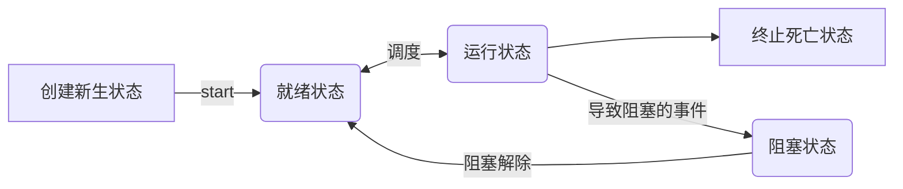
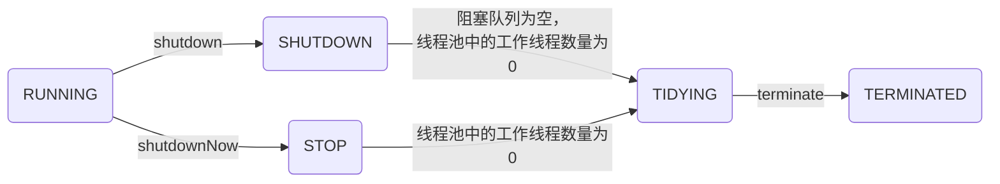

Javase

# 一、面向对象知识点：1~26

## 1、类与对象

-->名词与实例-->对象的抽象与对象

1、对象：一个实实在在具体的东西，是具体的事物

2、类：一个抽象层的东西，一个概念，是对对象的抽象

类可以生成对象，类是对象的抽象，对象是类的实例化

先有具体的对象，然后抽象各个对象之间像的部分，归纳出类，通过类再去认识其他对象	

## 2、变量：

### 1、局部变量：

栈内存中，无默认值，在没有使用当前变量时可以不赋值。

作用在方法中的变量是局部变量，

从定义位置到整个方法结束，

只能在当前方法使用，其他地方无法使用

### 2、成员变量：

堆内存中，有初始值，int 0，String null  boolean false

定义在方法外，类内的变量成员变量（或叫全局变量）

作用在整个类内

## 3、引用类型：

除了基本类型（8个）（放在栈stack中）之外都是引用类型（栈heap中为引用，具体在堆中）

受限的指针

指针：可以进行与整数做加减运算的，两个指针也可比较大小，引用只能进行赋值运算

引用的本质是一个对象，指针是一段内存空间的地址

## 4、内存分析：

1、stack：存放局部变量，先进后出，自下而上存储，方法执行完毕，自动释放空间

2、heap：存放new出来的对象，需要垃圾回收器来回收：System.gc()

3、方法区：存放类的信息，static变量，字符串常量	

## 5、构造方法：

创建对象的时候默认会调用构造方法来创建对象（在堆中开辟空间），可以完成成员变量的某些初始化操作

方法名称（构造方法的名称必须与类的名称一致），

访问修饰符()，

形参（可以用户自定义添加，跟方法的普通参数一样），

方法体（完成对象的初始化功能），返回值（无返回值）

1、创建完类，没有手动调用构造方法，会默认无参构造方法供调用。

2、当用户自定义了构造方法后，默认的无参构造方法就不能使用了，必须要手动定义无参构造方法。

3、同一类中可以有多个同名的构造方法

## 6、重载：

在一个类中可以包含多个重名的方法，但参数列表不能相同

参数个数，参数类型，顺序不同

## 7、构造器：

定义：constructor构造方法，一个在创建对象时被自动调用的特殊方法

作用：为对象进行初始化（成员变量）工作

构造器的方法名必须与类的名称一致

有返回值，当不能定义返回值类型。不能在构造器中调用return

通用new关键字调用

如果不人为定义，系统会自动定义无参构造，如果人为定义，系统则不会自动定义无参构造，需根据需求自行添加。

与普通方法一致，构造方法也可以重载

## 8、this关键字

在堆中存

表示当前对象的指针，表示当前对象的引用

this表示当前对象本身，更准确的说是当前对象的引用

### 1、普通方法

：区分类成员属性和方法的形参，位置任意

当多个普通方法之间需要调用时，可以用this修饰，指当前对象的其他方法

### 2、构造方法

：使用this来调用其他构造方法（this（）），但位置必须是第一条语句

当构造方法的参数名和类的成员变量名一致时，用this代指当前对象，用this可以保持参数一致

### 3、成员变量

：方法的参数名称跟成员变量一致时，使用this.表示对象的值，用变量名称，表示形参列表的值

this不能用于static方法

## 9、static关键字

在类中，用static声明的成员变量为静态成员变量，或叫类属性，类变量

普通变量必须通过对象名调用，类变量可以通过对象名，也可以使用类名

是该类的公用变量，属于类，被所有实例共享，在类被载入时被显示初始化。

静态变量：在创建对象之前被初始化，或者说在类载入之前被初始化

对于该类的所有对象来说。static成员变量只有一份，被该类的所有对象共享，一般使用类名.类属性调用

static变量位于方法区

修饰方法时：静态方法，类方法

普通方法，通过对象名调用，静态方法，类名调用

静态变量不能定义在静态方法中

静态方法可以在非静态方法调用，反之不行，必须new

在静态方法不能用this和super

一般工具类可以定义static

## 10、代码块

概念：使用{}括起来的一段代码

分类:：根据位置可分类

### 1、普通代码快

：直接在方法和语句中定义的代码块

### 2、构造代码块

：直接写在类中的代码块

每次代码运行时，将构造代码快的代码添加到构造方法之前

构造方法，加this关键字时，不会加构造代码块，而是把构造代码块加到其他无this的构造方法中，不会干预this位于第一行的编写规则。

### 3、静态代码块

：使用static声明的代码块，在程序载入的时候优先执行（类初始化），而不是创建对象时执行。

类第一次被载入时先执行static代码块，类多次被载入时，static代码块只执行一次

通常用来堆静态变量进行初始化，静态初始化块，不能访问非静态成员

数据库连接等其他提前准备好的代码快会放在static代码块中

### 4、同步代码快

：多线程会用到，用来给共享空间进行加锁操作

优先级：静态，构造（创建对象才会用到），普通

## 11、Package

多级目录，为了解决类的重名问题，为了更好的管理类

通常是类的第一句非注释性语句。

包名：域名倒着写即可，再加上模块名，并与内部管理类。

注意事项：

写项目时都要加包，不要使用默认包。

com.gao和com.gao.car，这两个包没有包含关系，是两个完全独立的包。只是逻辑上看起来后者是前者的一部分

ava.lang:包含一些Java语言的核心类，如String、Math、Integer、System和Thread，提供常用功能。

java.awt:包含了构成抽象窗口工具集（abstract window toolkits）的多个类，这些类被用来构建和管理应用程序的图形用户界面(GUI)。

java.net:包含执行与网络相关的操作的类。

java.io:包含能提供多种输入/输出功能的类。

java.util:包含一些实用工具类，如定义系统特性、使用与日期日历相关的函数。

## 12、import

Idea：Ait+Enter

### 1、为什么需要import?

如果不适用import，我们如果用到其他包的类时，只能这么写：java.util.Date，代码量太大，不利于编写和维护。通过import可以导入其他包下面的类，从而可以在本类中直接通过类名来调用。

### 2、import怎么使用?

import java.util.Date;
import java.util.*; //导入该包下所有的类。会降低编译速度，但不会降低运行速度。

### 3、注意要点：

java会默认导入java.lang包下所有的类，因此这些类我们可以直接使用。
如果导入两个同名的类，只能用包名+类名来显示调用相关类：
ava.util.Date date  = new java.util.Date();

静态导入的作用：用于导入指定类的静态属性

JDK5.0后增加！

### 4、如何使用：

import static java.lang.Math.*;//导入Math类的所有静态属性
import static java.lang.Math.PI;//导入Math类的PI属性
然后，我们可以在程序中直接使用：System.out.println(PI);

## 13、面向对象的三大特征

### 1、继承 inheritance

–子类 父类
–子类可以从父类继承属性和方法
子类可以提供自己单独的属性和方法

### 2、封装/隐藏encapsulation

–对外隐藏某些属性和方法
对外公开某些属性和方法

### 3、多态 polymorphism

–为了适应需求的多种变化，使代码变得更加通用！
▪面向过程只有封装性（功能的封装，而没有数据的封装），没有继承和多态

## 14、封装（encapsulation）

封装：将类的某些信息隐藏在类内部，不允许外部程序直接访问，而是通过该类提供的方法来实现对隐藏信息的操作和访问.

使用封装能够保证数据的规范，不符合规范的数据将无法进行操作。

将类的属性设置为私有属性，提供共有的外部方法供程序进行调用，可以实行丰富的细节操作，最终为了保证数据安全和规范

### 1、封装的好处：

​	1、只能通过规定方法访问数据  

​	2、隐藏类的实现细节

​	3、方便加入控制语句

​	4、方便修改实现

###  2、广义的封装：

​         可以将完成特定功能的代码块封装成一个方法，供不同的程序进行调用

隐藏对象内部的复杂性，只对外公开简单的接口。便于外界调用，从而提高系统的可扩展性、可维护性。

高内聚就是类的内部数据操作细节自己完成，不允许外部干涉；
低耦合 ：仅暴露少量的方法给外部使用。

### 3、定义类时：

​	私有属性

​	构造方法（无参构造方法和自定义构造方法）

​	set/get方法

​	普通方法

### 4、步骤：

​	1、修改属性的可见性（设为 private）

​	2、创建公有的getter/setter（用于属性的读写）

​	3、在getter/setter方法中加入属性控制语句（对属性的合法性进行判断）

### 5、封装要点：

•类的属性的处理:
	1、一般使用private.  (除非本属性确定会让子类继承)
	2、提供相应的get/set方法来访问相关属性. 这些方法通常是public ，从而提供对属性的读取操作。 （注意：boolean变量的get方法是用：is开头!）
	3、一些只用于本类的辅助性方法可以用private，
	4、希望其他类调用的方法用public

## 15、访问控制符

### 1、成员（成员变量或成员方法）访问权限共有四种：

​	1、public 公共的：当前项目的所有的类都可以进行访问
​	▪可以被项目中所有的类访问。(项目可见性)
​	2、protected 受保护的： 可以被当前类访问，可以被当前包访问，也可以被子类访问
​	可以被这个类本身访问；同一个包中的所有其他的类访问；被它的子类（同一个包以及不同包中的子类）访问
​	3、default／friendly 默认的/友好的（包可见性）： 可以被当前类访问，可以被当前包访问，
​	被这个类本身访问；被同一个包中的类访问。
​	4、private 私有的： 只能被当前类访问
​	只能被这个类本身访问。（类可见性）

注意：四种访问修饰符可以修饰属性和方法
\*       类的访问修饰符只有两个  public default

### 2、类的访问权限只有两种

1、public 公共的
	可被同一项目中所有的类访问。 (必须与文件名同名)
2、default／friendly 默认的/友好的
	可被同一个包中的类访问。

## 16、方法参数

/*
*
\* 方法参数的值是否改变
\*       方法中的参数列表叫做形式参数，没有具体的值，只是为了方便在方法体中使用
\*       调用方法的时候实际传入的值叫实际参数，代表具体的数值，用来替换在方法体中代码逻辑的值进行运算
\*       注意：
\*           1、形式参数的变量名称也是局部变量
\*           2、当方法的参数值是基本数据类型的时候，不会改变原来的值
\*           3、当方法的参数值是引用类型的时候，如果改变了该引用类型的值，会改变原来对象的值
\*       java中的参数传递是值传递
\* */

## 17、继承（inheritance）

表示父类跟子类之间的关系

当两个类或者多个类具备相同的属性和方法的时候，可以提取出来，变成父类，子类可以继承

子类跟父类是is-a的关系

### 1、使用：

\*       1、使用继承的时候需要使用extend关键字
\*       2、使用继承关系之后，父类中的属性和方法都可以在子类中进行使用(非私有属性和非私有方法)
\*       3、java中是单继承关系(如果包含多个父类，同时父类中包含重名方法，无法决定改调用谁)

类是对对象的抽象，继承是对某一批类的抽象，从而实现对现实世界更好的建模。
提高代码的复用性！
extands的意思是“扩展”。子类是父类的扩展
不同的叫法：超类、父类、基类、子类、派生类

### 2、理解继承：

#### 1、不能被继承的父类成员：

​	不能直接访问private成员

​	子类与父类不在同包，用默认访问权限的成员

​	构造方法

#### 2、多重继承关系的初始化顺序是怎样的？

​	父类属性，父类构造方法，子类属性，子类构造方法

#### 3、在何处使用继承？

​	符合is-a关系的设计使用继承

​	将子类共有的属性和行为放到父类中

### 3、小结：

1、通过继承可以简化类的定义，实现代码的重用
2、子类继承父类的成员变量和成员方法，但不继承父类的构造方法
3、java中只有单继承 ，没有像c++那样的多继承。多继承会引起混乱，使得承链过于复杂，系统难于维护。就像我们现实中，如果你有多个父母亲，那是一个多么混乱的世界啊。多继承，就是为了实现代码的复用性，却引入了复杂性，使得系统类之间的关系混乱。
4、java中的多继承，可以通过接口来实现
5、如果定义一个类时，没有调用extends，则它的父类是：java.lang.Object。

## 18、super关键字

\* super:是 直接父类 对象的引用

### 1、 用途：

\*       1、可以在子类中调用父类中被子类覆盖的方法  super.父类方法名称
\*       2、当super在普通方法中使用的话，可以任意位置编写
\*       3、当super在构造方法中使用的话，会调用父类的构造方法，一定要将super放在第一行
\*       4、在构造方法中super关键字和this关键字不能同时出现
\*       5、父类中私有的属性和方法都不能被调用，包括构造方法
\*       6、子类的构造方法中都会默认使用super关键字调用父类的无参构造方法,因此在定义类的时候，无论自己是否自定义了
\*               其他构造方法，最好将无参构造方法写上
\*       7、如果构造方法中显式的指定了super的构造方法，那么无参的构造方法就不会被调用

### 2、总结：

\*       1、在创建子类对象的时候一定会优先创建父类对象
\*       2、所有的java类都具备同一个老祖宗类，称之为Object，是所有类的根类

super是直接父类对象的引用。
可以通过super来访问父类中被子类覆盖的方法或属性。
普通方法：
	没有顺序限制。可以随便调用。
构造函数中：
	任何类的构造函数中，若是构造函数的第一行代码没有显式的调用super(...);那么Java默认都会调用super();作为父类的初始化函数。 所以你这里的super();加不加都无所谓。

super关键字来访问父类的成员
super只能出现在子类的方法和构造方法中
super调用构造方法时，只能是第一句
super和this不能同时出现在构造方法中
super不能访问父类的private成员
super和this都不能再static方法中

## 19、重写

\* 重写：
\*   必须要存在继承关系，当父类中的方法无法满足子类需求的时候可以选择使用重写的方式
\*   注意：
\*       1、重写表示的是子类覆盖父类的方法，当覆盖之后，调用同样的方法的时候会优先调用子类
\*       2、重写的方法名称，返回值类型，参数列表必须跟父类一直
\*       3、子类重写的方法不允许比父类的方法具备更小的访问权限
\*           父类      public     子类  public
\*           父类      protected     子类  public protected
\*           父类      protected     子类  public protected  default
\*   父类的静态方法子类可以进行调用，但是子类不可以重写

在子类中可以根据需要对从基类中继承来的方法进行重写。
重写方法必须和被重写方法具有相同方法名称、参数列表和返回类型。
重写方法不能使用比被重写方法更严格的访问权限。（由于多态）

构造方法也会被重写吗？不会，因为构造方法不会被继承

方法重写的规则
方法名相同
参数列表相同
返回值类型相同或者是其子类；
访问权限不能严于父类

重载：在一个类中可以包含多个重名的方法，但参数列表不能相同


## 20、抽象类，抽象方法

/*
\* java中的对象是对现实世界的具象化，但是在现实世界中，某些类并不具备实例化的意义，因此可以定义为抽象类
*

### 1、抽象类：

\*       1、创建抽象类的时候需要添加 abstract 的关键字
\*       2、不能进行实例化，也就是不能new对象
\*       3、抽象类中的某些方法需要子类进行更丰富的实现，父类实现没有意义，此时可以将抽象类
\*             中的方法定义为抽象方法，没有具体的实现，只包含方法名称，返回值，参数列表，访问修饰符
\*       4、使用abstract关键字修饰的方法叫做抽象方法，可以不写方法的实现
\*       5、子类在继承抽象父类的时候，必须要将父类中的抽象方法进行实现或者将子类也定义为抽象类
\*       6、有抽象方法的一定是抽象类，但是抽象类中不一定包含抽象方法
\* */

### 2、抽象方法

没有具体的实现，只包含方法名称，返回值，参数列表，访问修饰符，没有方法体，需要子类丰富实现。

使用abstract关键字修饰的方法叫做抽象方法，可以不写方法的实现

类在继承抽象父类的时候，必须要将父类中的抽象方法进行实现或者将子类也定义为抽象类

有抽象方法的一定是抽象类，但是抽象类中不一定包含抽象方法

abstract也可用于方法——抽象方法
抽象方法没有方法体
抽象方法必须在抽象类里
抽象方法必须在子类中被实现，除非子类是抽象类

## 21、final

**final**

final的使用：
\*       final可以修饰变量：
\*               表示变量的值不可变
\*       final可以修饰方法：
\*               表示方法不可以被重写
\*       final可以修饰类：
\*               表示类不可以被继承

Penguin类不希望再被其他类继承？

方法不希望被重写？

属性值不希望被修改？

## 22、object

 Object类是所有类的父类
 一个类如果没有使用extends显性的继承另外一个类，▪ 那么这个类就继承自Object类。

### 1、Object类的主要方法

<T> getClass：反射

int hashCode：计算哈希值

clone() ：创建并返回对象的副本

boolean equals:重写，具体比较逻辑（默认比较内存地址）

String toString()方法：重新实现（默认返回地址）

notify，notifyAll，wait(long timeout)，wait(long timeout, int nanos)，wait()：多线程唤醒和等待

 finalize() ：垃圾回收

### 2、对象的比较对象的比较—==和equals()

==：
	比较两基本类型变量的值是否相等
	比较两个引用类型的值即内存地址是否相等，即是否指向同一对象。
equals() ：
	两对象的内容是否一致
	示例
	object1.equals(object2) 如：p1.equals(p2)
		比较所指对象的内容是否一样
		是比较两个对象，而非两个基本数据类型的变量
	object1 == object2 如：p1==p2
		比较p1和p2的值即内存地址是否相等，即是否是指向同一对象。
自定义类须重写equals()，否则其对象比较结果总是false。

## 23、多态（polymorphism）

对于同一指令，不同对象，不同反应

当不同对象被调用同一方法名称之后，每个对象的具体子类实现都是不一样的。

instanceof通常和强制类型转换结合使用：pet instanceof Dog(类型判断)

### 1、 多态：

\*       对应同一个指令（调用同一个名称的方法），不同的对象给予不同的反应（不同的方法实现）

#### 1、规范(多态实现的提前)：

\*       1、必须要有继承关系
\*       2、子类方法必须重写父类的方法
\*       3、父类引用指向子类对象

#### 2、多态的目的：

\*       为了提高代码的扩展性和维护性
\*       方便代码逻辑的编写

#### 3、  多态的两种表现形式：

\*       1、父类作为方法的参数
\*       2、父类作为方法的返回值类型
*

#### 4、引用类型的转换跟基本数据类型的转换类似：

\*       1、当父类需要转成子类的时候，要进行强制转换，但是在强制转换之前一定要先判断父类引用指向的子类对象到底是谁，
\*           如果无法确定，在运行过程中可以出错
\*       2、当子类需要向父类转换的时候，直接自动转换，不需要进行任何的判断。


### 2、类型转换

向上转型——子类转换为父类，自动进行类型转换
向下转型——父类转换为子类，结合instanceof运算符进行强制类型转换
实现多态的两种方式
使用父类作为方法形参实现多态
用父类作为方法返回值实现多态
使用多态的好处?
多态可以减少类中代码量，可以提高代码的可扩展性和可维护性
 引用变量的两种类型：
编译时类型（模糊一点，一般是一个父类）
由声明时的类型决定。
运行时类型（运行时，具体是哪个子类就是哪个子类）
 由实际对应的对象类型决定。
态的存在要有3个必要条件：
要有继承，要有方法重写，父类引用指向子类对象

### 3、总结：

#### 1、多态总结

多态性是OOP中的一个重要特性，主要是用来实现动态联编的，换句话说，就是程序的最终状态只有在执行过程中才被决定而非在编译期间就决定了。这对于大型系统来说能提高系统的灵活性和扩展性。
ava中如何实现多态?使用多态的好处?
引用变量的两种类型：
编译时类型（模糊一点，一般是一个父类）
由声明时的类型决定。
运行时类型（运行时，具体是哪个子类就是哪个子类）
由实际对应的对象类型决定。
多态的存在要有3个必要条件：
要有继承，要有方法重写，父类引用指向子类对象

#### 2、类型转换总结

子类转换为父类：自动转换
上转型对象不能操作子类新增的成员变量和方法。
上转型对象可以操作子类继承或重写的成员变量和方法
如果子类重写了父类的某个方法，上转型对象调用该方法时，是调用的重写方法。
父类转换为子类：强制转换
（绝不是做手术，而是父类的真面目就是一个子类，否则会出现类型转换错误）

## 24、接口(interface)

面向接口编程

接口代表着一种能力

接口代表着一种约定

体现在接口名称和注释上      程序设计时面向接口的约定而不考虑具体实现

/*
\* java中的继承关系是单继承，如果拥有多个父类的时候，可以考虑使用接口进行实现
\*       java中的接口具备广泛的使用：

### 1、 用法：

\*           使用interface来修饰
\*           接口中可以包含多个方法，且方法跟抽象类中的抽象方法一致，可以不写实现，子类在实现的时候必须要实现代码逻辑
\*           子类实现接口使用implements关键字
\*    

### 2、   特征：

\*           1、接口中的所有方法都是抽象方法，不能包含方法的实现
\*           2、接口中的所有方法的访问修饰权限都是public，不写并不是默认访问权限，而是public
\*           3、接口不能被实例化
\*           4、接口的子类必须要实现接口中的所有方法，跟抽象类有所不同，抽象类中的抽象方法必须要被子类实现
\*           5、子类可以拥有实现多个接口
\*           6、接口中的变量都是静态常量,如果变量没有使用static关键字修饰，它也表示静态常量,不用final关键字修饰，也是常量
\*           7、接口中的方法和常量无论是否添加public修饰，默认的权限有且仅有一个，就是public
*

### 3、  接口的使用：

\*           1、接口代表一种能力，接口中可以定义N多个方法，子类在进行实现的时候，必须要实现这些方法
\*           2、 将这些方法进行实现，就意味着具体了方法的能力
\*           3、 关心实现类有何能力，而不关心实现细节

### 4、   抽象类和接口的区别：（is and have）

\*           1、抽象类中的方法可以有抽象方法，也可以有普通方法，但是接口中只能包含抽象方法
\*           2、抽象类需要使用abstract关键字来修饰，而接受使用interface关键字来修饰
\*           3、子类使用extends关键字来继承抽象类，使用implements来实现接口
\*           4、子类继承抽象类的时候必须要实现所有的抽象方法，普通方法可以不重写，而接口中的所有方法必须实现
\*           5、抽象类中可以定义成员变量，而接口中只能定义静态常量
\*           6、抽象类在子类实现的时候是单继承，而接口时多继承
\*           7、抽象类和接口都不能实例化，但是抽象类中可以有构造方法，而接口中不能有构造方法
\*           8、抽象类中可以实现接口，并且不实现接口中方法，而接口只能继承接口，不能实现接口
\*       注意：
\*           在实际的项目开发过程中，如果可以使用接口，尽量使用接口，将单继承的父类留在最关键的地方
 \* */


### 5、为什么需要接口?接口和抽象类的区别?

接口就是比“抽象类”还“抽象”的“抽象类”，可以更加规范的对子类进行约束。
全面地专业地实现了：规范和具体实现的分离。
接口就是规范，定义的是一组规则，体现了现实世界中“如果你是…则必须能…”的思想。如果你是天使，则必须能飞。如果你是汽车，则必须能跑。如果你好人，则必须干掉坏人；如果你是坏人，则必须欺负好人。
接口的本质是契约，就像我们人间的法律一样。制定好后大家都遵守。
项目的具体需求是多变的，我们必须以不变应万变才能从容开发，此处的
不变”就是“规范”。因此，我们开发项目往往都是面向接口编程！


### 6、接口相关规则

接口中所有方法都是抽象的。
即使没有显式的将接口中的成员用public标示，也是public访问类型的
接口中变量默认用 public static final标示，所以接口中定义的变量就是全局静态常量。
可以定义一个新接口，用extends去继承一个已有的接口
可以定义一个类，用implements去实现一个接口中所有方法。
可以定义一个抽象类，用implements去实现一个接口中部分方法。

### 7、定义与实现

▪如何定义接口?
–格式：
▪[访问修饰符]  interface 接口名 [extends 父接口1，父接口2…]  {

常量定义：/总是public   static  final
方法定义//总是：public   abstract

▪如何实现接口
–子类通过implements来实现接口中的规范
接口不能创建实例，但是可用于声明引用变量类型。
一个类实现了接口，必须实现接口中所有的方法，并且这些方法只能是public的。
Java的类只支持单继承，接口支持多继承

### 8、其他

C++支持多重继承，Java支持单重继承
C++多重继承的危险性在于一个类可能继承了同一个方法的不同实现，会导致系统崩溃。
Java中，一个类只能继承一个类，但同时可以实现多个接口，既可以实现多重继承的效果和功能，也避免的多重继承的危险性。
class Student extents Person implements Runner，Flyer
{…}
注意：extends 必须位于implements之前

## 25、内部类

\* 内部类（当作类中的一个普通成员变量，只不过此成员变量是class的类型）：
\*       一个java文件中可以包含多个class，但是只能有一个public class
\*       如果一个类定义在另一个类的内部，此时可以称之为内部类


### 1、 使用：

\*       创建内部类的时候，跟之前的方法不一样，需要在内部类的前面添加外部类来进行修饰
\*             InnerClassDemo.InnerClass inner = new InnerClassDemo().new InnerClass();


### 2、    特点：

​        1、内部类可以方便的访问外部类的私有属性
​        2、外部类不能访问内部类的私有属性,但是如果创建了内部类的对象，此时可以在外部类中访问私有属性
​        3、内部类中不能定义静态属性
​        4、当内部类和外部类具有相同的私有属性的时候，在内部类中访问的时候，可以直接访问内部类的属性，
​            如果需要访问外部类的属性，那么需要添加  外部类类名.this.属性。

### 3、成员内部类：

（1）外部类不能直接使用内部类的成员和方法
（2）如果外部类和内部类具有相同的成员变量或方法，内部类
默认访问自己的成员变量或方法，如果要访问外部类的成员变量，
需使用this关键字

在外部访问内部类：

▪ 语法
 外部类 外部类对象=new 外部类();
 外部类.内部类 内部类对象=外部类对象.new 内部类 ();


### 4、分类：

####         1、匿名内部类：

​		当定义了一个类，实现了某个接口的时候，在使用过程中只需要使用一次，没有其他用途
​               其实考虑到代码编写的简洁，可以考虑不创建具体的类，而采用new interface(){添加未实现的方法}
​               就叫做匿名内部类

​		适合只需要使用一次的类，安卓中使用的比较多

####       2、  静态内部类：

​		在内部类中可以定义静态内部类，使用static关键字进行修饰，使用规则
​                外部类.内部类 类的引用名称 = new 外部类.内部类（）；

​		▪ 语法
​			 new 外部类类名.内部类().方法名
​	 		外部类类名.内部类 内部类对象名=new 外部类类名.内部类类名();

####        3、 方法内部类：

​		   在外部类的方法中也可以定义类，此时叫做方法内部类（了解即可）
​                    使用的时候需要注意，只能在方法中创建对象，因为此class的作用域就是当前方法

​			方法内部类是指：将内部类定义在外部类的方法中。
​			注意事项：
​			（1）方法内部类不能在外部类的方法以外的地方使用，所以方法内部类不能使用访问控制符和static修饰符

## 26、垃圾回收机制（参考JVM）

▪对象空间的分配：
–使用new关键字创建对象即可
▪对象空间的释放：
–传统的C/C++语言，需要程序员负责回收已经分配内存。显式回收垃圾回收的缺点：
▪程序忘记及时回收，从而导致内存泄露，降低系统性能。
程序错误回收程序核心类库的内存，导致系统崩溃。
–Java语言不需要程序员直接控制内存回收，是由JRE在后台自动回收不再使用的内存，称为垃圾回收机制(Garbage Collection)。
▪可以提高编程效率。
保护程序的完整性。
▪其开销影响性能。Java虚拟机必须跟踪程序中有用的对象，确定哪些是无用的。

垃圾回收机制只回收JVM堆内存里的对象空间。
对其他物理连接，比如数据库连接、输入流输出流、Socket连接无能为力
现在的JVM有多种垃圾回收实现算法，表现各异。
垃圾回收发生具有不可预知性，程序无法精确控制垃圾回收机制执行。
可以将对象的引用变量设置为null，暗示垃圾回收机制可以回收该对象。
程序员可以通过System.gc()或者Runtime.getRuntime().gc()来通知系统进行垃圾回收，会有一些效果，但是系统是否进行垃圾回收依然不确定。
垃圾回收机制回收任何对象之前，总会先调用它的finalize方法（如果覆盖该方法，让一个新的引用变量重新引用该对象，则会重新激活对象）。
永远不要主动调用某个对象的finalize方法，应该交给垃圾回收机制调用。

# 二、实用知识点

## 27、异常

### 1、异常的概念

异常是指在程序的运行过程中所发生的不正常的事件，它会中断正在运行的程序

Java编程语言使用异常处理机制为程序提供了错误处理的能力

 Java的异常处理是通过5个关键字来实现的：try、catch、 finally、throw、throws


### 2、异常:

\*       在程序运行过程中，出现的不正常情况叫做异常
*
\*       注意：
\*           1、相同的代码在运行的时候，根据输入的参数或者操作的不同，有可能会发生异常，有可能不会发生异常
\*               应该在写代码的过程中尽可能的保证代码的正确性，不要到处都bug
\*           2、如果要解决代码中出现的异常，需要添加非常复杂的代码逻辑来进行判断，会使代码变得非常臃肿，不利于维护，可读性比较差
\*               因此，推荐大家使用异常机制来处理程序运行过程中出现的问题
\*           3、程序在运行过程中如果出现了问题，会导致后面的代码无法正常执行，而使用异常机制之后，可以对异常情况进行处理
\*              同时后续的代码会继续执行，不会中断整个程序
\*           4、在异常的处理过程中，不要只是简单的输出错误，要尽可能的讲详细的异常信息进行输出
\*                  e.printStackTrace():打印异常的堆栈信息，可以从异常信息的最后一行开始追踪，寻找自己编写的java类

### 3、异常的分类


### 4、异常处理（try, catch, finally,  throws,    throw）

*
\*      异常处理的方式：
\*          1、捕获异常
\*              try{代码逻辑}catch(Exception e){异常处理逻辑}
\*              try{代码逻辑}catch(具体的异常Exception e){异常处理逻辑}catch(具体的异常)：
\*                    可以针对每一种具体的异常做相应的更丰富的处理
\*                      注意：当使用多重的catch的时候一定要注意相关异常的顺序，将子类放在最前面的catch，父类放在后面的catch
\*              执行过程中可能存在的情况：
\*                  1、正常执行，只执行try中的代码
\*                  2、遇到异常情况，会处理try中异常代码之前的逻辑，后面的逻辑不会执行，最后会执行catch中的代码
\*                  3、使用多重catch的时候，会遇到异常子类不匹配的情况，此时依然会报错，因此建议在catch的最后将所有的异常的父类写上
*InputMismatchException
\* ArithmeticException


void printStackTrace()：输出异常的堆栈信息

String getMessage() ：返回异常信息描述字符串，printStackTrace()输出信息的一部分


### 5、 finally:

\* 在程序运行过程中，如果处理异常的部分包含finally的处理，那么无论代码是否发生异常，finally中的代码总会执行
\*   finally包含哪些处理逻辑？
\*       1、IO流的关闭操作一般设置在finally中
\*       2、数据库的连接关闭操作设置在finally中

```java
1、情况一（try中有return，finally中没有return）：
	public class TryTest{
		public static void main(String[] args){
			System.out.println(test());
		}
	
		private static int test(){
			int num = 10;
			try{
				System.out.println("try");
				return num += 80;
			}catch(Exception e){
				System.out.println("error");
			}finally{
				if (num > 20){
					System.out.println("num>20 : " + num);
				}
				System.out.println("finally");
			}
			return num;
		}
	}
2、情况二（try和finally中均有return）：
	public class TryTest{
		public static void main(String[] args){
			System.out.println(test());
		}
	
		private static int test(){
			int num = 10;
			try{
				System.out.println("try");
				return num += 80;
			}catch(Exception e){
				System.out.println("error");
			}finally{
				if (num > 20){
					System.out.println("num>20 : " + num);
				}
				System.out.println("finally");
				num = 100;
				return num;
			}
		}
	}
3、情况三（finally中改变返回值num）：
public class TryTest{
	public static void main(String[] args){
		System.out.println(test());
	}
 
	private static int test(){
		int num = 10;
		try{
			System.out.println("try");
			return num;
		}catch(Exception e){
			System.out.println("error");
		}finally{
			if (num > 20){
				System.out.println("num>20 : " + num);
			}
			System.out.println("finally");
			num = 100;
		}
		return num;
	}
}
4、情况四（将num的值包装在Num类中）：

public class TryTest{
	public static void main(String[] args){
		System.out.println(test().num);
	}
 
	private static Num test(){
		Num number = new Num();
		try{
			System.out.println("try");
			return number;
		}catch(Exception e){
			System.out.println("error");
		}finally{
			if (number.num > 20){
				System.out.println("number.num>20 : " + number.num);
			}
			System.out.println("finally");
			number.num = 100;
		}
		return number;
	}
}
 
class Num{
	public int num = 10;
}

1、
输出结果如下：
try
num>20 : 90
finally
90

分析：显然“return num += 80”被拆分成了“num = num+80”和“return num”两个语句，线执行try中的“num = num+80”语句，将其保存起来，在try中的”return num“执行前，先将finally中的语句执行完，而后再将90返回。
2、
输出结果如下：

try
num>20 : 90
finally
100

分析：try中的return语句同样被拆分了，finally中的return语句先于try中的return语句执行，因而try中的return被”覆盖“掉了，不再执行。
3、
输出结果如下：
try

finally

10

分析：虽然在finally中改变了返回值num，但因为finally中没有return该num的值，因此在执行完finally中的语句后，test（）函数会得到try中返回的num的值，而try中的num的值依然是程序进入finally代码块前保留下来的值，因此得到的返回值为10。
4、
输出结果如下：
try
finally
100

从结果中可以看出，同样是在finally中改变了返回值num的值，在情况三中，并没有被try中的return返回（test（）方法得到的不是100），但在这里却被try中的return语句返回了。


```

总结：
	 try语句在返回前，将其他所有的操作执行完，保留好要返回的值，而后转入执行finally中的语句，而后分为以下三种情况：

    情况一：如果finally中有return语句，则会将try中的return语句”覆盖“掉，直接执行finally中的return语句，得到返回值，这样便无法得到try之前保留好的返回值。
    
    情况二：如果finally中没有return语句，也没有改变要返回值，则执行完finally中的语句后，会接着执行try中的return语句，返回之前保留的值。
    
    情况三：如果finally中没有return语句，但是改变了要返回的值，这里有点类似与引用传递和值传递的区别，分以下两种情况，：
    
        1）如果return的数据是基本数据类型或文本字符串，则在finally中对该基本数据的改变不起作用，try中的return语句依然会返回进入finally块之前保留的值。
    
        2）如果return的数据是引用数据类型，而在finally中对该引用数据类型的属性值的改变起作用，try中的return语句返回的就是在finally中改变后的该属性的值。


### 6、声明异常：

throws:声明异常
\* 在异常情况出现的时候，可以使用try...catch...finally的方式对异常进行处理，除此之外，可以将异常向外跑出，由外部的进行处理
\*   1、在方法调用过程中，可以存在N多个方法之间的调用，此时假如每个方法中都包含了异常情况
\*       那么就需要在每个方法中都进行try。。catch，另外一种比较简单的方式，就是在方法的最外层调用处理一次即可
\*       使用throws的方法，对所有执行过程中的所有方法出现的异常进行统一集中处理
\*   2、如何判断是使用throws还是使用try...catch..
\*       最稳妥的方式是在每个方法中都进行异常的处理
\*       偷懒的方式是判断在整个调用的过程中，外层的调用方法是否有对异常的处理，如果有，直接使用throws,如果没有
\*           那么就要使用try...catch...

抛出异常

\* throw：抛出异常

### 7、自定义异常

\* 自定义异常：
\*       在java的api中提供了非常丰富的异常类，但是在某些情况下不太满足我们的需求，此时需要自定义异常
\*       步骤：
\*           1、继承Exception类
\*           2、自定义实现构造方法
\*           3、需要使用的时候，使用throw new 自定义异常的名称；
\*       什么时候需要自定义异常？
\*           一般情况下不需要
\*           但是在公司要求明确，或者要求异常格式规范统一的时候是必须要自己实现的

## 28、常用类(API重点)

### 1、基本数据类型的包装类

包装类是将基本类型封装到一个类中，包含属性和方法，方便对象操作包装类位于java.lang包中


integer：在cache中存在-128~127（value of）（为了减少内存使用）

Double：new 新对象（value Of）

类型转换：in value（包转基） value of（基转包）

\* 包装类与基本数据类型
\*   包装类是将基本数据类型封装成一个类，包含属性和方法
\*   使用：
\*       在使用过程中，会涉及到自动装箱和自动拆箱
\*       装箱：将基本数据类型转换成包装类
\*       拆箱：将包装类转换成基本数据类型

自动装箱
	基本类型就自动地封装到与它相同类型的包装中，如：
	Integer i = 100;
	本质上是，编译器编译时为我们添加了：
	Integer i = Integer.valueOf(100);
自动拆箱
	包装类对象自动转换成基本类型数据。如：
	int a = new Integer(100);
	本质上，编译器编译时为我们添加了：
	int a = new Integer(100).intValue();

### 2、字符串相关类

#### 	1、不可变字符序列：String

\* 注意：常量池在1.7之后放置在了堆空间之中
\*       字符串的使用：
\*           1、创建
\*               String str = "abc";
\*               String str2 = new String("abc");
\*               两种方式都可以用，只不过第一种使用比较多
\*           2、字符串的本质
\*               字符串的本质是字符数组或者叫做字符序列
\*               String类使用final修饰，不可以被继承
\*               使用equals方法比较的是字符数组的每一个位置的值
\*               String是一个不可变对象（引用关系不可变，但引用地址中的值是可变的）

string常用方法：

char charAt(int index)
	返回字符串中第index个字符。
boolean equals(String other)
	如果字符串与other相等，返回true
boolean equalsIgnoreCase(String other)
	如果字符串与other相等（忽略大小写），则返回true
int indexOf(String str) lastIndexOf(String str,int idx)
int length()
	返回字符串的长度。
String replace(char oldChar,char newChar)
 	返回一个新串，它是通过用 newChar 替换此字符串中出现的所有oldChar而生成的

boolean startsWith(String prefix)
	如果字符串以prefix开始，则返回true
boolean endsWith(String prefix)
	如果字符串以prefix结尾，则返回true
String substring(int beginIndex)：字符串截串（左闭右开）

String substring(int beginIndex,int endIndex)
	返回一个新字符串，该串包含从原始字符串beginIndex到串尾或endIndex-1的所有字符
String toLowerCase()
	返回一个新字符串，该串将原始字符串中的所有大写字母改成小写字母
String toUpperCase()
	返回一个新字符串，该串将原始字符串中的所有小写字母改成大写字母
String trim()
	返回一个新字符串，该串删除了原始字符串头部和尾部的空格

字符串连接： 

 	方法1：使用“+”
 	 方法2：使用String类的concat()方法

字符串常用提取方法：

​	1、搜索第一个出现的字符ch（或字符串value）：public int indexOf(int ch)     public int indexOf(String value)

​	2、搜索最后一个出现的字符ch（或字符串value）：public int lastIndexOf(int ch)；public int lastIndexOf(String value)

​	3、提取从位置索引开始的字符串部分：public String substring(int index)

​	4、提取beginindex和endindex之间的字符串部分;public String substring(int beginindex, int endindex)

​	5、返回一个前后不含任何空格的调用字符串的副本：public String trim()

字符串的拆分：

​	String 类提供了split() 方法，将 一个字 符串 分割为子 字符串 ，结果作为字符串数组返回

查看String的API

#### 	2、可变字符序列：StringBuffer、StringBuilder

 StringBuffer：String增强版字符串缓冲区，是一个容器

\* 可变字符串
\*   StringBuffer：线程安全，效率低
\*   StringBuilder: 线程不安全，效率高

参考：API

### 3、时间处理相关类


#### 	1、Date

Date类：表示日期和时间提供操作日期和时间各组成部分的方法

data.getTime():返回当前的毫秒值

#### 	2、DateFormat、SimpleDateFormat

用于定制日期时间的格式

```java
Date date = new Date(); //创建日期对象
impleDateFormat formater = new SimpleDateFormat("yyyy-
 MM-dd HH:mm:ss");//定制日期格式
tring now = formater.format(date);
ystem.out.println(now);
```

#### 	3、Calender

抽象类
于设置和获取日期/时间数据的特定部分
Calendar类提供一些方法和静态字段来操作日历

用于替代data中的过期类·

方法：

​	返回给定日历字段的值：int get(int field)

​	指示月：MONTH

​	指示一个月中的某天：DAY_OF_MONTH

​	指示一个星期中的某天：DAY_OF_WEEK

```java
//获取的是当前系统的时间
        Calendar calendar = Calendar.getInstance();
        System.out.println(calendar);
        //设置指定时间的日历类
        calendar.setTime(d1);
        System.out.println(calendar);
        System.out.println(calendar.get(Calendar.YEAR));
        System.out.println(calendar.get(Calendar.MONTH));
        System.out.println(calendar.get(Calendar.DAY_OF_MONTH));
        System.out.println(calendar.get(Calendar.HOUR_OF_DAY));
        System.out.println(calendar.get(Calendar.MINUTE));
        System.out.println(calendar.get(Calendar.SECOND));
```

查阅api

### 4、Math类

包含了常见的数学运算函数。
random()生成[0,1)之间的随机浮点数
生成：0-10之间的任意整数：
int a =  (int)(10*Math.random());
生成：20-30之间的任意整数：
int b = 20 + (int)(10*Math.random());

```java
        System.out.println(Math.abs(-1));//绝对值
        System.out.println(Math.sqrt(2));//开方
        System.out.println(Math.ceil(-3.14));//向上取整
        System.out.println(Math.floor(-3.14));//向下取整
        System.out.println(Math.pow(2,3));//乘方
```


### 5、File类（参考IO流）

 文件可认为是相关记录或放在一起的数据的集合


```java
package com.mashibing;


import java.io.File;
import java.io.IOException;

/**
 * File提供了对当前文件系统中文件的部分操作
 *
 *
 */
public class   FileDemo {
    public static void main(String[] args) throws IOException {
        File file = new File("src/abc.txt");

        //创建文件
        try {
            file.createNewFile();
        } catch (IOException e) {
            e.printStackTrace();
        }

        //判断文件的属性，都会返回boolean类型的值
        file.canExecute();
        file.canRead();
        file.canWrite();

        //判断当前文件是否存在
        System.out.println(file.exists());

        //获取文件的名称
        System.out.println(file.getName());
        //获取文件的绝对路径
        System.out.println(file.getAbsolutePath());
        //获取文件的父路径名称，如果文件的路径中只包含文件名称，则显示空
        System.out.println(file.getParent());
        //返回文件绝对路径的规范格式
        System.out.println(file.getCanonicalPath());
        //返回操作系统的文件分割符
        System.out.println(File.separator);

        //无论当前文件是否存在，只要给定具体的路径，都可以返回相应的路径名称
        File file2 = new File("c:/a/b/c");
        System.out.println(file2.getAbsolutePath());

        //判断文件是否是文件或者目录
        System.out.println(file2.isDirectory());
        System.out.println(file2.isFile());
//string数组
//        String[] list = file2.list();
//        for(String str:list){
//            System.out.println(list.toString());
//        }
//        System.out.println("---------------");
        //file数组：推荐使用
//        File[] files = file2.listFiles();
//        for(File f : files){
//            System.out.println(f);
//        }

        //打印当前文件系统的所有盘符
        File[] files1 = File.listRoots();
        for(int i = 0;i<files1.length;i++){
            System.out.println(files1[i]);
        }

        //创建单级目录
        file2.mkdir();
        //创建多级目录
        file2.mkdirs();

        //循环遍历输出C盘中的所有文件的绝对路径
        //使用递归的方式
        printFile(new File("D:\\Github\\javase"));
    }

    /**
     *
     * 文件在遍历的时候，会出现空指针的问题，原因在于当前文件系统受保护，某些文件没有访问权限，此时会报空指针异常
     * @param file
     */
    public static void printFile(File file){

        if(file.isDirectory()){
            File[] files = file.listFiles();
            for(File f:files){
                printFile(f);
            }
        }else{
            System.out.println(file.getAbsolutePath());
        }

    }
}
```


### 6、枚举类：Jdk1.5

枚举指由一组固定的常量组成的类型

枚举类型：
只能够取特定值中的一个
使用enum关键字
所有的枚举类型隐性地继承自 java.lang.Enum。（枚举实质上还是类！而每个被枚举的成员实质就是一个枚举类型的实例，他们默认都是publi c static final的。可以直接通过枚举类型名直接使用它们。）
强烈建议当你需要定义一组常量时，使用枚举类型

```java
package com.mashibing;

public enum EventEnum {

    LAUNCH("launch"),PAGEVIEW("pageview"),EVENT("event");

    EventEnum(String name){
        this.name = name;
    }
    private String name;

    public void show(){
        System.out.println(this.name);
        EventEnum[] ee = values();
        for(int i = 0;i<ee.length;i++){
            System.out.println(ee[i]);
        }
    }
}
 public static void main(String[] args) {
        EventEnum ee = EventEnum.LAUNCH;
        ee.show();
        String name = EventEnum.PAGEVIEW.name();
        System.out.println(name);
    }
```


## 29、Java容器/java集合框架

### 1、容器的概念

如果并不知道程序运行时会需要多少对象，或者需要更复杂方式存储对象——可以使用Java集合框架

Java集合框架提供了一套性能优良、使用方便的接口和类，它们位于java.util包中


### 2、容器 API

api方法：
\*           增加数据的方法
\*           add：要求必须传入的参数是Object对象，因此当写入基本数据类型的时候，包含了自动拆箱和自动装箱的过程
\*           addAll:添加另一个集合的元素到此集合中
*
\*           删除数据的方法
\*           clear:只是清空集合中的元素，但是此集合对象并没有被回收
\*           remove:删除指定元素
\*           removeAll：删除集合元素
*
\*           查询数据的方法
\*           contains:判断集合中是否包含指定的元素值
\*           containsAll:判断此集合中是否包含另一个集合
\*           isEmpty:判断集合是否等于空
\*           retainAll:若集合中拥有另一个集合的所有元素，返回true，否则返回false
\*           size:返回当前集合的大小
*
\*           //集合转数组的操作
\*           toArray:将集合转换成数组 
\* */

### 3、Collection 接口

Collection 接口存储一组不唯一，无序的对象

/*
\* java集合框架：
\*   Collection：存放的是单一值
\*       特点：
\*           1、可以存放不同类型的数据，而数组只能存放固定类型的数据
\*           2、当使用arraylist子类实现的时候，初始化的长度是10，当长度不够的时候会自动进行扩容操作
\*      


### 4、迭代器

Iterator 接口 Iterable接口

本质两个指针的移动（cursor与lastRet获取元素值及向下的遍历索引）

​	

\* 在java代码中包含三种循环的方式
\*   do...while
\*   while
\*   for
\* 还有一种增强for循环的方式，可以简化循环的编写
*
*
\*   所有的集合类都默认实现了Iterable的接口，实现此接口意味着具备了增强for循环的能力，也就是for-each
\*      增强for循环本质上使用的也是iterator的功能
\*      方法：
\*               iterator()
\*               foreach()
\*   在iterator的方法中，要求返回一个Iterator的接口子类实例对象
\*       此接口中包含了
\*               hasNext()
\*               next()
*
\*   在使用iterator进行迭代的过程中如果删除其中的某个元素会报错，并发操作异常，因此
\*       如果遍历的同时需要修改元素，建议使用listIterator（），
\*   ListIterator迭代器提供了向前和向后两种遍历的方式
\*       始终是通过cursor和lastret的指针来获取元素值及向下的遍历索引
\*       当使用向前遍历的时候必须要保证指针在迭代器的结果，否则无法获取结果值

```java
 public static void main(String[] args) {
        ArrayList list= new ArrayList();
        list.add(1);
        list.add(2);
        list.add(3);
        list.add(4);
        for(int i=0;i<list.size();i++){
            System.out.println(list.get(i));
        }

        //迭代器
        Iterator iterator = list.iterator();
//        ListIterator iterator = list.listIterator();
        while(iterator.hasNext()){
            Object o = iterator.next();
            if(o.equals(1)){
                iterator.remove();
            }
            System.out.println(o);
        }
//        System.out.println("-------------");
//        while (iterator.hasPrevious()){
//            System.out.println(iterator.previous());
//        }
//        for(Object i : list){
//            System.out.println(i);
//        }
    }
```


 所有实现了Collection接口的容器类都有一个iterator方法用以返
 回一个实现了Iterator接口的对象。
 Iterator对象称作迭代器，用以方便的实现对容器内元素的遍历
 操作。
 Iterator接口定义了如下方法：

boolean hasNext();  //判断是否有元素没有被遍历
Object next();      //返回游标当前位置的元素并将游标移动到下一个位置
void remove();      //删除游标左面的元素，在执行完next之后该
//操作只能执行一次


所有的集合类均未提供相应的遍历方法，而是把遍历交给迭代器完成。迭代器为集合而生，专门实现集合遍历
Iterator是迭代器设计模式的具体实现
Iterator方法
boolean hasNext():判断是否存在另一个可访问的元素
Object next():返回要访问的下一个元素
void remove():删除上次访问返回的对象
可以使用Iterator遍历的本质是什么？
实现Iterable接口


### 5、比较器

**Comparable 接口**

问题：上面的算法根据什么确定集合中对象的“大小”顺序？

所有可以“排序”的类都实现了java.lang.Comparable 接口，
Comparable接口中只有一个方法
 public int compareTo(Object obj)；
 该方法:

返回 0 表示 this == obj
返回正数 表示 this  >  obj
返回负数 表示 this  <  obj

• 实现了Comparable 接口的类通过实现 comparaTo 方法从而确定
 该类对象的排序方式。

比较器分类：
\*         内部比较器
\*               定义在元素的类中，通过实现comparable接口来进行实现
\*         外部比较器
\*               定义在当前类中，通过实现comparator接口来实现，但是要将该比较器传递到集合中
\*         注意：外部比较器可以定义成一个工具类，此时所有需要比较的规则如果一致的话，可以复用，而
\*               内部比较器只有在存储当前对象的时候才可以使用
\*               如果两者同时存在，使用外部比较器
\*               当使用比较器的时候，不会调用equals方法

### 6、List 接口

List 接口存储一组不唯一，有序（插入顺序）的对象

List特点:有序，不唯一（可重复）

ArrayList实现了长度可变的数组，在内存中分配连续的空间。
优点：遍历元素和随机访问元素的效率比较高
缺点：添加和删除需要大量移动元素效率低，按照内容查询效率低

LinkedList采用链表存储方式。
优点：插入、删除元素时效率比较高
缺点：遍历和随机访问元素效率低下


### 7、Set 接口

Set 接口存储一组唯一，无序的对象

▪ Set接口
 – Set接口存储一组唯一，无序的对象
 – （存入和取出的顺序不一定一致）
 – 操作数据的方法与List类似，Set接口不存在get()方法

▪HashSet:采用Hashtable哈希表存储结构
–优点：添加速度快，查询速度快，删除速度快
缺点：无序
–LinkedHashSet
 采用哈希表存储结构，同时使用链表维护次序▪有序（添加顺序）
▪TreeSet
–采用二叉树（红黑树）的存储结构
–优点：有序（排序后的升序）查询速度比List快
–缺点：查询速度没有HashSet快


/*
\*   1、set中存放的是无序，唯一的数据
\*   2、set不可以通过下标获取对应位置的元素的值，因为无序的特点
\*   3、使用treeset底层的实现是treemap,利用红黑树来进行实现
\*   4、设置元素的时候，如果是自定义对象，会查找对象中的equals和hashcode的方法，如果没有，比较的是地址
\*   5、树中的元素是要默认进行排序操作的，如果是基本数据类型，自动比较，如果是引用类型的话，需要自定义比较器

比较器分类：
\*         内部比较器
\*               定义在元素的类中，通过实现comparable接口来进行实现
\*         外部比较器
\*               定义在当前类中，通过实现comparator接口来实现，但是要将该比较器传递到集合中
\*         注意：外部比较器可以定义成一个工具类，此时所有需要比较的规则如果一致的话，可以复用，而
\*               内部比较器只有在存储当前对象的时候才可以使用
\*               如果两者同时存在，使用外部比较器
\*               当使用比较器的时候，不会调用equals方法   
\* */

### 8、Map 接口

Map接口存储一组键值对象，提供key到value的映射

Map
	特点key-value映射
HashMap
	Key无序 唯一（Set类型）
	Value无序 不唯一(Collection类型)
LinkedHashMap
	有序的HashMap 速度快
TreeMap
	有序 速度没有hash快
问题：Set与Map有关系吗？
采用了相同的数据结构，只用于map的key存储数据,以上是Set


```java
/** 
* map存储的是k-v键值对映射的数据
 *      实现子类：
 *          HashMap：数据+链表（1.7） 数组+链表+红黑树（1.8）
 *          LinkedHashMap：链表
 *          TreeMap:红黑树
 *
 *      基本api操作：
 *          增加：
 *              put（k,v）    添加元素
 *          查找：
 *              isEmpty      判断是否为空
 *              size        返回map的大小
 *              containsKey:是否包含key
 *              containsValue：是否包含value
 *              get：通过一个得到另外一个
 *          删除：
 *              clear 清空集合中的所有元素
 *              remove:删除指定元素
 *     Map.entry:表示的是K-V组合的一组映射关系，key和value成组出现
 *
 *     hashmap跟hashtable的区别：
 *      1、hashmap线程不安全，效率比较高，hashtable线程安全，效率低
 *      2、hashmap中key和value都可以为空,hashtable不允许为空
 *
 *
 *      hashmap初始值为2的N次幂，
 *          1、方便进行&操作，提高效率，&要比取模运算效率要高
 *              hash & (initCapacity-1)
 *          2、在扩容之后涉及到元素的迁移过程，迁移的时候只需要判断二进制的前一位是0或者是1即可
 *              如果是0，表示新数组和就数组的下标位置不变，如果是1，只需要将索引位置加上旧的数组的长度值即为新数组的下标
 *      1.7源码知识点：  数组+链表
 *          1、默认初始容量
 *          2、加载因子
 *          3、put操作
 *              1、设置值，计算hash
 *              2、扩容操作
 *              3、数据迁移的过程
 *      1.8源码知识点:   数组+链表+红黑树
 */    
 public class MapDemo {

    public static void main(String[] args) {
        Map<String,Integer> map = new HashMap<String,Integer>(13);
        map.put("a",1);
        map.put("b",2);
        map.put("c",3);
        map.put("d",4);
        map.put(null,null);
        System.out.println(map);
        System.out.println(map.isEmpty());
        System.out.println(map.size());
//        map.clear();
        System.out.println(map.containsKey("a"));
        System.out.println(map.containsValue(2));
        System.out.println(map.get("a"));
        map.remove("a");
        System.out.println(map);

        //遍历操作
        Set<String> keys = map.keySet();
        for(String key:keys){
            System.out.println(key+"="+map.get(key));
        }

        //只能获取对应的value值，不能根据value来获取key
        Collection<Integer> values = map.values();
        for (Integer i:values){
            System.out.println(i);
        }

        //迭代器
        Set<String> keys2 = map.keySet();
        Iterator<String> iterator = keys2.iterator();
        while(iterator.hasNext()){
            String key = iterator.next();
            System.out.println(key+"="+map.get(key));
        }
        //Map.entry
        Set<Map.Entry<String, Integer>> entries = map.entrySet();
        Iterator<Map.Entry<String, Integer>> iterator1 = entries.iterator();
        while (iterator1.hasNext()){
            Map.Entry<String, Integer> next = iterator1.next();
            System.out.println(next.getKey()+"--"+next.getValue());
        }
    }
}    	
```

### 9、总结：


### 10、面试题：

1、集合与数组的比较

数组不是面向对象的，存在明显的缺陷，集合弥补了数组的一
缺点，比数组更灵活更实用，可大大提高软件的开发效率，
且不同的集合框架类可适用不同场合。具体如下：
1：数组能存放基本数据类型和对象，而集合类中只能存放对象。
2：数组容易固定无法动态改变，集合类容量动态改变。
3：数组无法判断其中实际存有多少元素，length只告诉了数
的容量，而集合的size()可以确切知道元素的个数
4：集合有多种实现方式和不同适用场合，不像数组仅采用顺序表方式
5：集合以类的形式存在，具有封装、继承、多态等类的特性，通过简单的方法和属性即可实现各种复杂操作，大大提高了软
的开发效率

2、Collection和Collections的区别

Collection是Java提供的集合接口，存储一组不唯 一，无序的对象。它有两个子接口List和Set。
Java还有一个Collections类，专门用来操作集合类，它提供了一系列的静态方法实现对各种集合的搜索、排序、线程安全化等操作。

3、ArrayList和LinkedList的联系和区别

– ArrayList实现了长度可变的数组，在内存中分配连续空间。遍历元素和随机访问元素效率比较高。                – LinkedList采用链表存储方式。插入、删除元素效率比较高                                          

4、Vector和ArrayList的联系和区别

实现原理相同，功能相同，都是长度可变的数组结构，很多时候可以互用
两者的主要区别如下
Vector是早期的JDK接口，ArrayList是替代Vector的新接口
Vector线程安全，ArrayList重速度轻安全，线程非安全
长度需要增长时，Vector默认增长一倍，ArrayList增长50%
1.5+1)

5、HashMap和Hashtable的联系和区别

实现原理相同，功能相同，底层都是哈希表结构，查询速度快，在很多情况下可以互用
两者的主要区别如下
Hashtable是早期的JDK提供的接口，HashMap是新版的
DK提供的接口
Hashtable继承Dictionary类，HashMap实现Map接口
Hashtable是线程安全，HashMap线程非安全
Hashtable不允许null值，HashMap允许null值

## 30、Array List（偏向于查找）

ArrayList实现了长度可变的数组，在内存中分配连续的空间。
优点：遍历元素和随机访问元素的效率比较高
缺点：添加和删除需要大量移动元素效率低，按照内容查询效率低

面试：

*1**、**Vector**也是**List**接口的一个子类实现*

*2**、**Vector**跟**ArrayList**一样，底层都是使用数组进行实现的*

*3、面试经常问区别：*

*（**1**）**ArrayList**是线程不安全的，效率高，**Vector**是线程安全的效率低*

*（**2**）**ArrayList**在进行扩容的时候，是扩容**1.5**倍，**Vector**扩容的时候扩容原来的**2**倍*

## 31、Link List（偏向于增删）

LinkedList采用链表存储方式。
优点：插入、删除元素时效率比较高
缺点：遍历和随机访问元素效率低下

 linkedList拥有更加丰富的方法实，需要用的时候查询api即可，不需要记忆


## 32、Hash Set（无序）

本质是hashmap

▪HashSet:采用Hashtable哈希表存储结构
–优点：添加速度快，查询速度快，删除速度快
缺点：无序
–LinkedHashSet
 采用哈希表存储结构，同时使用链表维护次序▪有序（添加顺序）

hash表：取模，散列排放

```java
 Iterator iterator = set.iterator();
        while (iterator.hasNext()){
            System.out.println(iterator.next());
        }
 //将while循环改成for循环,推荐使用
       for(Iterator iter = set.iterator(); iter.hasNext();){
           System.out.println(iter.next());
       }
```

总结:
HashSet是如何保证元素的唯一性的呢?
答:是通过元素的两个方法,hashCode和equals方法来完成
如果元素的HashCode值相同，才会判断equals是否为true
如果元素的hashCode值不同，不会调用equals方法

## 33、Tree Set（有序）

树中的类型必须一致，默认实现排序

底层实现：红黑树

▪TreeSet
–采用二叉树（红黑树）的存储结构
–优点：有序（排序后的升序）查询速度比List快
–缺点：查询速度没有HashSet快

## 34、Hash Map

1、 HashMap：数据+链表（1.7） 数组+链表+红黑树（1.8）

​	允许空值

 hashmap跟hashtable的区别：

 *      1、hashmap线程不安全，效率比较高，hashtable线程安全，效率低
 *      2、hashmap中key和value都可以为空,hashtable不允许为空

2、  hashmap初始默认值：16.，可设置。移位计算，2的n次幂  加载因子0.75f

​	1、方便进行&操作，提高效率，&要比取模运算效率要高

​			与取模数据一致：hash & (initCapacity-1)，initCapacity-1必须全为1（二进制）

​	2、在扩容之后涉及到元素的迁移过程，迁移的时候只需要判断二进制的前一位是0或者是1即可

​	      如果是0，表示新数组和就数组的下标位置不变，如果是1，只需要将索引位置加上旧的数组的长度值即为新数组的下标


hash碰撞：解决：扰动函数：方法一：将值右移四位


1.7源码知识点：  数组+链表   Entry

*          1、默认初始容量
*          2、加载因子
*          3、put操作
           *          1、设置值，计算hash
           *          2、扩容操作
           *          3、数据迁移的过程


1.8源码知识点:   数组+链表+红黑树   Node	 TreeNode

哈希表的链表超过TREEIFY_THRESHOLD=8（泊松分布计算出来），变为红黑树。

根据效率最大化：*UNTREEIFY_THRESHOLD* = 6;


## 35、Tree Map

Tree Map:红黑树

## 36、泛型

### 1、为什么需要泛型？

​	解决数据类型操作不统一产生的异常▪ 使用泛型可以更好的去保护数据类型▪ 泛型类的定义

当做一些集合的统一操作的时候，需要保证集合的类型是统一的，此时需要泛型来进行限制

### 2、 优点：

​          1、数据安全
​          2、获取数据时效率比较高
​      给集合中的元素设置相同的类型就是泛型的基本需求

### 3、 使用：

​           在定义对象的时候，通过<>中设置合理的类型来进行实现

### 4、泛型的高阶应用：

​      1、泛型类
​          在定义类的时候在类名的后面添加<E,K,V,A,B>,起到占位的作用，类中的方法的返回值类型和属性的类型都可以使用
​      2、泛型接口
​         在定义接口的时候，在接口的名称后添加<E,K,V,A,B>,
​         1、子类在进行实现的时候，可以不填写泛型的类型，此时在创建具体的子类对象的时候才决定使用什么类型
​         2、子类在实现泛型接口的时候，只在实现父类的接口的时候指定父类的泛型类型即可，此时，测试方法中的泛型类型必须要跟子类保持一致
​      3、泛型方法
​           在定义方法的时候，指定方法的返回值和参数是自定义的占位符，可以是类名中的T,也可以是自定义的Q，只不过在使用Q的时候需要使用<
​           Q>定义在返回值的前面
​      4、泛型的上限（工作中不用）
​           如果父类确定了，所有的子类都可以直接使用
​      5、泛型的下限（工作中不用）
​           如果子类确定了，子类的所有父类都可以直接传递参数使用


## 37、collections工具类

Collections和Collection不同，前者是集合的操作类，后者是集合接口
Collections提供的静态方法
add All():批量添加

```java
 Collections.addAll(list,"cefsdf","cf1","cg32");
```

sort():排序

```java
//方式一：
list.sort(new Comparator<String>() {
           @Override
            public int compare(String o1, String o2) {
                if(o1.length()>o2.length()){
                    return 1;
                }else if(o1.length()<o2.length()){
                    return -1;
                }else{
                    return 0;
                }
            }
        });  
//方式二：
Collections.sort(list);
        Collections.sort(list,new Comparator<String>() {
            @Override
            public int compare(String o1, String o2) {
               if(o1.length()>o2.length()){
                    return 1;
                }else if(o1.length()<o2.length()){
                    return -1;
                }else{
                    return 0;
                }
            }
        });
```

binary Search()：二分查找

```java
 //二分查找的时候需要先进行排序操作，如果没有排序的话，是找不到指定元素的
        Collections.sort(list);
        System.out.println(Collections.binarySearch(list,"acssf"));
```

fill()：替换

```java
    Collections.fill(list,"mashibing");
```

shuffle():随机排序

reverse():逆序

数组与集合：

```java
**
 * Arrays提供了数据操作的工具类，包含很多方法
 *      集合和数组之间的转换
 *          数组转成list：
 *
 *
 */
public class ArraysDemo {
    public static void main(String[] args) {
//        int[] array = new int[]{1,2,3,4,5};
        List<Integer> ints = Arrays.asList(1,2,3,4,5);

        //list转换成数组
        Object[] objects = ints.toArray();
    }
}

```

## 38、IO

NIO（网络）：非阻塞式IO

BIO：阻塞式IO

AIO

netty：对NIO封装

### 1、File

参考常用类

#### 1、文件的读写

1、文本文件的读写
	用FileInputStream和FileOutputStream读写文本文件
	用BufferedReader和BufferedWriter读写文本文件
2、二进制文件的读写
	使用DataInputStream和DataOutputStream读写二进制文件以及基本数据类型数据的读写
3、对象的读写
 	使用ObjectInputStream和ObjectOutputStream读写对象(序列化与反序列化)

#### 2、使用FileInputStream 读文本文件

1、引入相关类

```java
import java.io.IOException;
import java.io.FileInputStream;
```

2、构造文件输入流FileInputStream 对象

```java
FileInputStream fis= new FileInputStream(“c:\\test.txt");
```

3、读取文本文件的数据

```java
Int len=0;
While((len=fis.read()!=-1){
 …..
}
```

4、关闭文件流对象

```java
fis.close();
```

InputStream类常用方法
int read( )
int read(byte[] b)
int read(byte[] b,int off,int len)
void close( )
int available()
子类FileInputStream常用的构造方法
 – FileInputStream(File file)
FileInputStream(String name)

#### 3、使用FileOutputStream 写文本文件

1、引入相关类

```java
import java.io.IOException;
import java.io.FileOutputStream;
```

2、构造文件输入流FileInputStream 对象

```java
FileOutputStreamfos = new FileOutputStream ("c:\\test.txt");
```

3、读取文本文件的数据

```java
String str =“HelloWorld";
byte[] words  = str.getBytes();fos.write(words, 0, words.length);
```

4、关闭文件流对象

```java
fis.close();
```

OutputStream类常用方法
 – void write(int c)
void write(byte[] buf)
void write(byte[] b,int off,int len)
void close( )
子类FileOutputStream常用的构造方法
 – FileOutputStream (File file)
FileOutputStream(String name)
FileOutputStream(String name,boolean append)


1、前两种构造方法在向文件写数据时将覆盖文件中原有的内容
2、创建FileOutputStream实例时，如果相应的文件并不存在，则会自动创建一个空的文件

#### 4、使用字符流读写文件文件

1、使用Reader抽象类实现

​	使用FileReader读取文件

​	使用 BufferedReader 读文本文件

2、使用Writer抽象类实现

​	使用FileWriter写文件

​	使用 BufferedWriter 写文件	

### 2、流

以代码为参照物，读为输入，写为输出

如何读写文件？
通过流来读写文件
流是指一连串流动的字符,是以先进先出方式发
送信息的通道

#### 1、数据源

​	data source. 提供原始数据的原始媒介。常见的：数据库、文件、其他程序、内存、网络连接、IO设备。
​	数据源就像水箱，流就像水管中流着的水流，程序就是我们最终的用户。 流是一个抽象、动态的概念，是一连串连续动态的数据集合。

#### 2、流的分类：

输入输出流是相对于计算机内存来说的,而不是相对于源和目标

字节流是 8 位通用字节流，字符流是 16 位 Unicode 字符流

功能不同
节点流：可以直接从数据源或目的地读写数据。
处理流（包装流）：不直接连接到数据源或目的地，是其他流进行封装。目的主要是简化操作和提高性能。
节点流和处理流的关系
节点流处于io操作的第一线，所有操作必须通过他们进行
处理流可以对其他流进行处理（提高效率或操作灵活性）


##### 1、字节流

Input Stream

Output Stream

万能，但会出现乱码问题

非文本处理可以利用

##### 2、字符流

Reader，Writer

有利于中文的传播

不利于非文本处理

\* 什么时候需要加flush,什么时候不加flush
\*      最保险的方式，在输出流关闭之前每次都flush一下，然后再关闭
\*      当某一个输出流对象中带有缓冲区的时候，就需要进行flush，不建议大家去记住每个输出流的分类

##### 3、输入流

Input Stream，Reader

```java
package com.mashibing.Stream;

import java.io.FileInputStream;
import java.io.FileNotFoundException;
import java.io.IOException;
import java.io.InputStream;

/**
 * 在java中需要读写文件中的数据的话，需要使用流的概念
 *  流表示从一个文件将数据返送到另一个文件，包含一个流向的问题
 *      最终需要选择一个参照物：当前程序作为参照物
 *          从一个文件中读取数据到程序叫做输入流
 *          从程序输出数据到另一个文件叫做输出流
 *
 * 注意：当编写io流的程序的时候一定要注意关闭流
 *      步骤;
 *          1、选择合适的io流对象
 *          2、创建对象
 *          3、传输数据
 *          4、关闭流对象（占用系统资源）
 */

/*
* 存在问题，每次只能读取一个字节，效率比较低，需要循环N多次
* */
public class StreamDemo2 {
    public static void main(String[] args) {
        InputStream inputStream = null;
        try {
            inputStream = new FileInputStream("abc.txt");
            int read = 0;
            //循环输出所有的字节，
            while((read = inputStream.read())!=-1){
                System.out.println((char)read);
            }
//            int read = inputStream.read();
//            System.out.println((char)read);
        } catch (FileNotFoundException e) {
            e.printStackTrace();
        } catch (IOException e) {
            e.printStackTrace();
        }finally {
            try {
                inputStream.close();
            } catch (IOException e) {
                e.printStackTrace();
            }
        }
    }
}

```

```java
 try {
            inputStream = new FileInputStream("abc.txt");
            int length = 0;
            //添加缓冲区的方式进行读取，每次会将数据添加到缓冲区中，当缓冲区满了之后，一次 读取，而不是每一个字节进行读取
            byte[] buffer = new  byte[1024];
            while((length = inputStream.read(buffer))!=-1){
                System.out.println(new String(buffer,0,length));
            }
//            int read = inputStream.read();
//            System.out.println((char)read);
```

```java
try {
            inputStream = new FileInputStream("abc.txt");
            int length = 0;
            //添加缓冲区的方式进行读取，每次会将数据添加到缓冲区中，当缓冲区满了之后，一次 读取，而不是每一个字节进行读取
            byte[] buffer = new  byte[1024];
            while((length = inputStream.read(buffer,5,5))!=-1){
                System.out.println(new String(buffer,5,length));
            }
//            int read = inputStream.read();
//            System.out.println((char)read);
```


##### 4、输出流

Output Stream，Writer

```java
package com.mashibing.Stream;

import java.io.*;


/**
 * 将abc.txt中的数据写入到aaa.txt中
 * 文件复制的过程
 *
 *
 */
public class OutputStreamDemo {
    public static void main(String[] args) {

        File file = new File("aaa.txt");
        OutputStream outputStream = null;
        try {
            outputStream = new FileOutputStream(file);
            outputStream.write(99);
            outputStream.write("\r\nmashibing".getBytes());
        } catch (FileNotFoundException e) {
            e.printStackTrace();
        } catch (IOException e) {
            e.printStackTrace();
        }finally {
            try {
                outputStream.close();
            } catch (IOException e) {
                e.printStackTrace();
            }
        }
    }
}
```

#### 3、文件copy

```java
package com.mashibing.Stream;

import java.io.*;

public class CopyFile {
    public static void main(String[] args) {

        //定义源数据文件
        File src = new File("abc.txt");
        //定义目的数据文件
        File dest = new File("aaa.txt");

        //创建输入流对象
        InputStream inputStream = null;
        //创建输出流对象
        OutputStream outputStream = null;

        try {
            inputStream = new FileInputStream(src);
            outputStream = new FileOutputStream(dest);

            //带缓存的输入输出方式
            byte[] buffer = new byte[1024];
            int length = 0;
            //完成数据传输的过程
            while((length = inputStream.read(buffer))!=-1){
                outputStream.write(buffer);
            }

        } catch (FileNotFoundException e) {
            e.printStackTrace();
        } catch (IOException e) {
            e.printStackTrace();
        }finally {
            try {
                outputStream.close();
            } catch (IOException e) {
                e.printStackTrace();
            }
            try {
                inputStream.close();
            } catch (IOException e) {
                e.printStackTrace();
            }
        }
    }
}
```

#### 4、其他流

##### 	1、处理流

处理流（包装流）：不直接连接到数据源或目的地，是其他流进行封装。目的主要是简化操作和提高性能。

处理流可以对其他流进行处理（提高效率或操作灵活性）

关闭流对象的时候，建议按照创建的顺序的逆序来进行关闭

写处理流

里面是一个字节流，外面是一个字符流

```java
package com.mashibing.handlerStream;

import java.io.*;


public class OutputStreamWriterDemo {
    public static void main(String[] args) {

        File file = new File("abc.txt");
        OutputStreamWriter outputStreamWriter = null;
        FileOutputStream fileOutputStream = null;


        try {
            long time = System.currentTimeMillis();
            fileOutputStream = new FileOutputStream(file);
            outputStreamWriter = new OutputStreamWriter(fileOutputStream,"iso8859-1");
            outputStreamWriter.write(99);
            outputStreamWriter.write("马士兵教育");
            outputStreamWriter.write("abcdefg",0,5);
            long end = System.currentTimeMillis();
            System.out.println(end-time);
        } catch (FileNotFoundException e) {
            e.printStackTrace();
        } catch (IOException e) {
            e.printStackTrace();
        }finally {
            //关闭流对象的时候，建议按照创建的顺序的逆序来进行关闭
            try {
                outputStreamWriter.close();
            } catch (IOException e) {
                e.printStackTrace();
            }
            try {
                fileOutputStream.close();
            } catch (IOException e) {
                e.printStackTrace();
            }

        }


    }
}
```

读的处理流

外字符，内字节

```java
package com.mashibing.handlerStream;

import java.io.*;
import java.net.ServerSocket;
import java.net.Socket;

public class InputStreamReaderDemo {
    public static void main(String[] args) {


        File file = new File("abc.txt");
        FileInputStream fileInputStream = null;
        InputStreamReader inputStreamReader = null;

        try {
            fileInputStream = new FileInputStream(file);
            inputStreamReader = new InputStreamReader(fileInputStream);
            //为什么没有用循环的方式，因为数据比较少，无法占用1024个缓存区，只需要读取一次即可
            char[] chars = new char[1024];
            int length = inputStreamReader.read(chars);
            System.out.println(new String(chars,0,length));
        } catch (FileNotFoundException e) {
            e.printStackTrace();
        } catch (IOException e) {
            e.printStackTrace();
        }finally {
            try {
                inputStreamReader.close();
            } catch (IOException e) {
                e.printStackTrace();
            }

            try {
                fileInputStream.close();
            } catch (IOException e) {
                e.printStackTrace();
            }
        }

    }
}
```

##### 2、Byte Array Input Stream与Byte Array Output Stream

包含一个内部缓冲区，该缓冲区包含从流中读取的细节

```java
package com.mashibing.streamtype;

import java.io.ByteArrayInputStream;
import java.io.IOException;

public class ByteArrayInputStreamDemo {

    public static void main(String[] args) {

        String str = "www.mashibing.com";
        byte[] buffer = str.getBytes();
        ByteArrayInputStream byteArrayInputStream = null;
        byteArrayInputStream = new ByteArrayInputStream(buffer);
        int read = 0;
        while((read = byteArrayInputStream.read())!=-1){
            byteArrayInputStream.skip(4);
            System.out.println((char)read);
        }
        try {
            byteArrayInputStream.close();
        } catch (IOException e) {
            e.printStackTrace();
        }
    }
}

```

```java
public class ByteArrayOutputStreamDemo {
    public static void main(String[] args) {
        ByteArrayOutputStream byteArrayOutputStream = null;
        byteArrayOutputStream = new ByteArrayOutputStream();
        byteArrayOutputStream.write(123);
        try {
            byteArrayOutputStream.write("www.mashibing.com".getBytes());
            System.out.println(byteArrayOutputStream.toString());
        } catch (IOException e) {
            e.printStackTrace();
        }finally {
            try {
                byteArrayOutputStream.close();
            } catch (IOException e) {
                e.printStackTrace();
            }
        }
    }
}
```

##### 3、Piped Input Stream和Piped Output Stream

实现多线程的管道（|）通信，管道两端都是进程

##### 4、Filter Input Stream**和**Filter Output Stream

过滤器

###### 1、Buffered Input Stream和Buffered Output Stream

```java
package com.mashibing.streamtype;

import java.io.*;

public class BufferedInputStreamDemo {
    public static void main(String[] args) {

        File file = new File("abc.txt");
        FileInputStream fileInputStream = null;
        BufferedInputStream bufferedInputStream = null;
        try {
             fileInputStream = new FileInputStream(file);
             bufferedInputStream = new BufferedInputStream(fileInputStream);
            int read = 0;
            while((read = bufferedInputStream.read())!=-1){
                bufferedInputStream.skip(10);
                System.out.print((char)read);
            }
                    ;
        } catch (FileNotFoundException e) {
            e.printStackTrace();
        } catch (IOException e) {
            e.printStackTrace();
        }finally {
            try {
                bufferedInputStream.close();
            } catch (IOException e) {
                e.printStackTrace();
            }
            try {
                fileInputStream.close();
            } catch (IOException e) {
                e.printStackTrace();
            }
        }
    }
}
```

```java
package com.mashibing.streamtype;

import java.io.BufferedOutputStream;
import java.io.File;
import java.io.FileOutputStream;
import java.io.IOException;


public class BufferedOutputStreamDemo {
    public static void main(String[] args) {

        File file = new File("123.txt");
        FileOutputStream fileOutputStream = null;
        BufferedOutputStream bufferedOutputStream =null;
        try {
            fileOutputStream = new FileOutputStream(file);
            bufferedOutputStream = new BufferedOutputStream(fileOutputStream);
            bufferedOutputStream.write(98);
            bufferedOutputStream.write("www.baidu.com".getBytes());
        } catch (IOException e) {
            e.printStackTrace();
        }finally {
            try {
                bufferedOutputStream.close();
            } catch (IOException e) {
                e.printStackTrace();
            }
            try {
                fileOutputStream.close();
            } catch (IOException e) {
                e.printStackTrace();
            }
        }


    }
}
```

###### 2、Data Input Stream和Data Outut Stream

用来装饰其他输入流，以从底层输入流中读取j基本Java数据类型

写的时候什么顺序，读取的时候就要什么顺序

```java
package com.mashibing.streamtype;

import java.io.*;


public class DataDemp {
    public static void main(String[] args) {

        FileInputStream fileInputStream = null;
        DataInputStream dataInputStream = null;
        DataOutputStream dataOutputStream = null;
        FileOutputStream fileOutputStream = null;

        try {
            //向文件中写入数据流
            fileOutputStream = new FileOutputStream("abc.txt");
            dataOutputStream = new DataOutputStream(fileOutputStream);
            dataOutputStream.writeBoolean(true);
            dataOutputStream.writeInt(123);
            dataOutputStream.writeShort(344);
            dataOutputStream.writeDouble(3.14);
            dataOutputStream.writeUTF("www.mashibing.com马士兵教育");
            //从文件读取数据流
            fileInputStream = new FileInputStream("abc.txt");
            dataInputStream = new DataInputStream(fileInputStream);
            System.out.println(dataInputStream.readBoolean());
            System.out.println(dataInputStream.readInt());
            System.out.println(dataInputStream.readShort());
            System.out.println(dataInputStream.readDouble());
            System.out.println(dataInputStream.readUTF());
        } catch (FileNotFoundException e) {
            e.printStackTrace();
        } catch (IOException e) {
            e.printStackTrace();
        }

    }
}
```

##### 5、Object Input Stream和Object Output Stream

对以前使用Object Output Stream写入的基本数据和对象进行反序列化

将Java对象的基本数据类型和图形写入Output Stream

序列化：

反序列化： 

```java
package com.mashibing.streamtype;

import java.io.FileInputStream;
import java.io.FileNotFoundException;
import java.io.IOException;
import java.io.ObjectInputStream;


public class ObjectInputStreamDemo {
    public static void main(String[] args) {

        FileInputStream fileInputStream = null;
        ObjectInputStream objectInputStream = null;
        try {

            fileInputStream = new FileInputStream("abc.txt");
            objectInputStream = new ObjectInputStream(fileInputStream);
            System.out.println(objectInputStream.readUTF());
           Object object = objectInputStream.readObject();
           if(object instanceof Person){
               Person p = (Person) object;
               System.out.println(p);
           }
        } catch (FileNotFoundException e) {
            e.printStackTrace();
        } catch (IOException e) {
            e.printStackTrace();
        } catch (ClassNotFoundException e) {
            e.printStackTrace();
        }finally {
            try {
                objectInputStream.close();
            } catch (IOException e) {
                e.printStackTrace();
            }

            try {
                fileInputStream.close();
            } catch (IOException e) {
                e.printStackTrace();
            }
        }

    }
}
```

 

```java
package com.mashibing.streamtype;

import java.io.Serializable;

/**
 * @author: 马士兵教育
 * @create: 2019-09-22 21:47
 */

/**
 * 1、如果需要将对象通过io流进行传输，那么必须要实现序列化接口
 * 2、当前类中必须声明一个serialVersionUID的值，值为多少无所谓，但是要有
 * 3、transient:使用此关键字修饰的变量，在进行序列化的时候，不会别序列化
 *
 */
public class Person implements Serializable {
    long serialVersionUID = 1L;

    private int id;
    private String name;
    transient private String pwd;

    public Person() {
    }

    public Person(int id, String name, String pwd) {
        this.id = id;
        this.name = name;
        this.pwd = pwd;
    }

    public int getId() {
        return id;
    }

    public void setId(int id) {
        this.id = id;
    }

    public String getName() {
        return name;
    }

    public void setName(String name) {
        this.name = name;
    }

    public String getPwd() {
        return pwd;
    }

    public void setPwd(String pwd) {
        this.pwd = pwd;
    }

    @Override
    public String toString() {
        return "Person{" +
                "id=" + id +
                ", name='" + name + '\'' +
                ", pwd='" + pwd + '\'' +
                '}';
    }
}

```


```java
package com.mashibing.streamtype;

import java.io.FileOutputStream;
import java.io.IOException;
import java.io.ObjectOutputStream;


public class ObjectOutputStreamDemo {
    public static void main(String[] args) {

        FileOutputStream fileOutputStream = null;
        ObjectOutputStream objectOutputStream = null;
        try {
            fileOutputStream = new FileOutputStream("abc.txt");
            objectOutputStream = new ObjectOutputStream(fileOutputStream);
            objectOutputStream.writeUTF("www.mashibing.com");
            objectOutputStream.writeObject(new Person(1,"zhangsan","123456"));
        } catch (IOException e) {
            e.printStackTrace();
        }finally {
            try {
                objectOutputStream.close();
            } catch (IOException e) {
                e.printStackTrace();
            }
            try {
                fileOutputStream.close();
            } catch (IOException e) {
                e.printStackTrace();
            }
        }
    }
}
```

##### 6、Char Array Reader和char Array Writer

```java
package com.mashibing.readerOrWriter;

import java.io.CharArrayReader;
import java.io.IOException;


public class CharArrayReaderTest {
    public static void main(String[] args) {

        char[] chars = "马士兵教育".toCharArray();
        CharArrayReader charArrayReader = new CharArrayReader(chars);
        try {
            int read = 0;
            while((read = charArrayReader.read())!=-1){
                System.out.println((char)read);
            }

        } catch (IOException e) {
            e.printStackTrace();
        }finally {
            charArrayReader.close();
        }

    }
}
```

```java
package com.mashibing.readerOrWriter;

import java.io.CharArrayWriter;

public class charArrayWriterTest {

    public static void main(String[] args) {
        CharArrayWriter charArrayWriter = new CharArrayWriter();
        charArrayWriter.write(97);
        charArrayWriter.write(98);
        charArrayWriter.write(99);
        System.out.println(charArrayWriter);
        charArrayWriter.close();
    }
}
```

#####  7、Buffered Reader和Buffered Writer

```java
package com.mashibing.readerOrWriter;

import java.io.*;

public class BufferedReaderTest {
    public static void main(String[] args) {

        BufferedReader  reader = null;

        try {
            reader = new BufferedReader(new FileReader("aaa.txt"));
            String read = null;
            while((read = reader.readLine())!=null){
                System.out.println(read);
            };
        } catch (FileNotFoundException e) {
            e.printStackTrace();
        } catch (IOException e) {
            e.printStackTrace();
        }finally {
            try {
                reader.close();
            } catch (IOException e) {
                e.printStackTrace();
            }
        }

    }
}
```

```java
package com.mashibing.readerOrWriter;

import java.io.BufferedWriter;
import java.io.File;
import java.io.FileWriter;
import java.io.IOException;

public class BufferedWriterTest {

    public static void main(String[] args) {

        BufferedWriter bufferedWriter = null;
        FileWriter fileWriter = null;
        try {
            fileWriter =  new FileWriter(new File("abc.txt"));
            bufferedWriter = new BufferedWriter(fileWriter);
            bufferedWriter.append("mashibing");
            bufferedWriter.newLine();
            bufferedWriter.append("马士兵教育");
            bufferedWriter.flush();
        } catch (IOException e) {
            e.printStackTrace();
        }finally {
            try {
                fileWriter.close();
            } catch (IOException e) {
                e.printStackTrace();
            }
            try {
                bufferedWriter.close();
            } catch (IOException e) {
                e.printStackTrace();
            }
        }
    }
}

```

### 3、标准输入与标准输出

#### 1、连续输入输出

version 1.0：

```java
package com.mashibing.exercise;

import java.io.*;


public class ExitTest {
    public static void main(String[] args) {

            InputStreamReader inputStreamReader = new InputStreamReader(System.in);
            OutputStreamWriter outputStreamWriter = new OutputStreamWriter(System.out);
            BufferedWriter bufferedWriter = new BufferedWriter(outputStreamWriter);
            BufferedReader bufferedReader = new BufferedReader(inputStreamReader);
        try {
            String str = "";
            while (!str.equals("exit")) {
                str = bufferedReader.readLine();
                bufferedWriter.write(str);
                bufferedWriter.flush();
            }
        } catch (IOException e) {
            e.printStackTrace();
        }finally {
            try {
                inputStreamReader.close();
            } catch (IOException e) {
                e.printStackTrace();
            }

            try {
                outputStreamWriter.close();
            } catch (IOException e) {
                e.printStackTrace();
            }

            try {
                bufferedReader.close();
            } catch (IOException e) {
                e.printStackTrace();
            }

            try {
                bufferedWriter.close();
            } catch (IOException e) {
                e.printStackTrace();
            }
        }

    }
}
```

version 2.0：简化

```java
package com.mashibing.exercise;

import java.io.*;

/**
 * @author: 马士兵教育
 * @create: 2019-09-28 15:34
 */
public class ExitTest2 {
    public static void main(String[] args) {


        try( InputStreamReader inputStreamReader = new InputStreamReader(System.in);
             OutputStreamWriter outputStreamWriter = new OutputStreamWriter(System.out);
             BufferedWriter bufferedWriter = new BufferedWriter(outputStreamWriter);
             BufferedReader bufferedReader = new BufferedReader(inputStreamReader);) {
            String str = "";
            while (!str.equals("exit")) {
                str = bufferedReader.readLine();
                bufferedWriter.write(str);
                bufferedWriter.flush();
            }
        } catch (IOException e) {
            e.printStackTrace();
        }
    }
}
```

#### 2、网络：

```java
package com.mashibing.exercise;

import java.io.*;
import java.net.URL;

/**
 * @author: 马士兵教育
 * @create: 2019-09-28 15:50
 */
public class BaiDuTest {

    public static void main(String[] args) {
        BufferedReader  bufferedReader = null;
        BufferedWriter bufferedWriter = null;

        try {
            bufferedReader = new BufferedReader(new InputStreamReader(new URL("http://www.baidu.com").openStream(),"utf-8"));
            bufferedWriter = new BufferedWriter(new OutputStreamWriter(new FileOutputStream("baidu.html")));

            String msg = null;
            while((msg = bufferedReader.readLine())!=null){
                bufferedWriter.write(msg);
                bufferedWriter.newLine();
            }

        } catch (IOException e) {
            e.printStackTrace();
        }finally {
            try {
                bufferedWriter.close();
            } catch (IOException e) {
                e.printStackTrace();
            }

            try {
                bufferedReader.close();
            } catch (IOException e) {
                e.printStackTrace();
            }
        }

    }
}
```

### 4、打印流

```java
package com.mashibing.readerOrWriter;

import java.io.FileNotFoundException;
import java.io.FileOutputStream;
import java.io.IOException;
import java.io.PrintStream;

/**
 * @author: 马士兵教育
 * @create: 2019-09-28 16:07
 */
public class PrintStreamTest {

    public static void main(String[] args) {
        PrintStream printStream = null;
        try {
//            printStream = new PrintStream(new FileOutputStream("123.txt"));
            printStream = new PrintStream(System.out);
            printStream.write("hello mashibing".getBytes());
            printStream.println(true);
            System.out.println();
            //格式化输出 %s：字符串  %d:整数  %f:浮点数
            System.out.printf("%s--%d---%.2f","abc",123,111.1111);
            //错误输出，标红
            System.err.println("mashibing");
        } catch (IOException e) {
            e.printStackTrace();
        }
        printStream.close();
    }
}
```

### 5、Random Access File

支持读取和写于随机访问文件

```java
import java.io.File;
import java.io.FileNotFoundException;
import java.io.IOException;
import java.io.RandomAccessFile;

/**
 * 分块读取文件
 *
 */
public class RandomAccessFileTest {
    public static void main(String[] args) {
        File file = new File("doc.txt");
        //整个文件的大小
        long length = file.length();
        //规定块的大小
        int blockSize = 1024;
        //文件可以被切分成多少个块
        int size = (int)Math.ceil(length*1.0/blockSize);
        System.out.printf("要被切成《%d》个块",size);

        int beginPos = 0;
        int actualSize = (int)(blockSize>length?length:blockSize);
        for(int i = 0;i<size;i++){
            //每次读取块的时候的起始偏移量
            beginPos = i*blockSize;
            if(i==size-1){
                actualSize = (int) length;
            }else{
                actualSize = blockSize;
                length -=actualSize;
            }
            System.out.println(i+"---》起始位置是："+beginPos+"---->读取的大小是："+actualSize);
//            readSplit(i,beginPos,actualSize);
        }
    }

    public static void readSplit(int i,int beginPos,int actualSize){
        RandomAccessFile randomAccessFile = null;
        try {
            randomAccessFile = new RandomAccessFile(new File("doc.txt"),"r");
            //表示从哪个偏移量开始读取数据
            randomAccessFile.seek(beginPos);
            byte[] bytes = new byte[1024];
            int length = 0;
            while((length = randomAccessFile.read(bytes))!=-1){
                if(actualSize>length){
                    System.out.println(new String(bytes,0,length));
                    actualSize-=length;
                }else{
                    System.out.println(new String(bytes,0,actualSize));
                    break;
                }
            }
        } catch (FileNotFoundException e) {
            e.printStackTrace();
        } catch (IOException e) {
            e.printStackTrace();
        }finally {
            try {
                randomAccessFile.close();
            } catch (IOException e) {
                e.printStackTrace();
            }
        }
    }
}
```

### 6、总结：

引入：commons  Io工具类   参加：JUC

```java
package com.mashibing.commonsio;

import org.apache.commons.io.FileUtils;
import org.apache.commons.io.filefilter.EmptyFileFilter;

import java.io.File;
import java.util.Collection;

/**
 * @author: 马士兵教育
 * @create: 2019-09-28 20:03
 */
public class Commons_ioTest {

    public static void main(String[] args) {
       long length =  FileUtils.sizeOf(new File("baidu.html"));
       System.out.println(length);
        Collection<File> files = FileUtils.listFiles(new File("c:"), EmptyFileFilter.NOT_EMPTY, null);
        for (File file:files){
            System.out.println(file.getAbsolutePath());
        }
    }
}
```


## 39、多线程

### 1、程序、线程与进程

#### 1、概念

1、程序:Program,是一个指令的集合
2、进程:Process,(正在执行中的程序)是一个静态的概念

​	进程是程序的一次静态态执行过程, 占用特定的地址空间.
​	每个进程都是独立的，由3部分组成cpu,data,code
​	缺点：内存的浪费，cpu的负担

3、线程:是进程中一个“单一的连续控制流程” (a singlesThread,equential flow of control)/执行路径

​	1、线程又被称为轻量级进程(lightweight process)。

​	2、Threads run at the same time, independently of one another 

​	3、一个进程可拥有多个并行的(concurrent)线程

​	4、一个进程中的线程共享相同的内存单元/内存地址空间可以访问相同的变量和对象，而且它们从同一堆中分配对象-->通信、数据交换、同步操作

​	5、由于线程间的通信是在同一地址空间上进行的，所以不需要额外的通信机制，这就使得通信更简便而且信息传递的速度也更快。

NIO：Nginx

BIO: Http

#### 2、线程和进程

一个进程中至少有有一个线程

Java虚拟机启动的时候会有一个进程java.exe,该进程中至少有一个线程，在负责java程序的执行。而且这个线程运行的代码存在于main方法中,该线程称之为主线程。
一个进程中的线程共享代码和数据空间
线程结束，进程未毕结束，但进程结束，线程一定结束

进程中包含线程，线程是进程的一部分

**进程和线程的关系：**


### 2、线程的实现方式

#### 1、JAVA中实现多线程

在Java中负责线程的这个功能的是Java.lang.Thread 这个类
可以通过创建 Thread 的实例来创建新的线程。
每个线程都是通过某个特定Thread对象所对应的方法run( )来完成其操作的，方法run( )称为线程体。
通过调用Thead类的start()方法来启动一个线程。

```java
/**
实现多线程的时候：
 *      1、需要继承Thread类
 *      2、必须要重写run方法，指的是核心执行的逻辑
 *      3、线程在启动的时候，不要直接调用run方法，而是要通过start()来进行调用
 *      4、每次运行相同的代码，出来的结果可能不一样，原因在于多线程谁先抢占资源无法进行人为控制
 *  第二种实现方式：使用了代理设计模式
 *      1、实现Runnable接口
 *      2、重写run方法
 *      3、创建Thread对象，将刚刚创建好的runnable的子类实现作为thread的构造参数
 *      4、通过thread.start()进行启动
 *    两种实现方式哪种用的比较多
 *    推荐使用第二种方式，
 *      1、java是单继承，将继承关系留给最需要的类
 *      2、使用runnable接口之后不需要给共享变量添加static关键字，每次创建一个对象，作为共享对象即可
 */

```

##### 1、继承Thread实现

```java
public class ThreadDemo  extends Thread{

    @Override
    public void run() {
        for(int i = 0;i<10;i++){
            System.out.println(Thread.currentThread().getName()+"--------------"+i);
        }
    }

    public static void main(String[] args) {
        ThreadDemo threadDemo = new ThreadDemo();
        threadDemo.start();
        for(int i =0;i<5;i++){
            System.out.println(Thread.currentThread().getName()+"==========="+i);
        }

    }
}
```

##### 2、实现Runnable接口（推荐）

```java
public class RunnableDemo implements Runnable {
    @Override
    public void run() {
        for(int i = 0;i<10;i++){
            System.out.println(Thread.currentThread().getName()+"--------------"+i);
        }
    }

    public static void main(String[] args) {
        RunnableDemo runnableDemo = new RunnableDemo();
        Thread thread = new Thread(runnableDemo);
        thread.start();
        for(int i =0;i<5;i++){
            System.out.println(Thread.currentThread().getName()+"==========="+i);
        }
    }
}

```

##### 3、优缺点

继承Thread类方式的缺点：那就是如果我们的类已经从一个类继承（如小程序必须继承自 Applet 类），则无法再继承 Thread

通过Runnable接口实现多线程
优点：可以同时实现继承。实现Runnable接口方式要通用一些。
1)避免单继承
2)方便共享资源 同一份资源 多个代理访问

#### 2、买票问题：线程同步

数据不一致的问题

解决方法;参考代码块和同步方法

version1.0

```java
/**
 * 此时出现的问题：
 *      1、每次在启动线程对象的时候都会创建自己对象的属性值，相当于每个线程操作自己，没有真正意义上实现贡献
 *          解决方法：将共享对象，共享变量设置成static
 *      2、每次访问共享对象的时候，数据不一致了、
 *          解决方法：使用线程同步
 *
 *
 */
public class TicketThread extends Thread{

    private static int ticket = 5;

    @Override
    public void run() {
        for(int i = 0;i<100;i++){
            if (ticket > 0) {
                System.out.println(Thread.currentThread().getName() + "正在出售第" + (ticket--) + "张票");
            }
        }
    }

    public static void main(String[] args) {
        TicketThread t1 = new TicketThread();
        TicketThread t2 = new TicketThread();
        TicketThread t3 = new TicketThread();
        TicketThread t4 = new TicketThread();

        t1.start();
        t2.start();
        t3.start();
        t4.start();
    }
}
```

version1.1

```java
package com.mashibing.ticket;


/**
 * 使用接口的方式，每次只创建了一个共享对象，所有的线程能够实现资源共享
 *      1、数据不一致的问题
 *          解决方法：线程同步
 *
 */
public class TicketRunnable implements Runnable {

    private int ticket = 5;

    @Override
    public void run() {
        for (int i = 0; i < 100; i++) {
            if (ticket > 0) {
                System.out.println(Thread.currentThread().getName() + "正在出售第" + (ticket--) + "张票");
            }
        }
    }

    public static void main(String[] args) {
        TicketRunnable ticket = new TicketRunnable();
        Thread t1 = new Thread(ticket);
        Thread t2 = new Thread(ticket);
        Thread t3 = new Thread(ticket);
        Thread t4 = new Thread(ticket);

        t1.start();
        t2.start();
        t3.start();
        t4.start();
    }
}
```

#### 3、代理模式

##### 1、统一接口：

```java
public interface KindWomen {

    /*
    * 抛媚眼
    * */
    public void makeEyesWithMen();

    public void playWithMen();

}
```

##### 2、代理人：

```java
/*
代理人
*/
public class WangPo implements KindWomen {

    private KindWomen kindWomen;

    public WangPo(){
        this.kindWomen = new PanJinLian();
    }

    public WangPo(KindWomen kindWomen){
        this.kindWomen = kindWomen;
    }

    @Override
    public void makeEyesWithMen() {
        this.kindWomen.makeEyesWithMen();
    }

    @Override
    public void playWithMen() {
        this.kindWomen.playWithMen();
    }
}
```

##### 3、被代理类：

```java
public class PanJinLian implements KindWomen{
    @Override
    public void makeEyesWithMen() {
        System.out.println("潘金莲在抛媚眼");
    }

    @Override
    public void playWithMen() {
        System.out.println("潘金莲。。。。。");
    }
}
```

```java
package com.mashibing.proxy;

/**
 * @author: 马士兵教育
 * @create: 2019-09-28 21:35
 */
public class JiaShi implements KindWomen{
    @Override
    public void makeEyesWithMen() {
        System.out.println("贾事抛媚眼");
    }

    @Override
    public void playWithMen() {
        System.out.println("贾事。。。。。");
    }
}
```

##### 4、测试类：

```java
ublic class XiMenQing {
    public static void main(String[] args) {

//        WangPo wangPo = new WangPo();
//        wangPo.playWithMen();
//        wangPo.makeEyesWithMen();

        JiaShi jiaShi = new JiaShi();
        WangPo wangPo = new WangPo(jiaShi);
        wangPo.makeEyesWithMen();
        wangPo.playWithMen();

    }
}

```


### 3、线程的生命周期

#### 1、线程状态：



1、新生状态
用new关键字建立一个线程后，该线程对象就处于新生状态。
处于新生状态的线程有自己的内存空间，通过调用start()方法进入就绪状态。

2、就绪状态
处于就绪状态线程具备了运行条件，但还没分配到CPU，处于线程就绪队列，等待系统为其分配CPU。
当系统选定一个等待执行的线程后，它就会从就绪状态进入执行状态，该动作称为“CPU调度”。

3、运行状态
在运行状态的线程执行自己的run方法中代码,直到等待某资源而阻塞或完成任何而死亡。
如果在给定的时间片内没有执行结束，就会被系统给换下来回到等待执行状态。

4、阻塞状态
处于运行状态的线程在某些情况下，如执行了sleep(睡眠)方法，或等待I/O设备等资源，将让出CPU并暂时停止自己运行，进入阻塞状态。
在阻塞状态的线程不能进入就绪队列。只有当引起阻塞的原因消除时，如睡眠时间已到，或等待的I/O设备空闲下来，线程便转入就绪状态，重新到就绪队列中排队等待，被系统选中后从原来停止的位置开始继续执行。

5、死亡状态
 死亡状态是线程生命周期中的最后一个阶段。线程死亡的原因有三个，一个是正常运行
线程完成了它的全部工作；另一个是线程被强制性地终止，如通过stop方法来终止一个
线程【不推荐使用】；三是线程抛出未捕获的异常。


```java
/**
线程的生命周期：
 *      1、新生状态：
 *          当创建好当前线程对象之后，没有启动之前（调用start方法之前）
 *          ThreadDemo thread = new ThreadDemo()
 *          RunnableDemo run = new RunnableDemo()
 *      2、就绪状态：准备开始执行，并没有执行，表示调用start方法之后
 *          当对应的线程创建完成，且调用start方法之后，所有的线程会添加到一个就绪队列中，所有的线程同时去抢占cpu的资源
 *      3、运行状态：当当前进程获取到cpu资源之后，就绪队列中的所有线程会去抢占cpu的资源，谁先抢占到谁先执行，在执行的过程中就叫做运行状态
 *          抢占到cpu资源，执行代码逻辑开始
 *      4、死亡状态：当运行中的线程正常执行完所有的代码逻辑或者因为异常情况导致程序结束叫做死亡状态
 *              进入的方式：
 *                  1、正常运行完成且结束
 *                  2、人为中断执行，比如使用stop方法
 *                  3、程序抛出未捕获的异常
 *      5、阻塞状态：在程序运行过程中，发生某些异常情况，导致当前线程无法再顺利执行下去，此时会进入阻塞状态，进入阻塞状态的原因消除之后，
 *                  所有的阻塞队列会再次进入到就绪状态中，随机抢占cpu的资源，等待执行
 *          进入的方式：
 *              sleep方法
 *              等待io资源
 *              join方法（代码中执行的逻辑）
 *
 
 注意：
 *          在多线程的时候，可以实现唤醒和等待的过程，但是唤醒和等待操作的对应不是thread类
 *             而是我们设置的共享对象或者共享变量
 *  

```

#### 2、相关方法：


```java
/*
* 介绍线程类api方法
* */
public class ThreadApiDemo  implements Runnable{
    public static void main(String[] args) {
        //获取当前线程对象
        Thread thread = Thread.currentThread();
        //获取当前线程的名称
        System.out.println(thread.getName());
        //获取线程的id
        System.out.println(thread.getId());
        //获取线程的优先级,在一般系统中范围是0-10的值，如果没有经过设置的话，就是默认值5，有些系统是0-100
        System.out.println(thread.getPriority());
        //设置线程池的优先级
        /*
        * 优先级越高一定越先执行吗？
        *       不一定，只是优先执行的概率比较大而已
        * */
        thread.setPriority(6);
        System.out.println(thread.getPriority());

        ThreadApiDemo threadApiDemo = new ThreadApiDemo();
        Thread t1 = new Thread(threadApiDemo);
        System.out.println(t1.isAlive());
        t1.start();
        System.out.println(t1.isAlive());
        System.out.println(t1.getPriority());
//        for(int i = 0;i<5;i++){
//            System.out.println(Thread.currentThread().getName()+"-----"+i);
//        }
        System.out.println(t1.isAlive());
    }

    @Override
    public void run() {
//        for(int i = 0;i<5;i++){
//            System.out.println(Thread.currentThread().getName()+"-----"+i);
//        }
    }
}
```

6、thread join

```java
public class MyRun implements Runnable {
    @Override
    public void run() {
        for(int i = 0;i<10;i++){
            System.out.println(Thread.currentThread().getName()+"------"+i);
        }
    }
}
public class JoinTest {
    public static void main(String[] args) {
        MyRun run = new MyRun();
        Thread thread = new Thread(run);
        thread.start();

        for(int i = 0;i<5;i++){
            System.out.println(Thread.currentThread().getName()+"-----------------"+i);
            if(i==3){
                try {
                    thread.join();
                } catch (InterruptedException e) {
                    e.printStackTrace();
                }
            }
        }

    }
}
```

7、Thread sleep

```java
public class SleepTest {
    public static void main(String[] args) {
        MyRun run = new MyRun();
        Thread thread = new Thread(run);
        thread.start();

        for(int i = 0;i<5;i++){
            System.out.println(Thread.currentThread().getName()+"=============="+i);
            if(i==2){
                try {
                    Thread.sleep(1000);
                } catch (InterruptedException e) {
                    e.printStackTrace();
                }
            }
        }
    }
```

8、Thread {yield  ，stop（不推荐，太暴力）}

```java
public class YieldTest {
    public static void main(String[] args) {
        MyRun run = new MyRun();
        Thread thread = new Thread(run);
        thread.start();

        for(int i = 0;i<5;i++){
            if(i==2){
                Thread.yield();
//                thread.stop();
                System.out.println(Thread.currentThread().getName()+"=============="+i+"礼让一次");
            }else{
                System.out.println(Thread.currentThread().getName()+"=============="+i);

            }
        }
    }
}
```

#### 3、阻塞状态

1、sleep：
不会释放锁，Sleep时别的线程也不可以访问锁定对象。

2、 yield:
 让出CPU的使用权，从运行态直接进入就绪态。让CPU重新挑选哪一个线程进入运行状态。

3、 join:
 当某个线程等待另一个线程执行结束后，才继续执行时，使调用该方法的线程在此之前执行完毕，也就是等待调用该方法的线程执行完毕后再往下继续执行

#### 4、问题：

需求说明
定义一个线程A，输出1 ～ 10之间的整数，定义一个线程B，逆序输出1 ～ 10之间的整数，要求线程A和线程B交替输出
分析
使用sleep()方法阻塞当前线程

利用时间差实现

```java
package com.mashibing.exercise;


public class Test1 implements Runnable{


    @Override
    public void run() {
        for(int i = 0;i<10;i++){
            System.out.println(Thread.currentThread().getName()+"====="+i);
            try {
                Thread.sleep(1001);
            } catch (InterruptedException e) {
                e.printStackTrace();
            }
        }
    }

    public static void main(String[] args) {
        Test1 test1 = new Test1();
        Thread thread = new Thread(test1);
        thread.start();
        for(int i=10;i>0;i--){
            System.out.println(Thread.currentThread().getName()+"----"+i);
            try {
                Thread.sleep(1000);
            } catch (InterruptedException e) {
                e.printStackTrace();
            }
        }
    }
}
```

### 4、线程同步与死锁

#### 1、死锁形象说明：

​	面试问题：解释死锁问题

​	面试者：你先给我发offer，我就给你解释

​	面试官：你给我先解释，我就给你发offer

​	循环往复

#### 2、线程同步

CAS: compare and swap

**解决线程的安全性问题**

```java
/*
多线程并发访问的时候回出现数据安全问题：
 *          解决方式：
 *              1、同步代码块
 *                  synchronized(共享资源、共享对象，需要是object的子类){具体执行的代码块}
 *              2、同步方法
 *                  将核心的代码逻辑定义成一个方法，使用synchronized关键字进行修饰，此时不需要指定共享对象
 */
```

##### 1、同步代码块 

synchronized (){}

version2.0

```java
public class TicketRunnable2 implements Runnable {

    private int ticket = 5;

    @Override
    public void run() {
        for (int i = 0; i < 100; i++) {
            try {
                Thread.sleep(200);
            } catch (InterruptedException e) {
                e.printStackTrace();
            }
            synchronized (this){
                if (ticket > 0) {
                    System.out.println(Thread.currentThread().getName() + "正在出售第" + (ticket--) + "张票");
                }
            }
        }
    }

    public static void main(String[] args) {
        TicketRunnable2 ticket = new TicketRunnable2();
        Thread t1 = new Thread(ticket,"A");
        Thread t2 = new Thread(ticket,"B");
        Thread t3 = new Thread(ticket,"C");
        Thread t4 = new Thread(ticket,"D");

        t1.start();
        t2.start();
        t3.start();
        t4.start();
    }
}
```

##### 2、同步方法 

version3.0

```java
package com.mashibing.ticket;

/**
 * 使用接口的方式，每次只创建了一个共享对象，所有的线程能够实现资源共享
 * 1、数据不一致的问题
 * 解决方法：线程同步
 */
public class TicketRunnable3 implements Runnable {

    private int ticket = 5;

    @Override
    public void run() {
        for (int i = 0; i < 100; i++) {
            try {
                Thread.sleep(200);
            } catch (InterruptedException e) {
                e.printStackTrace();
            }
            this.sale();
        }
    }

    /*
     * 使用同步方法解决多线程数据安全的问题
     * */
    public synchronized void sale() {

        if (ticket > 0) {
            System.out.println(Thread.currentThread().getName() + "正在出售第" + (ticket--) + "张票");
        }
    }

    public static void main(String[] args) {
        TicketRunnable3 ticket = new TicketRunnable3();
        Thread t1 = new Thread(ticket, "A");
        Thread t2 = new Thread(ticket, "B");
        Thread t3 = new Thread(ticket, "C");
        Thread t4 = new Thread(ticket, "D");

        t1.start();
        t2.start();
        t3.start();
        t4.start();
    }
}
```

#### 3、线程同步小结

同步监视器
synchronized(obj){}中的obj称为同步监视器
同步代码块中同步监视器可以是任何对象，但是推荐使用共享资源作为同步监视器
同步方法中无需指定同步监视器，因为同步方法的监视器是this，也就是该对象本身
同步监视器的执行过程
第一个线程访问，锁定同步监视器，执行其中代码
第二个线程访问，发现同步监视器被锁定，无法访问
第一个线程访问完毕，解锁同步监视器
第二个线程访问，发现同步监视器未锁，锁定并访问

### 5、生产者与消费者问题

#### 1、版本一

问题：

1、生产者没有生产商品，消费者就可以获取

2、商品的品牌和名称对应不上

生产者：

```java
/*
 *
 * 生产产品，将产房放置到共享空间中
 *
 * */
public class Producer implements Runnable {

    private Goods goods;

    public Producer(Goods goods) {
        this.goods = goods;
    }

    @Override
    public void run() {
        for (int i = 0; i < 10; i++) {
            if (i % 2 == 0) {
                goods.setBrand("娃哈哈");
                try {
                    Thread.sleep(200);
                } catch (InterruptedException e) {
                    e.printStackTrace();
                }
                goods.setName("矿泉水");
            } else {
                goods.setBrand("旺仔");
                try {
                    Thread.sleep(200);
                } catch (InterruptedException e) {
                    e.printStackTrace();
                }
                goods.setName("小馒头");

            }
            System.out.println("生产者生产了" + this.goods.getBrand() + "--" + this.goods.getName());
        }
    }
}
```

消费者：

```java
/*
*
* 从共享空间中取走产品
* */
public class Consumer implements Runnable {

    private Goods goods;

    public Consumer(Goods goods) {
        this.goods = goods;
    }

    @Override
    public void run() {
        for(int i = 0;i<10;i++){
            try {
                Thread.sleep(200);
            } catch (InterruptedException e) {
                e.printStackTrace();
            }
            System.out.println("消费者取走了"+this.goods.getBrand()+"----"+this.goods.getName());
        }
    }
}
```

产品：

```java
public class Goods {

    private String brand;
    private String name;

    public String getBrand() {
        return brand;
    }

    public void setBrand(String brand) {
        this.brand = brand;
    }

    public String getName() {
        return name;
    }

    public void setName(String name) {
        this.name = name;
    }
}
```

测试类：

```java
/*
* 多线程访问的时候出现了数据安全的问题
*   1、生产者没有生产商品，消费者就可以获取
*   2、商品的品牌和名称对应不上
*
* */
public class Test {
    public static void main(String[] args) {

        Goods goods = new Goods();

        Producer producer = new Producer(goods);
        Consumer consumer = new Consumer(goods);

        Thread t1 = new Thread(producer);
        Thread t2 = new Thread(consumer);
        t1.start();
        t2.start();


    }
}
```

#### 2、版本二

同步方法解决

仍存在问题：生产者没有生产商品，消费者就可以获取

生产者：

```java
/*
 *
 * 生产产品，将产房放置到共享空间中
 *
 * */
public class Producer implements Runnable {

    private Goods goods;

    public Producer(Goods goods) {
        this.goods = goods;
    }

    @Override
    public void run() {
        for (int i = 0; i < 10; i++) {
            if (i % 2 == 0) {
                goods.set("娃哈哈","矿泉水");
            } else {
                goods.set("旺仔","小馒头");
            }
        }
    }
}
```

消费者：

```java
/*
*
* 从共享空间中取走产品
* */
public class Consumer implements Runnable {

    private Goods goods;

    public Consumer(Goods goods) {
        this.goods = goods;
    }

    @Override
    public void run() {
        for(int i = 0;i<10;i++){
            goods.get();
        }
    }
}
```

产品：

```java
public class Goods {

    private String brand;
    private String name;

    public String getBrand() {
        return brand;
    }

    public void setBrand(String brand) {
        this.brand = brand;
    }

    public String getName() {
        return name;
    }

    public void setName(String name) {
        this.name = name;
    }

    //消费者获取商品
    public synchronized void get(){
        try {
            Thread.sleep(200);
        } catch (InterruptedException e) {
            e.printStackTrace();
        }
        System.out.println("消费者取走了"+this.getBrand()+"----"+this.getName());
    }
    //生产者生产商品
    public synchronized void set(String brand,String name){
       this.setBrand(brand);
        try {
            Thread.sleep(200);
        } catch (InterruptedException e) {
            e.printStackTrace();
        }
        this.setName(name);
        System.out.println("生产者生产了" + this.getBrand() + "--" + this.getName());
    }
}
```

测试类:

```java
/*
* 多线程访问的时候出现了数据安全的问题
*   1、生产者没有生产商品，消费者就可以获取
*   2、商品的品牌和名称对应不上
*
* */
public class Test {
    public static void main(String[] args) {

        Goods goods = new Goods();

        Producer producer = new Producer(goods);
        Consumer consumer = new Consumer(goods);

        Thread t1 = new Thread(producer);
        Thread t2 = new Thread(consumer);
        t1.start();
        t2.start();


    }
}
```

#### 3、版本三

对共享对象使用 wait();和notify();进行等待和唤醒

生产者：

```java
/*
 *
 * 生产产品，将产房放置到共享空间中
 *
 * */
public class Producer implements Runnable {

    private Goods goods;

    public Producer(Goods goods) {
        this.goods = goods;
    }

    @Override
    public void run() {
        for (int i = 0; i < 10; i++) {
            if (i % 2 == 0) {
                goods.set("娃哈哈","矿泉水");
            } else {
                goods.set("旺仔","小馒头");
            }
        }
    }
}
```

消费者：

```java
/*
*
* 从共享空间中取走产品
* */
public class Consumer implements Runnable {

    private Goods goods;

    public Consumer(Goods goods) {
        this.goods = goods;
    }

    @Override
    public void run() {
        for(int i = 0;i<10;i++){
            goods.get();
        }
    }
}

```

产品：重点修改类

1、默认是不存在商品的，如果值等于true的话，代表有商品

2、如果flag等于false的话，意味着生产者没有生产商品，此时消费者无法消费，需要让消费者线程进入到阻塞状态，等待生产者生产，当有商品之后，再开始消费。

3、当生产者抢占到cpu资源之后会判断当前对象是否有值，如果有的话，以为着消费者还没有消费，需要提醒消费者消费，同时当前线程进入阻塞状态，等待消费者取走商品之后，再次生产，如果没有的话，不需要等待，不需要进入阻塞状态，直接生产即可。

```java
package com.mashibing.pc3;

public class Goods {

    private String brand;
    private String name;
    //默认是不存在商品的，如果值等于true的话，代表有商品
    private boolean flag = false;

    public String getBrand() {
        return brand;
    }

    public void setBrand(String brand) {
        this.brand = brand;
    }

    public String getName() {
        return name;
    }

    public void setName(String name) {
        this.name = name;
    }

    //消费者获取商品
    public synchronized void get(){
        /*
        * 如果flag等于false的话，意味着生产者没有生产商品，此时消费者无法消费，需要让消费者线程进入到阻塞状态，等待生产者生产，当
        * 有商品之后，再开始消费
        * */
        if (!flag){
            try {
                wait();
            } catch (InterruptedException e) {
                e.printStackTrace();
            }
        }
        try {
            Thread.sleep(200);
        } catch (InterruptedException e) {
            e.printStackTrace();
        }
        System.out.println("消费者取走了"+this.getBrand()+"----"+this.getName());
        flag = false;
        //唤醒生产者去进行生产
        notify();
    }
    //生产者生产商品
    public synchronized void set(String brand,String name){
        //当生产者抢占到cpu资源之后会判断当前对象是否有值，如果有的话，以为着消费者还没有消费，需要提醒消费者消费，同时
        //当前线程进入阻塞状态，等待消费者取走商品之后，再次生产，如果没有的话，不需要等待，不需要进入阻塞状态，直接生产即可
        if(flag){
            try {
                wait();
            } catch (InterruptedException e) {
                e.printStackTrace();
            }
        }
       this.setBrand(brand);
        try {
            Thread.sleep(200);
        } catch (InterruptedException e) {
            e.printStackTrace();
        }
        this.setName(name);
        System.out.println("生产者生产了" + this.getBrand() + "--" + this.getName());
        //如果代码执行到此处，意味着已经生产完成，需要将flag设置为true
        flag = true;
        //唤醒消费者去进行消费
        notify();
    }
}
```

测试类：

```java
package com.mashibing.pc3;

/*
* 多线程访问的时候出现了数据安全的问题
*   1、生产者没有生产商品，消费者就可以获取
*   2、商品的品牌和名称对应不上
*
* */
public class Test {
    public static void main(String[] args) {

        Goods goods = new Goods();

        Producer producer = new Producer(goods);
        Consumer consumer = new Consumer(goods);

        Thread t1 = new Thread(producer);
        Thread t2 = new Thread(consumer);
        t1.start();
        t2.start();
    }
}
```

#### 4、版本四

**利用JUC开发**

生产者队列：

```java
package com.mashibing.pc4;

import java.util.concurrent.BlockingQueue;

/**
 * @author: 马士兵教育
 * @create: 2019-09-29 16:51
 */
public class ProducerQueue implements Runnable {

    private BlockingQueue<Goods> blockingQueue;

    public ProducerQueue(BlockingQueue blockingQueue) {
        this.blockingQueue = blockingQueue;
    }

    @Override
    public void run() {
        for(int i = 0;i<10;i++){
            Goods goods = null;
            if(i%2==0){
                goods = new Goods("娃哈哈","矿泉水");
            }else{
                goods = new Goods("旺仔","小馒头");
            }
            System.out.println("生产者开始生产商品："+goods.getBrand()+"--"+goods.getName());
            try {
                blockingQueue.put(goods);
            } catch (InterruptedException e) {
                e.printStackTrace();
            }
        }
    }
}
```

消费者队列：

```java
package com.mashibing.pc4;

import java.util.concurrent.BlockingQueue;

/**
 * @author: 马士兵教育
 * @create: 2019-09-29 16:51
 */
public class ConsumerQueue implements Runnable {

    private BlockingQueue<Goods> blockingQueue;

    public ConsumerQueue(BlockingQueue blockingQueue) {
        this.blockingQueue = blockingQueue;
    }

    @Override
    public void run() {
        for(int i = 0;i<10;i++){
            try {
                Goods goods = blockingQueue.take();
                System.out.println("消费者消费的商品是："+goods.getBrand()+"--"+goods.getName());
                Thread.sleep(200);
            } catch (InterruptedException e) {
                e.printStackTrace();
            }
        }
    }
}

```

产品：

```java
package com.mashibing.pc4;

/**
 * @author: 马士兵教育
 * @create: 2019-09-29 16:16
 */
public class Goods {

    private String brand;
    private String name;

    public Goods(String brand, String name) {
        this.brand = brand;
        this.name = name;
    }

    public String getBrand() {
        return brand;
    }

    public void setBrand(String brand) {
        this.brand = brand;
    }

    public String getName() {
        return name;
    }

    public void setName(String name) {
        this.name = name;
    }

}
```

测试类：

```java
public class Test {
    public static void main(String[] args) {
        //可以放5个商品
        BlockingQueue<Goods> queue = new ArrayBlockingQueue<Goods>(5);
        ProducerQueue producerQueue = new ProducerQueue(queue);
        ConsumerQueue consumerQueue = new ConsumerQueue(queue);
        new Thread(producerQueue).start();
        new Thread(consumerQueue).start();


    }
}
```

## 40、线程池

在实际使用中，线程是很占用系统资源的，如果对线程管理不善很容易导致系统问题。因此，在大多数并发框架中都会使用线程池来管理线程，使用线程池管理线程主要有如下好处：
1、使用线程池可以重复利用已有的线程继续执行任务，避免线程在创建和销毁时造成的消耗
2、由于没有线程创建和销毁时的消耗，可以提高系统响应速度
3、通过线程可以对线程进行合理的管理，根据系统的承受能力调整可运行线程数量的大小等


### 1、线程池的分类

#### 1、Thread Pool Executor

##### 	1、new Cached Thread Pool

创建一个可根据需要创建新线程的线程池，但是在以前构造的线程可用时将重用它们，并在需要时使用提供的 ThreadFactory 创建新线程

特征：

（1）线程池中数量没有固定，可达到最大值（Interger. MAX_VALUE）

（2）线程池中的线程可进行缓存重复利用和回收（回收默认时间为1分钟）

（3）当线程池中，没有可用线程，会重新创建一个线程

```java
    public static void main(String[] args) {
        ExecutorService executorService = Executors.newCachedThreadPool();
        for(int i = 0;i<20;i++){
            executorService.execute(new Task());
        }
        executorService.shutdown();
    }
```

##### 	2、new Fixed Thread Pool

创建一个可重用固定线程数的线程池，以共享的无界队列方式来运行这些线程。在任意点，在大多数 nThreads 线程会处于处理任务的活动状态。如果在所有线程处于活动状态时提交附加任务，则在有可用线程之前，附加任务将在队列中等待。如果在关闭前的执行期间由于失败而导致任何线程终止，那么一个新线程将代替它执行后续的任务（如果需要）。在某个线程被显式地关闭之前，池中的线程将一直存在。

特征：

（1）线程池中的线程处于一定的量，可以很好的控制线程的并发量

（2）线程可以重复被使用，在显示关闭之前，都将一直存在

（3）超出一定量的线程被提交时候需在队列中等待

```java
public static void main(String[] args) {
        ExecutorService executorService = Executors.newFixedThreadPool(5);
        for (int i = 0 ;i<20;i++){
            executorService.execute(new Task());
        }
        executorService.shutdown();
    }
```

##### 	3、new Single Thread Executor

创建一个使用单个 worker 线程的 Executor，以无界队列方式来运行该线程。（注意，如果因为在关闭前的执行期间出现失败而终止了此单个线程，那么如果需要，一个新线程将代替它执行后续的任务）。可保证顺序地执行各个任务，并且在任意给定的时间不会有多个线程是活动的。与其他等效的 newFixedThreadPool(1) 不同，可保证无需重新配置此方法所返回的执行程序即可使用其他的线程。

特征：

（1）线程池中最多执行1个线程，之后提交的线程活动将会排在队列中以此执行

```java
 public static void main(String[] args) {
        ExecutorService executorService = Executors.newSingleThreadExecutor();
        for(int i = 0;i<20;i++){
            executorService.execute(new Task());
        }
        executorService.shutdown();
    }
```

#### 2、Scheduled Thread Pool Executor(可调度的)

##### 	1、new Single Thread Scheduled Executor

创建一个线程池，它可安排在给定延迟后运行命令或者定期地执行。

特征：

（1）线程池中具有指定数量的线程，即便是空线程也将保留

（2）可定时或者延迟执行线程活动

##### 	2、new Scheduled Thread Pool

创建一个单线程执行程序，它可安排在给定延迟后运行命令或者定期地执行。

特征：

（1）线程池中最多执行1个线程，之后提交的线程活动将会排在队列中以此执行

（2）可定时或者延迟执行线程活动

```java
 public static void main(String[] args) {
        ScheduledExecutorService scheduledExecutorService = Executors.newScheduledThreadPool(3);
        System.out.println(System.currentTimeMillis());
        scheduledExecutorService.schedule(new Runnable() {
            @Override
            public void run() {
                System.out.println("延迟三秒执行");
                System.out.println(System.currentTimeMillis());
            }
        },3, TimeUnit.SECONDS);
        scheduledExecutorService.shutdown();
    }
```

```java
public static void main(String[] args) {
        ScheduledExecutorService scheduledExecutorService = Executors.newScheduledThreadPool(1);
        System.out.println(System.currentTimeMillis());
        scheduledExecutorService.scheduleAtFixedRate(new Runnable() {
            @Override
            public void run() {
                System.out.println("1------延迟一秒执行，每三秒执行一次");
                System.out.println(System.currentTimeMillis());
            }
        },1,3, TimeUnit.SECONDS);
    
        scheduledExecutorService.scheduleAtFixedRate(new Runnable() {
            @Override
            public void run() {
                System.out.println("2------延迟一秒执行，每三秒执行一次");
                System.out.println(System.currentTimeMillis());
            }
        },1,3, TimeUnit.SECONDS);
    
        scheduledExecutorService.scheduleAtFixedRate(new Runnable() {
            @Override
            public void run() {
                System.out.println("3-------延迟一秒执行，每三秒执行一次");
                System.out.println(System.currentTimeMillis());
            }
        },1,3, TimeUnit.SECONDS);
    
        scheduledExecutorService.scheduleAtFixedRate(new Runnable() {
            @Override
            public void run() {
                System.out.println("4--------延迟一秒执行，每三秒执行一次");
                System.out.println(System.currentTimeMillis());
            }
        },1,3, TimeUnit.SECONDS);
    
//        scheduledExecutorService.shutdown();
    }
```


#### 3、Fork Join Pool

##### 	1、new Work Stealing Pool

创建一个带并行级别的线程池，并行级别决定了同一时刻最多有多少个线程在执行，如不传如并行级别参数，将默认为当前系统的CPU个数

```java
package com.mashibing.forkjoin;

import java.util.Date;
import java.util.concurrent.ExecutorService;
import java.util.concurrent.Executors;
 
public class newWorkStealingPoolTest {
 
	public static void main(String[] args) throws Exception {
 
		// 设置并行级别为2，即默认每时每刻只有2个线程同时执行
		ExecutorService m = Executors.newWorkStealingPool();
 
		for (int i = 1; i <= 10; i++) {
			final int count=i;
			m.submit(new Runnable() {
				@Override
				public void run() {
					Date now=new Date();
					System.out.println("线程" + Thread.currentThread() + "完成任务："
							+ count+"   时间为："+	now.getSeconds());
					try {
						Thread.sleep(1000);//此任务耗时1s
					} catch (InterruptedException e) {
						e.printStackTrace();
					}
				}
 
			});
           
		}
		while(true){
			//主线程陷入死循环，来观察结果，否则是看不到结果的
		}
	}
}
```

### 2、实验

分而治之的思想，拆分

#### 1、*简单的打印**0-300**的数值。用多线程实现并行执行*

```java
package com.mashibing.forkjoin;

import java.util.concurrent.ForkJoinPool;
import java.util.concurrent.TimeUnit;

/**
 *
 * 简单的打印0-300的数值。用多线程实现并行执行
 *
 */
public class ForkJoinPoolAction {
    
    public static void main(String[] args) throws Exception{
        PrintTask task = new PrintTask(0, 300);
        //创建实例，并执行分割任务
        ForkJoinPool pool = new ForkJoinPool();
        pool.submit(task);
         //线程阻塞，等待所有任务完成
        pool.awaitTermination(2, TimeUnit.SECONDS);
        pool.shutdown();
    }
}
```


```java
package com.mashibing.forkjoin;

import java.util.concurrent.RecursiveAction;

class   PrintTask extends RecursiveAction {
    private static final int THRESHOLD = 50; //最多只能打印50个数
    private int start;
    private int end;
    
    

    public PrintTask(int start, int end) {
        super();
        this.start = start;
        this.end = end;
    }


    @Override
    protected void compute() {
        
        if(end - start < THRESHOLD){
            for(int i=start;i<end;i++){
                System.out.println(Thread.currentThread().getName()+"的i值："+i);
            }
        }else {
            int middle =(start+end)/2;
            PrintTask left = new PrintTask(start, middle);
            PrintTask right = new PrintTask(middle, end);
            //并行执行两个“小任务”
            left.fork();
            right.fork();
        }
        
    }
    
}
```

#### 2、多线程求和

```java
package com.mashibing.forkjoin;

import java.util.Random;
import java.util.concurrent.ForkJoinPool;
import java.util.concurrent.Future;

public class ForJoinPollTask {

    public static void main(String[] args) throws Exception {
        int[] arr = new int[100];
        Random random = new Random();
        int total =0;
        //初始化100个数组元素
        for(int i=0,len = arr.length;i<len;i++){
            int temp = random.nextInt(20);
            //对数组元素赋值，并将数组元素的值添加到sum总和中
            total += (arr[i]=temp);
        }
        System.out.println("初始化数组总和："+total);
        SumTask task = new SumTask(arr, 0, arr.length);
//        创建一个通用池，这个是jdk1.8提供的功能
        ForkJoinPool pool = ForkJoinPool.commonPool();
        Future<Integer> future = pool.submit(task); //提交分解的SumTask 任务
        System.out.println("多线程执行结果："+future.get());
        pool.shutdown(); //关闭线程池
            

    }

}
```


```java
package com.mashibing.forkjoin;

import java.util.concurrent.RecursiveTask;

class SumTask extends RecursiveTask<Integer> {
    private static final int THRESHOLD = 20; //每个小任务 最多只累加20个数
    private int arry[];
    private int start;
    private int end;
    
    

    /**
     * Creates a new instance of SumTask.
     * 累加从start到end的arry数组
     * @param arry
     * @param start
     * @param end
     */
    public SumTask(int[] arry, int start, int end) {
        super();
        this.arry = arry;
        this.start = start;
        this.end = end;
    }


    @Override
    protected Integer compute() {
        int sum =0;
        //当end与start之间的差小于threshold时，开始进行实际的累加
        if(end - start <THRESHOLD){
            for(int i= start;i<end;i++){
                System.out.println(Thread.currentThread().getName()+"的i值："+arry[i]);
                sum += arry[i];
            }
            return sum;
        }else {//当end与start之间的差大于threshold，即要累加的数超过20个时候，将大任务分解成小任务
            int middle = (start+ end)/2;
            SumTask left = new SumTask(arry, start, middle);
            SumTask right = new SumTask(arry, middle, end);
            //并行执行两个 小任务
            left.fork();
            right.fork();
            //把两个小任务累加的结果合并起来
            return left.join()+right.join();
        }
        
    }
    
}
```

### 3、线程池的生命周期




RUNNING ：能接受新提交的任务，并且也能处理阻塞队列中的任务；
SHUTDOWN：关闭状态，不再接受新提交的任务，但却可以继续处理阻
队列中已保存的任务。
STOP：不能接受新任务，也不处理队列中的任务，会中断正在处理任务的线程。
TIDYING：如果所有的任务都已终止了，workerCount (有效线程数) 为0，线程池进入该状态后会调用 terminated() 方法进入TERMINATED 状态。
TERMINATED：在terminated() 方法执行完后进入该状态，默认terminated()方法中什么也没有做。

### 4、线程池的创建

```java
    
public ThreadPoolExecutor(int corePoolSize,
                              int maximumPoolSize,
                              long keepAliveTime,
                              TimeUnit unit,
                              BlockingQueue<Runnable> workQueue) {
        this(corePoolSize, maximumPoolSize, keepAliveTime, unit, workQueue,
             Executors.defaultThreadFactory(), defaultHandler);
    }
```

▪ corePoolSize：核心线程池的大小
 maximumPoolSize：线程池能创建线程的最大个数

▪ keepAliveTime：空闲线程存活时间
 unit：时间单位，为keepAliveTime指定时间单位
 workQueue：阻塞队列，用于保存任务的阻塞队列

▪ threadFactory：创建线程的工程类
 handler：饱和策略（拒绝策略）

### 5、阻塞队列

#### 1、Array Blocking  Queue

​    基于数组的阻塞队列实现，在ArrayBlockingQueue内部，维护了一个定长数组，以便缓存队列中的数据对象，这是一个常用的阻塞队列，除了一个定长数组外，ArrayBlockingQueue内部还保存着两个整形变量，分别标识着队列的头部和尾部在数组中的位置。

　　Array Blocking Queue在生产者放入数据和消费者获取数据，都是共用同一个锁对象，由此也意味着两者无法真正并行运行，这点尤其不同于Linked Blocking Queue；按照实现原理来分析，Array Blocking Queue完全可以采用分离锁，从而实现生产者和消费者操作的完全并行运行。Doug Lea之所以没这样去做，也许是因为Array Blocking Queue的数据写入和获取操作已经足够轻巧，以至于引入独立的锁机制，除了给代码带来额外的复杂性外，其在性能上完全占不到任何便宜。 Array Blocking Queue和Linked Blocking Queue间还有一个明显的不同之处在于，前者在插入或删除元素时不会产生或销毁任何额外的对象实例，而后者则会生成一个额外的Node对象。这在长时间内需要高效并发地处理大批量数据的系统中，其对于GC的影响还是存在一定的区别。而在创建Array Blocking Queue时，我们还可以控制对象的内部锁是否采用公平锁，默认采用非公平锁。

#### 2、Linked Blocking Queue

​    基于链表的阻塞队列，同Array List Blocking Queue类似，其内部也维持着一个数据缓冲队列（该队列由一个链表构成），当生产者往队列中放入一个数据时，队列会从生产者手中获取数据，并缓存在队列内部，而生产者立即返回；只有当队列缓冲区达到最大值缓存容量时（Linked Blocking Queue可以通过构造函数指定该值），才会阻塞生产者队列，直到消费者从队列中消费掉一份数据，生产者线程会被唤醒，反之对于消费者这端的处理也基于同样的原理。而Linked Blocking Queue之所以能够高效的处理并发数据，还因为其对于生产者端和消费者端分别采用了独立的锁来控制数据同步，这也意味着在高并发的情况下生产者和消费者可以并行地操作队列中的数据，以此来提高整个队列的并发性能。

#### 3、Delay Queue

　　DelayQueue中的元素只有当其指定的延迟时间到了，才能够从队列中获取到该元素。DelayQueue是一个没有大小限制的队列，因此往队列中插入数据的操作（生产者）永远不会被阻塞，而只有获取数据的操作（消费者）才会被阻塞。

　　使用场景：

　　Delay Queue使用场景较少，但都相当巧妙，常见的例子比如使用一个Delay Queue来管理一个超时未响应的连接队列。

```java
package com.mashibing.blockingqueue.delayqueue;

import java.util.concurrent.DelayQueue;
import java.util.concurrent.Delayed;
import java.util.concurrent.TimeUnit;

public class DelayQueueTest {
    public static void main(String[] args) {
        DelayQueue<DelayTask> queue = new DelayQueue<>();
        queue.add(new DelayTask("1", 1000L, TimeUnit.MILLISECONDS));
        queue.add(new DelayTask("2", 2000L, TimeUnit.MILLISECONDS));
        queue.add(new DelayTask("3", 3000L, TimeUnit.MILLISECONDS));

        System.out.println("queue put done");

        while(!queue.isEmpty()) {
            try {
                DelayTask task = queue.take();
                System.out.println(task.name + ":" + System.currentTimeMillis());

            } catch (InterruptedException e) {
                e.printStackTrace();
            }
        }
    }
}
class DelayTask implements Delayed {
    public String name;
    public Long delayTime;
    public TimeUnit delayTimeUnit;
    public Long executeTime;//ms

    DelayTask(String name, long delayTime, TimeUnit delayTimeUnit) {
        this.name = name;
        this.delayTime = delayTime;
        this.delayTimeUnit = delayTimeUnit;
        this.executeTime = System.currentTimeMillis() + delayTimeUnit.toMillis(delayTime);
    }


    @Override
    public int compareTo(Delayed o) {
        if(this.getDelay(TimeUnit.MILLISECONDS) > o.getDelay(TimeUnit.MILLISECONDS)) {
            return 1;
        }else if(this.getDelay(TimeUnit.MILLISECONDS) < o.getDelay(TimeUnit.MILLISECONDS)) {
            return -1;
        }
        return 0;
    }

    @Override
    public long getDelay(TimeUnit unit) {
        return unit.convert(executeTime - System.currentTimeMillis(), TimeUnit.MILLISECONDS);
    }
}
```

#### 4、Priority Blocking Queue

　 基于优先级的阻塞队列（优先级的判断通过构造函数传入的Compator对象来决定），但需要注意的是Priority Blocking Queue并不会阻塞数据生产者，而只会在没有可消费的数据时，阻塞数据的消费者。因此使用的时候要特别注意，生产者生产数据的速度绝对不能快于消费者消费数据的速度，否则时间一长，会最终耗尽所有的可用堆内存空间。在实现Priority Blocking Queue时，内部控制线程同步的锁采用的是公平锁。

```java
package com.mashibing.blockingqueue.priorityqueue;

public class Task implements Comparable<Task> {

    private int id;
    private String name;

    public int getId() {
        return id;
    }

    public void setId(int id) {
        this.id = id;
    }

    public String getName() {
        return name;
    }

    public void setName(String name) {
        this.name = name;
    }

    @Override
    public int compareTo(Task task) {
        return this.id > task.id ? 1 : (this.id < task.id ? -1 : 0);
    }

    public String toString() {
        return this.id + "," + this.name;
    }

}
```

```java
package com.mashibing.blockingqueue.priorityqueue;

import java.util.concurrent.PriorityBlockingQueue;

public class UsePriorityBlockingQueue {
	public static void main(String[] args) throws Exception{
		PriorityBlockingQueue<Task> q = new PriorityBlockingQueue<Task>();
		Task t1 = new Task();
		t1.setId(3);
		t1.setName("id为3");
		Task t2 = new Task();
		t2.setId(4);
		t2.setName("id为4");
		Task t3 = new Task();
		t3.setId(1);
		t3.setName("id为1");
		
		q.add(t1);	//3
		q.add(t2);	//4
		q.add(t3);  //1
		
		System.out.println("容器：" + q);
		System.out.println(q.take().getId());
		System.out.println("容器：" + q);
	}
}
```


#### 5、Synchronous Queue

​    一种无缓冲的等待队列，类似于无中介的直接交易，有点像原始社会中的生产者和消费者，生产者拿着产品去集市销售给产品的最终消费者，而消费者必须亲自去集市找到所要商品的直接生产者，如果一方没有找到合适的目标，那么对不起，大家都在集市等待。相对于有缓冲的BlockingQueue来说，少了一个中间经销商的环节（缓冲区），如果有经销商，生产者直接把产品批发给经销商，而无需在意经销商最终会将这些产品卖给那些消费者，由于经销商可以库存一部分商品，因此相对于直接交易模式，总体来说采用中间经销商的模式会吞吐量高一些（可以批量买卖）；但另一方面，又因为经销商的引入，使得产品从生产者到消费者中间增加了额外的交易环节，单个产品的及时响应性能可能会降低。

　　声明一个Synchronous Queue有两种不同的方式，它们之间有着不太一样的行为。公平模式和非公平模式的区别:

　　如果采用公平模式：Synchronous Queue会采用公平锁，并配合一个FIFO队列来阻塞多余的生产者和消费者，从而体系整体的公平策略；

　　但如果是非公平模式（Synchronous Queue默认）：Synchronous Queue采用非公平锁，同时配合一个LIFO队列来管理多余的生产者和消费者，而后一种模式，如果生产者和消费者的处理速度有差距，则很容易出现饥渴的情况，即可能有某些生产者或者是消费者的数据永远都得不到处理。

```java
package com.mashibing.blockingqueue.Synchronousqueue;

import java.util.Random;
import java.util.UUID;
import java.util.concurrent.BlockingQueue;
import java.util.concurrent.SynchronousQueue;

public class SynchronousQueueExample {

    static class SynchronousQueueProducer implements Runnable {

        protected BlockingQueue<String> blockingQueue;
        final Random random = new Random();

        public SynchronousQueueProducer(BlockingQueue<String> queue) {
            this.blockingQueue = queue;
        }

        @Override
        public void run() {
            while (true) {
                try {
                    String data = UUID.randomUUID().toString();
                    System.out.println("Put: " + data);
                    blockingQueue.put(data);
                    Thread.sleep(1000);
                } catch (InterruptedException e) {
                    e.printStackTrace();
                }
            }
        }

    }

    static class SynchronousQueueConsumer implements Runnable {

        protected BlockingQueue<String> blockingQueue;

        public SynchronousQueueConsumer(BlockingQueue<String> queue) {
            this.blockingQueue = queue;
        }

        @Override
        public void run() {
            while (true) {
                try {
                    String data = blockingQueue.take();
                    System.out.println(Thread.currentThread().getName()
                            + " take(): " + data);
                    Thread.sleep(2000);
                } catch (InterruptedException e) {
                    e.printStackTrace();
                }
            }
        }

    }

    public static void main(String[] args) {
        final BlockingQueue<String> synchronousQueue = new SynchronousQueue<String>();

        SynchronousQueueProducer queueProducer = new SynchronousQueueProducer(
                synchronousQueue);
        new Thread(queueProducer).start();

        SynchronousQueueConsumer queueConsumer1 = new SynchronousQueueConsumer(
                synchronousQueue);
        new Thread(queueConsumer1).start();

        SynchronousQueueConsumer queueConsumer2 = new SynchronousQueueConsumer(
                synchronousQueue);
        new Thread(queueConsumer2).start();

    }
}
```


#### 6、array blocking queue和linked block queue的区别：

1. 队列中锁的实现不同

  ArrayBlockingQueue实现的队列中的锁是没有分离的，即生产和消费用的是同一个锁；

  LinkedBlockingQueue实现的队列中的锁是分离的，即生产用的是putLock，消费是takeLock

2. 队列大小初始化方式不同

  ArrayBlockingQueue实现的队列中必须指定队列的大小；

  LinkedBlockingQueue实现的队列中可以不指定队列的大小，但是默认是Integer.MAX_VALUE 

### 6、拒绝策略

Thread Pool Executor . Abort Policy:丢弃任务并抛出Rejected Execution Exception异常。
Thread Pool Executor . Discard Policy：也是丢弃任务，但是不抛出异常。
Thread Pool Executor . Discard Oldest Policy：丢弃队列最前面的任务，然后重新尝试执行任务（重复此过程）
Thread Pool Executor . Caller Runs Policy：由调用线程处理该任务

### 7、execute方法执行逻辑


如果当前运行的线程少于corePoolSize，则会创建新的线程来执行新的任务；
如果运行的线程个数等于或者大于corePoolSize，则会将提交的任务存放到阻塞队列workQueue中；
如果当前workQueue队列已满的话，则会创建新的线程来执行任务；
如果线程个数已经超过了maximumPoolSize，则会使用饱和策略RejectedExecutionHandler来进行处理。

```java
public void execute(Runnable command) {
        if (command == null)
            throw new NullPointerException();
        /*
         * Proceed in 3 steps:
         *
         * 1. If fewer than corePoolSize threads are running, try to
         * start a new thread with the given command as its first
         * task.  The call to addWorker atomically checks runState and
         * workerCount, and so prevents false alarms that would add
         * threads when it shouldn't, by returning false.
         *
         * 2. If a task can be successfully queued, then we still need
         * to double-check whether we should have added a thread
         * (because existing ones died since last checking) or that
         * the pool shut down since entry into this method. So we
         * recheck state and if necessary roll back the enqueuing if
         * stopped, or start a new thread if there are none.
         *
         * 3. If we cannot queue task, then we try to add a new
         * thread.  If it fails, we know we are shut down or saturated
         * and so reject the task.
         */
        int c = ctl.get();
        if (workerCountOf(c) < corePoolSize) {
            if (addWorker(command, true))
                return;
            c = ctl.get();
        }
        if (isRunning(c) && workQueue.offer(command)) {
            int recheck = ctl.get();
            if (! isRunning(recheck) && remove(command))
                reject(command);
            else if (workerCountOf(recheck) == 0)
                addWorker(null, false);
        }
        else if (!addWorker(command, false))
            reject(command);
    }
```


### 8、Executor和Submit

submit是基方法Executor.execute(Runnable)的延伸，通过创建并返回一个Future类对象可用于取消执行和/或等待完成。

### 9、线程池的关闭

关闭线程池，可以通过shutdown和shutdownNow两个方法
原理：遍历线程池中的所有线程，然后依次中断
1、shutdownNow首先将线程池的状态设置为STOP,然后尝试停止所有的正在执行和未执行任务的线程，并返回等待执行任务的列表；
2、shutdown只是将线程池的状态设置为SHUTDOWN状态，然后中断所有没有正在执行任务的线程

## 41、网络编程

### 1、基本概念

#### 1、网络编程的三要素

1、IP地址:唯一标识网络上的每一台计算机
 两台计算机之间通信的必备要素

2、端口号:计算机中应用的标号(代表一个应用程序)
 0-1024系统使用或保留端口 ，
效端口0-65536

3、通信协议:通信的规则
	 TCP,UDP

### 2、网络分层

#### 1、网络模型：

​	OSI参考模式:开放系统互连参考模型（Open System Interconnect）

​	TCP/IP参考模型:传输控制/网际协议 Transfer Controln Protocol/Internet Protocol

下一跳，ARP

#### 2、IP地址

IP 地址：32位，由4个8位二进制数组成

IP表示方法：点分十进制

IP地址 = 网络ID +主机ID
网络ID：标识计算机或网络设备所在的网段
主机ID：标识特定主机或网络设备


特殊IP：

0.0.0.0：本机
127.0.0.1：本机回环地址，用于本机测试
255.255.255.255：当前子网，一般用于向当前子网广播信息


### 3、数据封装拆分

#### 1、IP地址所对应的对象InetAddress

```java
package com.mashibing;

import java.net.InetAddress;
import java.net.UnknownHostException;

public class InetAddressDemo {
    public static void main(String[] args) throws UnknownHostException {
        InetAddress localHost = InetAddress.getLocalHost();//获得主机名和IP地址
        System.out.println(localHost);
        InetAddress inetAdd = InetAddress.getByName("www.baidu.com");//根据主机名获得IP
        System.out.println(inetAdd);
        System.out.println(inetAdd.getHostAddress());//获得IP地址
        System.out.println(inetAdd.getHostName());//获得主机名
    }
}
```

#### 2、端口

端口:port
端口是虚拟的概念，并不是说在主机上真的有若干个端口。通过端口，可以在一个主机上运行多个网络应用程序。

#### 3、传输协议

UDP:相当于发短信（有字数限制），
不需要建立连接，
数据报的大小限制在64k内,
 效率较高,不安全，容易丢包TCP:相当于打电话，需要建立连接，
效率相对比较低，数据传输安全,
三次握手完成。
(点名答到确认)

三次握手：

第一次握手 TCP客户进程也是先创建传输控制块TCB，然后向服务器发出连接请求报文，这是报文首部中的同部位SYN=1，同时选择一个初始序列号 seq=x ，此时，TCP客户端进程进入了 SYN-SENT 同步已发送状态

第二次握手 TCP服务器收到请求报文后，如果同意连接，则会向客户端发出确认报文。确认报文中应该 ACK=1，SYN=1，确认号是ack=x+1，同时也要为自己初始化一个序列号 seq=y，此时，TCP服务器进程进入了 SYN-RCVD 同步收到状态

第三次握手 TCP客户端收到确认后，还要向服务器给出确认。确认报文的ACK=1，ack=y+1，自己的序列号seq=x+1，此时，TCP连接建立，客户端进入ESTABLISHED已建立连接状态 触发三次握手

有人可能会很疑惑为什么要进行第三次握手？
主要原因：防止已经失效的连接请求报文突然又传送到了服务器，从而产生错误

​	第一次握手： 客户端向服务器端发送报文
证明客户端的发送能力正常

​	第二次握手：服务器端接收到报文并向客户端发送报文
证明服务器端的接收能力、发送能力正常

​	第三次握手：客户端向服务器发送报文
证明客户端的接收能力正常

四次挥手：

第一次挥手 客户端发出连接释放报文，并且停止发送数据。释放数据报文首部，FIN=1，其序列号为seq=u（等于前面已经传送过来的数据的最后一个字节的序号加1），此时，客户端进入FIN-WAIT-1（终止等待1）状态

第二次挥手 服务器端接收到连接释放报文后，发出确认报文，ACK=1，ack=u+1，并且带上自己的序列号seq=v，此时，服务端就进入了CLOSE-WAIT 关闭等待状态

第三次挥手 客户端接收到服务器端的确认请求后，客户端就会进入FIN-WAIT-2（终止等待2）状态，等待服务器发送连接释放报文，服务器将最后的数据发送完毕后，就向客户端发送连接释放报文，服务器就进入了LAST-ACK（最后确认）状态，等待客户端的确认。

第四次挥手 客户端收到服务器的连接释放报文后，必须发出确认，ACK=1，ack=w+1，而自己的序列号是seq=u+1，此时，客户端就进入了TIME-WAIT（时间等待）状态，但此时TCP连接还未终止，必须要经过2MSL后（最长报文寿命），当客户端撤销相应的TCB后，客户端才会进入CLOSED关闭状态，服务器端接收到确认报文后，会立即进入CLOSED关闭状态，到这里TCP连接就断开了，四次挥手完成


### 4、网络爬虫原理


### 5、TCP编程

#### 1、Socket套接字

网络上的两个程序通过一个双向的通信连接实现数据的交换，
这个连接的一端称为一个socket。
Java中使用Socket完成TCP程序的开发，使用此类可以方便的建立可靠的、双向的、持续性的、点对点的通讯连接
在Socket的程序开发中，服务器端使用ServerSocket等待客户端的连接，
对于java的网络程序来讲，每一个客户端都使用一个Socket对象表示

#### 2、基于TCP协议的Socket编程

进行网络通信时，Socket需要借助数据流来完成数据的传递工作

客户端：

建立连接

打开Socket关联的输入输出流

数据流中读写信息

关闭所有的数据流和Socket

服务器：

建立连接,处理发送到指定端口的数据

获取客户端对象

数据流中读写信息

关闭所有的数据流和Socket

##### 1、client向server发消息

client:

```java
/*
* 客户端向服务端发送数据
* */
public class Client {
    public static void main(String[] args) throws IOException {

        //创建socket对象，其实是开启实现io的虚拟接口（此接口不是java中的接口，而是类似于网线的插槽）
        //需要指定数据接受方的ip地址和端口号
        Socket client = new Socket("localhost",10086);
        //获取输出流对象，想服务端发送数据
        OutputStream outputStream = client.getOutputStream();
        //将输出流对象进行包装
        DataOutputStream dataOutputStream = new DataOutputStream(outputStream);
        //传输数据
        dataOutputStream.writeUTF("hello,你好");
        //关闭流操作
        dataOutputStream.close();
        outputStream.close();
        client.close();
    }
}
```

server:

```java

public class Server {
    public static void main(String[] args) throws IOException {
        //服务端需要使用serversocket来开放本地的端口
        ServerSocket serverSocket = new ServerSocket(10086);
        //需要接受client传输过来的数据，需要定义socket对象
        Socket server = serverSocket.accept();
        //通过server获取输入流对象
        InputStream inputStream = server.getInputStream();
        //对输入流做包装，包装成DataInputStream
        DataInputStream dataInputStream = new DataInputStream(inputStream);
        //读取对应的数据
        String str = dataInputStream.readUTF();
        System.out.println(str);
        //关闭所有的流操作
        dataInputStream.close();
        inputStream.close();
        server.close();
        serverSocket.close();
    }
}
```

##### 2、server向client通信

client:

```java
public class Client2 {
    public static void main(String[] args) throws IOException {

        //创建客户端的套接字
        Socket client = new Socket("127.0.0.1",10000);
        //--------------------向外进行输出---------------
        //获取输出流对象
        OutputStream outputStream = client.getOutputStream();
        //数据输出
        outputStream.write("hello java".getBytes());

        //--------------------接受服务端返回的消息---------------------------
        //获取输出流对象
        InputStream inputStream = client.getInputStream();
        byte[] buf = new byte[1024];
        int length = inputStream.read(buf);
        System.out.println("服务端的响应数据是：" + new String(buf,0,length));

        //关闭流操作
        inputStream.close();
        outputStream.close();
        client.close();
    }
}
```

server:

```java
public class Server2 {
    public static void main(String[] args) throws IOException {
        //创建serversocket对象
        ServerSocket serverSocket = new ServerSocket(10000);
        //获取服务端的套接字对象
        Socket server = serverSocket.accept();
        //--------------------接受客户端的输入---------------------------
        //获取输入流对象
        InputStream inputStream = server.getInputStream();
        byte[] buf = new byte[1024];
        int length = inputStream.read(buf);
        System.out.println("客户端传输的数据是：" + new String(buf,0,length));

        //---------------------返回客户端数据----------------------------------
        OutputStream outputStream = server.getOutputStream();
        outputStream.write("你好，收到".getBytes());
        //关闭流
        outputStream.close();
        inputStream.close();
        server.close();
        serverSocket.close();
    }
}
```

##### 3、上传图片

client:

```java
public class PicClient {
    public static void main(String[] args) throws Exception {
        //创建图片的输入流对象
        FileInputStream fileInputStream = new FileInputStream("img.jpg");
        //创建Socket
        Socket client=  new Socket("localhost",10086);
        //获取输出流对象
        OutputStream outputStream = client.getOutputStream();
        int temp = 0;
        while((temp = fileInputStream.read())!=-1){
            outputStream.write(temp);
        }
        //注意
        client.shutdownOutput();
        //接受服务端的响应
        InputStream inputStream = client.getInputStream();
        byte[] buf = new byte[1024];
        int length = inputStream.read(buf);
        System.out.println(new String(buf,0,length));
        //注意
        client.shutdownInput();
        //关闭操作
        inputStream.close();
        outputStream.close();
        fileInputStream.close();
        client.close();
    }
}
```

server：

```java
public class PicServer {
    public static void main(String[] args) throws IOException {
        //创建服务端对象，开放端口
        ServerSocket serverSocket = new ServerSocket(10086);
        //创建服务端的socket
        Socket server = serverSocket.accept();
        //获取输入流对象
        InputStream inputStream = server.getInputStream();
        //创建文件输出流对象
        FileOutputStream fileOutputStream = new FileOutputStream("qige.jpg");
        int temp = 0;
        while((temp = inputStream.read())!=-1){
            fileOutputStream.write(temp);
        }
        //注意
        server.shutdownInput();
        //添加流输出完成的标志
        //上传图片结束之后给予客户端响应
        OutputStream outputStream = server.getOutputStream();
        outputStream.write("上传成功".getBytes());
        //注意
        server.shutdownOutput();
        //关闭操作
        outputStream.close();
        fileOutputStream.close();
        inputStream.close();
        server.close();
        serverSocket.close();
    }
}
```

##### 4、实现用户登录

用户：

```java
public class User implements Serializable {

//序列化
    private static final long serialVersionUID = 1590020726742801370L;
    private String username;
    private String password;

    public User(){

    }

    public User(String username, String password) {
        this.username = username;
        this.password = password;
    }


    public String getUsername() {
        return username;
    }

    public void setUsername(String username) {
        this.username = username;
    }

    public String getPassword() {
        return password;
    }

    public void setPassword(String password) {
        this.password = password;
    }
}

```

登录客户端：

```java
public class LoginClient {
    public static void main(String[] args) throws IOException {

        Socket client = new Socket("localhost",10000);
        OutputStream outputStream = client.getOutputStream();
        //完成登录功能，需要传输一个user对象
        User user = getUser();
        //传输对象需要ObjectOutputStream
        ObjectOutputStream objectOutputStream = new ObjectOutputStream(outputStream);
        objectOutputStream.writeObject(user);
        //调用shutdown方法告诉对对方传输完成
        client.shutdownOutput();
        //接受响应
        DataInputStream dataInputStream = new DataInputStream(client.getInputStream());
        String str = dataInputStream.readUTF();
        System.out.println(str);
        //关闭流操作
        dataInputStream.close();
        objectOutputStream.close();
        outputStream.close();
        client.close();
    }

    public static User getUser(){
        Scanner scanner = new Scanner(System.in);
        System.out.println("请输入用户名:");
        String username = scanner.nextLine();
        System.out.println("请输入密码：");
        Strng password = scanner.nextLine();
        return new User(username,password);
    }
}
```

while实现服务端

```java
package com.mashibing.server;

import com.mashibing.client.User;

import java.io.*;
import java.net.ServerSocket;
import java.net.Socket;

/**
 * @author: 马士兵教育
 * @create: 2019-10-13 15:29
 */
public class LoginServer {
    public static void main(String[] args) throws Exception {

        ServerSocket serverSocket = new ServerSocket(10000);
        Socket server = serverSocket.accept();
        //获取输入流对象
        InputStream inputStream = server.getInputStream();
        //需要使用ObjectInputStream对象
        ObjectInputStream objectInputStream = new ObjectInputStream(inputStream);
        User user = (User) objectInputStream.readObject();
        String str = "";
        if("msb".equals(user.getUsername()) && "msb".equals(user.getPassword())){
            System.out.println("欢迎你："+user.getUsername());
            str = "登录成功";
        }else{
            str="登录失败";
        }
        //截断输入流
        server.shutdownInput();
        //给客户端响应
        DataOutputStream outputStream = new DataOutputStream(server.getOutputStream());
        outputStream.writeUTF(str);
        server.shutdownOutput();
        //关闭流操作
        outputStream.close();
        inputStream.close();
        server.close();
        serverSocket.close();


        /* ServerSocket serverSocket = new ServerSocket(10000);
        while(true){
            Socket server = serverSocket.accept();
            //获取输入流对象
            InputStream inputStream = server.getInputStream();
            //需要使用ObjectInputStream对象
            ObjectInputStream objectInputStream = new ObjectInputStream(inputStream);
            User user = (User) objectInputStream.readObject();
            String str = "";
            if("msb".equals(user.getUsername()) && "msb".equals(user.getPassword())){
                System.out.println("欢迎你："+user.getUsername());
                str = "登录成功";
            }else{
                str="登录失败";
            }
            //截断输入流
            server.shutdownInput();
            //给客户端响应
            DataOutputStream outputStream = new DataOutputStream(server.getOutputStream());
            outputStream.writeUTF(str);
            server.shutdownOutput();
            //关闭流操作
            outputStream.close();
            inputStream.close();
            server.close();
        }
//        serverSocket.close();*/
    }
}

```

多线程实现服务端：

```java
public class LoginThread  implements Runnable{

    private Socket socket;

    public LoginThread(Socket socket){
        this.socket = socket;
    }

    @Override
    public void run() {
        ObjectInputStream objectInputStream = null;
        DataOutputStream dataOutputStream = null;
        try {
            objectInputStream = new ObjectInputStream(socket.getInputStream());
            User user = (User) objectInputStream.readObject();
            String str = "";
            if("msb".equals(user.getUsername()) && "msb".equals(user.getPassword())){
                System.out.println("欢迎你："+user.getUsername());
                str = "登录成功";
            }else{
                str="登录失败";
            }
            socket.shutdownInput();
            dataOutputStream = new DataOutputStream(socket.getOutputStream());
            dataOutputStream.writeUTF(str);
            socket.shutdownOutput();

        } catch (IOException | ClassNotFoundException e) {
            e.printStackTrace();
        }finally {
            try {
                dataOutputStream.close();
                objectInputStream.close();
                socket.close();
            } catch (IOException e) {
                e.printStackTrace();
            }

        }
    }
}
```

```java
public class LoginServer2 {
    public static void main(String[] args) throws Exception {

        ServerSocket serverSocket = new ServerSocket(10000);
        while(true){
            Socket socket = serverSocket.accept();
            LoginThread loginThread = new LoginThread(socket);
            new Thread(loginThread).start();
        }
//        serverSocket.close();
    }
}

```

### 6、UDP编程

Datagram socket

案例：

 UDPClient:

```java
public class  UDPClient {
    public static void main(String[] args) throws Exception {
        //创建udp通信的socket
        DatagramSocket datagramSocket = new DatagramSocket(10000);
        //从控制台读取数据
        Scanner scanner = new Scanner(System.in);
        String str = scanner.nextLine();
        DatagramPacket datagramPacket = new DatagramPacket(str.getBytes(),str.getBytes().length, InetAddress.getByName("localhost"),10001);
        datagramSocket.send(datagramPacket);

        datagramSocket.close();
    }
}
```

UDP server:

```java
public class UDPServer {
    public static void main(String[] args) throws Exception {
        DatagramSocket datagramSocket = new DatagramSocket(10001);
        byte[] buf = new byte[1024];
        //用来接受传输过来的数据
        DatagramPacket datagramPacket = new DatagramPacket(buf,buf.length);
        //利用创建好的数据报包对象来接受数据
        datagramSocket.receive(datagramPacket);
        //打印输出信息
        System.out.println( new String(datagramPacket.getData(),0,datagramPacket.getLength()));
        datagramSocket.close();
    }
}
```

## 42、JDK8

### 1、lambda表达式

#### 1、介绍

Lambda表达式是 Java8 中最重要的新功能之一。使用 Lambda 表达式可以替代只有一个抽象函数的接口实现，告别匿名内部类，代码看起来更简洁易懂。Lambda表达式同时还提升了对集合、框架的迭代、遍历、过滤数据的操作。

#### 2、案例

```java
public class LambdaDemo {
    public static void main(String[] args) {
//        Thread thread = new Thread(new Runnable() {
//            @Override
//            public void run() {
//                System.out.println("running.....");
//            }
//        });
//        thread.start();
//
//        new Thread(()->{System.out.println("running2.....");}).start();

        List<String> list = Arrays.asList("java","javascript","scala","python");
//        Collections.sort(list, new Comparator<String>() {
//            @Override
//            public int compare(String o1, String o2) {
//                return o1.length()-o2.length();
//            }
//        });
//        for(String str:list){
//            System.out.println(str);
//        }
        Collections.sort(list,(a,b)->a.length()-b.length());
        list.forEach(System.out::println);
    }
}
```

#### 3、特点

1、函数式编程

2、参数类型自动推断

3、代码量少，简洁

#### 4、应用场景

任何有函数式接口的地方

##### 1、常规代码

```java
package com.mashibing.why;

import java.util.ArrayList;

public class Test {
    public static void main(String[] args) {
        ArrayList<Student> list = new ArrayList<Student>();
        list.add(new Student("zhangsan",14,67));
        list.add(new Student("lisi",13,89));
        list.add(new Student("wangwu",15,97));
        list.add(new Student("maliu",12,63));
        list.add(new Student("zhaoqi",17,75));
        //查找年龄大于14的学生
        findByAge(list);
        System.out.println("---------------------");
        //查找分数大于75的学生
        findByScore(list);
    }

    public static void findByAge(ArrayList<Student> students){
        ArrayList<Student> list =new ArrayList<>();
        for(Student stu:students){
            if(stu.getAge()>14){
                list.add(stu);
            }
        }
        for(Student student :list){
            System.out.println(student);
        }
    }

    public static void findByScore(ArrayList<Student> students){
        ArrayList<Student> list =new ArrayList<>();
        for(Student stu:students){
            if(stu.getScore()>75){
                list.add(stu);
            }
        }
        for(Student student :list){
            System.out.println(student);
        }
    }
}
```

```java
package com.mashibing.why;

/**
 * @author: 马士兵教育
 * @create: 2019-10-13 16:32
 */
public class Student {
    private String name;
    private int age;
    private int score;

    public Student() {
    }

    public Student(String name, int age, int score) {
        this.name = name;
        this.age = age;
        this.score = score;
    }

    public String getName() {
        return name;
    }

    public void setName(String name) {
        this.name = name;
    }

    public int getAge() {
        return age;
    }

    public void setAge(int age) {
        this.age = age;
    }

    public int getScore() {
        return score;
    }

    public void setScore(int score) {
        this.score = score;
    }

    @Override
    public String toString() {
        return "student{" +
                "name='" + name + '\'' +
                ", age=" + age +
                ", score=" + score +
                '}';
    }
}
```

##### 2、代码重构(面向接口编程思想)

```java
public interface StudentFilter {
    boolean compare(Student student);
}
```

```java
public class ScoreFilter implements StudentFilter {
    @Override
    public boolean compare(Student student) {
        return student.getScore()>75;
    }
}
```

```java
ublic class AgeFilter implements StudentFilter {
    @Override
    public boolean compare(Student student) {
        return student.getAge()>14;
    }
}
```

```java
package com.mashibing.why2;

import com.mashibing.why.Student;

import java.util.ArrayList;

/**
 * @author: 马士兵教育
 * @create: 2019-10-13 16:41
 */
public class Test {
    public static void main(String[] args) {
        ArrayList<Student> list = new ArrayList<Student>();
        list.add(new Student("zhangsan",14,67));
        list.add(new Student("lisi",13,89));
        list.add(new Student("wangwu",15,97));
        list.add(new Student("maliu",12,63));
        list.add(new Student("zhaoqi",17,75));

        getByFilter(list,new AgeFilter());
        getByFilter(list,new ScoreFilter());
    }

    public static void getByFilter(ArrayList<Student> students,StudentFilter filter){
        ArrayList<Student> list = new ArrayList<>();
        for(Student student:students){
            if(filter.compare(student)){
                list.add(student);
            }
        }
        printStudent(list);
    }

    public static void printStudent(ArrayList<Student> students){
        for(Student student:students){
            System.out.println(student);
        }
    }
}
```

##### 3、便于扩展型（匿名内部类）

```java
package com.mashibing.why3;

import com.mashibing.why.Student;
import com.mashibing.why2.StudentFilter;

import java.util.ArrayList;

public class Test {
    public static void main(String[] args) {
        ArrayList<Student> list = new ArrayList<Student>();
        list.add(new Student("zhangsan",14,67));
        list.add(new Student("lisi",13,89));
        list.add(new Student("wangwu",15,97));
        list.add(new Student("maliu",12,63));
        list.add(new Student("zhaoqi",17,75));

        getByFilter(list, new StudentFilter() {
            @Override
            public boolean compare(Student student) {
                return student.getAge()>14;
            }
        });

        getByFilter(list, new StudentFilter() {
            @Override
            public boolean compare(Student student) {
                return student.getScore()>75;
            }
        });
        System.out.println("-------------------");
        getByFilter(list, new StudentFilter() {
            @Override
            public boolean compare(Student student) {
                return student.getName().length()>5;
            }
        });
    }

    public static void getByFilter(ArrayList<Student> students, StudentFilter filter){
        ArrayList<Student> list = new ArrayList<>();
        for(Student student:students){
            if(filter.compare(student)){
                list.add(student);
            }
        }
        printStudent(list);
    }

    public static void printStudent(ArrayList<Student> students){
        for(Student student:students){
            System.out.println(student);
        }
    }
}
```

##### 4、lambda的模式

```java
package com.mashibing.why4;

import com.mashibing.why.Student;
import com.mashibing.why2.StudentFilter;

import java.util.ArrayList;

/**
 * @author: 马士兵教育
 * @create: 2019-10-13 16:46
 */
public class Test {
    public static void main(String[] args) {
        ArrayList<Student> list = new ArrayList<Student>();
        list.add(new Student("zhangsan",14,67));
        list.add(new Student("lisi",13,89));
        list.add(new Student("wangwu",15,97));
        list.add(new Student("maliu",12,63));
        list.add(new Student("zhaoqi",17,75));

        getByFilter(list,(e)->e.getAge()>14 );
        getByFilter(list, (e)->e.getScore()>75);
        System.out.println("-------------------");
        getByFilter(list, (e)->e.getName().length()>5);
    }

    public static void getByFilter(ArrayList<Student> students, StudentFilter filter){
        ArrayList<Student> list = new ArrayList<>();
        for(Student student:students){
            if(filter.compare(student)){
                list.add(student);
            }
        }
        printStudent(list);
    }

    public static void printStudent(ArrayList<Student> students){
        for(Student student:students){
            System.out.println(student);
        }
    }
}
```


#### 5、函数式接口

 在Java中提供了一系列的函数式接口，用来接受后续传入的逻辑，但是对输入和输出有要求

只有一个抽象方法（Object类中的方法除外）的接口是函数式接口

Supplier 代表一个输出

Consumer 代表一个输入
iConsumer 代表两个输入

Function 代表一个输入，一个输出（一般输入和输出是不同类型的）
UnaryOperator 代表一个输入，一个输出（输入和输出是相同类型的）

Bi Function 代表两个输入，一个输出（一般输入和输出是不同类型的）
Binary Operator 代表两个输入，一个输出（输入和输出是相同类型的）

#### 6、方法

1、方法的引用

方法引用是用来直接访问类或者实例的已经存在的方法或者构造方法，方法引用提供了一种引用而不执行方法的方式，如果抽象方法的实现恰好可以使用调用另外一个方法来实现，就有可能可以使用方法引用

2、方法引用的分类

静态方法引用：类名::staticMethod   (args) -> 类名.staticMethod(args)

实例方法引用：inst::instMethod  (args) -> inst.instMethod(args)

对象方法引用：类名::instMethod  （inst,args) ->类名.instMethod(args)

构造方法引用：类名::new  （args) -> new 类名(args)

静态：

静态方法引用：如果函数式接口的实现恰好可以通过调用一个静态方法来实现，那么就可以使用静态方法引用

```java
package com.mashibing.functionref;

import java.util.function.BiFunction;
import java.util.function.Consumer;
import java.util.function.Function;
import java.util.function.Supplier;


public class Test2 {

    static String put(){
        System.out.println("put.....");
        return "put";
    }

    public static void getSize(int size){
        System.out.println(size);
    }

    public static String toUpperCase(String str){
        return str.toUpperCase();
    }

    public static Integer getLength(String str,String str2){
        return str.length()+str2.length();
    }

    public static void main(String[] args) {
//        System.out.println(put());
        Supplier<String> s1 = ()->Test2.put();
        System.out.println(s1.get());

        Supplier<String> s2 = Test2::put;
        System.out.println(s2.get());

        Supplier<String> s3 = Fun::hehe;
        System.out.println(s3.get());

        Consumer<Integer>  c1 = Test2::getSize;
        Consumer<Integer> c2 = (size)->Test2.getSize(size);
        c1.accept(123);

        Function<String,String> f1 = (str)->str.toUpperCase();
        Function<String,String> f2 = (str)->Test2.toUpperCase(str);
        Function<String,String> f3 = Test2::toUpperCase;
        Function<String,String> f4 = Fun::toUpperCase;

        System.out.println(f1.apply("abc"));
        System.out.println(f2.apply("abc"));
        System.out.println(f3.apply("abc"));
        System.out.println(f4.apply("abc"));

        BiFunction<String,String,Integer> bf = (a,b)->a.length()+b.length();
        BiFunction<String,String,Integer> bf2 = Test2::getLength;
        System.out.println(bf2.apply("abc", "def"));
        System.out.println(bf.apply("abc", "def"));

    }

}

class Fun{
    public static String hehe(){
        return "hehe";
    }

    public static String toUpperCase(String str){
        return str.toUpperCase();
    }
}
```

实例：

实例方法引用：如果函数式接口的实现恰好可以通过调用一个实例的实例方法来实现，那么就可以使用实例方法引用

```java
package com.mashibing.functionref;

import java.util.function.Consumer;
import java.util.function.Function;
import java.util.function.Supplier;


public class Test3 {
    public String put(){
        return "put...";
    }

    public void getSize(int size){
        System.out.println("size:"+size);
    }

    public String toUpperCase(String str){
        return  str.toUpperCase();
    }
    public static void main(String[] args) {
        System.out.println(new Test3().put());
        Supplier<String> s1 = ()->new Test3().put();
        Supplier<String> s2 = ()->{return new Test3().put();};
        Supplier<String> s3 = new Test3()::put;
        System.out.println(s1.get());
        System.out.println(s2.get());
        System.out.println(s3.get());

        //唯一的创建一个test3对象
        Test3 test = new Test3();

        Consumer<Integer> c1 = (size)->new Test3().getSize(size);
        Consumer<Integer> c2 = new Test3()::getSize;
        Consumer<Integer> c3 = test::getSize;

        c1.accept(123);
        c2.accept(123);
        c3.accept(123);

        Function<String,String> f1 = (str)->str.toUpperCase();
        Function<String,String> f2 = (str)->test.toUpperCase(str);
        Function<String,String> f3 = new Test3()::toUpperCase;
        Function<String,String> f4 = test::toUpperCase;
        System.out.println(f1.apply("abc"));
        System.out.println(f2.apply("abc"));
        System.out.println(f3.apply("abc"));
        System.out.println(f4.apply("abc"));
    }
}
```


对象：

对象方法引用：抽象方法的第一个参数类型刚好是实例方法的类型，抽象方法剩余的参数恰好可以当做实例方法的参数。如果函数式接口的实现能由上面说的实例方法调用来实现的话，那么就可以使用对象方法引用

```java
package com.mashibing.functionref;

import java.util.function.BiConsumer;
import java.util.function.BiFunction;
import java.util.function.Consumer;

public class Test4 {
    public static void main(String[] args) {
        Consumer<Too> c1 = (Too too)->new Too().foo();
        c1.accept(new Too());
//        Consumer<Too> c2 = (Too too) ->new Too2().show();
//        c2.accept(new Too());
        Consumer<Too> c3 = Too::foo;
        c3.accept(new Too());

        BiConsumer<Too2,String> bc = (too2,str)->new Too2().show(str);
        BiConsumer<Too2,String> bc2 = Too2::show;
        bc.accept(new Too2(),"abc");
        bc2.accept(new Too2(),"def");

        BiFunction<Exec,String,Integer> bf1 = (e,s)->new Exec().test(s);
        bf1.apply(new Exec(),"abc");
        BiFunction<Exec,String,Integer> bf2 = Exec::test;
        bf2.apply(new Exec(),"def");
    }
}

class Exec{
    public int test(String name){
        return 1;
    }

}

class Too{
    public Integer fun(String s){
        return 1;
    }
    public void foo(){
        System.out.println("foo");
    }
}
class Too2{
    public Integer fun(String s){
        return 1;
    }
    public void foo(){
        System.out.println("foo---too2");
    }

    public void show(String str){
        System.out.println("show ---too2"+str);
    }
}
```

构造：

构造方法引用：如果函数式接口的实现恰好可以通过调用一个类的构造方法来实现，那么就可以使用构造方法引用

```java
package com.mashibing.functionref;

import com.sun.xml.internal.ws.api.model.wsdl.WSDLOutput;

import java.util.ArrayList;
import java.util.HashSet;
import java.util.List;
import java.util.Set;
import java.util.function.Consumer;
import java.util.function.Function;
import java.util.function.Supplier;

public class Test5 {
    public static void main(String[] args) {
        Supplier<Person> s1 = ()->new Person();
        s1.get();
        Supplier<Person> s2 = Person::new;
        s2.get();

        Supplier<List> s3 = ArrayList::new;
        Supplier<Set> s4 = HashSet::new;
        Supplier<Thread> s5 = Thread::new;
        Supplier<String> s6 = String::new;

        Consumer<Integer> c1 = (age)->new Account(age);
        Consumer<Integer> c2 = Account::new;
        c1.accept(123);
        c2.accept(456);

        Function<String,Account> f1 = (str)->new Account(str);
        Function<String,Account> f2 = Account::new;
        f1.apply("abc");
        f2.apply("def");

    }
}

class Account{
    public Account(){
        System.out.println("调用无参构造方法");
    }

    public Account(int age){
        System.out.println("age 参数构造" +age);
    }

    public Account(String str){
        System.out.println("str 参数构造" +str);
    }
}

class Person{
    public Person(){
        System.out.println("调用无参的构造方法");
    }
}
```


#### 7、案例

​	()->{}

​		()->{System.out.println(1);}

​		()->System.out.println(1)

​		()->{return 100;}

​		()->100

​		()->null

​		(int x)->{return x+1;}

​		(int x)->x+1

​		(x)->x+1

​		x->x+1


### 2、steam api（参考spark）

A sequence of elements supporting sequential and parallel aggregate operations
Stream是一组用来处理数组、集合的API
▪ Java 8之所以费这么大功夫引入函数式编程，原因有二：
	代码简洁函数式编程写出的代码简洁且意图明确，使用stream接口让你从
 此告别for循环。
	多核友好，Java函数式编程使得编写并行程序从未如此简单，你需要的全部
 就是调用一下parallel()方法。

#### 1、特性

1：不是数据结构，没有内部存储
2：不支持索引访问
3：延迟计算
4：支持并行
5：很容易生成数组或集合（List，Set）
6：支持过滤，查找，转换，汇总，聚合等操作、

#### 2、运行机制

Stream分为 源source，中间操作，终止操作
流的源可以是一个数组、一个集合、一个生成器方法，一个I/O通道等等。
一个流可以有零个和或者多个中间操作，每一个中间操作都会返回一个新的流，供下一个操作使用。一个流只会有一个终止操作
Stream只有遇到终止操作，它的源才开始执行遍历操作

#### 3、创建

1、通过数组
2、通过集合来
3、通过Stream.generate方法来创建
4、通过Stream.iterate方法来创建
5、其他API创建

#### 4、Stream常用API

中间操作
过滤 filter
去重 distinct
排序 sorted
截取 limit、skip
转换 map/flatMap

其他 peek

#### 5、案例

```java
package com.mashibing.stream;

import java.util.Date;


@SuppressWarnings(value="all")
public class Person {
    private String name;

    public Person() {
    }

    /**
     *
     * @param name
     */
    public Person(String name) {
        this.name = name;
    }

    /**
     *
     * @param name
     * @return
     */
    public static Person build(String name){
        Person p = new Person();
        p.setName(name);
        return p;
    }

    public String getName() {
        return name;
    }

    public void setName(String name) {
        this.name = name;
    }

    @Deprecated
    public static void show(){
        System.out.println("show");
    }
    @Override
    public String toString() {
        return "Person{" +
                "name='" + name + '\'' +
                '}';
    }

    public static void main(String[] args) {
        Person p = new Person();
        show();
        Date date = new Date();
        System.out.println(date.getMinutes());
    }
}
```

```java
package com.mashibing.stream;

import java.util.Arrays;
import java.util.List;
import java.util.Optional;
import java.util.stream.Collectors;
import java.util.stream.IntStream;
import java.util.stream.Stream;

public class StreamDemo {

    //通过数组来生成
    static void gen1(){
        String[] strs = {"a","b","c","d"};
        Stream<String> strs1 = Stream.of(strs);
        strs1.forEach(System.out::println);
    }

    //通过集合来生成
    static void gen2(){
        List<String> list = Arrays.asList("1","2","3","4");
        Stream<String> stream = list.stream();
        stream.forEach(System.out::println);
    }

    //generate
    static void gen3(){
        Stream<Integer> generate = Stream.generate(() -> 1);
        generate.limit(10).forEach(System.out::println);
    }

    //使用iterator
    static void gen4() {
        Stream<Integer> iterate = Stream.iterate(1, x -> x + 1);
        iterate.limit(10).forEach(System.out::println);
    }


    //其他方式
    static void gen5(){
        String str = "abcdefg";
        IntStream stream =str.chars();
        stream.forEach(System.out::println);
    }
    public static void main(String[] args) {
        //stream生成的操作
//        gen1();
//        gen2();
//        gen3();
//        gen4();
//        gen5();

        //中间操作:如果调用方法之后返回的结果是Stream对象就意味着是一个中间操作
        Arrays.asList(1,2,3,4,5).stream().filter((x)->x%2==0).forEach(System.out::println);
        //求出结果集中所有偶数的和
        int count = Arrays.asList(1, 2, 3, 4, 5, 6, 7, 8, 9).stream().filter(x -> x % 2 == 0).mapToInt(x->x).sum();
        System.out.println(count);
        //求集合中的最大值
        List<Integer> list = Arrays.asList(1,2, 3,4, 5, 6);
        Optional<Integer> max = list.stream().max((a, b) -> a - b);
        System.out.println(max.get());
        //求集合的最小值
        System.out.println(list.stream().min((a, b) -> a-b).get());

        Optional<Integer> any = list.stream().filter(x -> x % 2 == 0).findAny();
        System.out.println(any.get());

        Optional<Integer> first = list.stream().filter(x -> x % 10 == 6).findFirst();
        System.out.println(first.get());

        Stream<Integer> integerStream = list.stream().filter(i -> {
            System.out.println("运行代码");
            return i % 2 == 0;
        });
        System.out.println(integerStream.findAny().get());
        System.out.println("---------------");
        //获取最大值和最小值但是不使用min和max方法
        Optional<Integer> min = list.stream().sorted().findFirst();
        System.out.println(min.get());
        Optional<Integer> max2 = list.stream().sorted((a, b) -> b - a).findFirst();
        System.out.println(max2.get());

        Arrays.asList("java","c#","python","scala").stream().sorted().forEach(System.out::println);
        Arrays.asList("java","c#","python","scala").stream().sorted((a,b)->a.length()-b.length()).forEach(System.out::println);

        System.out.println("---------------");
        //想将集合中的元素进行过滤同时返回一个集合对象
        List<Integer> collect = list.stream().filter(x -> x % 2 == 0).collect(Collectors.toList());
        collect.forEach(System.out::println);
        System.out.println("---------------");

        //去重操作
        Arrays.asList(1,2,3,3,3,4,5,2).stream().distinct().forEach(System.out::println);
        System.out.println("---------------");
        Arrays.asList(1,2,3,3,3,4,5,2).stream().collect(Collectors.toSet()).forEach(System.out::println);

        //打印20-30这样的集合数据
        Stream.iterate(1,x->x+1).limit(50).skip(20).limit(10).forEach(System.out::println);

        String str ="11,22,33,44,55";
        System.out.println(Stream.of(str.split(",")).mapToInt(x -> Integer.valueOf(x)).sum());
        System.out.println(Stream.of(str.split(",")).mapToInt(Integer::valueOf).sum());
        System.out.println(Stream.of(str.split(",")).map(x -> Integer.valueOf(x)).mapToInt(x -> x).sum());
        System.out.println(Stream.of(str.split(",")).map(Integer::valueOf).mapToInt(x -> x).sum());

        //创建一组自定义对象
        String str2 = "java,scala,python";
        Stream.of(str2.split(",")).map(x->new Person(x)).forEach(System.out::println);
        Stream.of(str2.split(",")).map(Person::new).forEach(System.out::println);
        Stream.of(str2.split(",")).map(x->Person.build(x)).forEach(System.out::println);
        Stream.of(str2.split(",")).map(Person::build).forEach(System.out::println);

        //将str中的每一个数值都打印出来，同时算出最终的求和结果
        System.out.println(Stream.of(str.split(",")).peek(System.out::println).mapToInt(Integer::valueOf).sum());

        System.out.println(list.stream().allMatch(x -> x>=0));

    }
}
```


### 3、自定义注解

#### 1、概念

Annontation是Java5开始引入的新特征，中文名称叫注解。
 它提供了一种安全的类似注释的机制，用来将任何的信息或元数据（metadata）与程序元素（类、方法、成员变量等）进行关联。
 为程序的元素（类、方法、成员变量）加上更直观更明了的说明，这些说明信息是与程序的业务逻辑无关，并且供指定的工具或框架使用。
 Annontation像一种修饰符一样，应用于包、类型、构造方法、方法、成员变量、参数及本地变量的声明语句中。
 Java注解是附加在代码中的一些元信息，用于一些工具在编译、运行时进行解析和使用，起到说明、配置的功能。
 注解不会也不能影响代码的实际逻辑，仅仅起到辅助性的作用。包含在java.lang.annotation 包中。

#### 2、作用

生成文档。这是最常见的，也是java 最早提供的注解。常用的有
param @return 等
跟踪代码依赖性，实现替代配置文件功能。
在编译时进行格式检查。如@override 放在方法前，如果你这个方法并不是覆盖了超类方法，则编译时就能检查出。

#### 3、原理

反射

#### 4、内置注解

@Override：定义在java.lang.Override中，此注释只适用于修
方法，表示一个方法声明打算重写超类中的另一个方法声明
@Deprecated：定义在java.lang.Deprecated中，此注释可以
饰方法、属性、类，表示不鼓励程序员使用这样的元素，通常
因为它很危险或者存在更好的选择
@SuppressWarnings：定义在java.lang.SuppressWarnings中，用来抑制编写编译时的警告信息

#### 5、元注解（自定义注解的前置）

元注解的做哟个是负责注解其他注解，java中定义了四个标准的meta-annotation类型，他们被用来提供对其他annotation类型作说明
这些类型和它们所支持的类在java.lang.annotation包中
@Target：用来描述注解的使用范围（注解可以用在什么地方）
@Retention：表示需要在什么级别保存该注释信息，描述注解的生命周期
Source < Class < Runtime
@Document：说明该注解将被包含在javadoc中
@Inherited：说明子类可以继承父类中的该注解

#### 6、自定义注解

使用@interfac自定义注解时，自动继承了java.lang.annotation.Annotation接口
使用规则：
@interface用来声明一个注解，格式：public  @interface 注解名{}
其中的每一个方法实际上是声明了一个配置参数
方法的名称就是参数的名称
返回值类型就是参数的类型（返回值只能是基本类型，Class,String,enum）
可以头盖骨default来声明参数的默认值
如果只有一个参数成员，一般参数名为value
注解元素必须要有值，我们定义注解元素时，经常使用空字符串，0作为默认值

#### 7、案例

```java
package com.mashibing.annotation;

import java.lang.annotation.*;

//@MyAnnotation(name="hehe",age=12,id=3,likes = {"book","lol","movie"})
    @MyAnnotation
public class MetaAnnotation {
    public void test(){

    }
}

//target用来声明当前自定义的注解适合适用于什么地方，类，方法，变量，包。。。。
@Target({ElementType.METHOD,ElementType.TYPE})
//retention用来表示当前注解适用于什么环境，是源码级别还是类级别还是运行时环境，一般都是运行时环境
@Retention(RetentionPolicy.CLASS)
//表示该注解是否是显示在javadoc中
@Documented
//表示当前注解是否能够被继承
@Inherited
@interface MyAnnotation{

    //定义的方式看起来像是方法，但是实际上使用在使用注解的时候填写的参数的名称，默认的名称是value
    //自定义注解中填写的所有方法都需要在使用注解的时候，添加值，很麻烦，因此包含默认值
    String name() default "zhangsan";
    int age() default 12;
    int id() default 1;
    String[] likes() default {"a","b","c"};
}
```

