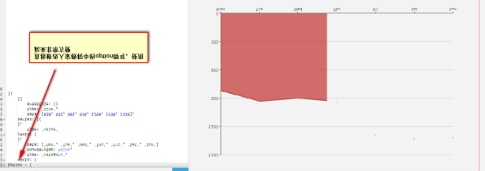
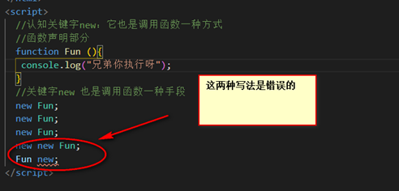
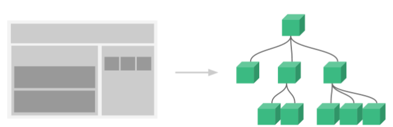
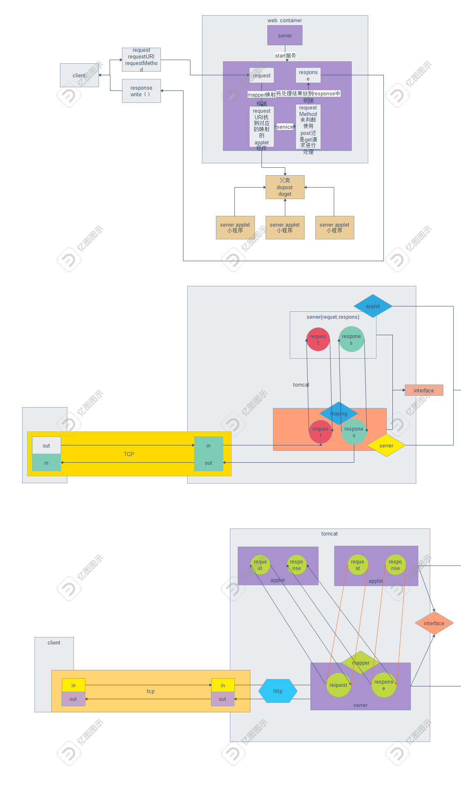

# Web前后端

# Web前端

# 1、HTML

概述:HTML（HeyperText MarkUp Language）全称称之为超文本标记语言，它是世界上最简单的语言，

在开发的时候我们只需要进行页面布局（利用标签:element）

注意：超文本标记语言（HTML）又称之为web(开发)，它诞生(1993~2019)这门语言大大小小经历过变化有五次，

最近一次2014称之为HTML5（超文本标记语言第五次重大变化）

## 1、element

概述：HTML（超文本标记语言）,它的页面（静态页面）是由标签组成，最终要一部分就是块元素；很明显一个特征：独占一行

### 1、常用块元素

#### 1、静态页面骨架

快捷键：shift + ！+ tab

```html
<!DOCTYPE html> //这是超文本标记语言第五次重大变化文档声明方式
<html lang="en"> 
<head>
    <meta charset="UTF-8" />  //chartset:设置字符集  UTF-8（简称万国编码）
    <title>Document</title>
</head>
<body>

</body>
</html>
```

1、 HTML标签是整个网页根元素（进行页面布局的其他元素：都是嵌套在HTML标签里面作为子元素）

2、HTML标签右侧有一个lang属性（前端当中管这种写法叫做属性），属性值en(英文简写：代表的是英文下开发)


#### 2、常用标签---块元素

概述：在web开发中块元素非常常用：块(block)元素是独占一行,在页面中是由上到下进行排列。常用块元素有很多：h1~h6(标题)、div、p、ul、li.....等等

注意：在书写学习这些标签（块元素），一定要注意在body标签内部进行书写.

标签小技巧：打出标签名（ctr + E）标签自动补齐；

运行方式：鼠标右键+赋值路径（在浏览器中运行）

```html
<!DOCTYPE html>
<html lang="en">
<head>
    <meta charset="UTF-8" />
    <title>我是人生当中第一12ABC个静态页面</title>
</head>
<body>
    <p>我也是一个块元素--独占一行(一个段落)</p>
    <p>我也是一个块元素--独占一行(一个段落)</p>
    <p>我也是一个块元素--独占一行(一个段落)</p>
    <p>我也是一个块元素--独占一行(一个段落)</p>
    <p>我也是一个块元素--独占一行(一个段落)</p>
    <h1>我代表的是网页中一级标题</h1>
    <h2>我代表的是网页中二级标题</h2>
    <h3>我代表的是网页中三级标题</h3>
    <h4>我代表的是网页中四级标题</h4>
    <h5>我代表的是网页中五级标题</h5>
    <h6>我代表的是网页中六级级标题</h6>
    <h1>我有事一级标题</h1>
    <h1>我有事一级标题</h1>
    <h1>我有事一级标题</h1>
    <h1>我有事一级标题</h1>
    <h1>我有事一级标题</h1>
    <h1>我有事一级标题</h1>
<h1>我有事一级标题</h1>
<div>我也是一个块元素-----经常会用到（布局用到）</div>
 <div>
      <h3>我是三级标题---作为div子元素</h3>
 </div>
</body>
</html>
```

1、h1~h6：一级标题~六级标题（字体越来越小样子）

2、咱们今天所学习的标签可以复用（多次使用）、标签可以嵌套使用

#### 3、常用块元素---列表系列

概述：列表（也是块元素）有两个：无序列表ul 、有序列表ol，这两个块元素用来显示列表，而且li标签经常作为他们子元素一起使用；

```html
<!DOCTYPE html>
<html lang="en">
<head>
    <meta charset="UTF-8" />
    <title>Document</title>
</head>
<body>
     <!-- 无序列表 -->
     <ul>
        <li>吃饭</li>
        <li>睡觉</li>
        <li>打豆豆</li>
     </ul>
     <ol>
         <li>学习</li>
         <li>喝酒</li>
         <li>烫头</li>
     </ol>
</body>
</html>
```

1、h1~h6(不同级别标题) div(盒子标签) p(段落)

2、ul（无序列表） ol(有序列表) 他们两者经常结合li元素一起使用

### 2、行内元素

概述:前端开发当中行内元素（内联元素）：常见的行内元素有如下几个：

行内元素特征：不是独占一行，从左到右进行排列

span、img、a

注意：在web领域中标签（双闭合标签）、单闭合标签

```html
<!DOCTYPE html>
<html lang="en">
<head>
    <meta charset="UTF-8" />
    <title>Document</title>
</head>
<body>
     <a href="http://www.sina.com">新浪</a>
     <a href="http://www.taobao.com">淘宝</a>
     <a href="http://www.baidu.com">百度</a>
     <span>我也是行内元素</span>
     <span>我也是行内元素span</span>
     
</body>
</html>
```

1、a标签href属性是用来设置超链接的地址属性

2、img标签的src属性是用来设置显示图片路径的（图片名称） 图片没有情况下默认显示文字

```html
<!DOCTYPE html>
<html lang="en">
<head>
    <meta charset="UTF-8" />
    <title>Document</title>
</head>
<body>
     <!-- address:块元素独占一行 -->
     <!-- address：是2014年才新增的：用来显示地址 -->
     <address>
           <iframe width="204" height="613" frameborder="0" scrolling="no" marginheight="0" marginwidth="0" src="http://j.map.baidu.com/s/5BcIFb"></iframe>
     </address>
</body>
</html>
```

### 3、小总结

块（block）元素:自己独占一行（h1~h6标题）、div、p、ul、ol、li、address

行内(inline)元素：a 、span、img<!DOCTYPE html>

```html
<html lang="en">
<head>
    <meta charset="UTF-8" />
    <title>Document</title>
</head>
<body>
    <ul>
        <li><a href="http://www.baidu.com">百度</a></li>
        <li><a href="http://www.sina.com">新浪</a></li>
        <li><a href="http://www.taobao.com">淘宝</a></li>
    </ul>
</body>
</html>
```

### 4、表单元素

概述：前端中比较重要标签：标元素（表单元素经常用来收集用户输入信息），将用户输入信息提交给服务器。表单元素即为input标签（单闭合标签），这个标签经常集合form标签一起使用。

```html
<!DOCTYPE html>
<html lang="en">
<head>
    <meta charset="UTF-8" />
    <title>Document</title>
</head>
<body>
    <form>
         <!-- 表单元素即为input标签 -->
         <p>
             用户名:  <input type="text" />
         </p>
         <p>
             密&nbsp;&nbsp;码: <input type="password" />
         </p>
         <p>
             日历:<input type="date" />
         </p>
         <p>
             你喜欢的颜色: <input type="color" />
         </p>
         <p>
             你的身高: <input type="range" >
         </p>
         <p>
             你喜欢的食物
             <input type="checkbox" />烤鸭
             <input type="checkbox" />烤鸭
             <input type="checkbox" />烤鸭
             <input type="checkbox" />烤鸭
             <input type="checkbox" />烤鸭
         </p>
         <p>
             你喜欢那个国家？
             <input type="radio" name="A"/>中国
             <input type="radio" name="A"/>韩国
             <input type="radio" name="A"/>日本
             <input type="radio" name="A"/>美国
         </p>
         <p>
             <input type="submit" />
         </p>
    </form>
</body>
</html>
```

### 5、小复习

问题:HTML呀？

答:HTML[HyperText MarkUp langage]即为超文本标记语言，它是世界上最简单的编程，利用标签完成页面中布局。

问题：块元素

答：块元素在网页中独占一行【一般从上到下进行排列】

h1~h6、div、p、ul、ol、li、address等等

问题：行内元素

span、a、img、表单元素：输入框、单选按钮、复选按钮、提交按钮等等

## 2、音频标签

概述：如果你想在网页中显示音频我们利用audio标签显示音频。Web领域中音频audio标签，只能播放下面三种音频格式。（行内元素）

mp3、ogg、wav格式

### 1、MP3:音频格式

​	MP3是一种音频压缩技术，其全称是动态影像专家压缩标准音频层面3（Moving Picture Experts Group Audio Layer III），简称为MP3。它被设计用来大幅度地降低音频数据量。利用 MPEG Audio Layer 3 的技术，将音乐以1:10 甚至 1:12 的压缩率，压缩成容量较小的文件，而对于大多数用户来说重放的音质与最初的不压缩音频相比没有明显的下降。它是在1991年由位于德国[埃尔朗根](https://baike.baidu.com/item/埃尔朗根/3312082)的研究组织[Fraunhofer-Gesellschaft](https://baike.baidu.com/item/Fraunhofer-Gesellschaft)的一组工程师发明和标准化的。用MP3形式存储的音乐就叫作MP3音乐，能播放MP3音乐的机器就叫作MP3播放器。

### 2、Ogg:音频格式

​	Ogg全称是OGGVobis(oggVorbis)是一种[音频](https://baike.baidu.com/item/音频)[压缩格式](https://baike.baidu.com/item/压缩格式)，类似于[MP3](https://baike.baidu.com/item/MP3/23904)等的[音乐格式](https://baike.baidu.com/item/音乐格式/3043629)。Ogg是完全免费、开放和没有专利限制的。OggVorbis文件的扩展名是".ogg"。Ogg文件格式可以不断地进行大小和音质的改良，而不影响旧有的[编码器](https://baike.baidu.com/item/编码器/6029803)或播放器。

### 3、wav:音频格式

​	是最常见的声音文件格式之一，是微软公司专门为Windows开发的一种标准数字音频文件，该文件能记录各种单声道或立体声的声音信息，并能保证声音不失真。但WAV文件有一个致命的缺点，就是它所占用的[磁盘空间](https://baike.baidu.com/item/磁盘空间/18951698)太大（每分钟的音乐大约需要12兆磁盘空间）。它符合资源互换文件格式（RIFF）规范，用于保存Windows平台的音频信息资源，被Windows平台及其应用程序所广泛支持。Wave格式支持MSADPCM、CCITT A律、CCITT μ律和其他压缩算法，支持多种音频位数、采样频率和声道，是PC机上最为流行的声音文件格式；但其文件尺寸较大，多用于存储简短的声音片段。

```html
<!DOCTYPE html>
<html lang="en">
<head>
    <meta charset="UTF-8" />
    <title>Document</title>
</head>
<body>
     <h1>下面兄弟就是音频</h1>
     <audio src="1.mp3" controls autoplay muted loop></audio>
</body>
</html>
```

1、我们可以利用audio标签播放音频（mp3、ogg、wav）

2、视频利用的是video标签(用法和上面音频几乎一模一样的)

| src      | 设置音频播放路径     |
| -------- | -------------------- |
| controls | 显示默认控制条       |
| autoplay | 自动播放（兼容问题） |
| muted    | 静音                 |
| loop     | 循环播放             |

注意：video视频标签也是支持三种格式：

mp4、ogg、webm

### 4、mp4:

​	MP4是一套用于[音频](https://baike.baidu.com/item/音频/1197465)、视频信息的压缩[编码](https://baike.baidu.com/item/编码/80092)标准，由国际标准化组织（ISO）和国际电工委员会（IEC）下属的“动态图像专家组”（Moving Picture Experts Group，即MPEG）制定，第一版在1998年10月通过，第二版在1999年12月通过。MPEG-4格式的主要用途在于网上流、光盘、语音发送（[视频电话](https://baike.baidu.com/item/视频电话/2673074)），以及电视广播。

### 5、WebM：

​	webM由[Google](https://baike.baidu.com/item/Google)提出，是一个开放、免费的媒体文件格式。WebM 影片格式其实是以 [Matroska](https://baike.baidu.com/item/Matroska)（即 [MKV](https://baike.baidu.com/item/MKV)）容器格式为基础开发的新容器格式，里面包括了[VP8](https://baike.baidu.com/item/VP8)影片轨和 [Ogg](https://baike.baidu.com/item/Ogg) Vorbis 音轨，其中Google将其拥有的VP8视频编码技术以类似[BSD](https://baike.baidu.com/item/BSD)授权开源，Ogg Vorbis 本来就是开放格式。 WebM标准的[网络视频](https://baike.baidu.com/item/网络视频/1701340)更加偏向于开源并且是基于[HTML5](https://baike.baidu.com/item/HTML5)标准的，WebM 项目旨在为对每个人都开放的网络开发高质量、开放的视频格式，其重点是解决视频服务这一核心的网络用户体验。Google 说 WebM 的格式相当有效率，应该可以在 netbook、tablet、手持式装置等上面顺畅地使用。

# 2、CSS

概述：CSS【Cascading Style Sheets】全称层叠样式表。

理解：可以把HTML文件想向成是一个房子骨架，里面标签（块元素、行内元素）理解为搭建房子转，

CSS负责美化房子（进行装修）,让你的静态页面（网站看的相对好看一些）

## 1、初识CSS

### 1、标签选择器

概述：样式【CSS】用来美观标签（页面），web领域样式分为三种（今天只是关注内部样式）。

内部样式需要书写在head中，利用子元素双闭合标签style标签完成。

语法格式：

```css
<style type=”text/css”>
      标签名字{
         属性:属性值;
         属性：属性值;
         属性：属性值;
}
<style>
```

l 外部样式

l 内部样式

l 行内样式

```html
<!DOCTYPE html>
<html lang="en">
<head>
    <meta charset="UTF-8" />
    <title>Document</title>
    <style type="text/css">
         h1{
            /* 文字颜色:属性值红、橙、黄、绿、青、蓝、紫色等等 */
            color:skyblue;
            /* 字体大小设置 */
            font-size:16px;
            /* 背景颜色设置 */
            background-color:orange;
            /* 文本对齐方式 */
            text-align:center;
            /* 字体样式设置 */
            font-style:italic;
         }

        div{
           background-color:red;
           font-size:28px;
           color:cyan;
           text-align:center;
           font-style:italic;
           /* 透明度设置：透明度属性值范围0~1 */
           opacity:1;
           /* 光标防止标签中:变为小手; */
           cursor:pointer;
        }
    </style>
</head>
<body>
      <h1>我是一级标题</h1>
      <h1>我是小明呀</h1>
      <div>我是常用布局标签</div>
</body>
</html>
```

标签选择器：常用样式中选择匹配标签

| color【设置标签文字颜色】         | red、orange、yellow、green、cyan、blue、purple |
| --------------------------------- | ---------------------------------------------- |
| font-size【标签文字大小尺寸设置】 | Numberpx (数字最小12~)                         |
| background-color【背景颜色设置】  | red、orange、yellow、green、cyan、blue、purple |
| text-align【文本对齐方式】        | left、center、right                            |
| font-style[字体样式]              | italic                                         |
| Opacity【透明度设置】             | 0~1【0：纯透明】                               |
| cursor                            | pointer【小手】                                |

### 2、id选择器

命名标识符规范：

1、可以数字、字母、下划线、美元符号

2、但是不能以数字开头

3、不能是这门语言当中关键字、保留字

概述:我们上面案例通过标签名字匹配页面中对应标签进行设置(内部样式）,除此之外还可以通过id选择器匹配标（节点:element）；

注意：一般情况下，页面中标签id属性值唯一（和人的身份证是一样的，没人都有一个但是都不同）

```html
<!DOCTYPE html>
<html lang="en">
<head>
    <meta charset="UTF-8" />
    <title>id选择器</title>
    <style type="text/css">
        #box{
          color:black;
          /* 文本描述 */
          text-decoration:none;
        }
    </style>
</head>
<body>
    <a href="http://www.baidu.com" id="box">百度</a>
</body>
</html>
```

1、 在标签（开始标签）这里添加一个id属性，对应右侧属性值

2、 在style标签里面（内部样式）#号+对应节点id的属性值

```html
<!DOCTYPE html>
<html lang="en">
<head>
    <meta charset="UTF-8" />
    <title>id选择器</title>
    <style type="text/css">
        #box{
          color:black;
          /* 文本描述 */
          text-decoration:none;
        }
        #box1{
           /* 列表默认样式设置 */
           list-style:square;
        }
        #cur{
             color:cyan;
        }
        #box2{
             /* 列表默认样式设置 */
             list-style:square;
        }
    </style>
</head>
<body>
    <a href="http://www.baidu.com" id="box">百度</a>
    <ul id="box1">
         <li>吃饭</li>
         <li id="cur">睡觉</li>
         <li>打豆豆</li>
    </ul>
    <ol id="box2">
        <li>unity3D</li>
        <li>cos2D</li>
        <li>PHP</li>
    </ol>
</body>
</html>
```

| text-decoration【文本描述】 | none、underline、overline、line-throuth |
| --------------------------- | --------------------------------------- |
| list-style                  | none、circle、square                    |

### 3、class选择器

概述：我们已经学习过了标签选择器、ID选择器、除此以外还可以使用class(类)选择器；

注意：ID选择器属性值一般唯一的、class属性值可以重复（不是唯一的）

```html
<!DOCTYPE html>
<html lang="en">
<head>
    <meta charset="UTF-8" />
    <title>Document</title>
    <style type="text/css">
         .current{
           font-size:30px;
           background-color:cyan;
         }
         .cur{
             color:skyblue;
             font-size:18px;
         }
    </style>
</head>
<body>
    <div class="current">我是祖国的老花骨朵,是祖国未来</div>
    <div>我也是祖国花鼓富哦</div>
    <div>我也是祖国花鼓富哦</div>
    <div class="current">我也是祖国花鼓富哦</div>
    <div>我也是祖国花鼓富哦</div>
    <div>我也是祖国花鼓富哦</div>
    <div>我也是祖国花鼓富哦</div>
    <div>今天是北京<span class="cur">2019年11月30日21:47:25</span></div>
</body>
</html>
```

学习了三个选择器：标签选择器（标签名字）、ID选择器（#+id属性值）、class选择器（.+class属性值）

### 4、背景系列样式

概述：背景系列属性有如下几个：

Background-color[背景颜色]、background-image[背景图设置]、background-repeat：【背景图重复】

```html
<!DOCTYPE html>
<html lang="en">
<head>
    <meta charset="UTF-8" />
    <title>Document</title>
    <style type="text/css">
        div{
            /*宽度和高度设置*/
            width:720px;
            height: 720px;
            /* 背景颜色 */
            background-color:red;
            /* 设置背景图 */
            background-image:url(jie.jpg);
            /* 背景重复设置 */
            background-repeat:no-repeat;
           /* 简写方式 */
           background: no-repeat url(jie.jpg)  red;
        }
    </style>
</head>
<body>
     <div></div>
</body>
</html>
```

| background-color  | 背景颜色设置（颜色）    |
| ----------------- | ----------------------- |
| Background-image  | 背景图(图片路径)        |
| Backgrpund-repeat | 背景图重复（no-repeat） |

他们三者可以进行简写：

background:cyan url(1.jpg) no-repeat;

这三个属性值谁先谁后都可以

## 2、样式

概述：CSS（层叠样式）可以给页面中标签进行‘修改’，外观看起来跟家好看一些。

前端web领域中样式写法有三种：外部样式、内部样式、行内样式

### 1、外部样式

概述：在前端web开发中样式可以防止在CSS文件里面，在页面中通过link标签可以引入外部文件样式。

比如：我们在程序当中创建CSS文件夹这个文件夹里面有一个default.css文件，这个文件里面可以书写你的样式。

静态页面：

```html
default.css文件<!DOCTYPE html>
<html lang="en">
<head>
    <meta charset="UTF-8" />
    <title>Document</title>
    <!-- 引入外部样式文件（CSS文件） -->
    <link rel="stylesheet" type="text/css" href="css/default.css">
</head>
<body>
     <div class="box">
          <p id="cur">北京昨天下大雪了,真的很美</p>
     </div>
</body>
</html>
```

如果想引入外部CSS文件，需要通过link标签进行引入

default.css文件：

```css
.box{
    width:280px;
    height: 280px;
    background:red;
}
#cur{
    font-size: 20px;
    color:green;
    text-align:center;
}
```

### 2、行内样式

概述：我们在给标签设置样式时候：可以选择器外部样式、内部样式、行内样式（对于web开发很少用）；

行内样式：直接在开始标签的地方就可以设置，通过style属性进行设置。

```html
<!DOCTYPE html>
<html lang="en">
<head>
    <meta charset="UTF-8" />
    <title>Document</title>
</head>
<body>
     <p style="width:600px;height:300px;font-size: 30;color: red;">最近比较热门话题是xx公司暴力裁员</p>
</body>
</html>
```

注意:行内样式写法

<标签名字 style = “属性:属性值;属性:属性值;”>文本</标签名字>

### 3、总结样式

总结：(web)前端开发中样式有三种：外部样式（link标签引入外部CSS文件）、内部样式、行内样式

| 外部样式 | Link标签引入                                      |
| -------- | ------------------------------------------------- |
| 内部样式 | <style></style>                                   |
| 行内样式 | <标签名字 style  = “属性:属性值;”>文本</标签名字> |

注意：前端开发中样式有优先级的：行内样式=>内部样式=>外部样式

问题：三种样式那种好?

外部样式相对而言在开发项目时候经常用外部样式【可以进行统一管理：让你的项目中样式看的更加整洁】

## 3、盒模型*

概述：所谓盒模型其实任意标签都有，可以让标签向外拓展。【padding、border、margin】

盒模型中：padding【内边距】、border【外边框】可以让元素向外拓展。

盒模型:（margin (外边距)+ padding（内边框） + border（外边框） + width（宽） + heigh（高））：参考画框

第一个div的


第二个div的


```html
<!DOCTYPE html>
<html lang="en">
<head>
    <meta charset="UTF-8" />
    <title>Document</title>
    <style type="text/css">
        .box{
             width:200px;
             height:200px;
             /* 外边框：可以让元素向外拓展 */
             border:5px solid red;
             padding:100px;
        }
        .box1{
             margin:10px;/*标签与标签的距离*/
             width:200px;
             height: 200px;
             background:red;
        }
    </style>
</head>
<body>
     <div class="box">文字文字</div>
     <div class="box1"></div>
</body>
</html>
```

## 4、定位

概述：在前端web开发中所谓文档流【页面中标签排列方式】：如果想打破文档流让标签可以在任意地方显示，

需要进行定位；

定位在前端开发中三种：固定定位、相对定位、绝对定位

块元素：从上到下排列（独占一行）

行内元素：从左到右排列（不独占一行）

### 1、固定定位

注意：如果是定位元素就有left、top、right、bottom四个属性；

概述：如果你想给某一个标签固定在网页中某一个位置，可以利用固定定位，哪怕页面有上下滑动效果也不影响。


```html
<!DOCTYPE html>
<html lang="en">
<head>
    <meta charset="UTF-8" />
    <title>Document</title>
    <style type="text/css">
        div{
             width:400px;
             height: 200px;
        }
        body{
            height: 10000px;
        }
        .box{
            /* 固定定位：固定定位元素不占起始位置 */
            position: fixed;
            left:500px;
            top:200px;
            background:red;
        }
        .box1{
            background:green;
        }
        .box2{
            background:purple;
        }
    </style>
</head>
<body>
    <div class="box"></div>
    <div class="box1"></div>
    <div class="box2"></div>
</body>
</html>
```

1、 定位元素才有left、top、right、bottom灯属性

2、 固定定位是以网页为参照，固定在某一个位置（哪怕页面滑动：也是在这个位置上）

3、 固定定位元素不占用起始位置

### 2、相对定位

概述：相对定位也可以让元素脱离文档流，元素在进行相对定位的时候，其实相对的起始位置进行偏离，

而且还需要注意：相对定位元素起始位置值占用的。


```html
<!DOCTYPE html>
<html lang="en">
<head>
    <meta charset="UTF-8" />
    <title>Document</title>
    <style type="text/css">
        /* 清除默认样式：默认情况下有缝隙 */
        *{
            margin:0;
            padding: 0;
        }
        div{
             width:400px;
             height: 200px;
        }
        .box1{
            background:red;
        }
        .box2{
            position: relative;
            left:400px;
            top:200px;
            background:green;
        }
        .box3{
            background:purple;
        }
    </style>
</head>
<body>
    <div class="box1"></div>
    <div class="box2"></div>
    <div class="box3"></div>
</body>
</html>
```

1、 相对定位元素：相对于自己起始位置

2、相对元素起始位置是占用的（别人用不了）


### 3、绝对定位

概述：绝对定位也可以让元素脱离标准文档流：

1. 绝对定位元素，如果没有定位父元素【绝对定位元素：参照页面进行偏移】
2. 绝对定位元素，如果有定位父元素【绝对定位元素：参照定位父元素进行偏移】

注意：绝对定位元素不占起始位置（别人可以占用起始位置）


```html
<!DOCTYPE html>
<html lang="en">
<head>
    <meta charset="UTF-8" />
    <title>Document</title>
    <style type="text/css">
         /* 清除默认样式 */
         *{
            margin:0;
            padding: 0;
         }
         body{
            height: 1000px;
         }
         div{
            width:400px;
            height: 200px;
         }
         .box1{
            position: fixed;
            left:100px;
            top:100px;
            background:red;
         }
         .box2{
            background:green;
         }
         .box3{
             background:purple;
         }
    </style>
</head>
<body>
    <div class="box1"></div>
    <div class="box2"></div>
    <div class="box3"></div>
</body>
</html>
```


```html
<!DOCTYPE html>
<html lang="en">
<head>
    <meta charset="UTF-8" />
    <title>Document</title>
    <style type="text/css">
        *{
            margin:0;
            padding: 0;
        }
        .outer{
             position: relative;
             /* 父元素 */
             width:400px;
             height: 400px;
             background:red;
             margin:200px;
        }
        .inner{
             position: absolute;
             left:10px;
             top:20px;
             width:200px;
             height: 200px;
             background:green;
        }
    </style>
</head>
<body>
        <div class="outer">
            <div class="inner"></div>
        </div>
</body>
</html>
```

### 4、定位小练习

```html
<!DOCTYPE html>
<html lang="en">
<head>
    <meta charset="UTF-8" />
    <title>Document</title>
    <style type="text/css">
        /* 子绝父相*/
        *{
            margin:0;
            padding: 0;
        }
        .box{
             position: relative;
             width:600px;
             height: 400px;
             background:red;
             border:1px solid black;
             left:200px;
        }
        .cur{
             position: absolute;
             left:0px;
             top:0px;
             width:300px;
             height:400px;
             background:cyan;
        }
        .cur1{
            position: absolute;
             width:300px;
             height:200px;
             left:300px;
             top:0px;
             background:purple;
        }
        .cur2{
            position: absolute;
            width:300px;
            height:200px;
            background:yellow;
            left:300px;
            top:200px;
        }
    </style>
</head>
<body>
    <div class="box">
        <div class="cur"></div>
        <div class="cur1"></div>
        <div class="cur2"></div>
    </div>
</body>
</html>
```

## 5、浮动

概述：我们可以利用定位打破文档流，除此以外也可以利用浮动，其实浮动就是让元素进行‘靠左、靠右’进行水平排列；

//靠左侧浮动


//靠右浮动


//靠左侧浮动（一行放不下自动换行）


```html
<!DOCTYPE html>
<html lang="en">
<head>
    <meta charset="UTF-8" />
    <title>Document</title>
    <style type="text/css">
        /* 清除默认样式 */
        *{
            margin:0;
            padding: 0;
        }
        div{
            /* 靠左侧浮动 */
            float:left;
            width:150px;
            height: 50px;
            background:cyan;
        }
    </style>
</head>
<body>
     <div>最近北京气温降低</div>
     <div>最近北京气温降低</div>
     <div>最近北京气温降低</div>
     <div>最近北京气温降低</div>
     <div>最近北京气温降低</div>
     <div>最近北京气温降低</div>
     <div>最近北京气温降低</div>
     <div>最近北京气温降低</div>
     <div>最近北京气温降低</div>
</body>
</html>
```

### 1、导航


```html
<!DOCTYPE html>
<html lang="en">
<head>
    <meta charset="UTF-8" />
    <title>Document</title>
    <style type="text/css">
        *{
            margin:0;
            padding: 0;
        }
        .box{
             position: relative;
             /* 当前这个div宽度是按照父元素宽度进行百分比*/
             width:100%;
             height:50px;
             background:#01204f;
        }
        ul{
             position: absolute;
             left:20%;
             width:80%;
             height: 50px;
             /* 将列表默认样式清除（将前面黑色圆球干掉） */
             list-style: none;
        }
        li{
            float:left;
            width:60px;
            height: 50px;
            color:white;
            /* 行高 */
            line-height:50px;
            /* 小手 */
            cursor:pointer;
            /* 文字居中 */
            text-align:center;
        }
        li:hover{
             background:red;
        }
    </style>
</head>
<body>
     <div class="box">
           <ul>
                <li>首页</li>
                <li>国内</li>
                <li>国际</li>
                <li>军事</li>
                <li>财经</li>
                <li>娱乐</li>
                <li>体育</li>
                <li>互联网</li>
                <li>科技</li>
                <li>游戏</li>
                <li>女人</li>
                <li>汽车</li>
                <li>房产</li>
           </ul>
     </div>
</body>
</html>
```

1、 子元素宽度可以是百分比单位，按照父元素宽度进行划分百分比的；

2、 Line-heigh(行高):可以让文本在垂直方向居中（最好它的属性值和当前元素高度一边高就行了）

### 2、轮播图小圆球


```html
<!DOCTYPE html>
<html lang="en">
<head>
    <meta charset="UTF-8" />
    <title>Document</title>
    <style type="text/css">
        *{
            margin:0;
            padding: 0;
        }
        ul{
             position: relative;
             width:300px;
             height: 50px;
             list-style: none;
             border:1px solid black;
             left:500px;
        }
        li{
            float:left;
            /* 左侧外边距 */
            margin-right:10px;
            width:50px;
            height: 50px;
            background:green;
            /* 圆角设置 */
            border-radius:50%;
        }
        .cur{
            background:yellow;
        }
    </style>
</head>
<body>
     <ul>
          <li class="cur"></li>
          <li></li>
          <li></li>
          <li></li>
          <li></li>
     </ul>
</body>
</html>
```

### 3、四叶草效果-----免费送的

https://www.w3school.com.cn/cssref/pr_animation.asp（CSS中给元素添加动画:animation）

概述：web前端开发浏览器厂商常见：谷歌、IE、火狐、欧朋

animation：动画稍微了解（知道有这个东西即可） 前端工程师可以利用样式搞动画

浏览器厂商私有前缀（带有私有前缀样式只能在当前浏览器中使用）：

| 谷歌   | IE   | 火狐 | 欧朋 |
| ------ | ---- | ---- | ---- |
| webkit | ms   | moz  | o    |

```html
<!DOCTYPE html>
<html lang="en">
<head>
    <meta charset="UTF-8" />
    <title>Document</title>
    <style type="text/css">
        *{
            margin:0;
            padding: 0;
        }
        .box{
             /*相对定位：相对的是自己起始位置  */
             position: relative;
             width:200px;
             height: 200px;
             left:40%;
             /* 调用动画 */
             animation:donghua 5s linear 0s infinite;
        }
        .ye1{
            /* 绝对定位：参照定位父元素进行偏移*/
            position: absolute;
            width:100px;
            height: 100px;
            background:green;
            left:0px;
            top:0px;
            /* 圆角设置:分别左上、右上、右下、左下 */
            border-radius:0px 90px 0px 90px;
        }
        .ye2{
             /* 绝对定位：参照定位父元素进行偏移*/
             position: absolute;
             width:100px;
             height: 100px;
             background:green;
             left:100px;
             border-radius:90px 0px 90px 0px;
        }
        .ye3{
             position: absolute;
             width:100px;
             height: 100px;
             background:green;
             left:0px;
             top:100px;
             border-radius:90px 0px 90px 0px;
        }
        .ye4{
             position: absolute;
             width:100px;
             height:100px;
             background:green;
             left:100px;
             top:100px;
            border-radius:0px 90px 0px 90px;
        }

        /* 声明一个animation动画 */
        @-webkit-keyframes donghua{
               from{
                   /* 旋转属性：可以让元素进行旋转（旋转单位是deg）*/
                   transform:rotate(0deg);
               }

               to{
                  transform:rotate(360deg);
               }
        }
    </style>
</head>
<body>
    <div class="box">
          <div class="ye1"></div>
          <div class="ye2"></div>
          <div class="ye3"></div>
          <div class="ye4"></div>
    </div>
</body>
</html>
```

## 6、轮播图布局

概述：很多电商（淘宝、京东）网站它首页中都带有banner(轮播图功能)。

**子绝父相**：子元素使用绝对定位（position: absolute），而父元素使用相对定位（position: relative）。这样设置后，子元素的位置是相对于父元素来计算的，而不是相对于文档的根元素


```html
<!DOCTYPE html>
<html lang="en">
<head>
    <meta charset="UTF-8" />
    <title>Document</title>
    <style type="text/css">
        /* 默认样式清除 */
        *{
            margin:0;
            padding: 0;
        }
        .box{
              /*相对定位  */
              position: relative;//相对自己起始位置进行便宜，起始位置占用（别人不能用）
              width:520px;
              height: 280px;
              border:1px solid red;//外边框【外边框大小设置 实线 颜色设置】
              left:400px;  //定位元素才有left、top、right bottom
              top:100px;
              /* 如果子元素超出父元素部分隐藏*/
              overflow: hidden;  //子元素超出父元素部分：隐藏掉
        }
        ul{
             position: absolute;
             list-style: none;//去除列表默认样式（前面黑色小球）
             width:520px;
             height: 280px;
        }
        .leftbtn{
             position:absolute;//绝对定位：按照已经定位父元素进行便宜
             width:60px;
             height:30px;
             background:black;
             left:0px;
             top:120px;
             color:white;
             text-align:center;//文本居中
             line-height:30px;//行高设置（让文字垂直方向居中：一般和高度一样）
             cursor:pointer;//小手
             opacity: .8;//透明【0~1】
        }
        .rightbtn{
             position: absolute;
             width:60px;
             height: 30px;
             background:black;
             right:0px;
             top:120px;
             color:white;
             text-align:center;
             line-height:30px;
             cursor:pointer;
             opacity: .8;
        }
        ol{
             position: absolute;
             width:200px;
             height:25px;
             list-style: none;
             left:35%;
             bottom:5px;
        }
        /* 后代选择器 */
        ol li{
            float:left;//左侧浮动
            width:25px;
            height: 25px;
            background:black;
            color:white;
            /* 变为圆球 */
            border-radius:12.5px;圆角设置【左上、右上、右下、左下】
            text-align:center;
            line-height:25px;
            margin-right:5px;
        }
        .cur{
             background:skyblue;
             /* 进行缩放 */
             transform:scale(1.2);
        }
    </style>
</head>
<body>
     <div class="box">
           <!--有序列表去做显示图片  -->
             <ul>
                  <li></li>
                  <li></li>
                  <li></li>
                  <li></li>
                  <li></li>
             </ul>
             <!-- 做左右按钮 -->
             <div class="leftbtn">left</div>
             <div class="rightbtn">right</div>
             <!-- 分页器 -->
             <ol>
                 <li class="cur">1</li>
                 <li>2</li>
                 <li>3</li>
                 <li>4</li>
                 <li>5</li>
             </ol>
     </div>
</body>
</html>
```

注意：transform可以让元素实现变化：旋转、平移、缩放

旋转（单位是度数deg）:可以让元素按照图形几何中心进行旋转

transform:rotate(30deg)

缩放：可以等比例让元素宽度和高度成比例放大、缩小

tranform:scale():属性值【0-1】缩小 大于1代表的是放大

架构师：技术大牛

前端工程师：web、iOS、安卓等等

后台工程师：Java、PHP、Scala、C++

测试人员：白盒（会代码） + 黑色（不会代码，工具）

产品经理：绘制原型图（网站效果、业务逻辑设计）

UI：切图（实习生）

项目经理：管控整个项目（可能不懂技术：懂管理）

# 3、JavaScript

## 1、初识Javascript

https://www.jianshu.com/p/92fa46c5841a

https://www.w3school.com.cn/ 学习手册

https://www.runoob.com/php/php-ref-array.html 学习手册

//想要了解前端资料网址：

https://cn.vuejs.org/ Vue.js学习手册

https://reactjs.org/docs/hello-world.html React.js学习手册

http://jquery.cuishifeng.cn/ jQuery函数库手册

http://nodejs.cn/ node平台

https://developer.mozilla.org/zh-CN/docs/Web/API/Canvas_API/Tutorial canvas

https://www.echartsjs.com/examples/zh/index.html 图表函数库

### 1、JavaScript简介

概述：JavaScript在前端中简称【JS】，JavaScript是开发web脚本语言。但是它也被用到了很多非浏览器环境中【比如：node平台】，JavaScript在1995年由[Netscape](https://baike.baidu.com/item/Netscape)公司的[Brendan Eich](https://baike.baidu.com/item/Brendan Eich)（创始人大概用了十天的时间将这门语言创建出来），JS可以嵌套在静态页面中可以给静态页面添加一些动态效果（脚本语言），

不同浏览器厂商（在浏览器中都有内置解析器解析JS语法）；

各大浏览器厂商：chorme、IE、火狐、sofai、欧朋（都有属于自己的解析器）

谷歌浏览器：V8解析器（可以解析JS语法：让谷歌浏览器知道你在写什么）

布兰登，艾奇

脚本语言：【PHP、JavaScript】

有一个很大特征：可以嵌套静态页面中添加一些动态效果。

### 2、JavaScript组成

问题：前端三层？

前端分为三层：

结构层 前面课程当中学习标签

样式层 前面课程我们学习样式

行为层 即将学习javaScript

问题2：JavaScript组成？

答：分为三部分


ECMAScript:欧洲计算机协会大概每年6月中旬定制语法规范；

比如：变量为什么用var、函数关键字为什么function、循环语句为什么是for

注意：咱们这段事件学习的是2014年规范简称ES5

DOM【document object model】文档对象模型（经常用来操作标签：在JS当中）

BOM【browser object model】:浏览器对象模型（模拟浏览器）

| JS核心     |                                     |
| ---------- | ----------------------------------- |
| ECMAScript | 欧洲计算机协会每年6月份定时语法规范 |
| DOM        | Document  Object Model              |
| BOM        | Browser  Object Model               |

### 3、JS书写格式

概述：JavaScript属于脚本语言，JS语法务必、必须、一定嵌套在静态页面中，JS当中才可以运行；

我们可以利用双闭合标签<script></scipt>在静态页面中书写JS语法，双闭合标签scipt可以防止静态页面中任意地方，script当然也可以有多个；


Hallo JS：

```html

<!DOCTYPE html>
<html lang="en">

<head>
    <meta charset="UTF-8">
    <meta name="viewport" content="width=device-width, initial-scale=1.0">
    <meta http-equiv="X-UA-Compatible" content="ie=edge">
    <title>Document</title>
</head>

<body>
</body>

</html>
<script>
    //这里面是要书写JS语法的地方
    alert("Hello word");
</script>
```

1、 JS语法必须放置在双闭合标签script里面

2、 双闭合标签script可以放置静态页面中任意地方（一般放置静态页面底部）

3、 程序当中当然可以有多个script标签

## 2、内置功能函数使用

内置：浏览器厂商天生本身天生就有的，我们程序员可以直接使用

### 1、警告框-alert

概述：警告框功能是在浏览器正上方（中间）弹出一个警告框。


用法

```html
<!DOCTYPE html>
<html lang="en">

<head>
    <meta charset="UTF-8">
    <meta name="viewport" content="width=device-width, initial-scale=1.0">
    <meta http-equiv="X-UA-Compatible" content="ie=edge">
    <title>Document</title>
</head>

<body>

</body>

</html>
<script>
    //单行注释
    /*
       多行注释：可以写多行注释给同事们看
       工作当中尽量养成这个习惯
    */
    //JS字符串：人说的话，务必加上双引号、单引号
    alert("我是祖国未来");
    alert("我们希望我们将来很好");
    alert('希望听贾老师的课程你们有收获');
</script>
```

1、 警告框功能可以多次使用

2、 JS当中字符串，外层需要加上双引号、单引号（别一双一单）

3、 每行代码最后面加上一个分号：代表的是这行语句结束

### 2、提示框-prompt


概述：在JS当中内置函数prompt，可以在浏览器正上方弹出一个提示框；

```html
<!DOCTYPE html>
<html lang="en">

<head>
    <meta charset="UTF-8">
    <meta name="viewport" content="width=device-width, initial-scale=1.0">
    <meta http-equiv="X-UA-Compatible" content="ie=edge">
    <title>Document</title>
</head>

<body>

</body>

</html>
<script>
    //提示框
    prompt("姑娘你的芳龄");
    prompt("小小兄弟你回家了吗", 66666);
</script>
```

### 3、控制台使用

概述：console.log（打印的数据）


```html
<!DOCTYPE html>
<html lang="en">

<head>
    <meta charset="UTF-8">
    <meta name="viewport" content="width=device-width, initial-scale=1.0">
    <meta http-equiv="X-UA-Compatible" content="ie=edge">
    <title>Document</title>
</head>

<body>

</body>

</html>
<script>
    //控制台打印数据
    console.log("我在控制台中打印数据，你看不见我");
    console.log(12306);
</script>
```

## 3、数据类型

概述：在JS当中也有数据类型也分：基本数据类型（5） 、引用类型【复杂数据类型】（1）

//基本数据类型

| 数据类型                   | 数值            |
| -------------------------- | --------------- |
| String：字符串（人说的话） | “我爱你祖国”    |
| Number：数字类型           | 100，3.14，-666 |
| Boolean:布尔类型           | true、false     |
| Undefined：未定义          | undefined       |
| Null：空对象类型           | null            |

引用类型数据：

| 数据类型        | 数值                       |
| --------------- | -------------------------- |
| Object:引用类型 | 函数、数组、正则、DOM、BOM |


```html
<!DOCTYPE html>
<html lang="en">

<head>
    <meta charset="UTF-8">
    <meta name="viewport" content="width=device-width, initial-scale=1.0">
    <meta http-equiv="X-UA-Compatible" content="ie=edge">
    <title>Document</title>
</head>

<body>

</body>

</html>
<script>
    //字符串（String）:字符串即为人说的话【务必加上双引号、单引号】
    console.log("我爱你JS");
    console.log("最近快过年了，回家要胖五进");
    //数字类型(Number):咱们小学学习数字
    console.log(100);
    console.log(-4.14);
    console.log(123456789);
    //布尔类型数值：true、false
    console.log(true);
    console.log(false);
    //未定类型数据
    console.log(undefined);
    //空对象类型
console.log(null);
    //JS当中有一个关键字typeof可以检测数据类型
    console.log(typeof 123);
    console.log(typeof true);
    console.log(typeof undefined);
</script>
```

1、 在JS当中有五个基本数据类型是：字符串、数字、布尔值、未定义、空对象

2、 typeof是JS当中一个关键字可以检查数据类型

## 4、变量

概述：变量（variable）来源于数学,变量相当于是一个容器，变量可以存储数据、存储计算完结果；

通过访问变量名字获取到存储数据。

JavaScript当中变量使用：

第一步：用关键字var 声明变量   var 变量名字

第二步：给变量进行赋值      变量名字 = 123；

第三步：使用变量         console.log(变量名字)

```html
<!DOCTYPE html>
<html lang="en">

<head>
    <meta charset="UTF-8">
    <meta name="viewport" content="width=device-width, initial-scale=1.0">
    <meta http-equiv="X-UA-Compatible" content="ie=edge">
    <title>Document</title>
</head>

<body>

</body>

</html>
<script>
    //第一步：用关键字var进行声明变量
    var num;
    //第二步：可以给变量进行赋值 （将右侧数据||计算完结果）赋值给左侧变量
    num = 123;
    //第三步：使用
    //通过访问变量名字、获取到对应存储数据
    console.log(num);
```

1、 JS当中变量只是用关键字var声明但为赋值，默认初始undefined

```javascript
  var abc;
    //给变量进行赋值（多次赋值）
    abc = 123;
    abc = "我爱你祖国";
    abc = "我喜欢貂蝉、吕布、鲁班";
    console.log(abc);
```

2、 JS当中变量 可以声明一次、但是可以多次赋值

3、 多次赋值以后在使用：使用的是最后一次赋值数据

```javascript
<script>
    var a = 100;
    var b = 200;
    var c = 300;
    console.log(a, b, c);
</script>
```

这种写法才是常用声明变量方式：就是将第一步和第二步结合在一起；

[https://baike.baidu.com/item/IEEE%20754/3869922?fr=aladdin](https://baike.baidu.com/item/IEEE 754/3869922?fr=aladdin)

0.1 + 0.2 ==0.3 错误的 由于遵守iEEE754浮点数标准（后面保留17位小数）

## 5、运算符

概述：在JS当中拥有数学运算符、比较运算符、逻辑运算符、赋值运算符等等。

运算符又称之为操作符。

### 1、数学运算符（5）

概述：数学运算符即为： 加、减、乘、除、取余数。在JS当中**任意类型数据**都可以参与数学运算符。

除了数字以为其他类型数据需要**隐式转换**为数字参与数学运算符。

#### 1、数字参与

概述：如果是数字参与数学运算符：运算符口诀和小学学习是一模一样的

```javascript
<script>

  //数学运算符------数字参与

  //如果是数字和数字进行数学运算符：

  //先算乘除、后算加减、如果有小括号先算小括号里面的

  console.log(66 + 22);

  console.log(66 - 33);

  console.log(22 * 22);

  console.log(6 / 3);

  console.log(99 % 3); // 0

</script>
```

#### 2、布尔参与

概述：在JS当中布尔值类型数据也可以参与数学运算符，布尔值参与数学运算符，计算机底层自动隐式转换为数字参与。（底层完成隐式转换为起始通过系统内置函数Number完成）

布尔类型数据参与数学运算符：隐式转换为数字 true=>1 false=>0

  ```javascript
  console.log(Number(true));//1
  
    console.log(Number(false));//0
  
    console.log(true + 99);//100
  
    console.log(false * 100);//0  
  ```

#### 3、未定义类型参数

概述：未定义类型是数值也可以参与数学运算符，需要隐式转换为数字NaN【not a number】

NaN:是JS语言当中一个数字类型特殊值，一般进行数学运算符的时候，计算不出结果，返回数字NaN；

```javascript
  //在JS当中未定义类型数据undefined也可以参数学运算符：

  //但是要隐式转换为数字参与

  //undefined未定义类型数据参与数学运算符的时候会隐式转换为数字NaN

  /************************************************************/

  //NaN起始也是数字类型数值：值不够这个数值比较特殊，一般在计算数学运算符的时候算不出结果的时候

  //返回数字NaN

  console.log(0 / 0);

  console.log(typeof NaN);

  console.log(NaN + 33);

  console.log(NaN * 33);

  console.log(NaN + NaN);

  console.log(undefined + 33);

  console.log(undefined / 33);

```

1、 总结：未定义类型数据也可以参数数学运算符，但是需要隐式转换为数字NaN参与

2、 NaN是数字类型一个特殊值：这个数字进行数学运算的时候都是计算不出结果（NaN）

#### 4、空对象类参与

概述：空对象类型数据null，也可以参与数学运算符，但是需要隐式转换为数字参与数学运算符；

```javascript
  //Null类型数值参与数学运算符

  console.log(Number(null));

  console.log(null * 99);

  console.log(0 + NaN);

  console.log(null + NaN); 
```

#### 5、小总结

概述：任意类型数据都可以参与数学运算符：如果不是数字类型的，隐式转换（浏览器自动）为数字参与；

| 类型       | 转换               |
| ---------- | ------------------ |
| 布尔值     | true=>1   false=>0 |
| 未定义类型 | undefined=>NaN     |
| 空对象类型 | null=>0            |

#### 6、字符串参与*******

概述:字符串也可以参与数学运算符，但是它有一些特殊：

特殊：字符串参与数学运算符的时候，加号比较特殊；

如果加号遇见字符串（不是数学中的加法），前端程序员叫连字符

  ```javascript
  console.log("12" + 44);
  
    console.log("张三喜欢李四" + 666);
  
    console.log("12" - 44);
  
    console.log("12" * 44);
  
    console.log("12" / 44);
  
  console.log("12" % 44);
  ```


注意1：

字符串也可以参数数学运算符：但加号比较特殊，

如果加号遇见字符串称之为连字符：将数据从左到右拼接为字符串

如果减、乘、除、取余数字符串参与：都隐式转换为数字参与。

从左到右，出现字符串，就是连字符

```javascript
<script>

  //字符串参与

  console.log("张三" + 66);

  console.log("张三" + "李四");

  //如果是字符串参与数学运算符：减、乘、除、取余数

  console.log("小明" / 66);

  console.log("小红红" * "小兰兰");

</script>

```

```html
<!DOCTYPE html>
<html lang="en">

<head>
    <meta charset="UTF-8">
    <meta name="viewport" content="width=device-width, initial-scale=1.0">
    <meta http-equiv="X-UA-Compatible" content="ie=edge">
    <title>Document</title>
</head>

<body>

</body>

</html>
<script>
    //数学运算符------数字参与
    //如果是数字和数字进行数学运算符：
    //先算乘除、后算加减、如果有小括号先算小括号里面的
    // console.log(66 + 22);
    // console.log(66 - 33);
    // console.log(22 * 22);
    // console.log(6 / 3);
    // console.log(99 % 3); // 0
</script>
<script>
    //数学运算符----布尔类型数值
    //布尔类型数据也可以参与数学运算符，但是系统自动隐式转寒为数字参与
    // console.log(Number(true));
    // console.log(Number(false));
    // console.log(true + 99);
    // console.log(false * 100);
    // console.log(true + false);
</script>

<script>
    //在JS当中未定义类型数据undefined也可以参数学运算符：
    //但是要隐式转换为数字参与
    //undefined未定义类型数据参与数学运算符的时候会隐式转换为数字NaN
    /************************************************************/
    //NaN起始也是数字类型数值：值不够这个数值比较特殊，一般在计算数学运算符的时候算不出结果的时候
    //返回数字NaN
    // console.log(0 / 0);
    // console.log(typeof NaN);
    // console.log(NaN + 33);
    // console.log(NaN * 33);
    // console.log(NaN + NaN);
    // console.log(undefined + 33);
    // console.log(undefined / 33);
    // console.log(NaN * 0);
</script>
<script>
    //Null类型数值参与数学运算符
    // console.log(Number(null));
    // console.log(null * 99);
    // console.log(0 + NaN);
    // console.log(null + NaN);
</script>
<script>
    //字符串也可以参与数学运算符：
    //加号运算符比较特殊：
    //加号运算符：如果遇见字符串不是数学当中加号，
    //前端人管他叫做连字符：将数据从左到右拼接在一起转换为字符串
    //不会进行数学的加法
    console.log("12" + 44);
    console.log("张三喜欢李四" + 666);
    console.log("12" - 44);
    console.log("12" * 44);
    console.log("12" / 44);
    console.log("12" % 44);
</script>
```

### 2、比较运算符（8）

概述：任意类型数据都可以参与比较运算符，比较最终结果：要么为布尔值true、要么为布尔值false

除了数字以外其他类型数据也可以参与比较运算符：但是需要隐式转换为数字参与（字符串特殊）

| 符号 | 含义                         |
| ---- | ---------------------------- |
| >    | 大于                         |
| >=   | 大于等于                     |
| <    | 小于                         |
| <=   | 小于等于                     |
| ==   | 相等判断（就看数值是否一样） |
| !=   | 不等                         |
| ===  | 全等（看数值+看数据类型）    |
| !==  | 不全等                       |

#### 1、数字比较

```javascript
  //数字参与比较运算符

  console.log(3 > 6); //false

  console.log(3 >= 6); //false

  console.log(3 < 6); //true

  console.log(3 <= 6); //true 

  console.log(3 == 3); //true

  console.log(3 != 3); //false

  console.log(3 === "3"); //false

  console.log(3 !== 3); //false
```

注意1：

一个等号：赋值运算符  不是进行比较运算符（常用语给变量赋值）

两个等号：相等比较运算符   (只看数值是否一样)

三个等号：全等比较 （即看数值又看类型比较）

```html
<!DOCTYPE html>
<html lang="en">

<head>
    <meta charset="UTF-8">
    <meta name="viewport" content="width=device-width, initial-scale=1.0">
    <meta http-equiv="X-UA-Compatible" content="ie=edge">
    <title>Document</title>
</head>

<body>

</body>

</html>
<script>
    //数字参与比较运算符
    // console.log(3 > 6); //false
    // console.log(3 >= 6); //false
    // console.log(3 < 6); //true
    // console.log(3 <= 6); //true 
    // console.log(3 == 3); //true
    // console.log(3 != 3); //false
    // console.log(3 === "3"); //false
    // console.log(3 !== "3"); //true
</script>
<script>
    //其他类型数据也可以参与比较运算符
    //但是需要隐式转换为数字参与
    // console.log(100 > true);
    // console.log(true === 1);
    // console.log(true == 1);
    // console.log(true < false);
    // console.log(NaN > 100);
    // console.log(undefined > 100);
    // console.log(6666 > null);

    console.log(null == 0);
    console.log(null > 0);
    console.log(NaN == NaN);
    console.log(NaN == undefined);
</script>
```

#### 2、其他类型数据比较（字符串除外）

概述：其他类型数据也可以参与比较（数字、字符串除去），其他类型数据也可以参与比较运算符，

但是需要隐式转换为数字参与。


```javascript
   console.log(100 > true);

  console.log(true === 1);

  console.log(true == 1);

  console.log(true < false);

  console.log(NaN > 100);

  console.log(undefined > 100);

  console.log(6666 > null);
```

内存五大区域：堆，栈，全局区（静态区），常量区，程序员代码区

```html
<!DOCTYPE html>
<html lang="en">

<head>
    <meta charset="UTF-8">
    <meta name="viewport" content="width=device-width, initial-scale=1.0">
    <meta http-equiv="X-UA-Compatible" content="ie=edge">
    <title>Document</title>
</head>

<body>

</body>

</html>
<script>
    //数字
    console.log(typeof 123);//number
    console.log(typeof true);//boolean
    console.log(typeof undefined);//undefined
    console.log(typeof "我爱你祖国");//string
    //null属于Null一个类型特殊值：但是在控制台打印的是Object类型
    //注意：虽然控制台打印的是Object类型，其实不是（Null）
    console.log(typeof null);//object(不准，存在bug)
</script>
```

#### 3、字符串比较（奇葩）

概述：字符串参与比较时候分为两种情况：

第一种：字符串和数字

第二种：字符串和字符串比较

##### 1、字符串和数字比较

概述：如果是字符窜和数字比较：字符串隐式转换为数字参与比较；

```javascript
<script>

  //字符串和数字比较

  console.log("66" > 99); //false

  console.log("33" > 12); //true

  console.log("33" == 33); //true 

  console.log("33" === 33); //false

</script>
```

##### 2、字符串和字符串进行比较

https://baike.baidu.com/item/ASCII/309296?fr=aladdin ASCII 

概述：如果是字符串和字符串进行表：通过的是ASCII码数值进行比较：

两个字符串都是从左到右有一个一个字符进行比较：知道某一个字符比较出结果，比较结束了；

ASCII:0-9<A-Z<a-z:从左到右依次变大

```javascript
  //字符串和字符串比较

  console.log("a2" > "A2"); //true

  console.log("b2a" > "ABC"); //true

  console.log("李四" == "李四");//true
```

```html
<!DOCTYPE html>
<html lang="en">

<head>
    <meta charset="UTF-8">
    <meta name="viewport" content="width=device-width, initial-scale=1.0">
    <meta http-equiv="X-UA-Compatible" content="ie=edge">
    <title>Document</title>
</head>

<body>

</body>

</html>
<script>
    //字符串和数字比较
    console.log("66" > 99); //false
    console.log("33" > 12); //true
    console.log("33" == 33); //true 
    console.log("33" === 33); //false
    //字符串和字符串比较
    console.log("a2" > "A2"); //true
    console.log("b2a" > "ABC"); //true
    console.log("李四" == "李四");
</script>
```

### 3、逻辑运算符（3）

概述：在JavaScript脚本语言当中也有所谓逻辑运算符【与、或、非】，任意类型数据都可以参与逻辑运算符，但是需要注意（除了布尔值以外数据）需要隐式转换为布尔值参与逻辑运算符（通过内置函数Boolean将其他类型数据转换为布尔值）

#### 1、逻辑与

概述：在JS当中使用两个&&代表逻辑与。两者（A、B）同时为真，返回结果才为真，否则结果为假的。

书写语法格式：

A&&B

1、 A数值一般需要布尔值 B数值一般需要也是布尔值

```javascript
   console.log(true && false); //false
    console.log(false && true); //false
    console.log(false && false); //false
    console.log(true && true); //true
```


记忆口诀：如果A为真，结果看B

​     	      如果A为假，结果看A

#### 2、逻辑或

概述：在JS当中使用两个||代表逻辑或。两者有一个为真即为真，否则为假的

语法格式：

A||B

```javascript
    console.log(true || false); //true
    console.log(true || true); //true
    console.log(false || true); //true
    console.log(false || false); //false 
```


口诀：如果A为真，结果看A

​            如果A为假，结果看B

#### 3、逻辑非

概述：JS当中逻辑非！，它的作用是置反；

```javascript
 console.log(!true); //false
    console.log(!false); //true
    console.log(!!!true); //false
```

1、 JS当中的逻辑非可以同时使用多个

#### 4、其他类型数据参与逻辑运算

数字隐式转换为布尔值

| 数字         | 布尔  |
| ------------ | ----- |
| 0            | False |
| NaN          | False |
| 非0、NaN数字 | true  |

字符串隐式转换为布尔值

| 字符串     | 布尔  |
| ---------- | ----- |
| 空字符串   | False |
| 非空字符串 | True  |

//未定义类型和空对象类型

| 未定义    | 布尔  |
| --------- | ----- |
| undefined | False |
| null      | False |

```javascript

<script>
    //逻辑与  //A为真，结果看B
    console.log(1 && 0);//0
    console.log(66666 && 999999);//999999
    console.log(NaN && 34);//NaN
    console.log("张三" && "李四");//李四
    //逻辑或  //A为真，结果看A，A为假，结果看B
    console.log("小明" || "小花花");//小明
    console.log(NaN || 123);
</script>
```

## 6、IF条件语句

概述:在JavaScript脚本语言当中：也有条件语句、也有循环语句；

### 1、条件语句基本使用

```javascript
<script>
    //条件语句基本使用
    if (true) alert("大江东去浪淘尽");
    if (false) alert(123);
    //其他类型数据也可以作为条件语句条件：但是都隐式转换为布尔值
    if (6666) alert(123);
    if (NaN) console.log("我能执行吗");
</script> 
```

1、 条件语句条件：一般需要的是布尔值，但是其他类型数值也可以参与（隐式转换为布尔值）

2、 如果条件语句只有一行代码可以省略大花括号、

### 2、if结合else关键字一起使用

```javascript
<script>
    //关键字else【否则】，可以结合if条件语句一起使用
    //else关键字是对于上面条件进行否定
    //小案例:让用户输入一个分数对应弹出这个学生是否及格
    var score = prompt("请你输入你的分数");
    if (score >= 60) {
        //条件：分数大于等于60
        alert("兄弟恭喜你及格啦");
    } else {
        //暗含条件：对于上面条件进行否定（分数是小于60分）
        alert("兄弟不好意思,来年回来继续考试，我等你");
    }
</script>
```

1、 else关键字可以结合if条件语句一起使用（可以：不是必须）

2、 else这个分支对于上面分支条件进行否定

比如：当前这个案例else这个分支暗含条件是（分数小于60分）

### 3、多分支条件语句

概述：javaScript脚本语言：也支持条件语句【多分支条件语句也有的】

案例：比如让学生输入分支对应弹出成绩？

| <60           | 挂科 |
| ------------- | ---- |
| >=60 且   <70 | 及格 |
| >=70 且 <80   | 良好 |
| >=80          | 优秀 |

```javascript
script>
    //用户输入分数
    var score = prompt("请你输入一个分数");
    if (score < 60) {
        //条件：分数小于60
        alert("兄弟不好意思,来年补考");
    } else if (score < 70) {
        //出现else:暗含条件分数一定是大于等于60
        //完整条件大于等于60 且小于70
        alert("兄弟恭喜你及格");
    } else if (score < 80) {
        //暗含条件：分数大于等于70
        //完整条件：大于等于70 且小于80
        alert("良好");
    } else {
        //暗含条件：分数大于等于80
        alert("优秀");
    }
</script>
```

### 4、嵌套使用

```javascript
<script>
    var nl = 88;
    var sex = "男";
    if (sex == "女") {

    } else {
        if (nl > 60) {
            alert(123);//弹出结果
        } else {
            alert(456);
        }
    }
</script>
```

## 7、循环语句

概述：JavaScript脚本语言当中也有循环【loop】语句，可以做一些重复事情；

它也有for、while、do.while

```javascript
<script>
    //for循环
    for (var i = 0; i < 10; i++) {
        console.log(i);
        document.write("<h1>我爱你祖国</h1>");
    }
    console.log(i);
</script>
```

l 在JS当中循环语句第一步（红色部分），认为全局变量，可以在循环体外面使用；Java是局部变量

### 1、累加

```javascript
<script>
    //计算数字1~100之间的数字累加和
    //声明变量：保存每一次循环计算结果
    var sum = 0;
    for (var i = 1; i <= 100; i++) {
        sum += i;
    }
    console.log(sum);
</script>
```

### 2、水仙花数字

```javascript
for (var i = 100; i < 1000; i++) {
        //分别获取当前这次循环数字个、十、百
        var ge = i % 10,
            shi = parseInt(i / 10) % 10;
        bai = parseInt(i / 100);
        //计算数字累加和
        var result = Math.pow(ge, 3) + Math.pow(shi, 3) + Math.pow(bai, 3);
        if (i == result) {
            console.log(i + "水仙花数字")
        }
    }
```

### 3、while练习

```javascript
<script>
    //计算数字1-10累加和
    var i = 11;
    var sum = 0;
    while (i--) {
        sum += i;
    }
    console.log(sum);
</script>
```

### 4、do...while

```javascript
<script>
    var i = 10;
    var sum = 0;
    do {
        sum += i;
        console.log(i);
    } while (i--);
    console.log(sum);
</script>
```

总结：JS当中循环语句和Java循环语句很类似，但是JS循环语句变量可以在循环体外边使用；

### 5、break和continue关键字

概述：break可以终止就近循环语句（立刻终止）

Continue可以终止当前这一次循环，去执行下一次循环。

用法和Java几乎一模一样的；

```javascript
<script>
    waiceng: for (var i = 1; i < 10; i++) {
        if (i % 3 == 0) break waiceng;
        console.log(i)
    }
</script>
```

## 小总结

有事件去学习一下其他语言（因为语言相通）
 JS、PHP、.net、c++、c##、scala、oc........

小总结：

逻辑运算符：与、或、非

条件语句：JS当中也有IF、switch条件语句

循环语句：for、while、do....while

需要注意：JS当中的循环语句中声明变量可以在循环语句外面使用；

## 8、函数

概述：在JavaScript脚本语言中也有函数概念，函数其实就是将某一个功能进行封装，当你事项用这个功能的时候，需要调用、执行这个函数

比如：我们在前面课程当中学习过一些内置函数

​	1、 内置函数alert：这个功能是在浏览器正上方弹出一个警告框

​	2、 内置函数prompt:这个功能是在浏览器正上方弹出一个提示框

比如他们使用的时候：函数名字+小括号

在javaScript脚本语言当中：函数使用也是分为两部分：声明+调用

注意：函数在JS当中声明方式有两种：关键字function声明函数、表达式声明函数

### 1、关键字函数基本使用

概述：JS当中如果想声明关键字形式函数，需要用到关键字function进行声明。

基本语法：

```html
<!DOCTYPE html>
<html lang="en">

<head>
    <meta charset="UTF-8">
    <meta name="viewport" content="width=device-width, initial-scale=1.0">
    <meta http-equiv="X-UA-Compatible" content="ie=edge">
    <title>Document</title>
</head>

<body>

</body>
</html>
<script>
    //关键字形式函数分为两部分声明+调用
    //声明部分(函数名字务必符合命名标识符规范)
    function fun() {
        //这里面是书写代码地方(函数体)
        console.log("鹅鹅鹅,去向向天歌");
        console.log("白毛浮绿水,红掌拨清波");
    }
    //函数调用部分
    fun();
    fun();
    fun();
</script>
```

l 函数声明一次可以多次使用。

### 2、形参和实参

```html
<script>
    //形参【形式参数】和实参【实际参数】
    //计算两个数字之和
    //a、b所谓形参
    function sum(a, b) {
        console.log(a + b);
    }
    //100、200实参
    sum(100, 200);
    sum("张三", "李四");
</script>
```

红色部分称之为实参：实际参数

橙色部分称之为形参：形式参数

当调用函数的时候：实参会一一对应进行赋值；

注意：在JS当中数学运算符中：加号比较特殊，如果加号遇见字符串【称之为连字符】不进行书写加法，

将数据从左到右进行字符串拼接；

### 3、全局变量和局部变量*****

局部变量：

作为函数形参【只能在函数体中使用】、在函数体中声明变量【局部变量：只能在函数体中使用】

全局变量：

只要不是局部变量即为全局变量【全局变量可以在JS行为层中任意地方使用】

//下面代码为局部变量：只能在函数体中使用

```html
<!DOCTYPE html>
<html lang="en">

<head>
    <meta charset="UTF-8">
    <meta name="viewport" content="width=device-width, initial-scale=1.0">
    <meta http-equiv="X-UA-Compatible" content="ie=edge">
    <title>Document</title>
</head>
<body>
</body>
</html>
<script>
    //局部变量：函数形参、在函数体中声明变量（只能在函数体中使用）
    //声明部分
    function fun(a, b) {
        //形参a、形参b称之为局部变量
        console.log(a);
        console.log(b);
        //在函数体中声明变量（局部变量）
        var c = "么么哒";
    }
    //调用
    fun(true, "我是祖国的老花骨朵");
    console.log(c);
</script>
```

#### 1、全局变量和局部变量区分

```html
<!DOCTYPE html>
<html lang="en">

<head>
    <meta charset="UTF-8">
    <meta name="viewport" content="width=device-width, initial-scale=1.0">
    <meta http-equiv="X-UA-Compatible" content="ie=edge">
    <title>Document</title>
</head>
<body>
</body>
</html>
<script>
    //当前变量i全局变量（可以在JS行为层中任意地方使用）
    for (var i = 0; i < 10; i++) {
        console.log(i);
    }
    console.log("循环语句结束" + i);

    //当前变量str：既不是形参、也不是函数体中声明变量[全局变量]
    if (true) {
        var str = "我是全局还是局部呀";
    }
    console.log(str);
    //判断下面变量是全局还是局部
    var a = 100;
    /*****************************************************************************/
    function fun(haha, hehe) {
        console.log(haha, hehe);

        //判断这个变量是全局还是局部
        for (var num = 1; num < 5; num++) {
            console.log(num);
        }
    }
    //调用函数
    fun(1, 2);
    // console.log(haha);
</script>
```

总结：

局部变量：函数形参、函数体中声明变量（只能在函数体中使用）

全局变量：全局变量可以在JS行为层中任意地方使用

### 4、作用域

概述：作用域【scope】代码书写范围;

```html
<!DOCTYPE html>
<html lang="en">

<head>
    <meta charset="UTF-8">
    <meta name="viewport" content="width=device-width, initial-scale=1.0">
    <meta http-equiv="X-UA-Compatible" content="ie=edge">
    <title>Document</title>
</head>
<body>
</body>
</html>
<script>
    //作用域书写代码范围
    //称之为全局作用域
    console.log(123);
    //函数也有作用域概念
    function fun(a, b) {
        console.log(a);
        console.log(b);
    }
    fun(5, 6);
</script>
```

问题：作用域是什么呀？

书写代码范围：

全局作用域：你可以理解为两个双闭合标签script之间

函数作用域：函数体

```html
<!DOCTYPE html>
<html lang="en">

<head>
    <meta charset="UTF-8">
    <meta name="viewport" content="width=device-width, initial-scale=1.0">
    <meta http-equiv="X-UA-Compatible" content="ie=edge">
    <title>Document</title>
</head>
<body>
</body>
</html>
<script>
    //全局变量
    var b = 100;
    //声明一个函数
    function fun() {
        //局部变量
        var b = 200;
        console.log(b);
    }
    fun();
</script>
```

### 5、JS当中没有函数重载概念******

概述：在JS当中如果有多个重名的函数，永远是后者覆盖前者，

没有函数重载问题；

```html
<!DOCTYPE html>
<html lang="en">

<head>
    <meta charset="UTF-8">
    <meta name="viewport" content="width=device-width, initial-scale=1.0">
    <meta http-equiv="X-UA-Compatible" content="ie=edge">
    <title>Document</title>
</head>
<body>
</body>
</html>
<script>
    function fun(a) {
        console.log("我是第一个");
    }

    function fun(a, b) {
        console.log("我是第二个");
    }

    function fun(a, b, c) {
        console.log("我是第三个");
    }
    fun("我爱你祖国");
</script>
```

### 6、关键字return

概述：return是JS当中关键字，经常结合函数一起使用，可以将函数计算完记过返回；

注意：return关键字只能在函数体中使用

1：在函数体中return关键字后面语句不在执行

2：可以将函数体中计算完结果返回，可以在函数体外面使用

```html
<!DOCTYPE html>
<html lang="en">

<head>
    <meta charset="UTF-8">
    <meta name="viewport" content="width=device-width, initial-scale=1.0">
    <meta http-equiv="X-UA-Compatible" content="ie=edge">
    <title>Document</title>
</head>
<body>
</body>
</html>
<script>
    function mul() {
        console.log(123);
        console.log(456);
        return;
        console.log(789);
    }
    mul();
</script>
```

l Return后面语句不在执行

```html
<!DOCTYPE html>
<html lang="en">

<head>
    <meta charset="UTF-8">
    <meta name="viewport" content="width=device-width, initial-scale=1.0">
    <meta http-equiv="X-UA-Compatible" content="ie=edge">
    <title>Document</title>
</head>
<body>
</body>
</html>
<script>
    function mul(a, b) {
        return a * b;
    }
    var result = mul(6, 7);
    console.log(result);
</script>
```

l Return可以将函数体中计算完结果返回，在函数体中使用；

## 9、拓展canvas(画布)

### 1、简介

https://developer.mozilla.org/zh-CN/docs/Web/API/Canvas_API 学习手册

概述：canvas是2014年（超文本标记语言第五次重大修改中新增的）结构层中一个双闭合标签；

我们可以通过JS在行为层中操作画布，可以在canvas中绘制一些简单图形、对于图片进行裁切、

可以实现一些简单2D动画、显示视频；

#### 1、基本使用

```html
<!DOCTYPE html>
<html lang="en">

<head>
    <meta charset="UTF-8">
    <meta name="viewport" content="width=device-width, initial-scale=1.0">
    <meta http-equiv="X-UA-Compatible" content="ie=edge">
    <title>Document</title>
    <style>
        * {
            margin: 0;
            padding: 0;
        }

        canvas {
            border: 1px solid black;
        }
    </style>
</head>
<body>
    <canvas width="600" height="400"></canvas>//默认300，150
</body>
</html>
<script>
    //获取canvas标签
    var canvas = document.querySelector("canvas");
    //画布当中任何操作必须通过2D上下文进行操作
    var ctx = canvas.getContext("2d");
    //一定要注意：画布当中任何操作都是通过ctx属性、方法进行操作
    //设置矩形填充颜色
    ctx.fillStyle = "cyan";
    //绘制矩形
    ctx.fillRect(100, 100, 100, 100);

    //绘制圆
    //通过绘制路径形式绘制圆
    ctx.beginPath();
    //用户在描述绘制图形
    ctx.arc(200, 200, 50, 0, Math.PI * 2, false);
    //设置填充颜色
    ctx.fillStyle = "red";
    //开始填充
    ctx.fill();
    //边框设置
    ctx.lineWidth = 20;
    ctx.strokeStyle = "pink";

    //开始绘制
    ctx.stroke();
</script>
```

l canvas是HTML5中新增的一个双闭合标签【浏览器认为他是一张图片】

l Canvas标签是由默认w（300）、h（150）

l canvas标签w、h务必通过属性进行设置（别写样式设置）否则变形

l canvas标签文本、儿子标签都没有任何意义

Canvas最基本功能是绘制图形，需要注意画布任何操作都是通过2D上下文进行渲染；

https://threejs.org/examples/#webgl_camera  **webGL学习手册**   ThreeJS

## 10、数组

array:数组

概述：在JS当中也有数组存在，数组你可以理解为是一个‘容器’，可以存储很多有序数据。

数组在JS当中是引用类型数据，在JS当中数组是用中括号表示

### 1、基本使用

```html
<!DOCTYPE html>
<html lang="en">

<head>
    <meta charset="UTF-8">
    <meta name="viewport" content="width=device-width, initial-scale=1.0">
    <meta http-equiv="X-UA-Compatible" content="ie=edge">
    <title>Document</title>
</head>
<body>
</body>
</html>
<script>
    //在JS当中数组使用[]进行表示
    //JS当中数组是引用类型数据
    console.log([]);
    console.log(typeof []);
    //数组目的：可以一次性存储很多有序数据
    console.log([1, 2, 3, 4, 5, 6, 7, 8, 9, 10]);
</script>
```

l JS当中[]代表是数组，数组引用类型数据

l JS当中数组可以存储很多元素（数据：可以是任意类型属）

### 2、数组经常存储、读取、修改、新增数据

```html
<!DOCTYPE html>
<html lang="en">

<head>
    <meta charset="UTF-8">
    <meta name="viewport" content="width=device-width, initial-scale=1.0">
    <meta http-equiv="X-UA-Compatible" content="ie=edge">
    <title>Document</title>
</head>
<body>
</body>
</html>
<script>
    //在JS当中数组使用[]进行表示
    //JS当中数组是引用类型数据
    console.log([]);
    console.log(typeof []);
    //数组目的：可以一次性存储很多有序数据
    console.log([1, 2, 3, 4, 5, 6, 7, 8, 9, 10]);
</script>
<script>
    //为了在JS当中使用数组方便
    //经常将右侧数组赋值给左侧变量（通过变量名字可以访问存储数组）

    //存储数据
    var arr = ["我爱你祖国", 12306, true, NaN, [2, 3, 4]];

    //为了读取数据:通过枚举法 + 下角标（索引值）获取数组里面存储数据
    console.log(arr[0]);
    console.log(arr[3]);
    console.log(arr[4]);
    //修改数组里面数据
    arr[0] = "我爱你母亲";
    arr[1] = 110;
    arr[4][0] = 66666;
    console.log(arr);
    //新增数据
    arr[5] = "我是后来的";
    arr[6] = "稍等我也来了";
    arr[9999] = "我是老嘎达";
    console.log(arr);
    console.log(arr[100]);
</script>
```

l JS当中数组：可以存储、可以读取、可以修改、可以新增数据

### 3、length属性

概述：length是数组一个属性，主要的作用是可以获取数组元素总个数；

因此它返回的是一个数字；

```html
<!DOCTYPE html>
<html lang="en">

<head>
    <meta charset="UTF-8">
    <meta name="viewport" content="width=device-width, initial-scale=1.0">
    <meta http-equiv="X-UA-Compatible" content="ie=edge">
    <title>Document</title>
</head>
<body>
</body>
</html>
<script>
    //length属性：可以获取数组里面元素总个数
    var arr = ["吃饭", "睡觉", "打豆豆", "喝酒", "烫头"];
    //数组里面一共是五个元素
    console.log(arr.length);
    //数组里面元素是从零开始的
    //数组的length属性常用语遍历数组
    for (var i = 0; i < arr.length; i++) {
        //获取数组里面元素
        console.log(arr[i]);
    }
</script>
<script>
    //数组常见算法题：
    //比如：计算数组里面元素累加和问题
    var arr = [1, 2, 3, 4, 5, 6, 7, 8, 9, 10];
    var sum = 0;
    for (var i = 0; i < arr.length; i++) {
        sum += arr[i];
    }
    //计算完毕获取结果
    console.log(sum);
</script>
<script>
    //获取数组里面最大元素
    var arr = [66, 3, 2, 99, 26, 21, 19, 88];
    //获取最大数字
    var max = arr[0];
    for (var i = 0; i < arr.length; i++) {
        //后者元素大于前者进行重新赋值
        if (arr[i] > max) {
            max = arr[i];
        }
    }
    console.log(max);
</script>
```

### 4、数组方法

https://www.w3school.com.cn/jsref/jsref_obj_array.asp 数组方法学习手册

| 方法                                                         | 描述                                               |
| :----------------------------------------------------------- | :------------------------------------------------- |
| [concat()](https://www.w3school.com.cn/jsref/jsref_concat_array.asp) | 连接两个或多个数组，并返回已连接数组的副本。       |
| [copyWithin()](https://www.w3school.com.cn/jsref/jsref_copywithin.asp) | 将数组中的数组元素复制到指定位置或从指定位置复制。 |
| [entries()](https://www.w3school.com.cn/jsref/jsref_entries.asp) | 返回键/值对数组迭代对象。                          |
| [every()](https://www.w3school.com.cn/jsref/jsref_every.asp) | 检查数组中的每个元素是否通过测试。                 |
| [fill()](https://www.w3school.com.cn/jsref/jsref_fill.asp)   | 用静态值填充数组中的元素。                         |
| [filter()](https://www.w3school.com.cn/jsref/jsref_filter.asp) | 使用数组中通过测试的每个元素创建新数组。           |
| [find()](https://www.w3school.com.cn/jsref/jsref_find.asp)   | 返回数组中第一个通过测试的元素的值。               |
| [findIndex()](https://www.w3school.com.cn/jsref/jsref_findindex.asp) | 返回数组中通过测试的第一个元素的索引。             |
| [forEach()](https://www.w3school.com.cn/jsref/jsref_foreach.asp) | 为每个数组元素调用函数。                           |
| [from()](https://www.w3school.com.cn/jsref/jsref_from.asp)   | 从对象创建数组。                                   |
| [includes()](https://www.w3school.com.cn/jsref/jsref_includes_array.asp) | 检查数组是否包含指定的元素。                       |
| [indexOf()](https://www.w3school.com.cn/jsref/jsref_indexof_array.asp) | 在数组中搜索元素并返回其位置。                     |
| [isArray()](https://www.w3school.com.cn/jsref/jsref_isarray.asp) | 检查对象是否为数组。                               |
| [join()](https://www.w3school.com.cn/jsref/jsref_join.asp)   | 将数组的所有元素连接成一个字符串。                 |
| [keys()](https://www.w3school.com.cn/jsref/jsref_keys.asp)   | 返回 Array Iteration 对象，包含原始数组的键.       |
| [lastIndexOf()](https://www.w3school.com.cn/jsref/jsref_lastindexof_array.asp) | 在数组中搜索元素，从末尾开始，并返回其位置。       |
| [map()](https://www.w3school.com.cn/jsref/jsref_map.asp)     | 使用为每个数组元素调用函数的结果创建新数组。       |
| [pop()](https://www.w3school.com.cn/jsref/jsref_pop.asp)     | 删除数组的最后一个元素，并返回该元素。             |
| [push()](https://www.w3school.com.cn/jsref/jsref_push.asp)   | 将新元素添加到数组的末尾，并返回新的长度。         |
| [reduce()](https://www.w3school.com.cn/jsref/jsref_reduce.asp) | 将数组的值减为单个值（从左到右）。                 |
| [reduceRight()](https://www.w3school.com.cn/jsref/jsref_reduceright.asp) | 将数组的值减为单个值（从右到左）。                 |
| [reverse()](https://www.w3school.com.cn/jsref/jsref_reverse.asp) | 反转数组中元素的顺序。                             |
| [shift()](https://www.w3school.com.cn/jsref/jsref_shift.asp) | 删除数组的第一个元素，并返回该元素。               |
| [slice()](https://www.w3school.com.cn/jsref/jsref_slice_array.asp) | 选择数组的一部分，并返回新数组。                   |
| [some()](https://www.w3school.com.cn/jsref/jsref_some.asp)   | 检查数组中的任何元素是否通过测试。                 |
| [sort()](https://www.w3school.com.cn/jsref/jsref_sort.asp)   | 对数组的元素进行排序。                             |
| [splice()](https://www.w3school.com.cn/jsref/jsref_splice.asp) | 从数组中添加/删除元素。                            |
| [toString()](https://www.w3school.com.cn/jsref/jsref_tostring_array.asp) | 将数组转换为字符串，并返回结果。                   |
| [unshift()](https://www.w3school.com.cn/jsref/jsref_unshift.asp) | 将新元素添加到数组的开头，并返回新的长度。         |
| [valueOf()](https://www.w3school.com.cn/jsref/jsref_valueof_array.asp) | 返回数组的原始值。                                 |

#### 1、pop||push（尾）*****

概述：他们两者是数组方法，主要的作用是可以在数组尾处移除、添加元素。

单词少的：移除元素  单词多的：新增元素

```html
<!DOCTYPE html>
<html lang="en">

<head>
    <meta charset="UTF-8">
    <meta name="viewport" content="width=device-width, initial-scale=1.0">
    <meta http-equiv="X-UA-Compatible" content="ie=edge">
    <title>Document</title>
</head>
<body>
</body>
</html>
<script>
    //声明数组
    var arr = ["幺鸡", "五万", "三饼", "二条", "二筒", "发财"];
    //pop:是数组的一个方法，主要的作用是可以在数组尾巴出移除 一项元素
    var result = arr.pop();
    var result1 = arr.pop();
    console.log(arr);
    console.log(result);
    console.log(result1);
</script>
```

l pop是数组方法，可以在数组尾出移除掉一项元素

l Pop方法有返回数值，返回的是移除掉的那项元素

```javascript
   var result = arr.push("曹操");
    var result1 = arr.push("刘备", "关二爷", "张飞");
    console.log(arr);
    console.log(result);
    console.log(result1)
```

l push也是数组方法，主要的作用是可以向数组尾出添加一项、多项元素

l push方法执行完毕有返回数值，返回的数值是数组新增完元素总个数；

总结：

​	pop是数组方法，可以在数组尾巴出移除一项元素，返回的是删除调的那个元素

​	push是数组方法， 可以在数组尾巴出添加一个、多个元素，返回的是添加完元素总个数

#### 2、shift||unshift（头）*****

概述：shift||unshift他们两者是数组方法，可以在数组头部添加、移除元素。

```html
<!DOCTYPE html>
<html lang="en">

<head>
    <meta charset="UTF-8">
    <meta name="viewport" content="width=device-width, initial-scale=1.0">
    <meta http-equiv="X-UA-Compatible" content="ie=edge">
    <title>Document</title>
</head>
<body>
</body>
</html>
<script>
    //shift:在数组头部删除一项元素
    var arr = ["北京", "上海", "广州", "深圳"];
    //头部删除一项元素
    // var result = arr.shift();
    // console.log(arr);
    // console.log(result);

    //头部添加一个、多个元素
    var result = arr.unshift("杭州", "苏州", "小米粥");
    console.log(arr);
    console.log(result);
</script>
```

l Shift在数组头部移除一项元素、返回删除掉的哪像元素

l unshift在数组头部添加一个、多个元素，返回的是数组元素总个数（新的总个数）

#### 3、reverse（倒置）

概述：它也是数组方法，主要的作用是可以让数组里面元素进行倒置。

```html
<!DOCTYPE html>
<html lang="en">

<head>
    <meta charset="UTF-8">
    <meta name="viewport" content="width=, initial-scale=1.0">
    <meta http-equiv="X-UA-Compatible" content="ie=edge">
    <title>Document</title>
</head>
<body>
</body>
</html>
<script>
    //reverse:数组方法让数组元素进行倒置
    var arr = ["香港港独", "最近最好别吃香蕉", "最近广厦事件"];
     arr.reverse();
    console.log(arr);
</script>
```

#### 4、indexOf（获得索引）

概述：它也是数组方法，主要的作用是可以获取数组当中某一个元素索引值。

```html
<!DOCTYPE html>
<html lang="en">

<head>
    <meta charset="UTF-8">
    <meta name="viewport" content="width=, initial-scale=1.0">
    <meta http-equiv="X-UA-Compatible" content="ie=edge">
    <title>Document</title>
</head>
<body>
</body>
</html>
<script>
    //reverse:数组方法让数组元素进行倒置
    var arr = ["香港港独", 1, 2, 3, 4, 5, "香蕉", "香蕉", "香蕉", "最近广厦事件"];
    // arr.reverse();
    // console.log(arr);
    //indexOf：可以检测某一个元素索引值
    console.log(arr.indexOf("香蕉"));
    console.log(arr.indexOf("贾成豪"));
</script>
```

l indexOf是数组方法，可以获取数组当中某一个元素索引值

l 注意1：获取到的是从左到右第一个符合条件索引值

l 注意2：如果获取的是数组里面没有元素，返回索引值是-1

#### 5、join*****（数组=>字符串）

概述：它也是数组方法，主要的作用是可以通过某一个字符将数组转换为字符串。默认逗号。

```html
<!DOCTYPE html>
<html lang="en">

<head>
    <meta charset="UTF-8">
    <meta name="viewport" content="width=device-width, initial-scale=1.0">
    <meta http-equiv="X-UA-Compatible" content="ie=edge">
    <title>Document</title>
</head>
<body>
</body>
</html>
<script>
    //join:将数组转换为字符串
    var arr = ["北京", "南京", "燕京", "东京", "吴京", "亮晶晶"];
    console.log(arr.join());
    console.log(arr.join("*"));
    console.log(arr.join(""));
</script>
```

#### 6、concat（合并）

概述：它也是数组方法，主要的做用时将多个数组合并为一个数组；

```javascript
    //concat:将多个数组合并为一个数组
    var a = [1, 2, 3]；
    var b = [4, 5, 6];
    var c = [7, 8, 9];
    console.log(a.concat(b, c));
    console.log(a, b, c);
```

#### 7、slice（切割）

概述:它也是数组方法，主要的作用是可以切割数组；

语法格式：

注意：切割的时候，包含起始位置，但是不包含结束位置,

**slice方法对于起始数组没有任何影响**

arr.slice(起始索引值，结束索引值);

```html
<!DOCTYPE html>
<html lang="en">

<head>
    <meta charset="UTF-8">
    <meta name="viewport" content="width=device-width, initial-scale=1.0">
    <meta http-equiv="X-UA-Compatible" content="ie=edge">
    <title>Document</title>
</head>

<body>

</body>

</html>
<script>
    //slice:数组方法用于切割数组
    //代表起始位置索引值，结束索引值 （包含起始位置，但是不包含结束为）
    var arr = ["小浣熊", "麻花", "包子", "烤鸭", "棒棒糖"];
    //一个参数：代表起始位置
    var newArr1 = arr.slice(1);
    var newArr2 = arr.slice(1, 3);
    var newArr3 = arr.slice(-2);
    console.log(newArr3);
</script>
```

#### 8、splice（切割，插入，替换都可完成）

概述：它也是数组方法，主要的作用是切割数组。

对起始数组有影响，直接切没

语法格式：

Arr.splice(起始位置，长度);

```html
!DOCTYPE html>
<html lang="en">

<head>
    <meta charset="UTF-8">
    <meta name="viewport" content="width=device-width, initial-scale=1.0">
    <meta http-equiv="X-UA-Compatible" content="ie=edge">
    <title>Document</title>
</head>
<body>
</body>
</html>
<script>
    var arr = ["王者荣耀", "吃鸡", "lol", '魔兽', "传奇", "劲舞团", "CF", "DNF", "逆战"];
    //切割
    // var newArr1 = arr.splice(2, 3);
    // console.log(newArr1);
    // console.log(arr);

    //插入
    // arr.splice(2, 0, "哈哈哈插入数据", "么么哒");
    // console.log(arr);

    //替换
    arr.splice(2, 2, "哈哈哈插入数据", "么么哒");
    console.log(arr);
</script>
```

## 11、节点树

节点【element】即为标签

概述：静态页面骨架是由标签组成，标签之间关系很像一颗大树，简称为节点树。

如下图：静态页面标签之间关系图，很像一颗大树，因为前端人称之为节点树。


### 0、问题

1:请你说一下前端三层?

HTML【标签】 结构层

CSS【样式】 样式层

JS【JavaScript】 行为层

2：请你描述一下JS组成？

ECMAScript:欧洲计算机协会大概每年6月中旬定制语法规范

DOM[document object model]：文档对象模型

BOM【browser object model】：浏览器对象模型

### 1、认识DOM

document:文档、页面

概述：DOM【全称：document object model】起始就是系统内置引用类型对象document，你可以认为他是整个节点树‘根元素’，

JS当中DOM对象可以通过一些手段操作结构层中标签。


#### 1、DOM四个小属性


l documentElement属性：可以获取页面中HTML标签

l head属性:可以获取到head标签

l body属性：可以获取到body标签

l title属性：可以操作title标签文本

```html
<!DOCTYPE html>
<html lang="en">

<head>
    <meta charset="UTF-8">
    <meta name="viewport" content="width=device-width, initial-scale=1.0">
    <meta http-equiv="X-UA-Compatible" content="ie=edge">
    <title>我爱你们</title>
</head>
<body>
    <div></div>
</body>
</html>
<script>
    //DOM：起始就是内置document（页面）对象，你可以认为是当前页面的‘根元素’
    //DOM：是引用类型数据
    console.log(document);
    console.log(typeof document);
    //四个小属性
    console.log(document.documentElement);
    console.log(document.head);
    console.log(document.body);
    console.log(document.title);
    //下面是错误的写法
    console.log(document.div);
    console.log(document.meta);
</script>

```

#### 2、DOM方法

上面我们已经学习了四个属性:documentElement(获取HTML标签),head(获取head标签),body(获取body标签),title(获取标题文字内容)。

如果想获取其他页面中标签：需要通过一些方法获取，DOM方法很多，今天怎么暂时学习一个。

getElementById：DOM这个方法可以通过标签的ID选择器匹配任意节点树上标签。

```html
<!DOCTYPE html>
<html lang="en">

<head>
    <meta charset="UTF-8" id="box">
    <meta name="viewport" content="width=device-width, initial-scale=1.0">
    <meta http-equiv="X-UA-Compatible" content="ie=edge">
    <title>Document</title>
</head>
<body>
    <div>
        <ul id="box1">
            <li>吃饭</li>
            <li id="box2">睡觉</li>
            <li>打豆豆</li>
        </ul>
    </div>
</body>
</html>
<script>
    //getElementById:是DOM方法，可以通过标签ID属性值获取任意节点
    var meta = document.getElementById("box");
    console.log(meta);
    //获取ul标签
    var ul = document.getElementById("box1");
    console.log(ul);
    //获取li标签
    var li = document.getElementById("box2");
    console.log(li);
</script>
```

l getElementById：是DOM方法，可以通过节点ID属性值获取节点树上任意标签

l Script标签一般放置程序最下方（因为加载先后书序问题）

### 2、操作标签文本

概述：我们可以通过DOM方法获取节点树上任意节点，初次之外，获取节点经常操作自己文本内容；

l 如果是表单元素：需要通过value属性操作文本【经常结合form标签一起使用input标签】

l 如果是非表单元素：需要通过innerHTML属性操作文本【非input标签】

下面红色地方是称之为标签文本：

​	<div>我是祖国的未来，妈妈说的呀</div>

```html
<!DOCTYPE html>
<html lang="en">

<head>
    <meta charset="UTF-8">
    <meta name="viewport" content="width=device-width, initial-scale=1.0">
    <meta http-equiv="X-UA-Compatible" content="ie=edge">
    <title>Document</title>
</head>

<body>
    <div>
        我是表单元素:<input type="text" value="最近天气好冷呀" id="cur">
    </div>
    <a href="http://www.baidu.com" id="box">跳转到百度</a>
    <p id="memeda">欢迎大家来贾老师课程~~快速了解web</p>
</body>

</html>
<script>
    //如果操作表单元素文本：需要使用标签的value属性
    //操作文本：即为可以在JS当中获取已有文本、但让也可以重新设置文本
    //第一步：获取表单元素
    var input = document.getElementById("cur");
    //获取表单元素文本
    console.log(input.value);
    //从新设置表单元素文本
    input.value = "我是通过JS动态修改表单元素文本";

    //非表单元素：就不是input即可
    //非表单元素操作文本：需要通过innerHTML属性
    var a = document.getElementById("box");
    //获取非表单元素文本
    console.log(a.innerHTML);
    //重新设置非表单元素文本
    a.innerHTML = "贾老师你好帅";

    //获取P标签
    var p = document.getElementById("memeda");
    //获取文本
    console.log(p.innerHTML);
    //动态修改
    p.innerHTML = "最近有的同学老不来上课";
</script>
```

### 3、操作标签属性

下面红色部分称之为属性：

```html
<!-- 下面这行代码：是文档声明方式，不是标签（H5） -->
<!DOCTYPE html>
<html lang="en">

<head>
    <meta charset="UTF-8">
    <meta name="viewport" content="width=device-width, initial-scale=1.0">
    <meta http-equiv="X-UA-Compatible" content="ie=edge">
    <title>Document</title>
</head>

<body>
    
    <div class="cur" id="ha">我是一个粉刷匠</div>
</body>

</html>
<script>
    //获取img标签
    var img = document.getElementById("box");
    //获取标签属性值
    console.log(img.src);
    //重新修改图片src属性值
    img.src = "./img/2.jpg";
    //获取div标签
    var div = document.getElementById("ha");
    //获取div的class、id属性值
    console.log(div.id);
    console.log(div.className);
    //从新设置class属性值
    div.className = "rewrite";
    div.id = "gagaga";
    //修改文本
    div.innerHTML = "粉霜本领强";
</script>
```

l 大多情况下：操作标签属性标签.属性名字进行操作

l 但是有特例：**class属性，如果操作标签class属性，需要通过className属性值操作**

### 4、操作标签样式

概述：我们通过DOM可以操作标签的行内样式。

区分web样式：

Link:    称之为外部样式

Style：称之为内部样式

行内样式：

·<h1 style="color:red">我是文本</h1>

```html
<!DOCTYPE html>
<html lang="en">

<head>
    <meta charset="UTF-8">
    <meta name="viewport" content="width=device-width, initial-scale=1.0">
    <meta http-equiv="X-UA-Compatible" content="ie=edge">
    <title>Document</title>

</head>

<body>
    <div style="width:100px;height: 100px;color:blueviolet;border: 1px solid black;" id="cur">12306</div>
</body>

</html>
<script>
    //获取div标签
    var div = document.getElementById("cur");
    //获取已有样式
    console.log(div.style.width);
    console.log(div.style.height);
    console.log(div.style.color);
    console.log(div.style.border);
    //设置元素样式
    div.style.width = "250px";
    div.style.color = "red";
    //如果样式中中间带有横杠变驼峰写法
    div.style.fontSize = "30px";
    div.style.textAlign = "center";
    div.style.background = "cyan";
</script>
```

l DOM能操作的只是标签的行内样式（外部样式、内部样式暂时操作不了）

l 样式中属性带有横杠变为驼峰写法

l 该有单位需要有单位

### 5、事件*******

概述：事件英文【event】，事件是由用户触发，当用户触发事件的时候，标签可以做出相应的响应。

比如：用户触发单击事件、鼠标移上、鼠标移下.......

语法格式：

element.onxxxx = function(){

}

l 红色这个函数：称之为事件处理函数（当用户触发事件的时候才会执行一次）

#### 1、单击事件-onclick

概述：你可以给任意标签绑定单击事件（当用户触发单击事件的时候），事件处理函数才会执行一次。

```html
<!DOCTYPE html>
<html lang="en">

<head>
    <meta charset="UTF-8">
    <meta name="viewport" content="width=device-width, initial-scale=1.0">
    <meta http-equiv="X-UA-Compatible" content="ie=edge">
    <title>Document</title>
    <style>
        * {
            margin: 0;
            padding: 0;
        }

        #box {
            width: 600px;
            height: 100px;
            margin: 100px auto;
            background: red;
            color: white;
            text-align: center;
            line-height: 100px;
        }

        #box1 {
            /* 定位元素 */
            position: relative;
            width: 100px;
            height: 100px;
            background: cyan;
            left: 0px;
        }

        #box2 {
            width: 300px;
            height: 100px;
            background: pink;
        }
    </style>
</head>
<body>
    <div id="box">文字</div>
    <div id="box1"></div>
    <div id="box2"></div>
</body>
</html>
<script>
    //给第一个div标签绑定单击事件
    var div = document.getElementById("box");
    var div1 = document.getElementById("box1");
    var div2 = document.getElementById("box2");
    //全局变量：存储一下起始字号大小
    var f = 16;
    var w = 600;
    //绑定单击事件
    div.onclick = function () {
        //字号加上1
        f++;
        w += 5;
        div.style.fontSize = f + "px";
        div.style.width = w + "px";
    }
    //第二个div
    var l = 0;
    div1.onclick = function () {
        l += 10;
        div1.style.left = l + "px";
    }
    //第三个div
    div2.onclick = function () {
        //随机三个数字
        var R = parseInt(Math.random() * 255);
        var G = parseInt(Math.random() * 255);
        var B = parseInt(Math.random() * 255);
        //随机颜色
        div2.style.background = `rgb(${R},${G},${B})`;
    }
</script>

```

注意：JS属于脚本语言，脚本语言需要嵌套在静态页面中，给静态页面添加一些动态效果。

### 6、动态创建标签

```html
<!DOCTYPE html>
<html lang="en">

<head>
    <meta charset="UTF-8">
    <meta name="viewport" content="width=device-width, initial-scale=1.0">
    <meta http-equiv="X-UA-Compatible" content="ie=edge">
    <title>Document</title>
</head>

<body>
    <ul id="box">

    </ul>
</body>

</html>
<script>
    //先获取UL标签
    var ul = document.getElementById("box");
    //DOM提供给我们一个createElement方法，可以在JS当中动态创建标签
    //循环语句创建10000li
    for (var i = 0; i < 10000; i++) {
        var li = document.createElement("li");
        li.innerHTML = i;
        //UL追加子元素
        ul.appendChild(li);
    }
</script>
```

# 4、面向对象编程

## 1、echarts图表库******

[Apache ECharts](https://echarts.apache.org/zh/index.html)官方手册

概述：echarts是前端工程师比较出名的JavaScript函数库，它最牛的一件事情，就是可以快速开发各种图标。

比如：折线图、柱状图、饼图、散点图等等。

```html
<!DOCTYPE html>
<html lang="en">
<head>
    <meta charset="UTF-8">
    <meta name="viewport" content="width=device-width, initial-scale=1.0">
    <meta http-equiv="X-UA-Compatible" content="ie=edge">
    <title>Document</title>
    <!-- 通过双闭和标签script将echarts源码引入 -->
    <!-- 第一步：需要引包，将人家源码引入 -->
    <script src="./js/echarts.min.js"></script>
</head>
<body>
      <!-- 第二步:显示图表的地方 -->
     <div id="main" style="width: 600px;height:400px;"></div>
</body>
</html>  
<script type="text/javascript">
    //当引入echarts函数的时候，它对外保留一个对象通过init方法创建实例
    var myChart = echarts.init(document.getElementById('main'));
    // 指定图表的配置项和数据
   Var option = {
    title : {
        text: '南丁格尔玫瑰图',
        subtext: '纯属虚构',
        x:'center'
    },
    tooltip : {
        trigger: 'item',
        formatter: "{a} <br/>{b} : {c} ({d}%)"
    },
    legend: {
        x : 'center',
        y : 'bottom',
        data:['rose1','rose2','rose3','rose4','rose5','rose6','rose7','rose8']
    },
    toolbox: {
        show : true,
        feature : {
            mark : {show: true},
            dataView : {show: true, readOnly: false},
            magicType : {
                show: true,
                type: ['pie', 'funnel']
            },
            restore : {show: true},
            saveAsImage : {show: true}
        }
    },
    calculable : true,
    series : [
        {
            name:'半径模式',
            type:'pie',
            radius : [20, 110],
            center : ['25%', '50%'],
            roseType : 'radius',
            label: {
                normal: {
                    show: false
                },
                emphasis: {
                    show: true
                }
            },
            lableLine: {
                normal: {
                    show: false
                },
                emphasis: {
                    show: true
                }
            },
            data:[
                {value:10, name:'rose1'},
                {value:5, name:'rose2'},
                {value:15, name:'rose3'},
                {value:25, name:'rose4'},
                {value:20, name:'rose5'},
                {value:35, name:'rose6'},
                {value:30, name:'rose7'},
                {value:40, name:'rose8'}
            ]
        },
        {
            name:'面积模式',
            type:'pie',
            radius : [30, 110],
            center : ['75%', '50%'],
            roseType : 'area',
            data:[
                {value:10, name:'rose1'},
                {value:5, name:'rose2'},
                {value:15, name:'rose3'},
                {value:25, name:'rose4'},
                {value:20, name:'rose5'},
                {value:35, name:'rose6'},
                {value:30, name:'rose7'},
                {value:40, name:'rose8'}
            ]
        }
    ]
};

    // 使用刚指定的配置项和数据显示图表。
    myChart.setOption(option);
</script>
```

l ECHARTS函数库：搞图标开发，抄option

l 在实际工作的时候用到概率比较大的【前端工程师】，在使用的时候如下图



**jQueryUI：**[jQuery UI](https://jqueryui.com/)

## 2、对象

概述：前端工程师中也有面向对象编程概念(基于面向对象编程),在JS当中对象分为两种：

l 第一种：狭义对象

l 第二种：广义对象

### 1、狭义对象

概述：在JS当中狭义对象用一个大花括号表示{}；狭义对象可以拥有很多属性和方法；


```html
<!DOCTYPE html>
<html lang="en">
<head>
    <meta charset="UTF-8">
    <meta name="viewport" content="width=device-width, initial-scale=1.0">
    <meta http-equiv="X-UA-Compatible" content="ie=edge">
    <title>Document</title>
</head>
<body>
    
</body>
</html>
<script>
   //狭义对象:使用大花括号表示
   var obj = {
        name:"小明",
        age:18,
        sex:"男",
        eat:function(){
             console.log("我可以吃八斤米饭");
        }
   };
 //检测当前对象类型
 console.log(typeof obj);
 //对应获取属性值
</script>
```

l 右侧属性值为函数：称之为对象方法，否则为属性

```html
<!DOCTYPE html>
<html lang="en">
<head>
    <meta charset="UTF-8">
    <meta name="viewport" content="width=device-width, initial-scale=1.0">
    <meta http-equiv="X-UA-Compatible" content="ie=edge">
    <title>Document</title>
</head>
<body>
    
</body>
</html>
<script>
   //狭义对象:使用大花括号表示
   var obj = {
        name:"小明",
        age:18,
        sex:"男",
        eat:function(){
             console.log("我可以吃八斤米饭");
        }
   };
 //检测当前对象类型
 console.log(typeof obj);
 //获取属性值
 console.log(obj.name);
 console.log(obj.age);
 console.log(obj.sex);
 console.log(obj.eat);
 //重新修改属性值
 obj.name = "二哈";
 obj.age = 2;
 obj.sex = "公";
 //动态添加属性、方法
 obj.color = "白加黑";
 obj.yaoren = function(){
      console.log("我可以咬人");
 }
/*********************************************************/
//同学问的问题（相忘于江湖）
 obj.eat();
 obj.eat();
 obj.eat();
 obj.yaoren();
</script>
```

l 在JS当中大花括号即为狭义对象

l 狭义对象可以拥有属性、方法（区分开：属性值为函数称之为方法，否则称之为属性）

记住：JS当中对象才可以通过点语法动态添加属性和方法

### 2、广义对象

概述：如果是引用类型数据，且系统提供内置属性和方法的对象，称之为广义对象；

```html
<!DOCTYPE html>
<html lang="en">
<head>
    <meta charset="UTF-8">
    <meta name="viewport" content="width=device-width, initial-scale=1.0">
    <meta http-equiv="X-UA-Compatible" content="ie=edge">
    <title>Document</title>
</head>
<body>
    
</body>
</html>   
<script>
  //广义对象-----函数
  function People (a,b,c){

  }
  //JS当中：五个基本数据类型：数字、字符串、布尔、未定义、空对象
  //引用类型数据:Object
  //函数即为广义对象：因为有一些系统内置属性、方法提供给我们使用
  //name:系统提供内置属性，可以获取函数名字
  console.log(People.name);
  //length：系统提供内置属性，可以获取函数形参个数
  console.log(People.length);
  //动态添加自定义属性
  People.xingming = "我是小明";
  People.age = 18;
  People.sex = "男";
  console.log(People.xingming);
/*************************************************************/People
//广义对象------数组
var arr = ["吃饭",'睡觉','打豆豆'];
console.log(arr.length);
console.log(arr.reverse());
console.log(arr.join());
//动态添加属性和方法
arr.xingming ="小红";
arr.age = 18;
arr.sex = "女";
console.log(arr.xingming);
</script>
```

在JS当中对象【狭义、广义】：可以通过点语法动态添加自定义属性、方法

狭义对象：其实狭义对象即为大花括号表示

广义对象对象:广义对象除了自定义属性、方法意外，系统给它提供了内置属性和方法使用；

大总结：其实在JS当中只要是引用类型数据即为对象

### 3、什么不是对象

概述：在JS当中基本数据类型数值都不是对象：（如果不是对象不能通过点语法动态添加属性和方法）

比如：数字、字符串、布尔值、未定义、空对象

```html
<!DOCTYPE html>
<html lang="en">
<head>
    <meta charset="UTF-8">
    <meta name="viewport" content="width=device-width, initial-scale=1.0">
    <meta http-equiv="X-UA-Compatible" content="ie=edge">
    <title>Document</title>
</head>
<body>
    
</body>
</html>
<script>
   //NaN不是数据类型，它只是Number（数字类型中的一个特殊值）
   console.log(5);
   console.log(NaN);
   console.log(typeof 5);
   console.log(typeof NaN);
   //在那些特定情况下回出现这个特殊值NaN【在进行数学运算符且算不出结果的时候返回数字NaN】
   console.log(0/0)
</script>
<!DOCTYPE html>
<html lang="en">
<head>
    <meta charset="UTF-8">
    <meta name="viewport" content="width=device-width, initial-scale=1.0">
    <meta http-equiv="X-UA-Compatible" content="ie=edge">
    <title>Document</title>
</head>
<body>
    
</body>
</html>
<script>
   //JS当用基本数据类型数值都不是对象【数字、字符串、布尔值、未定义、空对象】
   var num = 100;
   num.xingming ="我爱你";
   console.log(num.xingming);
   var str = "今天是个好日子";
   str.xingming = "毛爷爷";
   console.log(str.xingming);
</script>
```

总结：在JS当中引用类型都是对象（通过点语法动态添加属性、方法）

   在JS当中基本数据类型都不是对象（不能通过点语法动态添加属性、方法）

## 3、函数上下文******

概述：函数上下文即为this，它只能在函数体中使用，函数上下文this（它代表的数值并不是一个固定数值），

函数上下文数值取决函数该如何调用执行；

问题：函数执行在JS当中有几种呀？（五种）

l 函数名+小括号 ;

l 函数作为事件处理函数执行

l 定时器回调函数执行

l 函数作为数组元素枚举出来执行

l 函数作为对象方法执行 

综上所述：函数执行方式有五种，不同执行方法，函数上下文this 是不同的；

### 1、函数名+小括号执行

概述：函数名+小括号执行，函数体中上下文为window[即为BOM对象：浏览器对象]

```html
<!DOCTYPE html>
<html lang="en">
<head>
    <meta charset="UTF-8">
    <meta name="viewport" content="width=device-width, initial-scale=1.0">
    <meta http-equiv="X-UA-Compatible" content="ie=edge">
    <title>Document</title>
</head>
<body>
    
</body>
</html>   
<script>
  //先认识BOM【browser object model】浏览器对象模型
  //在模拟浏览器
  //函数名+小括号执行，函数上下文即为BOM【内置window对象】
  function fun (){
      //这个this即为函数上下文
      console.log(this);
  }
  //如果是函数名+小括号调用函数上下文为window【所谓BOM对象】
  fun();

</script>
```

### 2、函数作为事件处理函数执行

概述：函数作为事件处理函数执行，函数的上下文即为触发事件的当前标签。

```html
<!DOCTYPE html>
<html lang="en">
<head>
    <meta charset="UTF-8">
    <meta name="viewport" content="width=device-width, initial-scale=1.0">
    <meta http-equiv="X-UA-Compatible" content="ie=edge">
    <title>Document</title>
    <style>
       div{
            width:400px;
            height: 200px;
            background-color: black;
       }
    </style>
</head>
<body>
     <div id="box"></div>
</body>
</html>  
<script>
  //获取div标签
  var div = document.getElementById("box");
  //绑定单击事件
  div.onclick = function(){
     //函数体中上下文
     this.style.background = "red";
  }
</script>
```

### 3、定时器回调函数执行

概述：在JavaScript语言当中，定时为回调函数回每隔一段时间执行一次，

而定时器回调函数上下文为window；

```html
<!DOCTYPE html>
<html lang="en">
<head>
    <meta charset="UTF-8">
    <meta name="viewport" content="width=device-width, initial-scale=1.0">
    <meta http-equiv="X-UA-Compatible" content="ie=edge">
    <title>Document</title>
</head>
<body>
    
</body>
</html>   
<script>
  //定时器回调函数每隔一段事件执行一次
  //第一个参数：函数（称之为回调函数）
  //第二个参数：是一个数字（代表的是定时器间隔）单位MS
  setInterval(function(){
      console.log(this);
  },1500);
</script>
```

### 4、函数作为数组元素枚举出来执行

概述：函数作为数组元素枚举出来执行，函数的上下文为当前数组。

```html
<!DOCTYPE html>
<html lang="en">
<head>
    <meta charset="UTF-8">
    <meta name="viewport" content="width=device-width, initial-scale=1.0">
    <meta http-equiv="X-UA-Compatible" content="ie=edge">
    <title>Document</title>
</head>
<body>
    
</body>
</html>   
<script>
  var arr = [1,2,3,4,5,function(){
       console.log("我是数组里面函数----我执行了");
       this.reverse();
  },6,7,8,9,10];
  //枚举出函数执行
  arr[5]();
  console.log(arr);
</script>
```

### 5、函数作为狭义对象方法执行

概述：函数作为狭义对象方法执行，谁最后打点函数的上下文即为谁.

```html
<!DOCTYPE html>
<html lang="en">
<head>
    <meta charset="UTF-8">
    <meta name="viewport" content="width=device-width, initial-scale=1.0">
    <meta http-equiv="X-UA-Compatible" content="ie=edge">
    <title>Document</title>
</head>
<body>
    
</body>
</html>
<script>
   //狭义对象
   var jch = {
       name:"贾成豪",
       age:18,
       sex:"男",
       eat:function(){
           console.log(this.name+"我可以吃八级米饭");
       }
   }
//调用对象方法
jch.eat();
</script>
```

总结：函数上下文五大规律

1、函数名+小括号执行=>window

2、函数作为事件处理函数执行=>当前触发这个事件标签

3、定时器回调函数每隔一段事件执行=>window

4、函数作为数组元素枚举出来执行=>当前数组

5、函数作为狭义对象方法执行=>最后打点对象

## 4、构造函数

概述：在JavaScript语言当中也有所谓构造函数【constructor】，JS当中构造函数要符合如下两个特征：

l 函数名字首个英文字母一般需要大写【不是决定形因素】

l 构造函数务必、必须、一定是一个关键字new调用的【决定形因素】

### 1、先认知关键字new

概述：在上一次课程当中，我们知道函数执行一共五种，关键字new其实也是调用函数另外一种方式。

```html
<!DOCTYPE html>
<html lang="en">
<head>
    <meta charset="UTF-8">
    <meta name="viewport" content="width=device-width, initial-scale=1.0">
    <meta http-equiv="X-UA-Compatible" content="ie=edge">
    <title>Document</title>
</head>
<body>
    
</body>
</html>
<script>
  //认知关键字new：它也是调用函数一种方式
  //函数声明部分
  function Fun (){
   console.log("兄弟你执行呀");
  }
  //关键字new 也是调用函数一种手段
  new Fun;
  new Fun;
  new Fun;
</script>
```

l 关键字new也是调用函数一种方式【6种方式】

l 关键字new需要放在函数名字前面



### 2、构造函数基本使用

```html
<!DOCTYPE html>
<html lang="en">
<head>
    <meta charset="UTF-8">
    <meta name="viewport" content="width=device-width, initial-scale=1.0">
    <meta http-equiv="X-UA-Compatible" content="ie=edge">
    <title>Document</title>
</head>
<body>
    
</body>
</html>
<script>
   //构造函数两个特征:
   //第一：构造函数的首个英文字母一般大写的【不是决定性因素】
   //第二：函数如果是new调用的，称之为构造函数【决定形式因素】
   //问题：老师函数名+小括号调用函数执行、new调用函数也执行，两者也有什么区别呀？
   function People(){
     //第一步：在函数体中神秘创建了一个空的狭义对象【大的花括号】
     //第二步:函数体种上下文指向当前这个空的狭义对象
     //第三步：可以通过点语法给狭义对象动态添加属性、方法
     this.xingming = "小明";
     this.age = 18;
     this.sex = "男";
     this.hobby = ['吃饭','睡觉','打豆豆'];
     //第四步：虽然没有关键字return，但是系统回自动将狭义对象返回 
   }
   var obj = new People;
   console.log(obj);

</script>
```


```html
<!DOCTYPE html>
<html lang="en">
<head>
    <meta charset="UTF-8">
    <meta name="viewport" content="width=device-width, initial-scale=1.0">
    <meta http-equiv="X-UA-Compatible" content="ie=edge">
    <title>Document</title>
</head>
<body>
    
</body>
</html>   
<script>
    //构造函数两个特征：
    //函数名字首个英文字母需要大写的
    //函数务必使用关键字new调用的
    function Dog(name,sex,age){
      //构造函数独有四步走
      //第一步：在函数体中神秘创建了一个空的狭义对象
      //第二步：函数的上下文指向当前的空的下一对象
      //第三步：通过点语法动态给狭义对象添加属性、方法
       this.name = name;
       this.sex  = sex;
       this.age = age;
      //第四步：虽然没有关键字new，但是系统会将当前这个狭义对象返回
      for(var i = 0 ; i < 10 ;i++){};
      if(true){};
    }
    //调用函数
    var erha =  new Dog("二哈","公",3);
    var taidi  =  new Dog("泰迪","母",6);
   //因为这是两个不同对象，因为在堆空间当中内存地址不同
   console.log(erha,taidi);
</script>
```

l 构造函数也是一个函数，以前函数能做的构造函数也能在【循环、条件】

l 只不过构造函数可以捎带脚返回一个狭义对象而已

### 3、原型----prototype

概述：在前端工程师世界当中，构造函数就是所谓‘类’，通过四步走出来的狭义对象，称之为‘实例’：

比如上一个案例：Dog构造函数他们一般称之为Dog类  erha、taidi:一般称之为Dog类的实例；


任意构造函数天生都有一个prototype属性，指向一个空的狭义对象

实例天生拥有一个__proto__属性，向上面的狭义对象借用方法使用

```html
<!DOCTYPE html>
<html lang="en">
<head>
    <meta charset="UTF-8">
    <meta name="viewport" content="width=device-width, initial-scale=1.0">
    <meta http-equiv="X-UA-Compatible" content="ie=edge">
    <title>Document</title>
</head>
<body>
    
</body>
</html>
<script>
      //任意构造函数 天生都有一个 prototype属性 ，指向一个空的狭义对象
      //创建出来的时候天生拥有一个__proto__属性，可以向上面的狭义对象借用方法使用
      function Dog(name,age,sex){
         //经历四步走
         this.name = name;
         this.age = age;
         this.sex  = sex;
      }   
      Dog.prototype.yaoren = function(){
          console.log("我可以咬人");
      }
      //创建二哈实例
      var erha = new Dog("二哈",18,"公");  
      console.log(erha); 
      erha.yaoren();
      erha.yaoren();
</script>
```


### 4、士兵行走

```html
<!DOCTYPE html>
<html lang="en">

<head>
    <meta charset="UTF-8">
    <meta name="viewport" content="width=device-width, initial-scale=1.0">
    <meta http-equiv="X-UA-Compatible" content="ie=edge">
    <title>Document</title>
    <style>
        * {
            margin: 0;
            padding: 0;
        }

        div {
            position: absolute;
            width: 50px;
            height: 100px;
            background: url('./img/1.png');
            /* 背景图定位 */
            background-position: 0px -200px;
        }
    </style>
</head>

<body>

</body>

</html>
<script>
    //将来我需要10000士兵行走
    function Bing() {
        //控制背景图发生变化属性
        this.x = 0;
        //top属性值
        this.t = parseInt(Math.random() * 500);
        //修改left属性值
        this.l = 0;
        //控制小兵是否行走
        this.isMove = false;
        //经历四步走
        this.init();
        //将每隔一秒创建实例添加到数组进行同一管理
        arr.push(this);
        //控制是否行走
        this.bind();
    }
    Bing.prototype.init = function () {
        //在JS当中创建div标签
        this.dom = document.createElement("div");
        this.dom.style.top = this.t + "px";
        //标签上树
        document.body.appendChild(this.dom);
    }
    //跟新脚步方法
    Bing.prototype.update = function () {
        if (this.isMove) return;
        //控制背景图发生变化属性值
        this.x++;
        //修改控制left变化属性值
        this.l += 10;
        if (this.x > 3) this.x = 0;
        //修改div背景图定位
        this.dom.style.backgroundPosition = -this.x * 50 + "px -200px";
        this.dom.style.left = this.l + "px";
        //当达到一定条件删除标签
        if (this.l > 500) {
            //将数组里面实例移出
            arr.splice(arr.indexOf(this), 1);
            //节点移出
            document.body.removeChild(this.dom);
        }
    }
    Bing.prototype.bind = function () {
        var self = this;
        this.dom.onclick = function () {
            self.isMove = !self.isMove;
        }
    }
    //向每隔一秒创建一个士兵
    var time = 0;
    //创建数组接受全部实例
    var arr = [];
    //开启定时器一直运动
    setInterval(function () {
        time++;
        if (time % 10 == 0) new Bing;
        //让每一个士兵向右侧行走---遍历数组
        for (var i = 0; i < arr.length; i++) {
            arr[i].update();
        }
    }, 100);
</script>
```

# 5、jQuery

## 1、jQuery函数库简介******

http://jquery.cuishifeng.cn/ jQuery函数库学习手册

jQuery是一个快速、简洁的JavaScript框架，是继Prototype（原型链）之后又一个优秀的JavaScript代码库（或JavaScript框架）。jQuery设计的宗旨是“write Less，Do More”，即倡导写更少的代码，做更多的事情。它封装JavaScript常用的功能代码，提供一种简便的JavaScript设计模式，优化HTML文档操作、事件处理、动画设计和Ajax交互。

jQuery的核心特性可以总结为：具有独特的链式语法和短小清晰的多功能接口；具有高效灵活的css选择器，并且可对CSS选择器进行扩展；拥有便捷的插件扩展机制和丰富的插件。jQuery兼容各种主流浏览器，如IE 6.0+、FF 1.5+、Safari 2.0+、Opera 9.0+等。

jQuery它是前端当中比较优秀的一个JavaScript函数库【前端人经常简称JQ】，它核心里面是写的少、做的事情多。JQ可以进行DOM操作、节点事件处理、简单2D动画等等。

jQuery函数库支持链式语法（连续打点），JQ有一些插件，使用JQ时候一般不用考虑兼容问题

### 1、jQuery函数库基本使用

(注！jquery-2.0以上版本不再支持IE 6/7/8) 并不是最新的版本就最好的，而是根据您项目需求所适合的版本！

需要在网上下载人家源码：http://www.jq22.com/jquery-info122

注意1：如果你想在程序当中使用JQ，需要在程序当中通过script标签引入JQ

```html
<!DOCTYPE html>
<html lang="en">

<head>
    <meta charset="UTF-8">
    <meta name="viewport" content="width=device-width, initial-scale=1.0">
    <meta http-equiv="X-UA-Compatible" content="ie=edge">
    <title>Document</title>
    <!-- 引入JQ函数库：前端人也称之为引爆 -->
    <script src="./js/jQuery.min.js"></script>
</head>

<body>
    <ul>
        <li>吃饭</li>
        <li>睡觉</li>
        <li>打豆豆</li>
    </ul>
    <div id="box">
        我爱你祖国
    </div>
    <p class="cur">
        我是祖国的花骨朵
    </p>
</body>

</html>
<script>
    //Q函数经常用来操作节点数上标签
    //支持我们曾经学习过选择器：标签选择器、ID选择器、class选择器
    //注意1:当程序当中引入JQ，这个函数库对外暴露了一个$函数,
    //它是JQ函数库一个核心函数,经常用来匹配标签
    //标签选择器
    console.log($("li"));
    //id选择器
    console.log($("#box"));
    //类选择器
    console.log($(".cur"));
    //如果向设置匹配标签的行内样式可以连续打点css函数
    $("p").css({
        "color": "red",
        "fontSize": 30,
        "background": "cyan",
        "textAlign": "center"
    })
</script>
```

l 一般情况下单位px可以省略

l 中间带有横杠的样式【font-size、padding-left】可以变为驼峰写法

l jQuery函数库支持我们曾经学习过标签选择器、ID选择器、class选择器等等；

### 2、jQuery函数库中独有选择器

概述：以后学习的选择器只能在JQ种使用，因为它是JQ函数库中独有的。

```html
<!DOCTYPE html>
<html lang="en">

<head>
    <meta charset="UTF-8">
    <meta name="viewport" content="width=device-width, initial-scale=1.0">
    <meta http-equiv="X-UA-Compatible" content="ie=edge">
    <title>Document</title>
    <!-- 引包 -->
    <script src="./js/jQuery.min.js"></script>
</head>

<body>
    <div>我是中国人</div>
    <div>我是巴基斯坦人</div>
    <div>我是泰国人</div>
    <div>我是日本人</div>
    <div>我是中国人</div>
    <div>我是巴基斯坦人</div>
    <div>我是泰国人</div>
    <div>我是日本人</div>
    <div>我是中国人</div>
    <div>我是巴基斯坦人</div>
    <div>我是泰国人</div>
    <div>我是日本人</div>
    <div>我是中国人</div>
    <div>我是巴基斯坦人</div>
    <div>我是泰国人</div>
    <div>我是日本人</div>
</body>

</html>
<script>
    //下面这些都是JQ函数库独有选择器
    /*:first,可以获取某一个匹配标签的第一个元素
    $("div:first").css({
        "background": "red"
    });
    //:last,可以获取到某一个匹配标签最后一个元素
    $("div:last").css({
        'background': "cyan"
    });
    */
    /*:even,代表的是偶数选择器
    $("div:even").css({
        'background': "skyblue"
    });
    //:odd，代表的是奇数选择器
    $("div:odd").css({
        'background': "pink"
    })
    */

    //:gt(index)，大于选择器
    $("div:gt(6)").css({
        'background': "red"
    });

    //:lt(index)小于选择器
    $("div:lt(6)").css({
        'color': "yellow"
    })
</script>
```

l jQuery函数库支持我们曾经学习过的选择器，除此之外还支持一些独有选择器

| :first     | :last        | :even      | :odd       | :lt(index) | :gt(index) |
| ---------- | ------------ | ---------- | ---------- | ---------- | ---------- |
| 匹配第一个 | 匹配最后一个 | 偶数选择器 | 奇数选择器 | 小于选择器 | 大于选择器 |

## 2、操作匹配标签文本

​	<h1>我是一级标题</h1>

l 表单元素【input标签】利用JQ中val方法操作表单元素文本

l 非表单元素利用JQ中html方法操作文本

```html
<!DOCTYPE html>
<html lang="en">

<head>
    <meta charset="UTF-8">
    <meta name="viewport" content="width=device-width, initial-scale=1.0">
    <meta http-equiv="X-UA-Compatible" content="ie=edge">
    <title>Document</title>
    <!-- 引包 -->
    <script src="./js/jQuery.min.js"></script>
</head>

<body>
    <p>
        <input type="text" value="我是一个输入文本地方">
    </p>
    <div>我是一个粉霜将，粉霜本领强</div>
</body>

</html>
<script>
    //操作表单元素文本：利用的val方法
    //获取表单元素文本
    console.log($("input").val());
    //重新设置表单元素文本
    $("input").val("我修改了表单元素文本");
    /**************************************************************************/
    //操作非表单元素文本：利用的html方法
    //获取非表单元素文本
    console.log($("div").html());
    $("div").html("修改非表单元素文本啦么么打~~~~")
</script>
```

l 表单元素操作文本：利用val函数

l 非表单元素操作文本：利用html函数

## 3、给元素绑定事件

概述：jQuery函数库对于元素事件也进行封装，都封装成函数形式。

```html
<!DOCTYPE html>
<html lang="en">

<head>
    <meta charset="UTF-8">
    <meta name="viewport" content="width=device-width, initial-scale=1.0">
    <meta http-equiv="X-UA-Compatible" content="ie=edge">
    <title>Document</title>
    <!-- 引包 -->
    <script src="./js/jQuery.min.js"></script>
</head>

<body>
    <div>我是中国人我很自豪</div>
</body>

</html>
<script>
    var f = 16;
    //JQ对于元素绑定事件都封装成函数
    $("div").click(function () {
        f++;
        //修改div的字号大小
        $(this).css({
            "fontSize": f
        })
    });
</script>
```

l 前端当中事件很多【只是学习单击事件】，如果向学习其他事件参考下面网址进行学习

http://jquery.cuishifeng.cn/click.html

## 4、特效函数

概述：JQ函数提供一些特效函数，可以给匹配元素添加一些动画效果；

```html
<!DOCTYPE html>
<html lang="en">

<head>
    <meta charset="UTF-8">
    <meta name="viewport" content="width= , initial-scale=1.0">
    <meta http-equiv="X-UA-Compatible" content="ie=edge">
    <title>Document</title>
    <!-- 引包 -->
    <script src="./js/jQuery.min.js"></script>
    <style>
        div {
            width: 400px;
            height: 200px;
            background-color: red;
        }
    </style>
</head>

<body>
    <button id="box1">slideUp</button>
    <button id="box2">slideDown</button>
    <button id="box3">fadeOut</button>
    <button id="box4">fadeIn</button>

    <div></div>
</body>

</html>
<script>
    ///第一个按钮单击事件
    $("#box1").click(function () {
        //slideUp:可以让元素向上卷起，它传递参数2000代表动画时间（MS）
        $("div").slideUp(2000);
    });
    //第二个按钮的单击事件
    $("#box2").click(function () {
        //slideDown:可以让元素向下展开，它传递参数2000代表动画时间（MS）
        $("div").slideDown(2000);
    });
    //第三个按钮绑定单击事件
    $("#box3").click(function () {
        //fadeOut:可以让元素淡出，它传递参数2000代表动画时间（MS）
        $("div").fadeOut(2000);
    });
    //第四个按钮绑定单击事件
    $("#box4").click(function () {
        //fadeIn:可以让元素淡入，它传递参数2000代表动画时间（MS）
        $("div").fadeIn(2000);
    });
</script>
```

## 5、jQueryUI插件使用*****

https://jqueryui.com/ 学习手册

概述：jQueryUI是JQ函数库一个插件。

插件：就是在JQ已有的功能基础之上，在添加一个其他功能。

注意：jQueryUI是JQ插件【也是一个JS函数库】，需要注意这个函数库依赖JQ

在使用jQueryUI的时候，务必要引入JQ才可以使用。

//拖拽的案例

```html
<!DOCTYPE html>
<html lang="en">

<head>
    <meta charset="UTF-8">
    <meta name="viewport" content="width=device-width, initial-scale=1.0">
    <meta http-equiv="X-UA-Compatible" content="ie=edge">
    <title>Document</title>
    <!-- 引入JQ -->
    <script src="./js/jQuery.min.js"></script>
    <!-- 引入插件 -->
    <script src="./js/jquery-ui.min.js"></script>
</head>

<body>
    <div>
        <p>我是你的孩子~~~要拖拽</p>
    </div>
    <ul>
        <li>吃饭</li>
        <li>睡觉</li>
        <li>打豆豆</li>
        <li>么么打</li>
    </ul>
</body>

</html>
<script>
    //拖拽
    $("div").draggable();
    //排序拖拽
    $("ul").sortable();
</script>
```

//日历案例

```html
<!DOCTYPE html>
<html lang="en">

<head>
    <meta charset="UTF-8">
    <meta name="viewport" content="width=device-width, initial-scale=1.0">
    <meta http-equiv="X-UA-Compatible" content="ie=edge">
    <title>Document</title>
    <!-- 引包 -->
    <script src="./js/jQuery.min.js"></script>
    <script src="./js/jquery-ui.min.js"></script>
    <!-- 引入人家的样式 -->
    <link rel="stylesheet" href="./js/jquery-ui.min.css">

</head>

<body>
    <p>
        <input type="text">
    </p>
</body>

</html>
<script>
    $("input").datepicker();
</script>
```


## 6、常用函数

### 1、节点关系函数

概述：jQuery函数库中拥有一些节点（标签:element）关系一些方法提供给我们使用。

比如：可以获取某一个标签的父元素、兄弟元素、儿子元素等等.

#### 1、parent

概述：它是jQuery函数库提供一个节点关系方法，主要的作用是可以获取到某一个标签的父元素。

```html
<!DOCTYPE html>
<html lang="en">

<head>
    <meta charset="UTF-8">
    <meta name="viewport" content="width=device-width, initial-scale=1.0">
    <meta http-equiv="X-UA-Compatible" content="ie=edge">
    <title>Document</title>
    <!--利用JQ时候切记需要通过script标签进行引包  -->
    <script src="./js/jQuery.min.js"></script>
    <style>
        * {
            margin: 0;
            padding: 0;
        }

        div {
            width: 500px;
            height: 100px;
            border: 1px solid black;
            margin: 100px auto;
        }

        p {
            float: left;
            width: 100px;
            height: 100px;
            background-color: pink;
            margin-right: 10px;
        }
    </style>
</head>

<body>
    <div>
        <p></p>
        <p></p>
        <p></p>
        <p></p>
    </div>
</body>

</html>
<script>
    //给P标签绑定单击事件，要他们的父元素div背景颜色为青色
    $("p").click(function () {
        $("p").parent().css({
            "background": "cyan"
        })
    })
</script>
```

l parent方法可以获取到某一个标签父元素.

#### 2、this【函数的上下文】

概述：this不是jQuery函数库提供的，因为系统当中函数就有上下文this。

函数的上下文this也可以在JQ当中使用。

总结规律：函数作为事件处理函数执行，上下文是当前这个触发事件的元素。

```html
<!DOCTYPE html>
<html lang="en">

<head>
    <meta charset="UTF-8">
    <meta name="viewport" content="width=device-width, initial-scale=1.0">
    <meta http-equiv="X-UA-Compatible" content="ie=edge">
    <title>Document</title>
    <!--利用JQ时候切记需要通过script标签进行引包  -->
    <script src="./js/jQuery.min.js"></script>
    <style>
        * {
            margin: 0;
            padding: 0;
        }

        div {
            width: 500px;
            height: 100px;
            border: 1px solid black;
            margin: 100px auto;
        }

        p {
            float: left;
            width: 100px;
            height: 100px;
            background-color: pink;
            margin-right: 10px;
        }
    </style>
</head>

<body>
    <div>
        <p>1</p>
        <p>2</p>
        <p>3</p>
        <p>4</p>
    </div>
</body>

</html>
<script>
    //单击某一个p标签，当前被单击的这个p标签背景颜色为天蓝色
    //给全部P标签绑定单击事件
    $("p").click(function () {
        //单击某一个p，当前被单击的这个p标签背景颜色为天蓝色
        $(this).css({
            "background": "skyblue"
        })
    });
</script>
```

l 函数的上下文this，也可以在JQ当中使用

l 它代表的是当前触发这个事件的元素（标签）

函数上下文判断五大规律？

函数的上下文(this)，函数不同执行方法，上下文是不同的.

1. 函数名+小括号=>window
2. 函数作为事件的处理函数执行=>当前触发这个事件元素
3. 函数作为定时回调函数每隔一段事件执=>window
4. 函数作为数组元素枚举出来执行=>当前数组
5. 函数作为对象的方法执行，谁最后打点调用上下文即为谁

#### 3、siblings

概述：它是jQuery函数库提供一个关系方法，主要的作用是可以获取到某一个标签其他的姊妹元素们。

```html
<!DOCTYPE html>
<html lang="en">

<head>
    <meta charset="UTF-8">
    <meta name="viewport" content="width=device-width, initial-scale=1.0">
    <meta http-equiv="X-UA-Compatible" content="ie=edge">
    <title>Document</title>
    <!--利用JQ时候切记需要通过script标签进行引包  -->
    <script src="./js/jQuery.min.js"></script>
    <style>
        * {
            margin: 0;
            padding: 0;
        }

        div {
            width: 500px;
            height: 100px;
            border: 1px solid black;
            margin: 100px auto;
        }

        p {
            float: left;
            width: 100px;
            height: 100px;
            background-color: pink;
            margin-right: 10px;
        }
    </style>
</head>

<body>
    <div>
        <p>1</p>
        <p>2</p>
        <p>3</p>
        <p>4</p>
    </div>
</body>

</html>
<script>
    //siblings:获取姊妹元素
    //单击某一个P让他的背景颜色为黄色，他的其余兄弟元素们为绿色
    //给P标签绑定单击事件
    $("p").click(function () {
       $(this).css({"background": "yellow"}).siblings().css({"background": "green"})
    });
    //链式语法【来源于OC语言:搞iOS苹果开发语言】
    //为了方便(书写语句的时候)可以从左到右连续打点
    //看着比较整洁
    //链式语法执行顺序：从左到右一次执行
</script>
```

#### 4、children

概述：它也是jQuery函数库提供的一个节点关系函数，主要的作用是可以获取到某一个节点儿子元素。

```html
<!DOCTYPE html>
<html lang="en">

<head>
    <meta charset="UTF-8">
    <meta name="viewport" content="width=device-width, initial-scale=1.0">
    <meta http-equiv="X-UA-Compatible" content="ie=edge">
    <title>Document</title>
    <!--利用JQ时候切记需要通过script标签进行引包  -->
    <script src="./js/jQuery.min.js"></script>
    <style>
        * {
            margin: 0;
            padding: 0;
        }

        div {
            width: 500px;
            height: 100px;
            border: 1px solid black;
            margin: 100px auto;
        }

        p {
            float: left;
            width: 100px;
            height: 100px;
            background-color: pink;
            margin-right: 10px;
        }
    </style>
</head>

<body>
    <div>
        <p>1</p>
        <p>2</p>
        <p>3</p>
        <p>4</p>
        <span>5</span>
    </div>
</body>

</html>
<script>
    //将四个P标签背景颜色为黑色
    /*第一种写法：
    $("p").css({
        "background": "black"
    });
    */

    $("div").children().css({
        "background": "black"
    });
</script>
```

#### 5、折叠卡片特效

```html
<!DOCTYPE html>
<html lang="en">

<head>
    <meta charset="UTF-8">
    <meta name="viewport" content="width=device-width, initial-scale=1.0">
    <meta http-equiv="X-UA-Compatible" content="ie=edge">
    <title>Document</title>
    <!-- 引包 -->
    <script src="./js/jQuery.min.js"></script>
    <style>
        * {
            margin: 0;
            padding: 0;
        }

        ul {
            width: 600px;
            border: 1px solid black;
            margin: 0px auto;
            list-style: none;
        }

        li {
            border-bottom: 1px dashed red;
            text-align: center;
            cursor: pointer;
        }

        p {
            background-color: black;
            color: white;
            display: none;
        }

        .open {
            display: block;
        }
    </style>
</head>

<body>
    <ul>
        <li>
            <h4>万众一心加油干 越是艰险越向前 共谱时代华章</h4>
            <p class="open">
                　历史的发展，总有一些关键的时间节点。习近平主席强调，
                “2020年是具有里程碑意义的一年。我们将全面建成小康社会
                ，实现第一个百年奋斗目标。”这既是决胜期，也是攻坚期。以必胜的信心、昂扬的斗志、扎实的工作，确保全面建成小康社会圆满收官，乘势而上开启全面建设社会主义现代化国家新征程
                ，向第二个百年奋斗目标进军，这是历史赋予我们的光荣使命和时代重任。
            </p>
        </li>
        <li>
            <h4>万众一心加油干 越是艰险越向前 共谱时代华章</h4>
            <p>
                　历史的发展，总有一些关键的时间节点。习近平主席强调，
                “2020年是具有里程碑意义的一年。我们将全面建成小康社会
                ，实现第一个百年奋斗目标。”这既是决胜期，也是攻坚期。以必胜的信心、昂扬的斗志、扎实的工作，确保全面建成小康社会圆满收官，乘势而上开启全面建设社会主义现代化国家新征程
                ，向第二个百年奋斗目标进军，这是历史赋予我们的光荣使命和时代重任。
            </p>
        </li>
        <li>
            <h4>万众一心加油干 越是艰险越向前 共谱时代华章</h4>
            <p>
                　历史的发展，总有一些关键的时间节点。习近平主席强调，
                “2020年是具有里程碑意义的一年。我们将全面建成小康社会
                ，实现第一个百年奋斗目标。”这既是决胜期，也是攻坚期。以必胜的信心、昂扬的斗志、扎实的工作，确保全面建成小康社会圆满收官，乘势而上开启全面建设社会主义现代化国家新征程
                ，向第二个百年奋斗目标进军，这是历史赋予我们的光荣使命和时代重任。
            </p>
        </li>
        <li>
            <h4>万众一心加油干 越是艰险越向前 共谱时代华章</h4>
            <p>
                　历史的发展，总有一些关键的时间节点。习近平主席强调，
                “2020年是具有里程碑意义的一年。我们将全面建成小康社会
                ，实现第一个百年奋斗目标。”这既是决胜期，也是攻坚期。以必胜的信心、昂扬的斗志、扎实的工作，确保全面建成小康社会圆满收官，乘势而上开启全面建设社会主义现代化国家新征程
                ，向第二个百年奋斗目标进军，这是历史赋予我们的光荣使命和时代重任。
            </p>
        </li>
    </ul>
</body>

</html>
<script>
    //jQuery函数库核心理念 写的少但是做的多
    $("h4").click(function () {
        //链式语法执行顺序:从左到右
        $(this).siblings().slideDown(2000).parent().siblings().children("p").slideUp(2000);
    })
</script>
```

### 2、animate函数（动画函数）

概述：它也是jQuery函数库提供一个动画函数，主要的作用是可以让元素添加一些2D动画效果。

使用格式如下：

​	$(selector).animate(JSON,TIME,CALLBACK);

l JSON：动画属性设置【left、width、top等等】

l TIME:动画时间设置（单位是MS）

l CALLBACK：函数，这个函数会在动画结束的时候执行一次

```html
<!DOCTYPE html>
<html lang="en">

<head>
    <meta charset="UTF-8">
    <meta name="viewport" content="width=device-width, initial-scale=1.0">
    <meta http-equiv="X-UA-Compatible" content="ie=edge">
    <title>Document</title>
    <!-- 引包 -->
    <script src="./js/jQuery.min.js"></script>
    <style>
        * {
            margin: 0;
            padding: 0;
        }

        div {
            /* 定位元素才有left|top|bottom|right */
            position: relative;
            width: 100px;
            height: 100px;
            background-color: pink;
            border: 1px solid black;
        }
    </style>
</head>

<body>
    <div>中国</div>
</body>

</html>
<script>
    $("div").animate({
        "left": 1000,
        "top": 100,
        "width": 150,
        "height": 50,
        "background": "cyan",
        "color": "white",
        "border": "20px solid red"
    }, 5000, function () {
        //让div遍椭圆
        $(this).css({
            "borderRadius": "50%",
            "textAlign": "center"
        })
    });
</script>
```

animate是JQ封装一个函数动画，并不是全部的样式都可以参与动画（涉及颜色一般都不能参与动画）

#### 1、动画积累问题

```html
<!DOCTYPE html>
<html lang="en">

<head>
    <meta charset="UTF-8">
    <meta name="viewport" content="width=device-width, initial-scale=1.0">
    <meta http-equiv="X-UA-Compatible" content="ie=edge">
    <title>Document</title>
    <script src="./js/jQuery.min.js"></script>
    <style>
        * {
            margin: 0;
            padding: 0;
        }

        div {
            position: relative;
            width: 100px;
            height: 100px;
            border-radius: 50%;
            background-color: red;
        }
    </style>
</head>

<body>
    <button class="btn1">去北京</button>
    <button class="btn2">去东京</button>
    <div></div>
</body>

</html>
<script>
    //第一个按钮
    $(".btn1").click(function () {
        $("div").stop(true).animate({
            "left": 1000
        }, 2000);
    });
    //第二个按钮
    $(".btn2").click(function () {
        $("div").stop(true).animate({
            "left": 0
        }, 2000)
    })
</script>
```

l stop(true):将匹配元素全部动画清除，避免动画积累问题。

### 3、实战案需求

1：淘宝轮播图

l 自动轮播（每隔一段时间换一张图）

l 鼠标放上去（自动轮播停止），鼠标移出（自动轮播有开始）

l 有左右按钮，单击左右按钮可以切换图片

l 单击不同的分页器，可以显示不同图片

2：百度新闻导航效果


l 鼠标移上去、移下来事件

## 7、三位轮播图（定位：子绝父相）

概述：轮播图英文（carousel）,类似于淘宝、京东首页轮播图，前端工程师经常叫做‘三位轮播|传统轮播’

[Swiper中文网-轮播图幻灯片js插件,H5页面前端开发](https://swiper.com.cn/)

[Three.js中文网 (webgl3d.cn)](http://www.webgl3d.cn/)


```html
<!DOCTYPE html>
<html lang="en">

<head>
    <meta charset="UTF-8">
    <meta name="viewport" content="width=device-width, initial-scale=1.0">
    <meta http-equiv="X-UA-Compatible" content="ie=edge">
    <title>Document</title>
    <!-- 引入外部样式 -->
    <link rel="stylesheet" href="./css/default.css">
    <!-- 引包，引入JQ -->
    <script src="./js/jQuery.min.js"></script>
</head>

<body>
    <div>
        <ul>
            <li class="current"></li>
            <li></li>
            <li></li>
            <li></li>
            <li></li>
        </ul>
        <button class="lbtn">&lt;</button>
        <button class="rbtn">&gt;</button>
        <ol>
            <li class="cur">1</li>
            <li>2</li>
            <li>3</li>
            <li>4</li>
            <li>5</li>
        </ol>
    </div>
</body>

</html>
<script>
    //右侧按钮单击事件
    //信号量：全局变量（控制某一个li运动）
    var idx = 0;
    //右侧按钮的代码进行封装
    function rhandle() {
        //当前显示这张图片从left为0位置运动到-600
        $("ul li").eq(idx).css({
            "left": 0
        }).stop(true).animate({
            "left": -600
        }, 500);
        //全局变量累加1【下一张图要进入容器里面】
        idx++;
        idx = idx > 4 ? 0 : idx;
        //下一张图进入
        $("ul li").eq(idx).css({
            "left": 600
        }).stop(true).animate({
            "left": 0
        }, 500);
        //底下分页器也跟着变化
        $("ol li").eq(idx).addClass("cur").siblings().removeClass();
        //addClass代表给标签添加类名、removeClass代表给标签移出类名
    }
    $(".rbtn").click(rhandle);
    //开启定时器让轮播图自动轮播
    var timer = setInterval(rhandle, 1500);
    //鼠标移上事件
    $("div").mouseenter(function () {
        //清除定时器
        clearInterval(timer);
    });
    //鼠标离开事件
    $("div").mouseleave(function () {
        timer = setInterval(rhandle, 1500);
    });

    //左侧按钮的单击事件
    $(".lbtn").click(function () {
        //当前显示图片运动的动画
        $("ul li").eq(idx).css({
            "left": 0
        }).stop(true).animate({
            "left": 600
        }, 500);
        //全局变量需要累减
        idx--;
        idx = idx < 0 ? 4 : idx;
        //下一张图片动画
        $("ul li").eq(idx).css({
            "left": -600
        }).animate({
            "left": 0
        }, 500);
        //底下分页器也跟着变化
        $("ol li").eq(idx).addClass("cur").siblings().removeClass();
    });
    /*****************************************************************************************/
    //底下的分页器业务
    $("ol li").click(function () {
        //获取单击的那个分页器li索引值
        var index = $(this).index();
        //分两种情况讨论
        if (index > idx) {
            //当前显示这张图片动画
            $("ul li").eq(idx).css({
                "left": 0
            }).stop(true).animate({
                "left": -600
            }, 500);
            //单击那个分页器对应的图片动画
            $("ul li").eq(index).css({
                "left": 600
            }).stop(true).animate({
                "left": 0
            }, 500);
            //全局变量idx从新赋值
            idx = index;
            //底下分页器也跟着变化
            $("ol li").eq(idx).addClass("cur").siblings().removeClass();
            //addClass代表给标签添加类名、removeClass代表给标签移出类名
        } else {
            //当前显示这张图片动画
            $("ul li").eq(idx).css({
                "left": 0
            }).stop(true).animate({
                "left": -600
            }, 500);
            //单击那个分页器对应的图片动画
            $("ul li").eq(index).css({
                "left": 600
            }).stop(true).animate({
                "left": 0
            }, 500);
            //全局变量idx从新赋值
            idx = index;
            //底下分页器也跟着变化
            $("ol li").eq(idx).addClass("cur").siblings().removeClass();
            //addClass代表给标签添加类名、removeClass代表给标签移出类名
        }

    })
</script>
```

l addClass||removeClass:分别是给标签添加类名+移动类名

l eq方法：可以获取到某一个索引值标签

l index:可以获取到某一个标签索引值

## 8、百度新闻导航

```html
<!DOCTYPE html>
<html lang="en">

<head>
    <meta charset="UTF-8">
    <meta name="viewport" content="width=device-width, initial-scale=1.0">
    <meta http-equiv="X-UA-Compatible" content="ie=edge">
    <title>Document</title>
    <!-- 引入JQ -->
    <script src="./js/jQuery.min.js"></script>
    <style>
        * {
            margin: 0;
            padding: 0;
        }

        div {
            position: relative;
            width: 100%;
            height: 40px;
            background-color: #01204f;
        }

        ul {
            position: absolute;
            width: 100%;
            height: 40px;
            list-style: none;
        }

        ul li {
            float: left;
            padding: 10px;
            color: white;
        }

        div.slider {
            position: absolute;
            width: 52px;
            height: 41px;
            background: red;
            opacity: .8;
        }
    </style>
</head>

<body>
    <div>
        <div class="slider"></div>
        <ul>
            <li>首页</li>
            <li>国内</li>
            <li>国际</li>
            <li>军事</li>
            <li>财经</li>
            <li>娱乐</li>
            <li>体遇</li>
            <li>互联网</li>
            <li>科技</li>
            <li>科技</li>
            <li>游戏</li>
            <li>女人</li>
            <li>汽车</li>
        </ul>

    </div>
</body>

</html>
<script>
    //全部li添加鼠标以上事件
    $("li").mouseenter(function () {
        //红色滑块算法(要获取到鼠标进入的这个li,前面全部姊妹元素之和)
        //prevAll:代表的是获取某一个元素前面全部姊妹元素
        //累加器
        var sum = 0;
        $(this).prevAll().each(function () {
            //获取每一个姊妹元素宽度
            sum += $(this).innerWidth();
        });
        //让红色滑块运动起来
        $(".slider").stop(true).animate({
            "left": sum,
            "width": $(this).innerWidth()
        }, 500);
    });

    //鼠标移出，红色滑块归还原始位置
    $("div").mouseleave(function () {
        $(".slider").stop(true).animate({
            "left": 0,
            "width": $("ul li").eq(0).innerWidth()
        }, 500);
    })
</script>
```

l prevAll：可以获取到某一个节点前面全部姊妹元素

l each：可以遍历到每一个匹配节点

l innerWidth:可以获取某一个标签宽度(也算上内边距数据)

## 9、工作部分组成

项目经理:管理项目的（PMP证书）

后台工程师：玩数据库【给全端提供数据来源】

前端工程师：web、iOS、安卓.开发页面的

测试工程师：看你的程序是否有问题

产品经理：设计原型图（网站写成什么样子，按照他的图进行开发）

需求工程师：和产品差不多，天天去甲方哪里开会（收集甲方需求）

# 6、常识

## 1、认知服务器

问题：什么是服务器呀?

答:服务器又称伺服器，只要是一台功能、性能差不多的电脑就可以作为服务器。

服务器主要的作用是可以提供数据来源。

了解一些比较出名服务器：

1、apache服务器：

Apache是世界使用排名第一的Web[服务器](https://baike.baidu.com/item/服务器)软件。它可以运行在几乎所有广泛使用的[计算机平台](https://baike.baidu.com/item/计算机平台/2606037)上，由于其[跨平台](https://baike.baidu.com/item/跨平台/8558902)和安全性被广泛使用，是最流行的Web服务器端软件之一。

2、nginx服务器：

Nginx (engine x) 是一个高性能的[HTTP](https://baike.baidu.com/item/HTTP)和[反向代理](https://baike.baidu.com/item/反向代理/7793488)web服务器，同时也提供了IMAP/POP3/SMTP[服务](https://baike.baidu.com/item/服务/100571)。Nginx是由伊戈尔·赛索耶夫为[俄罗斯](https://baike.baidu.com/item/俄罗斯/125568)访问量第二的Rambler.ru站点（俄文：Рамблер）开发的，第一个公开版本0.1.0发布于2004年10月4日。

其将[源代码](https://baike.baidu.com/item/源代码)以类BSD许可证的形式发布，因它的稳定性、丰富的功能集、示例配置文件和低系统资源的消耗而[闻名](https://baike.baidu.com/item/闻名/2303308)。2011年6月1日，nginx 1.0.4发布。

Nginx是一款[轻量级](https://baike.baidu.com/item/轻量级/10002835)的[Web](https://baike.baidu.com/item/Web/150564) 服务器/[反向代理](https://baike.baidu.com/item/反向代理/7793488)服务器及[电子邮件](https://baike.baidu.com/item/电子邮件/111106)（IMAP/POP3）代理服务器，在BSD-like 协议下发行。其特点是占有内存少，[并发](https://baike.baidu.com/item/并发/11024806)能力强，事实上nginx的并发能力在同类型的网页服务器中表现较好，中国大陆使用nginx网站用户有：百度、[京东](https://baike.baidu.com/item/京东/210931)、[新浪](https://baike.baidu.com/item/新浪/125692)、[网易](https://baike.baidu.com/item/网易/185754)、[腾讯](https://baike.baidu.com/item/腾讯/112204)、[淘宝](https://baike.baidu.com/item/淘宝/145661)等。

问题：服务器可以做什么呀?

答：你拥有属于自己服务器，就可以创建属于自己网站。

创建属于自己网站需要经历下面三步骤：

1：购买一个服务器

2：购买域名

3：DNS解析【域名解析：目的是让服务器认识域名、让域名认识服务器】

问题：当用户在地址栏中输入一个网址(URL：网络资源定位符)按下会车到底发生了什么呀？

答:当用户在地址栏种输入一个网址（URL:网络资源定位符）按下回车，回向服务器端发起一次上行请求，

服务器端接收到上行请求做出下行响应。(经过浏览器渲染：可以看到网站)


## 2、认知HTTP协议

概述：HTTP【超文本传输协议】，在网络中请求别人网站的时候，地址（URL），必须是以http||https开头的。

淘宝：

https://www.taobao.com/

百度：

http://www.baidu.com

http://www.memeda.com:8080

http和https有什么不同呀?

相同的：都是超文本传传输协议，但是需要注意https相对安全一些。

问题：一个网址URL是由什么组成的呀?

http:超文本传输协议

www：别名

taobao：域名

.com:域名尾缀

:8080，端口号，端口号范围【0~65535】

| 域名尾缀 | 含义                 |
| -------- | -------------------- |
| .cn      | 中国国家顶级域名     |
| gov      | 政府机构域名尾缀     |
| .com     | 盈利商业组织（公司） |
| .me      | 黑山共和国           |

## 3、区分前端语言和后台语言区别


工作面试的时候：前端语言和后台语言由什么区别呀?

经过小测试：我们发现一件事情，后台语言PHP在本地浏览器中没有运行，只是当中标签文本。

PHP后台语言是在服务器上面运行的。

前端语言：前端语言：JS、CSS、标签，是在客户端浏览器中运行的。

## 4、安装apache服务器

概述：为了学习PHP、AJAX技术，我们计算机需要安装一个apache服务器软件。

目的就是为了学习前面这两者知识点。

安装步骤看老师回放视频。


# 7、PHP

## 1、PHP简介

PHP即“[超文本](https://baike.baidu.com/item/超文本)[预处理器](https://baike.baidu.com/item/预处理器)”，是一种通用[开源](https://baike.baidu.com/item/开源/246339)[脚本语言](https://baike.baidu.com/item/脚本语言/1379708)。PHP是在服务器端执行的脚本语言，与[C语言](https://baike.baidu.com/item/C语言/105958)类似，是常用的网站编程语言。


https://www.w3school.com.cn/php/index.asp 学习PHP网址

## 2、PHP壳子

注意：在学习PHP语法的时候一定要切记PHP是在服务器端运行的。

注意：在学习PHP路径千万别出现汉字（倒置程序奔溃）

PHP语法务必放置的壳子当中书写：

​	<?php 书写代码地方?>

```php+HTML
<?php echo "PHP是世界上最好的语言"?>
<!DOCTYPE html>
<html lang="en">
<head>
    <meta charset="UTF-8">
    <meta name="viewport" content="width=device-width, initial-scale=1.0">
    <meta http-equiv="X-UA-Compatible" content="ie=edge">
    <title>Document</title>
</head>
<bo<?php echo "d"?>y>
     <h1>我非常喜欢华为买了一个花了我<?php echo 5888 + 1?></h1>
</body>
</html>
<?php echo "我爱你php"?>
```

l PHP语法需要放置在壳子当中使用<?php 书写代码地方?>

l Php可以可以有多个，可以放置程序任意地方

## 3、echo

概述：echo是PHP当中一个关键字，主要的作用是可以输出数据。

一般输出的都是基本类型数据（字符串、数字、布尔值）

```php
<meta http-equiv="Content-Type" content="text/html;charset=UTF-8">
<!-- PHP语言当中基本类型数据：数字、字符串、布尔值、空对象：没有未定义 -->
<?php
   echo 123;
   echo "<br/>";
   echo "我爱你祖国";
   echo "<br/>";
   echo true;
?>
```

## 4、变量

```php
<?php
   //变量需要用关键字$进行声明
   $a = 100;
   $b = 200;
   echo $a + $b;
   //PHP也支持我们曾经学习运算符
   //数学运算符： + -  * / %
   //比较运算符：大于、小于等等
   //赋值运算符： ++ -- +=
   //逻辑运算符：与、或、非
   echo $a > $b ? $a : $b;
?>
```

## 5、流程控制语句

概述：PHP语言当中也有条件、循环语句。

```php
<?php
    for($i = 1 ; $i <=100;$i++){
          if($i % 2 ==0){
              echo $i."<br>";
          }
    }
?>
```

l PHP也拥有流程控制语句：条件 + 循环语句

## 6、函数

```php
<?php
   //全局变量
   $c = 1000;
   //函数声明部分
   function sum ($a,$b){
       //如果在函数体中使用全局变量
       //需要需要使用global关键字进行声明
      global $c;
      return $a + $b + $c;
   }
   //调用
   echo sum(100,666);
?>
```

l PHP当中函数使用类似于JS，但是还有有区别的

## 7、数组

全部语言数组方法最多的

```php
<?php
    //php当中的数组是通过内置函数array函数进行声明
    $arr=array("吃饭","睡觉","打豆豆")
    //输出数组元素
    echo $arr[0];
    ?>
```

| 函数                                                         | 描述                                                         |
| :----------------------------------------------------------- | :----------------------------------------------------------- |
| [array()](https://www.w3school.com.cn/php/func_array.asp)    | 创建数组。                                                   |
| [array_change_key_case()](https://www.w3school.com.cn/php/func_array_change_key_case.asp) | 把数组中所有键更改为小写或大写。                             |
| [array_chunk()](https://www.w3school.com.cn/php/func_array_chunk.asp) | 把一个数组分割为新的数组块。                                 |
| [array_column()](https://www.w3school.com.cn/php/func_array_column.asp) | 返回输入数组中某个单一列的值。                               |
| [array_combine()](https://www.w3school.com.cn/php/func_array_combine.asp) | 通过合并两个数组来创建一个新数组。                           |
| [array_count_values()](https://www.w3school.com.cn/php/func_array_count_values.asp) | 用于统计数组中所有值出现的次数。                             |
| [array_diff()](https://www.w3school.com.cn/php/func_array_diff.asp) | 比较数组，返回差集（只比较键值）。                           |
| [array_diff_assoc()](https://www.w3school.com.cn/php/func_array_diff_assoc.asp) | 比较数组，返回差集（比较键名和键值）。                       |
| [array_diff_key()](https://www.w3school.com.cn/php/func_array_diff_key.asp) | 比较数组，返回差集（只比较键名）。                           |
| [array_diff_uassoc()](https://www.w3school.com.cn/php/func_array_diff_uassoc.asp) | 比较数组，返回差集（比较键名和键值，使用用户自定义的键名比较函数）。 |
| [array_diff_ukey()](https://www.w3school.com.cn/php/func_array_diff_ukey.asp) | 比较数组，返回差集（只比较键名，使用用户自定义的键名比较函数）。 |
| [array_fill()](https://www.w3school.com.cn/php/func_array_fill.asp) | 用给定的键值填充数组。                                       |
| [array_fill_keys()](https://www.w3school.com.cn/php/func_array_fill_keys.asp) | 用指定键名的给定键值填充数组。                               |
| [array_filter()](https://www.w3school.com.cn/php/func_array_filter.asp) | 用回调函数过滤数组中的元素。                                 |
| [array_flip()](https://www.w3school.com.cn/php/func_array_flip.asp) | 交换数组中的键和值。                                         |
| [array_intersect()](https://www.w3school.com.cn/php/func_array_intersect.asp) | 比较数组，返回交集（只比较键值）。                           |
| [array_intersect_assoc()](https://www.w3school.com.cn/php/func_array_intersect_assoc.asp) | 比较数组，返回交集（比较键名和键值）。                       |
| [array_intersect_key()](https://www.w3school.com.cn/php/func_array_intersect_key.asp) | 比较数组，返回交集（只比较键名）。                           |
| [array_intersect_uassoc()](https://www.w3school.com.cn/php/func_array_intersect_uassoc.asp) | 比较数组，返回交集（比较键名和键值，使用用户自定义的键名比较函数）。 |
| [array_intersect_ukey()](https://www.w3school.com.cn/php/func_array_intersect_ukey.asp) | 比较数组，返回交集（只比较键名，使用用户自定义的键名比较函数）。 |
| [array_key_exists()](https://www.w3school.com.cn/php/func_array_key_exists.asp) | 检查指定的键名是否存在于数组中。                             |
| [array_keys()](https://www.w3school.com.cn/php/func_array_keys.asp) | 返回数组中所有的键名。                                       |
| [array_map()](https://www.w3school.com.cn/php/func_array_map.asp) | 把数组中的每个值发送到用户自定义函数，返回新的值。           |
| [array_merge()](https://www.w3school.com.cn/php/func_array_merge.asp) | 把一个或多个数组合并为一个数组。                             |
| [array_merge_recursive()](https://www.w3school.com.cn/php/func_array_merge_recursive.asp) | 递归地合并一个或多个数组。                                   |
| [array_multisort()](https://www.w3school.com.cn/php/func_array_multisort.asp) | 对多个数组或多维数组进行排序。                               |
| [array_pad()](https://www.w3school.com.cn/php/func_array_pad.asp) | 用值将数组填补到指定长度。                                   |
| [array_pop()](https://www.w3school.com.cn/php/func_array_pop.asp) | 删除数组的最后一个元素（出栈）。                             |
| [array_product()](https://www.w3school.com.cn/php/func_array_product.asp) | 计算数组中所有值的乘积。                                     |
| [array_push()](https://www.w3school.com.cn/php/func_array_push.asp) | 将一个或多个元素插入数组的末尾（入栈）。                     |
| [array_rand()](https://www.w3school.com.cn/php/func_array_rand.asp) | 返回数组中一个或多个随机的键。                               |
| [array_reduce()](https://www.w3school.com.cn/php/func_array_reduce.asp) | 通过使用用户自定义函数，以字符串返回数组。                   |
| [array_replace()](https://www.w3school.com.cn/php/func_array_replace.asp) | 使用后面数组的值替换第一个数组的值。                         |
| [array_replace_recursive()](https://www.w3school.com.cn/php/func_array_replace_recursive.asp) | 递归地使用后面数组的值替换第一个数组的值。                   |
| [array_reverse()](https://www.w3school.com.cn/php/func_array_reverse.asp) | 以相反的顺序返回数组。                                       |
| [array_search()](https://www.w3school.com.cn/php/func_array_search.asp) | 搜索数组中给定的值并返回键名。                               |
| [array_shift()](https://www.w3school.com.cn/php/func_array_shift.asp) | 删除数组中首个元素，并返回被删除元素的值。                   |
| [array_slice()](https://www.w3school.com.cn/php/func_array_slice.asp) | 返回数组中被选定的部分。                                     |
| [array_splice()](https://www.w3school.com.cn/php/func_array_splice.asp) | 删除并替换数组中指定的元素。                                 |
| [array_sum()](https://www.w3school.com.cn/php/func_array_sum.asp) | 返回数组中值的和。                                           |
| [array_udiff()](https://www.w3school.com.cn/php/func_array_udiff.asp) | 比较数组，返回差集（只比较值，使用一个用户自定义的键名比较函数）。 |
| [array_udiff_assoc()](https://www.w3school.com.cn/php/func_array_udiff_assoc.asp) | 比较数组，返回差集（比较键和值，使用内建函数比较键名，使用用户自定义函数比较键值）。 |
| [array_udiff_uassoc()](https://www.w3school.com.cn/php/func_array_udiff_uassoc.asp) | 比较数组，返回差集（比较键和值，使用两个用户自定义的键名比较函数）。 |
| [array_uintersect()](https://www.w3school.com.cn/php/func_array_uintersect.asp) | 比较数组，返回交集（只比较值，使用一个用户自定义的键名比较函数）。 |
| [array_uintersect_assoc()](https://www.w3school.com.cn/php/func_array_uintersect_assoc.asp) | 比较数组，返回交集（比较键和值，使用内建函数比较键名，使用用户自定义函数比较键值）。 |
| [array_uintersect_uassoc()](https://www.w3school.com.cn/php/func_array_uintersect_uassoc.asp) | 比较数组，返回交集（比较键和值，使用两个用户自定义的键名比较函数）。 |
| [array_unique()](https://www.w3school.com.cn/php/func_array_unique.asp) | 删除数组中的重复值。                                         |
| [array_unshift()](https://www.w3school.com.cn/php/func_array_unshift.asp) | 在数组开头插入一个或多个元素。                               |
| [array_values()](https://www.w3school.com.cn/php/func_array_values.asp) | 返回数组中所有的值。                                         |
| [array_walk()](https://www.w3school.com.cn/php/func_array_walk.asp) | 对数组中的每个成员应用用户函数。                             |
| [array_walk_recursive()](https://www.w3school.com.cn/php/func_array_walk_recursive.asp) | 对数组中的每个成员递归地应用用户函数。                       |
| [arsort()](https://www.w3school.com.cn/php/func_array_arsort.asp) | 对关联数组按照键值进行降序排序。                             |
| [asort()](https://www.w3school.com.cn/php/func_array_asort.asp) | 对关联数组按照键值进行升序排序。                             |
| [compact()](https://www.w3school.com.cn/php/func_array_compact.asp) | 创建包含变量名和它们的值的数组。                             |
| [count()](https://www.w3school.com.cn/php/func_array_count.asp) | 返回数组中元素的数目。                                       |
| [current()](https://www.w3school.com.cn/php/func_array_current.asp) | 返回数组中的当前元素。                                       |
| [each()](https://www.w3school.com.cn/php/func_array_each.asp) | 返回数组中当前的键／值对。                                   |
| [end()](https://www.w3school.com.cn/php/func_array_end.asp)  | 将数组的内部指针指向最后一个元素。                           |
| [extract()](https://www.w3school.com.cn/php/func_array_extract.asp) | 从数组中将变量导入到当前的符号表。                           |
| [in_array()](https://www.w3school.com.cn/php/func_array_in_array.asp) | 检查数组中是否存在指定的值。                                 |
| [key()](https://www.w3school.com.cn/php/func_array_key.asp)  | 从关联数组中取得键名。                                       |
| [krsort()](https://www.w3school.com.cn/php/func_array_krsort.asp) | 对数组按照键名逆向排序。                                     |
| [ksort()](https://www.w3school.com.cn/php/func_array_ksort.asp) | 对数组按照键名排序。                                         |
| [list()](https://www.w3school.com.cn/php/func_array_list.asp) | 把数组中的值赋给一些变量。                                   |
| [natcasesort()](https://www.w3school.com.cn/php/func_array_natcasesort.asp) | 用“自然排序”算法对数组进行不区分大小写字母的排序。           |
| [natsort()](https://www.w3school.com.cn/php/func_array_natsort.asp) | 用“自然排序”算法对数组排序。                                 |
| [next()](https://www.w3school.com.cn/php/func_array_next.asp) | 将数组中的内部指针向前移动一位。                             |
| [pos()](https://www.w3school.com.cn/php/func_array_pos.asp)  | current() 的别名。                                           |
| [prev()](https://www.w3school.com.cn/php/func_array_prev.asp) | 将数组的内部指针倒回一位。                                   |
| [range()](https://www.w3school.com.cn/php/func_array_range.asp) | 创建包含指定范围单元的数组。                                 |
| [reset()](https://www.w3school.com.cn/php/func_array_reset.asp) | 将数组的内部指针指向第一个元素。                             |
| [rsort()](https://www.w3school.com.cn/php/func_array_rsort.asp) | 对数组逆向排序。                                             |
| [shuffle()](https://www.w3school.com.cn/php/func_array_shuffle.asp) | 将数组打乱。                                                 |
| [sizeof()](https://www.w3school.com.cn/php/func_array_sizeof.asp) | count() 的别名。                                             |
| [sort()](https://www.w3school.com.cn/php/func_array_sort.asp) | 对数组排序。                                                 |
| [uasort()](https://www.w3school.com.cn/php/func_array_uasort.asp) | 使用用户自定义的比较函数对数组中的键值进行排序。             |
| [uksort()](https://www.w3school.com.cn/php/func_array_uksort.asp) | 使用用户自定义的比较函数对数组中的键名进行排序。             |
| [usort()](https://www.w3school.com.cn/php/func_array_usort.asp) | 使用用户自定义的比较函数对数组进行排序。                     |

# 8、AJAX

## 1、AJAX技术简介

问题：当用户在地址栏中输入一个网址（URL），按下回车到底发了什么？

答：当用户在地址栏中输入一个网址按下回车，客户端会向服务器端发起一次上行请求，服务器端接收到请求以后，会响应的做出相应。

经过浏览器渲染用户就可以看见了。


注意：客户端可以向服务器端发起上行请求，常见上行请求有GET、POST上行请求。（起始一共有20多种上行请求）

百度百科解释：

ajax 即“Asynchronous Javascript And XML”（异步 JavaScript 和 XML），是指一种创建交互式[网页](https://baike.baidu.com/item/网页/99347)应用的网页开发技术。

Ajax = 异步 [JavaScript](https://baike.baidu.com/item/JavaScript) 和 XML 或者是 HTML（[标准通用标记语言](https://baike.baidu.com/item/标准通用标记语言/6805073)的子集）。

Ajax 是一种用于创建快速动态网页的技术。

Ajax 是一种在无需重新加载整个网页的情况下，能够更新部分网页的技术。

通过在后台与服务器进行少量数据交换，Ajax 可以使网页实现异步更新。这意味着可以在不重新加载整个网页的情况下，对网页的某部分进行更新。

传统的网页（不使用 Ajax）如果需要更新内容，必须重载整个网页页面。

总结：AJAX【Asynchronous Javascript And XML】是一门前端技术（不是一门语言），客户端可以‘悄悄的’向服务器端发起上行请求，

服务器端可以悄悄的做出相应的下行响应，在页面没有重新加载情况下可以实现页面局部更新。

举例子：163邮箱注册业务，就是用AJAX技术；


## 2、AJAX技术基本使用

概述：AJAX用户端可以向服务器端悄悄的发起上行请求，服务器端悄悄的做出相应的下行响应。

在页面没有重新加载情况下实现页面局部更新。

注意:前端单中AJAX技术实现其实是由内置构造函数XMLHttpRequest构造函数实现的。

但是在工作当中一般都是用JQ，因为JQ将原生AJAX技术进行封装。


//JQ当中AJAX技术------GET

```html
<!DOCTYPE html>
<html lang="en">

<head>
    <meta charset="UTF-8">
    <meta name="viewport" content="width=device-width, initial-scale=1.0">
    <meta http-equiv="X-UA-Compatible" content="ie=edge">
    <title>Document</title>
    <!-- 使用JQ务必引包 -->
    <script src="./js/jQuery.min.js"></script>
</head>

<body>
    <h1>今天课程重点就是AJAX技术</h1>
    <button>单击我向服务器端----悄悄发起上行请求（GET）</button>
</body>

</html>
<script>
    //给按钮绑定单击事件
    $("button").click(function () {
        //向服务器端悄悄发起上行请求----GET,拉去服务器数据
        //第一个参数向向服务器端请求path
        //第二个参数:客户端向服务器端额外传递一些数据(可有可无)
        //第三个参数：当服务器响应数据成功的时候会立即执行一次
        $.get("./data.txt", {
            "name": "小明",
            'ps': 123
        }, function (data) {
            //data:就是服务器端响应数据
            //修改H1标题
            $("h1").html(data);
        });
    });
</script>
```

//JQ当中AJAX技术------POST

```php
 //第二个按钮发起POST请求
    $("button:eq(1)").click(function () {
        //向服务器端去悄悄的发起上行请求----POST，拉去服务器数据
        $.post("./data.txt", function (data) {
            //在页面没有重新加载情况下实现页面局部跟新
            $("h1").html(data);
        });

    });
```

//JQ当中AJAX技术------GET||POST

```php
//第三个按钮单击事件
    $("button:eq(2)").click(function () {
        //向服务器端发起POST请求
        //当前这个方法可以发起GET、POST，请求参数配置务必是一个JSON数据格式
        $.ajax({
            // 请求网址
            "url": "./data.txt",
            //请求方式既可以GET、POST
            "type": "post",
            //给服务器额外传递数据
            "data": {
                "a": 1
            },
            //回调函数：可以接受服务器数据
            "success": function (data) {
                //当服务器响应成功的时候会立即执行一次
                $("h1").html(data);

            }

        });
    });
```

## 3、原生AJAX技术

概述：AJAX技术原生写法在工作当中不怎么常用，但是面试的时候（前端人）有的时候会让你手写出来。

问题：你了解前端AjAX技术，实现原理其实是使用内置构造函数**XMLHttpReques**t构造函数实现的。

```html
<!DOCTYPE html>
<html lang="en">

<head>
    <meta charset="UTF-8">
    <meta name="viewport" content="width=device-width, initial-scale=1.0">
    <meta http-equiv="X-UA-Compatible" content="ie=edge">
    <title>Document</title>
</head>

<body>
    <h1>我是默认文本</h1>
    <button>单击我悄悄发起上行请求----GET</button>
</body>

</html>
<script>
    //获取标签
    var h1 = document.querySelector("h1");
    var btn = document.querySelector("button");
    //单击按钮发起上行请求
    btn.onclick = function () {
        //悄悄发起上行请求
        if (window.XMLHttpRequest) {
            //高级浏览器写法
            var xhr = new XMLHttpRequest();
        } else {
            //IE低版本写法
            var xhr = new ActiveXObject("msxml2.0xmlhttp");
        }
        //设置请求方式
        xhr.open("get", "./data.txt", true);
        //发送请求
        xhr.send();
        //监听就绪状态
        xhr.onreadystatechange = function () {
            if (xhr.status == 200 && xhr.readyState == 4) {
                //在页面没有重新加载情况下实现页面局部跟新
                h1.innerHTML = xhr.responseText;
            }
        }

    }
</script>
```

大公司面试题非常注意细节：

200  请求成功

404  请求失败

500 服务器端错误

**301**是永久重定向，而**302**是临时重定向

## 4、GET和POST区别

相同地方：GET、POST都属于上行请求

不同地方：

| GET                            | POST             |
| ------------------------------ | ---------------- |
| 相对而言不安全                 | 相对而言安全一些 |
| 给服务器额外传递数据是由上限的 | 相对而言没有上限 |
| 便于分享                       | 不便于分享       |

# 9、JSON跨域

概述：跨域（前端当中术语）：当用户发起多次请求的时候，如果协议|域名|端口号不同情况下，

称之为跨域。

比如：看下面的小表哥，问问自己是否跨域

| 第一次请求                  | 第二次请求                | 是否跨域             |
| --------------------------- | ------------------------- | -------------------- |
| http://www.baidu.com        | http://www.sina.com       | 跨域（域名不同）     |
| http://www.baidu.com:80     | http://www.baidu.com:8080 | 跨域（因为端号不同） |
| http://127.0.0.1/index.html | http://127.0.0.1/01.php   | 没有跨域             |
| http://127.0.0.1            | http:127.0.0.2            | 跨域(域名不同)       |

注意：apache服务器可以同时模拟多个服务器

## 1、AJAX技术不能跨域请求数据

概述：AJAX技术不能实现跨域请求数据，因为AJAX技术遵守‘同源策略’

```html
<!DOCTYPE html>
<html lang="en">

<head>
    <meta charset="UTF-8">
    <meta name="viewport" content="width=device-width, initial-scale=1.0">
    <meta http-equiv="X-UA-Compatible" content="ie=edge">
    <title>Document</title>
    <!-- 引包 -->
    <script src="./js/jQuery.min.js"></script>
</head>

<body>
    <h1>我是来源于127.0.0.1服务器页面</h1>
    <button>拉去127.0.0.2服务器上面数据</button>
</body>

</html>
<script>
    //AJAX技术不能跨域请求数据
    $("button").click(function () {
        //请求第二个服务器上面数据
        $.get("http://127.0.0.2/案例/data.txt", function () {

        })
    });
</script>
```

## 2、JSONP可以跨域请求数据

概述：AJAX技术确实不能实现跨域，但是JSONP数据格式可以实现。

JSONP数据格式跨域so easy：实现原理是如下：

l 利用script标签src属性（本身就可以跨域请求数据）

l 利用的是将一个函数执行部分放置另外一个服务器上面

```html
<!DOCTYPE html>
<html lang="en">

<head>
    <meta charset="UTF-8">
    <meta name="viewport" content="width=device-width, initial-scale=1.0">
    <meta http-equiv="X-UA-Compatible" content="ie=edge">
    <title>Document</title>
</head>

<body>
    <h1>我是来源苏127.0.0.1服务器上面页面----拉去127.0.0.2服务器数据</h1>
</body>

</html>
<script>
    //声明一个同名函数
    function fetchV85(a, b, c, d, e) {
        console.log(a, b, c, d, e);
    }
</script>
<!--将另外一个服务器函数调用部分引入 -->
<script src="http://127.0.0.2/案例/fetchV85.txt"></script>
```

## 3、跨域拉取京东数据

```html
<!DOCTYPE html>
<html lang="en">

<head>
    <meta charset="UTF-8">
    <meta name="viewport" content="width=device-width, initial-scale=1.0">
    <meta http-equiv="X-UA-Compatible" content="ie=edge">
    <title>Document</title>
</head>

<body>
    <select></select>
</body>

</html>
<script>
    //获取下拉框
    var select = document.querySelector("select");
    //声明一个同名函数
    function jQuery4494404(arr) {
        //遍历数组
        for (var i = 0; i < arr.length; i++) {
            //创建节点
            var op = document.createElement("option");
            op.innerHTML = arr[i].name;
            select.appendChild(op);
        }
    }
</script>
<!-- 将京东服务器调用部分引入 -->
<script src="https://fts.jd.com/area/get?fid=72&callback=jQuery4494404&_=1578732186910"></script>
```

# 10、bootstrap(主要为移动端)

https://www.runoob.com/bootstrap/bootstrap-tutorial.html

```html
<!DOCTYPE html>
<html lang="en">

<head>
    <meta charset="UTF-8">
    <meta name="viewport" content="width=device-width, initial-scale=1.0">
    <meta http-equiv="X-UA-Compatible" content="ie=edge">
    <title>Document</title>
    <link rel="stylesheet" href="./css/bootstrap.min.css">
</head>

<body>
    <div class="container">
        <div class="row">
            <div class="col-xs-6">么么哒</div>
            <div class="col-xs-6">哈哈哈</div>
        </div>
        <div class="row">
            <div class="col-xs-2">小明</div>
            <div class="col-xs-10">小123131</div>
        </div>
        <span class="glyphicon glyphicon-fullscreen"></span>
        <ul class="pagination">
            <li><a href="#">&laquo;</a></li>
            <li><a href="#">1</a></li>
            <li><a href="#">2</a></li>
            <li><a href="#">3</a></li>
            <li><a href="#">4</a></li>
            <li><a href="#">5</a></li>
            <li><a href="#">&raquo;</a></li>
        </ul>
    </div>
</body>

</html>
```

# 11、node平台*****

http://nodejs.cn/ 官方地址

概述:node诞生于2009年，它是一款软件（并不是一门语言）,这个软件有一个很牛功能，可以让JS在这个软件上运行。

node在设计的时候目的向替代老牌Java、PHP后台语言，你会发现‘痴心妄想’；

注意：node软件最开始的时候，想搞服务器端开发（最近已经停止更新了），一定要注意，前端工程师使用node软件目的不是为了开发开发服务器。它（node）相当于前端开发当中‘脚手架’;

## 1、安装

概述：安装非常简单，无脑下一步。


注意：安装node.js四样东西；

l 可以让JS运行环境

l NPM工具

l 在线学习手册

l 将node软件添加环境变量

验证是否安装成功：

打开CMD命令行，输入node -v 如果现实出版本号代表安装成功;

## 2、node基本使用

概述：node是一个软件，这个软件可以让JavaScript脚本语言在这个软件上运行。

```javascript
//node平台支持JS全部核心语法
//变量
var a = 100;
var b = 200;
console.log(a + b);
//运算符[数学运算符、比较运算符、逻辑运算符]都支持
console.log(3 > 8 ? 6 : 9);
//流程控制语句
for (var i = 1; i <= 100; i++) {
  if (i % 2 == 0) console.log(i);
}
//函数
function sum(a, b) {
  return a + b;
}
console.log(sum(11, 11));
//数组
var arr = ["吃饭", "睡觉", "打豆豆"];
console.log(arr.reverse());
//构造函数
function People(name, age, sex) {
  this.name = name;
  this.age = age;
  this.sex = sex;
}
//原型对象方法
People.prototype.eat = function() {
  console.log("我可以吃八斤米饭");
};
//创建小明
var xiaoming = new People("小明", 18, "男");
xiaoming.eat();
```

l node软件支持JS全部核心语法（ES6、7、8、9、10）

l node平台没有DOM、BOM概念。

运行方式：node软件只能运行JS文件，运行JS文件是在CMD窗口里面运行的（没有浏览器概念）

进入到你JS文件的文件夹里面（shift+鼠标右键）使用CMD，运行方式执行那个JS文件，就node + JS文件名字即可。

## 3、node平台中内置模块使用

概述：传统JS使用，是在静态页面中通过scrit标签引入。Node软件给JS赋予一些‘超能力’，

传统JS是没有办法做到的：比如通过JS向某一个文件里面写入一些数据，而这些所谓超能力，即为node软件给我们提供内置模块。

### 1、1fs模块

概述：fs是node软件给我们提供内置模块功能，可以向某一个文件里面写入数据。

```javascript
//node软件给我们提供模块（给JS赋予超能力），node软件本省就有的
//fs：可以通过JS向某一个文件写入数据
var fs = require("fs");
//写入数据
fs.writeFile("./jch.txt", "老师是祖国的老花骨朵把", function () {
    console.log("数据写入......")
});
//读取数据
fs.readFile("./jch.txt", function (err, data) {
    console.log(data.toString());
})
```

### 2、queryString模块

```javascript
//node软件给我们提供模块（给JS赋予超能力），node软件本省就有的
//fs：可以通过JS向某一个文件写入数据
var fs = require("fs");
//queryString模块：可以将JSON数据格式转换为queryString字符串
var querystring = require("querystring");
//写入数据
fs.writeFile("./jch.txt", "老师是祖国的老花骨朵把", function () {
    console.log("数据写入......")
});
//读取数据
fs.readFile("./jch.txt", function (err, data) {
    console.log(data.toString());
});

//将JSON转换为queryString字符串
console.log(querystring.stringify({
    "a": 1,
    "b": 2
}));
//不是重点
var http = require("http");
//创建服务器对象
var app = http.createServer(function (req, res) {
    res.setHeader('Content-Type', 'text/html;charset=utf-8');
    //服务器响应数据
    res.end("老师自己开发的服务器");
});
//端口号设置
app.listen(3000);
```

## 4、NPM工具使用

https://www.npmjs.com/社区网站（这个网站服务器位于美国）

可以利用npm工具去社区网站下载别人已经写好插件使用（Vue、React）

概述：在安装node的时候，我们安装了一个工具npm工具，这个工具可以去社区下载其他人已经写好自定义模块，直接在你的程序中使用。

### 1、colors社区自定义模块


自定义：程序员自己写好了的一些模块，不是node平台提供（需要我们去社区网站通过npm工具进行下载）

问题：CMD控制台打印的文字变颜色？

第一步：去社区网站npm搜索

第二步：打开CMD命令行（路径：务必是当前案例文件夹路径）

第三步：安装通过npm install 自定义模块名字

```javascript
//引入社区自定义模块colors
//可以改变文字颜色
var colors = require("colors");
console.log("我非常喜欢贾成豪,因为贾成豪只是深渊".green);
console.log("我很喜欢小明".rainbow);
```

### 2、solarlunar社区自定义模块

概述：进行公历、农历转换。

```javascript
//引入社区自定义模块solarLunar
var solarLunar = require("solarLunar");
var solar2lunarData = solarLunar.solar2lunar(1996, 3, 8);
console.log(solar2lunarData);
console.log(solar2lunarData.animal);
```

# 12、VUE

https://cn.vuejs.org/ Vue框架官网地址

前端领域当中有三大框架（都是开发单页面应用框架）

1、l Angular诞生于2009年，是由谷歌创建出来的框架

2、l React诞生于2013年，是由facebook公司创建出来框架

3、l Vue诞生于2014年，是由中国在校大学生尤雨溪创建出来的。

Vue (读音 /vjuː/，类似于 view) 是一套用于构建用户界面的渐进式（JavaScript）框架。与其它大型框架不同的是，Vue 被设计为可以自底向上逐层应用。Vue 的核心库只关注视图层，不仅易于上手，还便于与第三方库或既有项目整合

## 1、Vue框架基本使用

注意：Vue它是属于前端当中的一个JavaScript框架，源码都封装到了一个尾缀为JS这样一样的文件里面。

因此我们需要获取到源码.

```html
<!DOCTYPE html>
<html lang="en">

<head>
    <meta charset="UTF-8">
    <meta name="viewport" content="width=device-width, initial-scale=1.0">
    <meta http-equiv="X-UA-Compatible" content="ie=edge">
    <title>Document</title>
    <!-- 引入Vue源码（引包） -->
    <script src="./js/vue.min.js"></script>
</head>

<body>
    <!-- 页面标签布局 -->
    <div id="app">
        <h1>我是Vue,我今年{{age}}岁了</h1>
    </div>
</body>

</html>
<script>
    //Vue框架对外暴露了一个Vue构造函数
    //通过这个Vue构造函数，创建实例
    var vm = new Vue({
        //el:挂载点设置（将Vue实例）和结构层中标签进行挂在
        el: "#app",
        //实例数据来源
        data: {
            age: 100
        }
    });
    //修改实例age属性值
    vm.age = 23;
    vm.age = 99999;
</script>
```

## 2、Vue框架中常用指令

概述：Vue框架给我们提供了很多指令，都是以v-xxx开头（为什么是以V开头，因为是由Vue提供的），Vue提供这些指令其实都是作为标签属性直接使用；

指令：指令是由Vue提供的，主要的作用是可以操作标签（文本、样式、事件等等）

指令理解：相当于长官给士兵下达军令（我让你干什么，你就干什么）

```html
<div id=’box’ class=’cur’>我是div</div>
```

### 1、v-text

概述：可以更新标签文本内容；

```html
<!DOCTYPE html>
<html lang="en">

<head>
    <meta charset="UTF-8">
    <meta name="viewport" content="width=device-width, initial-scale=1.0">
    <meta http-equiv="X-UA-Compatible" content="ie=edge">
    <title>Document</title>
    <!-- 引包 -->
    <script src="./js/vue.min.js"></script>
</head>

<body>

    <div id="app">
        <h1>下面指令是操作文本</h1>
        <p v-text="msg"></p>
        <hr>
        <p>{{msg}}</p>
        <p v-html="msg"></p>
    </div>
</body>

</html>
<script>
    //创建Vue实例
    var vm = new Vue({
        el: "#app",
        data: {
            msg: "<a href='http://www/baidu.com'>百度</a>"
        }
    })
</script>
```

l v-text:它可以更新标签文本内容【简写的方式是双大括号】

l v-html:它也可以更新标签文本内筒【如果渲染数据为标签形式字符串，会真的渲染为标签】

### 2、v-show

概述：v-show指令可以控制标签的显示与隐藏，底层原理其实是通过CSS中display属性进行控制。

```html
<!DOCTYPE html>
<html lang="en">

<head>
    <meta charset="UTF-8">
    <meta name="viewport" content="width=device-width, initial-scale=1.0">
    <meta http-equiv="X-UA-Compatible" content="ie=edge">
    <title>Document</title>
    <!-- 引包 -->
    <script src="./js/vue.min.js"></script>
</head>

<body>
    <div id="app">
        <ul>
            <li>吃饭</li>
            <li v-show='3 > 8'>睡觉</li>
            <li>打豆豆</li>
        </ul>
    </div>
</body>

</html>
<script>
    //创建实例
    var vm = new Vue({
        el: "#app"
    })
</script>
//用上面指令选项卡效果
<!DOCTYPE html>
<html lang="en">

<head>
    <meta charset="UTF-8">
    <meta name="viewport" content="width=device-width, initial-scale=1.0">
    <meta http-equiv="X-UA-Compatible" content="ie=edge">
    <title>Document</title>
    <!-- 引包 -->
    <script src="./js/vue.min.js"></script>
</head>

<body>

    <div id="app">
        <button @click="add('军事')">军事</button>
        <button @click="add('新闻')">新闻</button>
        <button @click="add('直播')">直播</button>
        <ul v-show="'军事'==info">
            <li>军事军事</li>
            <li>军事军事</li>
            <li>军事军事</li>
            <li>军事军事</li>
            <li>军事军事</li>
            <li>军事军事</li>
            <li>军事军事</li>
            <li>军事军事</li>
            <li>军事军事</li>
            <li>军事军事</li>
        </ul>
        <ul v-show="'新闻'==info">
            <li>新闻新闻</li>
            <li>新闻新闻</li>
            <li>新闻新闻</li>
            <li>新闻新闻</li>
            <li>新闻新闻</li>
            <li>新闻新闻</li>
            <li>新闻新闻</li>
            <li>新闻新闻</li>
            <li>新闻新闻</li>
            <li>新闻新闻</li>
        </ul>
        <ul v-show="'直播'==info">
            <li>直播直播</li>
            <li>直播直播</li>
            <li>直播直播</li>
            <li>直播直播</li>
            <li>直播直播</li>
            <li>直播直播</li>
            <li>直播直播</li>
            <li>直播直播</li>
            <li>直播直播</li>
            <li>直播直播</li>
        </ul>
    </div>
</body>

</html>
<script>
    //创建实例
    var vm = new Vue({
        el: "#app",
        data: {
            info: "直播"
        },
        //书写标签事件处理函数地方
        methods: {
            //事件处理函数add
            add(a) {
                //修改Vue实例属性值即可
                this.info = a;
            }
        },
    })
</script>
```

### 3、v-if

概述：v-if根据属性值为真假进行渲染标签。

注：它和v-show区别：显示与隐藏的标签（在节点树上始终是有的）

​    v-if控制标签在节点树上上树、下树操作。

```html
<!DOCTYPE html>
<html lang="en">

<head>
    <meta charset="UTF-8">
    <meta name="viewport" content="width=device-width, initial-scale=1.0">
    <meta http-equiv="X-UA-Compatible" content="ie=edge">
    <title>Document</title>
    <!-- 引包 -->
    <script src="./js/vue.min.js"></script>
</head>

<body>
    <div id="app">
        <h1>你的姓别是什么呀?</h1>
        <ul>
            <li v-if="'男'==sex">男</li>
            <li v-else-if="'女'==sex">女</li>
            <li v-else>未知</li>
        </ul>
    </div>
</body>

</html>
<script>
    //创建Vue实例
    var vm = new Vue({
        el: "#app",
        data: {
            sex: "未知"
        }
    })
</script>

```

### 4、v-for*****

```html
<!DOCTYPE html>
<html lang="en">

<head>
    <meta charset="UTF-8">
    <meta name="viewport" content="width=device-width, initial-scale=1.0">
    <meta http-equiv="X-UA-Compatible" content="ie=edge">
    <title>Document</title>
    <script src="./js/vue.min.js"></script>
</head>

<body>
    <div id="app">
        <h1>非常常用的指令v-for</h1>
        <h1>循环语句遍历数字</h1>
        <h2 v-for="item in 2">我是二级标题{{item}}</h2>
        <h1>循环语句遍历数组</h1>
        <ul>
            <li v-for="(item , index) in arr">{{item}}----{{index}}</li>
        </ul>
        <table>
            <tr v-for="row in 9">
                <td v-for="col in 9">小明</td>
            </tr>
        </table>
    </div>
</body>

</html>
<script>
    //创建Vue实例
    var vm = new Vue({
        el: "#app",
        data: {
            arr: ['吃饭', '睡觉', '打豆豆']
        }
    })
</script>
//v-for小练习
<!DOCTYPE html>
<html lang="en">

<head>
    <meta charset="UTF-8">
    <meta name="viewport" content="width=device-width, initial-scale=1.0">
    <meta http-equiv="X-UA-Compatible" content="ie=edge">
    <title>Document</title>
    <script src="./js/vue.min.js"></script>
</head>

<body>
    <div id="app">
        <p><input type="text" v-model="hobby"><button @click="add">单击我添加爱好</button></p>
        <ul>
            <li v-for="item in arr">{{item}}</li>
        </ul>
    </div>
</body>

</html>
<script>
    //创建实例
    var vm = new Vue({
        el: "#app",
        data: {
            arr: ['吃饭', '睡觉', '打豆豆'],
            hobby: ''
        },
        methods: {
            add() {
                //向数组尾出添加元素
                vm.arr.push(this.hobby);
                //文本制空
                vm.hobby = '';
            }
        },
    })
</script>
```


### 5、v-on****

概述：这个指令可以给元素绑定事件。V-on简写方式即为@；

```html
<!DOCTYPE html>
<html lang="en">

<head>
    <meta charset="UTF-8">
    <meta name="viewport" content="width=device-width, initial-scale=1.0">
    <meta http-equiv="X-UA-Compatible" content="ie=edge">
    <title>Document</title>
    <!-- 引包 -->
    <script src="./js/vue.min.js"></script>
</head>

<body>
    <div id="app">
        <h1>我是计数器小案例{{count}}</h1>
        <button v-on:click="add">单击我+1</button>
        <button @click="minus">单击我-1</button>
        <p @mouseenter="haha">我绑定鼠标移上</p>
    </div>
</body>

</html>
<script>
    //创建Vue实例
    var vm = new Vue({
        el: "#app",
        data: {
            count: 1
        },
        //事件处理函数地方
        methods: {
            //加上1事件处理函数
            add() {
                this.count++;
                //设置上限
                this.count = this.count >= 10 ? 10 : this.count;
            },
            minus() {
                this.count--;
                this.count = this.count <= -6 ? -1000000 : this.count;
            },
            haha() {
                alert("鼠标在我上面");
            }
        },
    })
</script>
```

Methods这里是书写标签事件处理函数地方,一定要注意函数名字务必要准确

### 6、v-model*****

概述：v-model这个指令，只能给表单元素使用【给非表单元素使用也可以，但是没有任何效果】。

```html
<!DOCTYPE html>
<html lang="en">

<head>
    <meta charset="UTF-8">
    <meta name="viewport" content="width=device-width, initial-scale=1.0">
    <meta http-equiv="X-UA-Compatible" content="ie=edge">
    <title>Document</title>
    <!-- 引包 -->
    <script src="./js/vue.min.js"></script>
</head>

<body>
    <div id="app">
        <h1>我是实例属性值{{msg}}</h1>
        <input type="text" v-model="msg">
    </div>
</body>

</html>
<script>
    //创建Vue实例
    var vm = new Vue({
        el: "#app",
        data: {
            msg: "我是实例数据"
        }
    })
</script>
```

v-text：简写为双大括号（渲染DOM文本）

v-if：通过标签上树、下树形式控制节点显示与隐藏

v-show：通过display这个属性，控制标签显示与隐藏

v-model：数据双向绑定（表单元素使用）

v-for:遍历

v-on：简写为@可以给元素绑定事件

v-bing：动态绑定属性值(简写为:)

v-html:可以渲染DOM文本（可以将标签形式字符串转换为标签）

## 3、Vue上

### 1、H5新增

HTML5中新增的一些表单元素：

HTML5【即为超文本标记语言第五次重大修改，这次修改的时间为2014】新增了很多标签元素：

如下：

```html
<!DOCTYPE html>
<html lang="en">

<head>
    <meta charset="UTF-8">
    <meta name="viewport" content="width=device-width, initial-scale=1.0">
    <meta http-equiv="X-UA-Compatible" content="ie=edge">
    <title>Document</title>
</head>

<body>
    <form>
        <p>
            <!-- placeholder:占位符属性 -->
            文本框: <input type="text" placeholder="请你输入用户名">
        </p>
        <p>
            单选按钮:
            <input type="radio" name="hobby">吃饭
            <input type="radio" name="hobby">睡觉
            <input type="radio" name="hobby">打豆豆
        </p>
        <p>
            复选按钮
            <input type="checkbox">飞机
            <input type="checkbox">大炮
            <input type="checkbox">坦克
        </p>
        <hr>
        <p>
            <!-- min：设置范围条最小数值 max最大数值 -->
            范围条: <input type="range" min="0" max="255" value="0">
        </p>
        <p>
            颜色表单元素: <input type="color">
        </p>
        <p>
            日历表单元素： <input type="date">
        </p>
        <p>
            第几周日历:<input type="week">
        </p>
        <p>
            搜索的表单元素： <input type="search">
        </p>
        <p>
            地址格式表单元素:(表单元素输入文本务必符合URL格式)
            <input type="url">
        </p>
        <p>
            邮箱格式：（表单元素的文本务必符合邮箱格式）
            <input type="email">
        </p>
        <p>
            输入密码的表单元素
            <input type="password">
        </p>
        <p>
            <input type="submit">
        </p>
    </form>
</body>

</html>
```


### 2、调色板


调色板代码

```html
<!DOCTYPE html>
<html lang="en">

<head>
    <meta charset="UTF-8">
    <meta name="viewport" content="width=device-width, initial-scale=1.0">
    <meta http-equiv="X-UA-Compatible" content="ie=edge">
    <title>Document</title>
    <!-- 引包 -->
    <script src="./js/vue.min.js"></script>
</head>

<body>
    <!-- 模板 -->
    <div id="app">
        <!-- 颜色变化元素 -->
        <div :style="{width:'400px',height:'100px',background:`rgb(${R},${G},${B})`}"></div>
        <!-- 三个范围条 -->
        <p>
            R: <input type="range" min="0" max="255" value="0" v-model="R"><span>{{R}}</span>
        </p>
        <p>
            G: <input type="range" min="0" max="255" value="0" v-model="G"><span>{{G}}</span>
        </p>
        <p>
            B: <input type="range" min="0" max="255" value="0" v-model="B"><span>{{B}}</span>
        </p>
    </div>
</body>

</html>
<script>
    //创建Vue实例
    var vm = new Vue({
        //配置对象
        // 挂载点设置[设置Vue可以管理区域]
        el: "#app",
        data: {
            R: 0,
            G: 0,
            B: 0
        }
    })
</script>
```

### 3、微博发布框效果

```html
<!DOCTYPE html>
<html lang="en">

<head>
    <meta charset="UTF-8">
    <meta name="viewport" content="width=device-width, initial-scale=1.0">
    <meta http-equiv="X-UA-Compatible" content="ie=edge">
    <title>Document</title>
    <!-- 引包 -->
    <script src="./js/vue.min.js"></script>
    <style>
        * {
            margin: 0;
            padding: 0;
        }

        .cur {
            animation: donghua 2s linear 0s infinite;
        }
     //旋转
        @-webkit-keyframes donghua {
            from {
                transform: rotate(0deg);
            }

            to {
                transform: rotate(360deg);
            }
        }
    </style>
</head>

<body>
    <!-- 模板 -->
    <div id="app" class="cur">
        <!-- 多行文本框 -->
        <textarea cols="30" rows="10" v-model="info"></textarea><span>{{info.length}}/140字</span>
        <p>
            <button :disabled='info.length==0||info.length>140'>发布</button>
            <button @click="clear">清除</button>
        </p>
    </div>
</body>

</html>
<script>
    //创建Vue实例
    var vm = new Vue({
        // 配置对象
        el: "#app",
        data: {
            info: ''
        },
        methods: {
            //事件处理函数
            clear() {
                this.info = '';
            }
        },
    })
</script>
```

### 4、animation ******

概述:animation是CSS3中新增的动画样式，它的使用类似于函数，分为两步：声明和调用。

Animation这个属性可以让程序员在样式当中完成动画效果。

注意：以前让元素运动一般都是需要通过JS【比如：JQ】

浏览器私有前缀：

| 谷歌   | 微软 | 火狐浏览器 | 欧朋 |
| ------ | ---- | ---------- | ---- |
| webkit | ms   | Moz        | o    |

```html
<!DOCTYPE html>
<html lang="en">

<head>
    <meta charset="UTF-8">
    <meta name="viewport" content="width=device-width, initial-scale=1.0">
    <meta http-equiv="X-UA-Compatible" content="ie=edge">
    <title>Document</title>
    <style>
        * {
            margin: 0;
            padding: 0;
        }

        div {
            position: relative;
            width: 300px;
            height: 150px;
            background-color: cyan;
            /* 调用动画 */
            /* 
              第一个参数：动画名称
              第二个参数：每一次动画执行时间（S||MS）
              第三个参数：动画执行速率
              第四个参数：第一次动画延迟时间
              第五个参数：动画执行次数（infinite:代表动画执行无数次）
             */
            animation: erha 3s linear 0s infinite;
        }

        /* animation动画声明部分 */
        /* webkit代表谷歌浏览器私有前缀：这个动画只能在谷歌浏览器中使用 */
        @-webkit-keyframes erha {
            from {
                left: 0px;
                background-color: cyan;
                border-radius: 0px 0px 0px 0px;
                font-size: 16px;
            }

            to {
                left: 600px;
                background-color: red;
                font-size: 30px;
                border-radius: 0px 0px 100px 0px;
            }
        }
    </style>
</head>

<body>
    <div>我爱你</div>
</body>

</html>
```

### 5、watch监听属性

概述：Vue框架当中给我们的配置对象当中可以进行监听属性值变化。

```html
<!DOCTYPE html>
<html lang="en">

<head>
    <meta charset="UTF-8">
    <meta name="viewport" content="width=device-width, initial-scale=1.0">
    <meta http-equiv="X-UA-Compatible" content="ie=edge">
    <title>Document</title>
    <!-- 引包 -->
    <script src="./js/vue.min.js"></script>
</head>

<body>
    <!-- 模板 -->
    <div id="app">
        <h1>{{msg}}</h1>
        <input type="text" v-model="msg">
    </div>
</body>

</html>
<script>
    //创建Vue实例
    var vm = new Vue({
        // 挂载点设置
        el: "#app",
        data: {
            msg: ""
        },
        // 监听实例属性值变化地方
        watch: {
            //watch可以监听实例属性值变化
            //watch这里书写函数名字务必和监听属性名字要统一
            msg() {
                console.log("你发生变化了");
            }
        },
    })
</script>
```

#### 1、百度预搜索效果

```html
!DOCTYPE html>
<html lang="en">

<head>
    <meta charset="UTF-8">
    <meta name="viewport" content="width=device-width, initial-scale=1.0">
    <meta http-equiv="X-UA-Compatible" content="ie=edge">
    <title>Document</title>
    <!-- 引包 -->
    <script src="./js/vue.min.js"></script>
</head>

<body>
    <div id="app">
        {{url}}
        <h1>请你输入想搜索的内容: <input type="text" v-model="url"></h1>
        <ul>
            <li v-for="item in arr">{{item}}</li>
        </ul>
    </div>
</body>

</html>
<script>
    //创建Vue实例
    var vm = new Vue({
        //挂载点设置
        el: "#app",
        data: {
            url: "",
            arr: []
        },
        //监听url属性值变化
        watch: {
            //函数名字务必和监听属性名字一直
            url(a) {
                //这个函数在监听的属性值发生变化的时候回立即执行一次
                //会将最新的数值给我们作为实参注入
                //请求网址拼接
                var path = "https://sp0.baidu.com/5a1Fazu8AA54nxGko9WTAnF6hhy/su?wd=" + a + "&cb=a";
                //JSONP跨域拉去数据
                //实现原理：
                //利用script标签src属性
                //利用函数声明+调用放在两个不同服务器上面
                //动态创建script
                var script = document.createElement("script");
                //设置script标签的src属性值
                script.src = path;
                //标签上树将请求发出去
                document.body.appendChild(script);
            }
        },
    });


    //声明一个同名函数
    function a(obj) {
        console.log(obj);
        //修改vue实例的arr属性值
        vm.arr = obj.s;
    }
</script>

<!-- JSONP跨域原理：利用script标签src属性（天生就跨域） -->
```

## 4、 Vue下

重要知识点：

1：生命周期函数

2：Vue当中使用AJAX技术

3：Vue组件

4:  Vue当中通信方式

5：明星小案例

### 1、生命周期函数

概述：在Vue实例和模板DOM标签进行关联的时候，其实这个阶段经历很多种状态，

可以通过Vue框架提供生命周期函数，可以在不同的状态下，书写自己业务代码即可。

注意：在特定的条件下执行函数而已。（面试常问道：八个）

创建之前，已创建，模板关联之前，已关联，数据变化时执行，数据改变之后执行

```html
<!DOCTYPE html>
<html lang="en">

<head>
    <meta charset="UTF-8">
    <meta name="viewport" content="width=device-width, initial-scale=1.0">
    <meta http-equiv="X-UA-Compatible" content="ie=edge">
    <title>Document</title>
    <script src="./js/vue.min.js"></script>
</head>

<body>
    <!-- 模板 -->
    <div id="app">
        <h1>生命周期函数-----{{msg}}</h1>
        <button @click="add">单击我我加上1</button>
    </div>
</body>

</html>
<script>
    //创建Vue实例
    var vm = new Vue({
        //配置对象
        //挂载点
        el: "#app",
        // 数据
        data: {
            msg: 1
        },
        //事件处理函数
        methods: {
            //事件处理函数
            add() {
                this.msg++;
            }
        },
        //监听属性地方
        watch: {},
        //生命周期函数
        beforeCreate() {
            //在创建实例之前执行一次，这里访问不到实例data数据
            console.log("在创建vm之前执行一次");
            // console.log(this.msg);
        },
        created() {
            //在实例创建完毕以后立即执行一次
            console.log("在创建vm之后执行一次");
            // console.log(this.msg);
        },
        beforeMount() {
            //在实例创建完毕且和模板进行关联之前执行一次
            console.log("我是VM即将和模板进行关联");
        },
        /*************************/
        mounted() {
            //实际工作当中经常从这个生命周期函数拉去服务器数据
            console.log("我是VM我已经和模板关联完毕");
            // console.log(this.msg);
        },
        beforeUpdate() {
            console.log("当数据发生变化时候立即执行一次");
            if (this.msg % 2 == 0) {
                this.msg += 6;
            }
        },
        updated() {
            console.log("当数据发生改变以后立即执行一次");
            if (this.msg < 10) {
                this.msg = "哈哈哈";
            }
        },

    })
</script>
```

### 2、Vue当中AJAX技术实现

概述：AJAX：它是前端当中一门技术，客户端可以悄悄的想服务器端发起上行请求，服务器端接收到请求做出响应的响应，

在页面没有重新加载的情况下实现页面局部更新。

Vue2.0版本以后，当时Vue当中AJAX技术，经常使用axios第三放实现AJAX技术（底层使用promise进行封装）。


axios:它是Vue当中经常使用第三方JavaScript函数库，它主要作用是可以向服务器端发起请求。

下载axios源码方式：

CDN：百度静态资源库（百度公司给提供网站：各种常用前端源码文件都有）

https://www.bootcdn.cn

```html
<!DOCTYPE html>
<html lang="en">

<head>
    <meta charset="UTF-8">
    <meta name="viewport" content="width=device-width, initial-scale=1.0">
    <meta http-equiv="X-UA-Compatible" content="ie=edge">
    <title>Document</title>
    <!-- 引包 -->
    <script src="./js/vue.min.js"></script>
    <script src="./js/axios.js"></script>
    <script src="https://cdn.bootcss.com/jquery/3.4.1/jquery.js"></script>
</head>

<body>
    <div id="app">
        <h1>{{msg}}</h1>
        <button @click="fetchData">单击我发起GET</button>
        <button @click="psotData">单击我法七POST</button>
    </div>
</body>

</html>
<script>
    //创建Vue实例
    var vm = new Vue({
        //挂载点
        el: "#app",
        data: {
            msg: "默认文本"
        },
        methods: {
            //通过GET请求拉去服务器数据
            fetchData() {
                //发起GET请求，拉去服务器新闻数据
                axios.get("./data.txt").then((obj) => {
                    this.msg = obj.data;
                });
            },
            psotData() {
                //发起POST请求，拉去服务器数据
                // axios.post("./data.txt").then((obj) => {
                //     this.msg = obj.data;
                // })

                $.post("./data.txt", (data) => {
                    this.msg = data;
                });
            }
        },
    })
</script>
```

### 3、生命周期函数结合axios一起使用

```html
<!DOCTYPE html>
<html lang="en">

<head>
    <meta charset="UTF-8">
    <meta name="viewport" content="width=device-width, initial-scale=1.0">
    <meta http-equiv="X-UA-Compatible" content="ie=edge">
    <title>Document</title>
    <!-- 引包 -->
    <script src="./js/axios.js"></script>
    <script src="./js/vue.min.js"></script>
</head>

<body>
    <div id="app">
        <ul>
            <li v-for="item in postList">{{item.name}}</li>
        </ul>
    </div>
</body>

</html>
<script>
    //创建Vue实例
    var vm = new Vue({
        //挂载点
        el: "#app",
        data: {
            postList: []
        },
        //生命周期函数:实例已经和模板挂在完毕
        mounted() {
            //向服务器拉去数据
            axios.get("./jieyong.txt").then(obj => {
                //修改实例postList属性值
                this.postList = obj.data.postList;
            })
        },
    })
</script>
```

### 4、组件开发

组件：component



概述：React、Vue框架开发离不开组件是开发。

到底什么是组件啊？

答：在程序当中经常出现功能类似结构且重复结构，就可以利用组件进行开发；


```html
<!DOCTYPE html>
<html lang="en">

<head>
    <meta charset="UTF-8">
    <meta name="viewport" content="width=device-width, initial-scale=1.0">
    <meta http-equiv="X-UA-Compatible" content="ie=edge">
    <title>Document</title>
    <style>
        * {
            margin: 0;
            padding: 0;
        }

        p {
            float: left;
            width: 100px;
            height: 100px;
            background-color: cyan;
            margin-right: 10px;
        }
    </style>
    <!-- 引包 -->
    <script src="./js/vue.min.js"></script>
</head>

<body>
    <!-- 模板 -->
    <div id="app">
        <!-- 用标签形式使用组件 -->
        <jch></jch>
        <gen></gen>
        <say-call></say-call>
        <go></go>
    </div>
    <hr>
    <!--下面这里是组件模板 -->
    <template id="erha">
        <div>
            <p @click="add">{{msg}}</p>
        </div>
    </template>
    <template id="gen">
        <div>
            <ul>
                <go></go>
                <li v-for="item in arr">{{item}}</li>
            </ul>
        </div>
    </template>
    <template id="memeda">
        <div>
            <go></go>
            <h1>我是么么打</h1>
        </div>
    </template>
    <template id="go">
        <div>
            <a href="http://www.sina.com">新浪</a>
        </div>
    </template>
</body>

</html>
<script>
    //全局组件
    Vue.component("go", {
        template: "#go"
    })
    //创建Vue实例
    var vm = new Vue({
        //挂载点
        el: "#app",
        //根组件数据
        data: {},
        methods: {},
        watch: {},
        //局部组件需要注册
        components: {
            //组件名字
            jch: {
                //jch组件模板
                template: "#erha",
                //jch组件数据
                data() {
                    console.log(123);
                    //组件数据务必要有返回值
                    return {
                        msg: 1
                    }
                },
                //事件处理函数地方
                methods: {
                    //jch组件事件处理函数地方
                    add() {
                        this.msg++;
                    }
                }
            },
            gen: {
                // gen组件的模板
                template: "#gen",
                data() {
                    return {
                        arr: [1, 2, 3, 4, 5]
                    }
                }
            },
            // 组件名字不能是以后标签名字
            div: {
                template: "#gen"
            },
            sayCall: {
                template: "#memeda"
            }

        }
    });
    //Vue当中组件分为两种：
    //局部组件务必需要在compoents里面进行注册
    //使用的时候当中一个自定义标签即可
    //注意组件名字不能瞎写：不能是以后标签名字
</script>
```

## 5、Vue高级

### 1、vue框架中的组件通信

概述：在实际工作中，项目一定会大量使用组件，组件与组件之间可以通信。

vue组件通信的三种方式：父子组件，子父组件，兄弟组件传递

#### 1、父组件给子组件传值

父组件可以通过v-bind（简写：），通过在子组件（标签）动态属性值的形式给子组件传递数值/

子组件通过props接收数值（props是一个数组）

**父亲以动态属性的形式传值，儿子以props接收**

```html
<!DOCTYPE html>
<html lang="en">
<head>
    <meta charset="UTF-8">
    <meta name="viewport" content="width=device-width, initial-scale=1.0">
    <title>Document</title>
    <!--引包-->
    <script src="./js/vue.min.js"></script>
    <style>
        #app{
          width: 80%;
          height: 300px;
          background-color: red;
          border: 2px solid black;
          margin: 0 auto;  
        }
        .cur{
            width: 400px;
            height: 200px;
            background-color: yellow;
        }
    </style>
</head>
<body>
    <!--模板-->
    <div id="app">
        <h1>我是最大的根组件-----{{msg}}</h1>
        <son class="cur" :msg="msg":car="car"></son>
    </div>
    <template id="son">
        <div>
            <h1>我是儿子组件-----{{msg}}</h1>
            <h2>{{car}}</h2>
        </div> 
    </template>
</body>
</html>
<script>
    //创建VUE实例
    var vm = new Vue({
        el: "#app",
        data:  {
            msg:"我有一个亿",
            car:"奔驰"
        },
        components:{
            son:{
                //局部组件
                template:"#son",
                //props的属性值是数组，接受父组件传递数据
                props:["msg","car"]
            }
        }
    } )
    //父组件给子组件传递数据，利用props
</script>
```

#### 2、子组件给父组件传值

概述：在Vue框架中可以实现子组件给父组件传递数据。

利用的是自定义事件@，

1、儿子组件需要通过$emit方法触发自定义事件，第一个参数自定义事件的名字，第二个参数是给父组件传递的数据

2、父组件接收子组件的数据：在子组件的标签上@自定义事件名字+父组件提供的一个函数即可

```html
<!DOCTYPE html>
<html lang="en">
<head>
    <meta charset="UTF-8">
    <meta name="viewport" content="width=device-width, initial-scale=1.0">
    <title>Document</title>
    <!--引包-->
    <script src="./js/vue.min.js"></script>
    <style>
        *{
            margin: 0;
            padding: 0;
        }
        #app{
            width: 80%;
            height: 400px;
            background-color: skyblue;
            margin: 10px auto;
        }
        .cur{
            width: 200px;
            height: 100px;
            background-color: plum;
        }
    </style>
</head>
<body>
    <!--跟组件的模板-->
    <div id="app">
        <h1>我是王健林----{{liwu}}</h1>
        <wsc class="cur" @gift="show($event)"></wsc>
    </div>
    <!--子组件的模板-->
    <template id="wsc">
        <div>
            <h1>我是王思聪</h1>
            <button @click="send">单击我送熊猫TV</button>
        </div>
    </template>
</body>     
</html>
<script>
    //创建Vue实例
    var vm = new Vue({
        el: "#app",
        data: {
            liwu:''
        },
        methods:{
            show(liwu){
                this.liwu=liwu;
            }
        },
        components :{
            wsc :{
                //局部组件
                template:"#wsc",
                //组件的数据data务必是一个函数，函数务必需要有返回值
                data(){
                    return{
                        msg:"熊猫TV"
                    }
                },
                methods:{
                    //给父亲传递数据的方法
                    send(){
                        //触发自定义事件,通过组件的$emit方法
                        this.$emit("gift",this.msg);
                    }        
                    },
            }
        }
    })
</script>
```

#### 3、兄弟之间传递数据

利用的是中间管道的

参考：面向对象编程，构造函数的原型图：prototype


```html
<!DOCTYPE html>
<html lang="en">
<head>
    <meta charset="UTF-8">
    <meta name="viewport" content="width=device-width, initial-scale=1.0">
    <title>Document</title>
    <!--引包-->
    <script src="./js/vue.min.js"></script>
    <style>
        #app{
          width: 80%;
          height: 600px;
          background-color: red;
          border: 2px solid black;
          margin: 0 auto;  
        }
        .son{
            width: 400px;
            height: 200px;
            background-color: pink;
            margin-top: 20px;
        }
     
    </style>
</head>
<body>
    <!--模板-->
    <div id="app">
        <son class="son"></son>
        <son1 class="son"></son1>
    </div>
    <template id="son">
        <div>
            <h1>我是大儿子组件</h1>
            <h3>{{info}}</h3>
        </div> 
    </template>
    <template id="son1">
        <div>
            <h1>我是二儿子组件---{{car}}</h1>
            <button @click="sendCar">单机我给哥哥送礼物</button>
        </div> 
    </template>
</body>
</html>
<script>
    //前端工程师，中央管道
    Vue.prototype.$bus=new Vue;
    //原理：
    //创建VUE实例
    var vm = new Vue({
        el: "#app",
        data:  {
           
        },
        components:{
            son:{
                //局部组件
                template:"#son",
                data(){
                    return{
                        info:''
                    }
                },
                mounted(){
                    //哥哥组件接收兄弟数据
                    this.$bus.$on("sendCar",($event)=>{
                        this.info=$event;
                    })
                },
            },
            son1:{
                //局部组件
                template:"#son1",
                data(){
                    return{
                        car:"奔驰"
                    }
                },
                methods:{
                    sendCar(){
                    //二儿子给大儿子传递数据
                    this.$bus.$emit("sendCar",this.car);
                    }
                  
                },
            }

        }
    } )
    
</script>
```

### 2、Vue-CLI的使用

vue脚手架，可以快速生成Vue项目（全局安装）

1、安装Vue-CLI脚手架工具

npm instaill -g vue -cli

-g：代表这个工具在任意目录使用

检测：vue  -V

2、使用脚手架创建项目

vue init webpack myproject

重新安装：npm instill镜像：cnpm instill 

跑程序：npm run dev

主要注意src文件

main.js:入口文件，引入vue框架的vue构造函数

import Vue from “vue”；:引入根组件

App.vue:style:样式   template：书写html   script:js 

# Web后端

## 1、HTTP协议


### 1、客户端与服务端的交互原理


### 2、HTTP协议

▪HTTP：超文本传输协议(Hyper Text Transfer Protocol)

▪作用：规范了浏览器和服务器的数据交互

▪特点：

–1、简单快速：k-V键值对

–2、灵活：json

–3、无连接：1.1之后可持续连接

–4、无状态：不保留连接数据

–5、支持B/S和C/S架构

▪注意：HTTP1.1版本之后支持可持续连接

### 3、HTTP协议的交互流程

建立连接：三次握手

断开连接：四次分手


### 4、HTTP协议请求格式


### 5、HTTP请求方法

| **方法** | **作用**                                             |
| -------- | ---------------------------------------------------- |
| GET      | 请求获取由Request-URI所标识的资源                    |
| POST     | 在Request-URI所标识的资源后附件新的数据              |
| HEAD     | 请求获取由Request-URI所标识的资源的响应消息报头      |
| DELETE   | 请求服务器删除由Reqest-URI所标识的资源               |
| TRACE    | 请求服务器会送收到的请求信息，用于测试或诊断         |
| CONNECT  | 保留将来使用                                         |
| OPTIONS  | 请求查询服务器的性能，或者查询与资源相关的选项和需求 |
| PUT      | 请求服务器存储一个资源，并用Request-URI作为其标识x   |

### 6、GET和POST请求方式的区别

▪1、get请求参数是直接显示在地址栏的，而post在地址栏不显示

▪2、get方式不安全，post安全

▪3、get请求参数是又长度限制的，post没有限制

### 7、HTTP协议响应格式


### 8、HTTP响应状态码

| **分类** | **分类描述**                                   |
| -------- | ---------------------------------------------- |
| 1**      | 信息，服务器收到请求，需要请求者继续执行操作   |
| 2**      | 成功，操作被成功接受并处理                     |
| 3**      | 重定向，需要进一步的操作以完成请求             |
| 4**      | 客户端错误，请求包含语法错误或无法完成请求     |
| 5**      | 服务器操作，服务器在处理请求的过程中发生了错误 |

### 9、常见的响应状态码

▪200 OK //客户端请求成功

▪400 Bad Request //客户端请求有语法错误，不能被服务器所理解

▪401 Unauthorized //请求未经授权，这个状态代码必须和WWW-Authenticate 报头域一起使用

▪403 Forbidden //服务器收到请求，但是拒绝提供服务

▪404 Not Found //请求资源不存在，eg：输入了错误的 URL

▪500 Internal Server Error //服务器发生不可预期的错误

▪503 Server Unavailable //服务器当前不能处理客户端的请求，一段时间后可能恢复正常

### 10、核心要点

▪客户端与服务端交互的基本原理

​	▪为什么需要HTTP协议

​	▪HTTP协议是什么	

​	▪HTTP协议的特点

​	▪HTTP协议的请求方式

​	▪HTTP协议的响应方式

## 2、Tomcat

### 1、什么是Tomcat?

▪Tomcat服务器是一个免费的开放源代码的web应用服务器，属于轻量级应用服务器

#### 1、tomcat原理图



#### 2、Javase自定义实现Tomcat(单机)

导包：ait+Enter

##### 1、MyRequest

```java
package com.mashibing;

import java.io.InputStream;

public class MyRequest {

    //请求方法  GET/POST
    private String requestMethod;
    //请求地址
    private String requestUrl;

    public MyRequest(InputStream inputStream) throws Exception{
        //缓冲区域
        byte[] buffer = new byte[1024];
        //读取数据的长度
        int len = 0;
        //定义请求的变量
        String str = null;

        if((len = inputStream.read(buffer))>0){
            str = new String(buffer,0,len);
        }
        // GET / HTTP/1.1
        //按换行切割，按空格切割
       String data =  str.split("\n")[0];
       String[] params =  data.split(" ");
        this.requestMethod = params[0];
        this.requestUrl = params[1];
    }

    public String getRequestMethod() {
        return requestMethod;
    }

    public void setRequestMethod(String requestMethod) {
        this.requestMethod = requestMethod;
    }

    public String getRequestUrl() {
        return requestUrl;
    }

    public void setRequestUrl(String requestUrl) {
        this.requestUrl = requestUrl;
    }
}
```

##### 2、MyResponse 

```java
package com.mashibing;

import java.io.OutputStream;

public class MyResponse {

    private OutputStream outputStream;

    public MyResponse(OutputStream outputStream) {
        this.outputStream = outputStream;
    }

    public void write(String str) throws  Exception{
        StringBuilder builder = new StringBuilder();
        builder.append("HTTP/1.1 200 OK\n")
                .append("Content-Type:text/html\n")
                .append("\r\n")
                .append("<html>")
                .append("<body>")
                .append("<h1>"+str+"</h1>")
                .append("</body>")
                .append("</html>");
        this.outputStream.write(builder.toString().getBytes());
        this.outputStream.flush();
        this.outputStream.close();
    }
}
```

##### 3、MyMapping 

```java
package com.mashibing;

import java.util.HashMap;

public class MyMapping {

    public static HashMap<String,String> mapping = new HashMap<String,String>();

    static {
        mapping.put("/mytomcat","com.mashibing.MyServlet");
    }

    public HashMap<String,String> getMapping(){
        return mapping;
    }
}
```

##### 4、MyHttpServlet

```java
package com.mashibing;

public abstract class MyHttpServlet {

    //定义常量
    public static final String METHOD_GET = "GET";
    public static final String METHOD_POST = "POST";

    public abstract void doGet(MyRequest request,MyResponse response) throws  Exception;
    public abstract void doPost(MyRequest request,MyResponse response) throws  Exception;


    /**
     * 根据请求方式来判断调用哪种处理方法
     * @param request
     * @param response
     */
    public void service(MyRequest request,MyResponse response) throws Exception{
        if(METHOD_GET.equals(request.getRequestMethod())){
            doGet(request,response);
        }else if(METHOD_POST.equals(request.getRequestMethod())){
            doPost(request,response);
        }
    }
}
```

##### 5、MyServlet 

```java
package com.mashibing;

public class MyServlet extends MyHttpServlet{
    @Override
    public void doGet(MyRequest request, MyResponse response) throws Exception {
        response.write("mytomcat get");
    }

    @Override
    public void doPost(MyRequest request, MyResponse response) throws Exception {
        response.write("post tomcat");
    }
}
```

##### 6、MyServer 

```java
package com.mashibing;

import java.io.InputStream;
import java.io.OutputStream;
import java.net.ServerSocket;
import java.net.Socket;

public class MyServer {
    /**
     * 定义服务端的接受程序，接受socket请求
     * @param port
     */
    public static void startServer(int port) throws Exception{

        //定义服务端套接字
        ServerSocket serverSocket = new ServerSocket(port);
        //定义客户端套接字
        Socket socket = null;

        while (true){
            socket = serverSocket.accept();

            //获取输入流和输出流
            InputStream inputStream = socket.getInputStream();
            OutputStream outputStream = socket.getOutputStream();

            //定义请求对象
            MyRequest request = new MyRequest(inputStream);
            //定义响应对象
            MyResponse response = new MyResponse(outputStream);

            String clazz = new MyMapping().getMapping().get(request.getRequestUrl());
            if(clazz!=null){
                Class<MyServlet> myServletClass = (Class<MyServlet>)Class.forName(clazz);
                //根据myServletClass创建对象
                MyServlet myServlet = myServletClass.newInstance();
                myServlet.service(request,response);
            }

        }
    }

    public static void main(String[] args) {
        try {
            startServer(10086);
        } catch (Exception e) {
            e.printStackTrace();
        }
    }
}
```

### 2、Tomcat的安装配置


### 3、Tomcat的安装配置

▪下载地址：https://tomcat.apache.org/download-70.cgi

▪下载选项：


### 4、Tomcat的目录结构介绍	

​	▪\bin 存放启动和关闭 Tomcat 的可执行文件

​	▪\conf 存放 Tomcat 的配置文件

​	▪\lib 存放库文件

​	▪\logs 存放日志文件

​	▪\temp 存放临时文件

​	▪\webapps 存放 web 应用

​	▪\work 存放 JSP 转换后的 Servlet 文件

​	▪找到bin目录下的startup.bat文件，直接双击启动

### 5、Tomcat的启动


## 3、第一个web程序

1、打开idea开发工具，创建java web项目


2、输入项目名称，指定项目存储的路径


3、在src目录下，创建java文件


4、输入java文件的名称，取名为MyServlet


5、当MyServlet类创建好之后，发现代码中无法引入servlet的包，因此添加servlet包，servlet的jar文件放置在tomcat的lib目录中，添加完成之后发现MyServlet类已经不报错了


7、在MyServlet文件中添加如下代码


8、打开WEB-INF文件夹下的web.xml,添加servlet的映射信息


9、将如上的设置都完成之后，需要添加tomcat的依赖，保证web项目的运行


10、在如下窗口中添加Tomcat的服务


11、填写对应的web application的名称，点击fix之后输入项目路径的名称，然后点击ok


12、在窗口的右上角点击run，开始运行当前web项目


13、打开浏览器，输入如下地址后，显示first web project则表示项目已经运行成功


## 4、Servlet

### 1、Servlet简介

▪是一种Web服务器端编程技术。

▪是实现了特殊接口的Java类。

▪由支持Servlet的Web服务器调用和启动运行。

▪一个Servlet负责对应的一个或一组URL访问请求，并返回相应的响应内容。

### 2、实现使用

▪创建一个普通java文件

▪Java文件的类名实现HttpServlet

▪重写service的方法

▪在WEB-INF下的web.xml中添加请求与servlet类的映射关系

### 3、Servlet特点

▪运行在支持java的应用服务器上

▪服务器能根据请求调用对应的servlet进行请求处理

▪简单方便，可移植性强

### 4、Servlet运行流程


### 5、Servlet的访问流程

▪url：http://localhost:8080/firstweb/first

▪组成：

​	–服务器地址：端口/虚拟项目名/servlet的别名

​	–uri：虚拟项目名/servlet别名

▪过程：浏览器发送请求到服务器，服务器根据请求URL地址中的URI信息在webapps目录下找到对应的项目文件夹，然后再web.xml中检索对应的servlet，找到后调用并执行servlet

### 6、Servlet的生命周期


```java
package com.mashibing;

import javax.servlet.ServletException;
import javax.servlet.annotation.WebServlet;
import javax.servlet.http.HttpServlet;
import javax.servlet.http.HttpServletRequest;
import javax.servlet.http.HttpServletResponse;
import java.io.IOException;

@WebServlet(name = "ServletLife")
public class ServletLife extends HttpServlet {

    /**
     * 完成servlet对象的初始化工作
     *  在servlet接受到第一次请求的时候创建对象
     *  生命周期：从第一次接受请求开始到服务器关系之后销毁
     *  当在web.xml文件中配置了<load-on-startup>1</load-on-startup>,在开启tomcat的时候就会创建servlet对象，中间的数值表示优先级的意思
     * @throws ServletException
     */
    @Override
    public void init() throws ServletException {
        System.out.println("init");
    }

    @Override
    protected void service(HttpServletRequest req, HttpServletResponse resp) throws ServletException, IOException {
        resp.getWriter().write("servlet life");
        System.out.println("learn servlet life");
        System.out.println(req.getParameter("name"));
    }

    @Override
    public void destroy() {
        System.out.println("我被销毁了");
    }
}
```


### 7、Service、doGet、doPost方法的区别

▪Service方法

​	–不管是get还是post请求方式，如果service方法存在，则优先执行service方法

▪doGet方法

​	–在没有service的情况下，如果是get请求，调用doGet方法

▪doPost方法

​	–在没有service的情况下，如果是post请求，调用diPost方法

```java
package com.mashibing;

import javax.servlet.ServletException;
import javax.servlet.http.HttpServlet;
import javax.servlet.http.HttpServletRequest;
import javax.servlet.http.HttpServletResponse;
import java.io.IOException;

/**
 *  Servlet类中可以有service方法，
 *      用来接受get或者post请求
 *      如果service和doGet或者doPost同时存在，那么默认会调用service方法
 *      如果同时又server，doGet和doPost方法，在service方法的实现中调用了super.service()会根据请求的方式跳转到doGet或者doPost
 *  doget方法：
 *      用来接受get请求
 *  doPost方法：
 *      用来接受post请求
 *
 * 总结：
 *      在编写servlet类的时候，不需要重新实现service方法，只需要重写doGet和doPost方法即可，用来接受post或者get请求
 *
 */
public class MethodServlet extends HttpServlet {
    protected void doPost(HttpServletRequest request, HttpServletResponse response) throws ServletException, IOException {
        System.out.println("我是post");
    }

    protected void doGet(HttpServletRequest request, HttpServletResponse response) throws ServletException, IOException {
        System.out.println(10/0);
        System.out.println("我是get");
    }

    @Override
    protected void service(HttpServletRequest req, HttpServletResponse resp) throws ServletException, IOException {
        System.out.println("我是service");
        super.service(req, resp);
    }
}
```

### 8、Servlet常见错误

▪404：访问资源不存在

​	–请求路径跟web.xml中填写的请求不一致

​	–请求路径的项目虚拟名称填写错误

▪405：

​	–请求的方式跟servlet中支持的方式不一致

▪500：服务器内部错误

​	–web.xml中servlet类的名称错误

​	–servlet对应的处理方法中存在代码逻辑错误

## 5、Request和Response

### 1、HttpServletRequest

​		▪HttpServletRequest对象代表客户端的请求，当客户端通过HTTP协议访问服务器时，HTTP请求中的所有信息都封装在这个对象中，通过此种方式来获取请求中的数据

### 2、request常用方法

▪getRequestURL：获取客户端的完整URL

▪getRequesURI：获取请求行中的资源名部分

▪getQueryString：获取请求行的参数部分

▪getMethod：获取请求方式

▪getSchema：获取请求的协议

▪getRemoteAddr：获取客户端的ip地址

▪getRemoteHost：获取客户端的完整主机名

▪getRemotePort：获取客户端的网络端口号

### 3、request常用方法-map

▪获取请求头信息

​	–getHeader(String name)

​	–getHeaders(String name)

▪获取客户端请求参数（用户提交的数据）

​	–getParameter(name)

​	–getParameterValues(String name)

​	–getParameterNames()

​	–getParameterMap()

```java
package com.mashibing;

import javax.servlet.ServletException;
import javax.servlet.annotation.WebServlet;
import javax.servlet.http.HttpServlet;
import javax.servlet.http.HttpServletRequest;
import javax.servlet.http.HttpServletResponse;
import java.io.IOException;
import java.util.Enumeration;

/**
 * HttpServletRequest用来存放客户端请求的参数
 *  请求行
 *  请求头
 *  请求体
 *
 *
 */
public class RequestServlet extends HttpServlet {

    protected void doPost(HttpServletRequest request, HttpServletResponse response) throws ServletException, IOException {
        System.out.println("post请求");
        this.doGet(request,response);
    }

    protected void doGet(HttpServletRequest request, HttpServletResponse response) throws ServletException, IOException {
        System.out.println("get请求");
        //获取请求行数据
        //获取请求中的请求方式
        String method = request.getMethod();
        System.out.println(method);
        //获取请求的完整地址
        StringBuffer url = request.getRequestURL();
        System.out.println(url);
        //获取请求中的资源路径
        String uri = request.getRequestURI();
        System.out.println(uri);
        //获取请求中的协议
        String schema = request.getScheme();
        System.out.println(schema);

        //获取请求头数据
        //根据key获取value的值
        String userAgent = request.getHeader("User-Agent");
        System.out.println(userAgent);
        //获取请求头信息中的所有key的枚举对象
        Enumeration<String> headerNames = request.getHeaderNames();
        while (headerNames.hasMoreElements()){
            String key = headerNames.nextElement();
            String value = request.getHeader(key);
//            System.out.println(headerNames.nextElement());
            System.out.println(key+":"+value);
        }

        //获取用户请求数据
        //无论请求方式是post还是get，获取用户数据的方式不变
        String name = request.getParameter("name");
        String pwd = request.getParameter("pwd");
        String fav = request.getParameter("fav");
        System.out.println(name+":"+pwd+":"+fav);

        //获取用户数据中的所有key
        Enumeration<String> parameterNames = request.getParameterNames();
        while(parameterNames.hasMoreElements()){
            System.out.println(parameterNames.nextElement());
        }

        //获取相同key的多个数据值，例如checkbox
        String[] parameterValues = request.getParameterValues("fav");
        for (String  str:parameterValues) {
            System.out.println("fav:"+str);
        }

        //其他常用方法
        //获取远程客户端的地址
        String remoteAddress = request.getRemoteAddr();
        //获取远程客户端的主机名称
        String remoteHost = request.getRemoteHost();
        //获取远程客户端的端口号
        int remotePort = request.getRemotePort();
        System.out.println(remoteAddress+":"+remoteHost+":"+remotePort);

        String localAddr = request.getLocalAddr();
        String localName = request.getLocalName();
        System.out.println(localAddr+":"+localName);

    }
}
```

```
get请求
GET
http://localhost:8888/firstweb/request
/firstweb/request
http
Mozilla/5.0 (Windows NT 10.0; Win64; x64) AppleWebKit/537.36 (KHTML, like Gecko) Chrome/124.0.0.0 Safari/537.36 Edg/124.0.0.0
host:localhost:8888
connection:keep-alive
sec-ch-ua:"Chromium";v="124", "Microsoft Edge";v="124", "Not-A.Brand";v="99"
sec-ch-ua-mobile:?0
sec-ch-ua-platform:"Windows"
upgrade-insecure-requests:1

user-agent:Mozilla/5.0 (Windows NT 10.0; Win64; x64) AppleWebKit/537.36 (KHTML, like Gecko) Chrome/124.0.0.0 Safari/537.36 Edg/124.0.0.0

accept:text/html,application/xhtml+xml,application/xml;q=0.9,image/avif,image/webp,image/apng,*/*;q=0.8,application/signed-exchange;v=b3;q=0.7

sec-fetch-site:same-origin
sec-fetch-mode:navigate
sec-fetch-user:?1
sec-fetch-dest:document
referer:http://localhost:8888/firstweb/method.jsp
accept-encoding:gzip, deflate, br, zstd
accept-language:zh-CN,zh;q=0.9,en;q=0.8,en-GB;q=0.7,en-US;q=0.6
cookie:JSESSIONID=4BD8BD11E360D8AEF1F1787FB76C0303; Idea-4eb57750=8d5cdba7-8d8b-4f09-9c12-544cc05fe5a5
111:1111:1
name
pwd

fav
fav:1
0:0:0:0:0:0:0:1:0:0:0:0:0:0:0:1:58273
0:0:0:0:0:0:0:1:0:0:0:0:0:0:0:1
```

### 4、HttpServletResponse

▪HttpServletResponse对象是服务器的响应对象，这个对象中封装了向客户端发送数据，发送响应头，发送响应状态码的方法。

### 5、response常用方法

▪设置响应头

​	–setHeader(String key,String value) 添加响应信息，key重复会覆盖

​	–addHeader(String key,String value) 添加响应信息，key重复不会覆盖

▪设置响应状态

​	–sendError(int num,String msg ) 添加响应状态

▪设置响应实体

​	–getWriter().write(msg)  响应具体的数据给浏览器

```java
package com.mashibing;

import javax.servlet.ServletException;
import javax.servlet.http.HttpServlet;
import javax.servlet.http.HttpServletRequest;
import javax.servlet.http.HttpServletResponse;
import java.io.IOException;

/**
 *
 * response:表示服务端返回数据的响应对象
 *  响应头：
 *  响应行：
 *  响应体：
 *
 *
 *
 */
public class ResponseServlet extends HttpServlet {
    protected void doPost(HttpServletRequest request, HttpServletResponse response) throws ServletException, IOException {
        System.out.println("this is post");
        this.doGet(request,response);
    }

    protected void doGet(HttpServletRequest request, HttpServletResponse response) throws ServletException, IOException {
        System.out.println("this is get");
        //设置响应头，按照key-value键值对的方式来设置,如果存在相同的key，会把value的值覆盖
        response.setHeader("hehe","haha");
        response.setHeader("hehe","heihei");
        //设置响应头，按照key-value键值对的方式来设置,如果存在相同的key，不会覆盖值
        response.addHeader("beijing","shanghai");
        response.addHeader("beijing","guangzhou");

        //服务端返回的对象数据要按照一定的格式要求进行渲染，只有是html格式才会识别标签
//        response.setHeader("Content-Type","text/html");
        response.setHeader("Content-Type","text/plain");
//        response.setContentType("text/html");
        //设置响应状态码
//        response.sendError(404,"not found");
        response.getWriter().write("<b>java is easy</b>");

    }
}
```


### 6、乱码问题解决

▪1、使用String重新进行编码

​	–String name = new String(name.getBytes(“ios-8859-1”),”utf-8”)

▪2、get请求乱码

​	–request.setCharacterEncoding("utf-8");

​	–在server.xml中添加属性useBodyEncodingForURI=true

▪3、post请求乱码

​	–request.setCharacterEncoding("utf-8");

▪4、response乱码

​	–response.setCharacterEncoding("UTF-8");

​	–response.setContentType("text/html;charset=utf-8")

### 7、servlet的流程处理


### 8、servlet请求转发


```java
 request.getRequestDispatcher("page").forward(request,response);
```

①客户端只发送一次请求

②浏览器的地址栏地址没有变化

③请求过程中只有一个request和response

④几个servlet共享一个request和response

⑤对客户端透明，客户端不需要知道服务端做了哪些操作

### 9、servlet request作用域

▪思考：不同的servlet之间如何实现数据共享？

▪用法：

​	–request.setAttribute(Object key,Object value)

​	–request.getAttribute(Object key)

### 10、servlet重定向

避免表单数据的重复提交


▪①浏览器发送两次请求

▪②浏览器的地址发生变化

▪③请求过程产生两个request对象和两个response对象

▪④两个servlet不能共享同一个request和response对象

### 11、请求转发和重定向的区别

|          | **请求次数** | **地址栏信息** | **是否共享数据** | **跳转限制** | **发生行为** |
| -------- | ------------ | -------------- | ---------------- | ------------ | ------------ |
| 请求转发 | 1            | 不变           | 是               | 本站资源     | 服务端       |
| 重定向   | 2            | 变化           | 否               | 任意URL      | 客户端       |

## 6、Cookie（客户端）

### 1、无状态的HTTP协议

▪HTTP是一个无状态的协议，当一个客户端向服务端发送请求，在服务器返回响应后，连接就关闭了，在服务器端不保留连接信息。

▪思考：当客户端发送多次请求且需要相同的请求参数的时候，应该如何处理？

### 2、什么是Cookie

​	▪Cookie是一种在客户端保持HTTP状态信息的技术

​	▪Cookie是在浏览器访问服务器的某个资源时，由web服务器在响应头传送给浏览器的数据

​	▪浏览器如果保存了某个cookie，那么以后每次访问服务器的时候，都会在请求头传递给服务端

​	▪一个cookie只能记录一种信息，是key-value形式

​	▪一个web站点可以给浏览器发送多个cookie，一个浏览器也可以存储多个站点的cookie

```java
package com.mashibing;

import javax.servlet.http.Cookie;
import java.io.IOException;

/**
 * cookie:用来处理客户端发送不同请求的时候如何使用相同的参数信息
 *  cookie的使用
 *        Cookie cookie = new Cookie("00001","beijing");
 *        response.addCookie(cookie);
 *        设置cookie的参数
 *        cookie.setMaxAge( int seconds)
 *        cookie.setPath(String  url)
 *        获取cookie对象
 *        Cookie[] cookies = request.getCookies()
 *
 *  特点：
 *      1、cookie是保存在浏览器端的数据名称
 *      2、cookie分类：临时cookie，默认是存储在内存中的，所以当浏览器关闭的时候，cookie自动失效
 *                      持久化cookie，保存在浏览器的某个存储目录，当时间过期之后，才会失效
 *      3、每一个cookie对象中保存一个key-value键值对的数据，想要存储多个k-v数据，需要创建多个Cookie对象
 *
 */
public class CookieServlet extends javax.servlet.http.HttpServlet {
    protected void doPost(javax.servlet.http.HttpServletRequest request, javax.servlet.http.HttpServletResponse response) throws javax.servlet.ServletException, IOException {
        this.doGet(request,response);
    }

    protected void doGet(javax.servlet.http.HttpServletRequest request, javax.servlet.http.HttpServletResponse response) throws javax.servlet.ServletException, IOException {
        request.setCharacterEncoding("utf-8");
        response.setCharacterEncoding("gbk");


        //创建Cookie对象
        Cookie cookie = new Cookie("00001","beijing");
        Cookie cookie1 = new Cookie("0002","shanghai");
        //给cookie对象添加时间有效期,单位是s
        cookie.setMaxAge(3*24*3600);
        //给cookie设置固定路径值
        cookie1.setPath("/cookie/abc");
        //将cookie设置到response对象中
        response.addCookie(cookie);
        response.addCookie(cookie1);
        response.getWriter().write("学习cookie");
    }
}
```


### 3、cookie的基本原理


### 4、cookie基本操作

▪创建cookie对象

​	–Cookie cookie = new Cookie(String key,String value);

▪设置cookie参数

​	–cookie.setMaxAge(int seconds)

​	–cookie.setPath(String url)

▪响应Cookie给客户端

​	–response.addCookie(Cookie cookie)

▪获取cookie属性

​	–Cookie[] cookies = request.getCookies()

## 7、Session（服务端，数据共享）

### 1、什么是Session？

▪概念：

​	–Session表示会话，在一段时间内，用户与服务器之间的一系列的交互操作。

​	–session对象：用户发送不同请求的时候，在服务器端保存不同请求共享数据的存储对象

▪特点

​	–Session是依赖cookie技术的服务器端的数据存储技术

​	–由服务器进行创建

​	–每个用户独立拥有一个session对象

​	–默认存储时间是30分钟

### 2、Session机制

​	用户使用浏览器第一次向服务器发送请求， 服务器在接受到请求后， 调用对应的 Servlet 进行处理。 在处理过程中会给用户创建一个 session 对象， 用来存储用户请求处理相关的公共数据， 并将此 session 对象的 JSESSIONID 以 sessoin 的形式存储在浏览器中(临时存储， 浏览器关闭即失效)。 用户在发起第二次请求及后续请求时， 请求信息中会附带 JSESSIONID， 服务器在接收到请求后，调用对应的 Servlet 进行请求处理， 同时根据 JSESSIONID 返回其对应的 session 对象

### 3、Session的基本原理


### 4、Session基本操作

▪创建sessoin对象

​	–HttpSession session = request.getSession()

▪向Session对象中添加值

​	–sessoin.setAttribute(String name,Object object)

▪获取Session中的值

​	–session.getAttribute(String name)

▪设置sessoin属性

​	–session.setMaxInactiveInterval(5)//设置存活时间

​	–session.invalidate(); //session强制失效

```java
package com.mashibing;

import javax.servlet.http.HttpSession;
import java.io.IOException;

/**
 *
 * session
 *  作用：
 *      解决相同用户发送不同请求时的数据共享问题
 *  特点：
 *      1、服务器端存储共享数据的技术
 *      2、session需要依赖cookie技术
 *      3、每个用户对应一个独立的session对象
 *      4、每个session对象的有效时长是30分钟
 *      5、每次关闭浏览器的时候，重新请求都会开启一个新的session对象，因为返回的JSESSIONID保存在浏览器的内存中，是临时cookie，所以关闭之后自然消失
 *  使用：
 *      获取session对象
 *      HttpSession session = request.getSession();
 *      修改session会话的保持时间
 *      session.setMaxInactiveInterval(int second);
 *      设置强制失效
 *      session.invalidate();
 */
public class SessionServlet extends javax.servlet.http.HttpServlet {
    protected void doPost(javax.servlet.http.HttpServletRequest request, javax.servlet.http.HttpServletResponse response) throws javax.servlet.ServletException, IOException {
        this.doGet(request,response);
    }

    protected void doGet(javax.servlet.http.HttpServletRequest request, javax.servlet.http.HttpServletResponse response) throws javax.servlet.ServletException, IOException {
        //设置请求响应的编码格式
        request.setCharacterEncoding("utf-8");
        response.setCharacterEncoding("utf-8");
        response.setContentType("text/html;charset=utf-8");
        
        System.out.println("接受到请求get");
        //获取session对象
        HttpSession session = request.getSession();
        //设置session的有效时长,一般不用
//        session.setMaxInactiveInterval(5);
        //getid方法拿到JSESSIONID
        System.out.println(session.getId());
        //设置session强制失效
//        session.invalidate();
        //向session中设置参数
        session.setAttribute("111","zhangsan");
        response.getWriter().write("学习session");
    }
}
```


## 8、ServletContext和ServletConfig（不同用户数据共享）

### 1、什么是ServletContext

▪运行在JVM上的每一个web应用程序都有一个与之对应的Servlet上下文（Servlet运行环境）

▪Servlet API提供ServletContext接口用来表示Servlet上下文，ServletContext对象可以被web应用程序中的所有servlet访问

▪ServletContext对象是web服务器中的一个已知路径的根

### 2、ServletContext原理

▪ServletContext 对象由服务器进行创建， 一个项目只有一个对象。 不管在项目的任意位置进行获取得到的都是同一个对象， 那么不同用户发起的请求获取到的也就是同一个对象了， 该对象由用户共同拥有。

### 3、Servletcontext API

| **方法**                                             | **作用**                           |
| ---------------------------------------------------- | ---------------------------------- |
| void setAttribute(String  name,Object  obj)          | 设置共享属性                       |
| Object getAttribute(String  name)                    | 读取共享属性                       |
| void removeAttribute(String  name)                   | 移除共享属性                       |
| ServletContext getContext(String  uri)               | 获取指定uri的上下文对象            |
| String getContextPath()                              | 返回web程序的上下文路径            |
| String getInitParameter(String  param)               | 获取上下文初始化参数               |
| String getRealPath(String  path)                     | 返回资源在服务器上的真实路径       |
| RequestDispatcher  getRequestDispatcher(String path) | 返回一个包装了路径信息的Dispatcher |

### 4、ServletConfig

▪思考：使用ServletContext对象可以获取web.xml中的全局配置文件，在web.xml中，每个Servlet也可以进行单独的配置，那么该怎么获取配置信息呢？

▪使用ServletConfig对象

▪作用：

​	–ServletConfig对象是Servlet的专属配置对象，每个Servlet都单独拥有一个ServletConfig对象 ，用来获取web.xml中的配置信息

▪使用：

​	–获取ServletConfig对象

​	–获取web.xml中的servlet配置信息

Servletconfig:

```java
package com.mashibing;

import javax.servlet.ServletConfig;
import javax.servlet.ServletException;
import javax.servlet.http.HttpServlet;
import javax.servlet.http.HttpServletRequest;
import javax.servlet.http.HttpServletResponse;
import java.io.IOException;
import java.util.Enumeration;

/**
 *
 * Servletconfig
 *      作用：
 *          方便每一个servlet获取自己单独的属性配置
 *      特点：
 *          1、每一个servlet单独拥有一个servletConfig对象
 *      使用：
 *          获取对象
 *          ServletConfig config = this.getServletConfig();
 *          获取值
 *          config.getInitParameter("china");
 *          获取所有的key值
 *          config.getInitParameterNames();
 */
public class ServletConfigServlet extends HttpServlet {
    protected void doPost(HttpServletRequest request, HttpServletResponse response) throws ServletException, IOException {
        this.doGet(request,response);
    }

    protected void doGet(HttpServletRequest request, HttpServletResponse response) throws ServletException, IOException {
        //获取对象
        ServletConfig config = this.getServletConfig();
        String value = config.getInitParameter("china");
        System.out.println(value);
        //获取所有的key
        Enumeration<String> initParameterNames = config.getInitParameterNames();
        while (initParameterNames.hasMoreElements()){
            String key = initParameterNames.nextElement();
            String value2 = config.getInitParameter(key);
            System.out.println(key+"----"+value2);
        }
    }
}
```

```xml
<?xml version="1.0" encoding="UTF-8"?>
<web-app xmlns="http://xmlns.jcp.org/xml/ns/javaee"
         xmlns:xsi="http://www.w3.org/2001/XMLSchema-instance"
         xsi:schemaLocation="http://xmlns.jcp.org/xml/ns/javaee http://xmlns.jcp.org/xml/ns/javaee/web-app_4_0.xsd"
         version="4.0">
    <servlet>
        <servlet-name>ServletConfigServlet</servlet-name>
        <servlet-class>com.mashibing.ServletConfigServlet</servlet-class>
        <init-param>
            <param-name>china</param-name>
            <param-value>beijing</param-value>
        </init-param>
        <init-param>
            <param-name>hebei</param-name>
            <param-value>shijiazhuang</param-value>
        </init-param>
    </servlet>
    <servlet-mapping>
        <servlet-name>ServletConfigServlet</servlet-name>
        <url-pattern>/config</url-pattern>
    </servlet-mapping>
</web-app>
```

Servletcontext:

```java
package com.mashibing;

import javax.servlet.ServletContext;
import javax.servlet.ServletException;
import javax.servlet.http.HttpServlet;
import javax.servlet.http.HttpServletRequest;
import javax.servlet.http.HttpServletResponse;
import java.io.IOException;

/**
 *
 * Servletcontext：
 *      作用：
 *          解决不同用户的数据共享问题
 *      特点：
 *          1、由服务器创建
 *          2、所有用户共享同一个ServletContext对象
 *          3、所有的servlet都可以访问到同一个ServletContext中的属性
 *          4、每一个web项目对应的是一个ServletContext
 *      用法：
 *          获取servletcontext对象
 *          //1
 *         ServletContext context = this.getServletContext();
 *         //2
 *         ServletContext context1 = this.getServletConfig().getServletContext();
 *         //3
 *         ServletContext context2 = request.getSession().getServletContext();
 *          向ServletContext对象中设置属性值
 *          context.setAttribute(String key,Object value)
 *          获取属性值
 *          context.getAttribute(String key)
 *          其他用途
 *          1、获取web,xml中配置的公共属性
 *          在web.xml中添加公共属性
 *              <context-param>
 *                  <param-name>beijing</param-name>
 *                  <param-value>beautiful</param-value>
 *              </context-param>
 *         context.getInitParameter(String key)
 *         如果有多组公共属性，使用多个context-param标签
 *         2、获取项目的虚拟目录路径
 *         context.getContextPath()
 *         3、获取某个资源的绝对路径
 *         context.getRealPath(String filename)
 */
public class ServletContextServlet extends HttpServlet {
    protected void doPost(HttpServletRequest request, HttpServletResponse response) throws ServletException, IOException {
        this.doGet(request,response);
    }

    protected void doGet(HttpServletRequest request, HttpServletResponse response) throws ServletException, IOException {

        //获取servletContext对象
        //1
        ServletContext context = this.getServletContext();
        //2
        ServletContext context1 = this.getServletConfig().getServletContext();
        //3
        ServletContext context2 = request.getSession().getServletContext();

        //三个true
        System.out.println(context==context1);
        System.out.println(context == context2);
        System.out.println(context1==context2);

        //设置属性值
        context.setAttribute("111","zhangsan");

        //从web.xml中获取参数值
        String value = context.getInitParameter("china");
        System.out.println(value);
        //获取某个文件的绝对路径
        String path = context.getRealPath("web.xml");
        System.out.println(path);

        //获取web项目的上下文路径
        String path2 = context.getContextPath();
        System.out.println(path2);
    }
}

```

访问计数器：

```java
package com.context;

import javax.servlet.ServletContext;
import javax.servlet.ServletException;
import javax.servlet.http.HttpServlet;
import javax.servlet.http.HttpServletRequest;
import javax.servlet.http.HttpServletResponse;
import java.io.IOException;
import java.io.PrintWriter;

public class NumServlet extends HttpServlet {
    protected void doPost(HttpServletRequest request, HttpServletResponse response) throws ServletException, IOException {
        this.doGet(request,response);
    }

    protected void doGet(HttpServletRequest request, HttpServletResponse response) throws ServletException, IOException {
        //设置编码格式
        request.setCharacterEncoding("utf-8");
        response.setContentType("text/html;charset=utf-8");

        //获取Servletcontext对象
        ServletContext context = this.getServletContext();
        //获取属性值
        Integer num = (Integer) context.getAttribute("num");
        if(num==null){
            context.setAttribute("num",1);
        }else{
            //实现每次访问加1的功能
            num++;
            //将num设置会servletcontext对象中
            context.setAttribute("num",num);
        }

        //获取输出对象
        PrintWriter out = response.getWriter();
        out.write("<html>");
        out.write("<head>");
        out.write("</head>");
        out.write("<body>");
        out.write("用户访问的次数是"+context.getAttribute("num")+"次");
        out.write("</body>");
        out.write("</html>");
    }
}

```


## 9、JSP介绍

### 1、为什么需要JSP?

▪Servlet:

​	–优点：逻辑处理方便

​	–缺点：页面表现麻烦

▪JSP：

​	–优点：页面表现方便

​	–缺点：逻辑处理麻烦

▪注意：一般在web项目中，采用JSP+Servlet+JavaBean的技术（SSM）

### 2、JSP本质

▪JSP是一种动态网页技术

​	–动态生成网页数据，而不是有动态效果的网页！

​	–常见的几种动态网页技术：	

​		▪JSP(Java Server Page)

​		▪ASP(Active Server Page)

​		▪PHP(Hypertext Preprocessor) 超级文本预处理语言

▪本质：JSP就是Servlet，JSP也是Java类，通过JSP引擎将JSP转译成Servlet

▪JSP≈java+html

### 3、JSP执行过程


▪浏览器输入：localhost:8080/jsp/1.jsp

▪tomcat收到*.jsp请求，则会到org.apache.jasper.servlet.JspServlet处理

▪JspServlet调用相应的java类，jsp引擎根据_1_.jsp生成的java类（位于tomcat子目录work下面：_1_jsp.java,_1_jsp.class）

▪执行_1_.jsp.class,将HTML数据输出给tomcat，tomcat再将这些数据输出给客户端

### 4、搭建第一个JSP页面

### 5、注释

```jsp
<%--
    html注释
        也会被转译成java文件，会发送给浏览器，但是浏览器不会执行
    java注释
        也会被转译，但是不会发送给浏览器
    jsp注释
        不会被转译
--%>
```


## 10、JSP语法

### 0、配置

```jsp
<%--
  Created by IntelliJ IDEA.
  User: Administrator
  To change this template use File | Settings | File Templates.
--%>
<%--
    
0、page:
        用来设置转译成servlet文件时的参数
            contentType:表示浏览器解析响应信息的时候使用的编码和解析格式
            language：表示jsp要转译成的文件类型
            import:导入需要的jar包，多个包使用逗号分隔
            pageEncoding:设置页面的编码格式
            session:用来控制sevlet中是否有session对象
            errorPage:当页面发生逻辑错误的时候，跳转的页面
            extends:需要要转译的servlet类要继承的父类（包名+类名）
    
1、代码块
     局部代码块：
        可以将java代码跟页面展示的标签写到一个jsp页面中，java代码转译成的servlet文件中，java代码跟输出是保存在service方法中的
        缺点：
            代码可读性比较差，开发比较麻烦
            一般不使用
    全局代码块：
        定义公共的方法的时候需要使用全局代码块使用<%!%>、，生成的代码在servlet类中
        调用的时候需要使用局部代码块
    
2、脚本调用方式
        使用<%=直接调用变量和方法（必须有返回值）%>
        注意：不能再变量或方法的后面添加；
   
3、页面导入的方式
        静态导入：
            <%@ include file="staticImport.jsp"%>  file中填写的是jsp文件的相对路径
            不会将静态导入的页面生成一个新的servlet文件，而是将两个文件合并，
            优点：运行效率高
            缺点：两个页面会耦合到一起，不利于维护，两个页面中不能存在相同名称的变量名
        动态导入：
            <jsp:include page="dynamicImport.jsp"></jsp:include>
            两个页面不会进行合并，分别生成自己的servlet文件，但是页面在最终展示的时候是合并到一起的
            优点：没有耦合，可以存在同名的变量
        
4、请求转发：
            在jsp中也可以实现servlet的请求转发功能
            <jsp:forward page="forward.jsp"></jsp:forward>  page填写的是jsp页面的相对路径
            注意：在标签中间不可以添加任何字符.除了<jsp:param name="" value="">
            在转发的页面中想要获取到属性值通过request.getParameter(String key)
        
                
5、jsp九大内置对象：
            jsp页面在转移成其对应的servlet文件的时候，会自动声明一些对象，在jsp页面中可以直接使用
            注意：内置对象是在jsp页面中使用的，可以在局部代码块中使用，也可以在脚本段语句中使用，但是不能再全局代码块中使用
			九大对象：
                pageContext：表示页面的上下文的对象封存了其他的内置对象，封存了当前页面的运行信息
                            注意：每一个页面都有一个对应的pagecontext对象，
                            伴随着当前页面的结束而结束
                request：封装当前请求的数据，由tomcat创建，一次请求对应一个request对象
                session：用来封装同一个用户的不同请求的共享数据，一次会话对应一个session对象
                application：相当于ServletContext对象，一个web项目只有一个对象，存储着所有用户的共享数据，从服务器启动到服务器结束
                response：响应对象，用来响应请求数据，将处理结果返回给浏览器，可以进行重定向
                page:代表当前jsp对象，跟java中的this指针类似
                exception：异常对象，存储当前运行的异常信息，必须在page指令=中添加属性isErrorPage=true
                config:相当于Serlverconfig对象，用来获取web.xml中配置的数据，完成servlet的初始化操作
                out：响应对象，jsp内部使用，带有缓存区的响应对象，效率要高于repsonse
       

6、四大作用域：
                pageContext：表示当前页面，解决当前页面内的数据共享问题，获取其他内置对象
                request：一次请求，一次请求的servlet的数据共享，通过请求转发的方式，将数据流转到下一个servlet
                session：一次会话，一个用户发送的不同请求之间的数据共享，可以将数据从一个请求流转到其他请求
                application：项目内，不同用的数据共享问题，将数据从一个用户流转到其他用户
        
                
7、路径问题：
                想要获取项目中的资源，可以使用相对路径，也可以使用绝对路径
             相对路径：相对于当前页面的路径
                  问题：1、资源的位置不可以随便更改
                       2、需要使用../的方式进行文件夹的跳出，如果目录结果比较深，可以操作起来比较麻烦
             绝对路径：
                    在请求路径的前面加/,表示当前服务器的根路径，使用的时候要添加/虚拟项目名称/资源目录
             
             使用jsp中自带的全局路径声明：  
                <%
                    String path = request.getContextPath();
                        System.out.println(path);
                    String basePath = request.getScheme()+"://"+request.getServerName()+":"+request.getServerPort()+path+"/";
                        System.out.println(basePath);请求主机名称+请求端口+路径
                 %>
                    <base href="<%=basePath%>">
               添加资源路径的时候，从当前项目的web目录下添加即可


--%>
<%@ page contentType="text/html;charset=UTF-8" language="java" import="java.util.*,java.lang.*" pageEncoding="utf-8" %>
<%@ page session="true" %>
<%@ page errorPage="error.jsp" isErrorPage="true" %>
<%
String path = request.getContextPath();
    System.out.println(path);
String basePath = request.getScheme()+"://"+request.getServerName()+":"+request.getServerPort()+path+"/";
    System.out.println(basePath);

%>
<html>
<head>
    <base href="<%=basePath%>">
    <title>Title</title>
</head>
<body>
<%!
    String str="jsp简单";
public void  test(){
    System.out.println("我是全局代码块");
}

public String hehe(){
    return "hehe";
}
%>
<%
//int i = 5/0;
%>
<!--我是html注释-->
page jsp
<%
 int i = new Random().nextInt(10);
 int a = 100;
 if(i>5){
%>
<b>今天天气很好</b>
<%=str%>
<%}else{
%>
<b>今天天气不好</b>
<%=hehe()%>
<%}%>
<%--<%test();}%>--%>

<%@ include file="staticImport.jsp"%>
<jsp:include page="dynamicImport.jsp"></jsp:include>

<%--<jsp:forward page="forward.jsp">--%>
    <%--<jsp:param name="china" value="beijing"></jsp:param>--%>
    <%--<jsp:param name="hebei" value="shijiazhaung"></jsp:param>--%>
<%--</jsp:forward>--%>
<%--<%--%>
    <%--response.sendRedirect("forward.jsp");--%>
<%--%>--%>

<a href="a/a.jsp">aaa</a>
<a href="b/b.jsp">bbb</a>
</body>
</html>
```

### 1、编译器指令

▪page

​	–<%@ page contentType="text/html; charset=GBK"%>

​	–<%@ page import="java.util.*, java.lang.*" %> 

​	–<%@ page errorPage="error.jsp" %>

▪include

​	–<%@ include file=“相对位置” %>

▪taglib

​	–<%@ taglib uri="http://java.sun.com/jstl/core" prefix="c"%>

### 2、脚本语法

▪“HTML注释”:<!— comments -->

​	–Servlet中会生成，会发给浏览器

▪“隐藏注释”:<%-- comments --%>

​	–Servlet中不生成，不发给浏览器

▪“声明”

​	–<%! 声明; [声明; ] ... %>

▪“表达式”

​	–<%=…%>

▪“脚本段”

​	–<%...%>

### 3、include

▪静态导入：

​	–<%@ include file="logo.jsp" %>

​	–是在servlet引擎转译时，就把此文件内容包含了进去（两个文件的源代码整合到一起，全部放到_jspService方法中），所以只生成了一个servlet，所以两个页面不能有同名的变量。

​	–运行效率高一点点。耦合性较高，不够灵活。

▪动态导入

​	–<jsp:include page=“logo.jsp”></jsp:include>

​	–是在servlet引擎转译后，请求的此页面，所以共生成了两个servlet，所以可以有同名变量。

​	–生成两个servlet，相当于两个类之间的调用，耦合性较低，非常灵活。

### 4、动作语法-forword请求转发

▪<jsp:forward>用于请求转发！标签以后的代码，将不会被执行！

```jsp
<jsp:forward page="MyJsp2.jsp">
     <jsp:param name="a" value="AAA"/>
  	<jsp:param name="b" value="BBB"/>
  </jsp:forward>
	<%String a="MyJsp2.jsp"; %>
	<jsp:forward page="<%=a %>"/>
```

### 5、JSP九大内置对象

▪**pageContext**

–**一个页面，当前页面**

▪**request**

–**一次请求所有被转发过的servlet**

▪**session**

–**一次会话所有的servlet**

▪**application**

–**一个项目所有的servlet**

▪**response**

–**相应信息，比较底层，没有做封装**

▪**out**

–**内置了一个缓冲区，响应信息推荐使用out**

▪**config**

–**配置信息，很少使用**

▪**page**

–**当前页面对象，基本不用**

▪**exception**

–**异常对象，根本不用**

## 11、EL和JSTL

```java
package com.mashibing;

import com.mashibing.entity.Address;
import com.mashibing.entity.User;

import javax.servlet.ServletException;
import javax.servlet.http.HttpServlet;
import javax.servlet.http.HttpServletRequest;
import javax.servlet.http.HttpServletResponse;
import java.io.IOException;
import java.util.ArrayList;
import java.util.HashMap;

/**
 * EL表达式
 *      概念;
 *          Experssion Language,一种表达式语言，语法简单
 *      作用
 *          方便jsp页面获取作用域中的属性
 *      语法规则：
 *          ${expression},可以使用.或者[]来获取属性值或者指定索引位置的对象
 *          获取值的时候，直接使用作用域中的key即可，然后使用.来引用属性，使用[]来获取指定索引位置的对象
 *      作用域：
 *          pageContext--->request--->session--->application
 *      获取作用域数据的顺序：
 *          从小的作用域开始查询，如果找到则返回对应的值，不接着向大范围寻找数据
 *          当四种作用域中存在相同key的属性的时候，可以通过pageScope，requestScope，sessionScope，applicationScope获取指定作用域的数据
 *      EL表达式可以进行算术运算和关系运算
 *          直接在表达式中写入算法操作即可，如果是关系运算，返回true或者false
 *          注意：在el表达式中的+表示加法操作而不是字符串连接符
 *      EL表达式可以进行逻辑运算
 *          ${true&&false}<br>
 *          ${true&&true}<br>
 *          ${true||false}<br>
 *          ${true||true}<br>
 *      EL表达式获取header信息
 *          ${header}:获取所有请求头信息
 *          ${header[key]}:获取指定key的数据
 *          ${headerValues[key]}:获取key对应的一组数据，返回类型是数组
 *          ${headervalues[key][0]}:获取key对应数组的某一个值
 *      EL表达式获取cookie数据：
 *          ${cookie}:获取cookie中的所有数据
 *          ${cookie.key}：获取cookie中指定key的数据
 *          ${cookie.key.name}：获取cookie指定key数据的name
 *          ${cookie.key.value}：获取cookie指定key数据的value
 *
 *
 */
public class ELServlet extends HttpServlet {
    protected void doPost(HttpServletRequest request, HttpServletResponse response) throws ServletException, IOException {
        this.doGet(request,response);
    }

    protected void doGet(HttpServletRequest request, HttpServletResponse response) throws ServletException, IOException {
        //设置请求响应的编码格式
        request.setCharacterEncoding("utf-8");
        response.setContentType("text/html;charset=utf-8");

        //从请求中获取数据
        String name = request.getParameter("name");
        String pwd = request.getParameter("pwd");
        System.out.println(name);
        System.out.println(pwd);
        //给request对象单独设置属性
        request.setAttribute("aa","aaaaa");
        //给request添加对象
        User user = new User(1,"张三",new Address("北京市","北京市","海淀区"));
        User user2 = new User(2,"张三",new Address("河北省","邯郸市","武安"));

        ArrayList<User> list  =new ArrayList<>();
        list.add(user);
        list.add(user2);
        request.setAttribute("user",user);

        //给request对象设置集合
        request.setAttribute("list",list);

        //给reqeust对象设置map对象
        HashMap<String,String> map = new HashMap<>();
        map.put("china","beijing");
        map.put("hebei","shijiazhuang");

        request.setAttribute("map",map);

        HashMap<String,User> map2 = new HashMap<>();
        map2.put("a1",user);
        map2.put("a2",user2);

        request.setAttribute("map2",map2);

        //通过请求转发的方式跳转到某一个jsp页面
        request.getRequestDispatcher("el.jsp").forward(request,response);
    }
}
```

```jsp
<%--<%@ page import="com.mashibing.entity.User" %>--%>
<%--<%@ page import="java.util.ArrayList" %>--%>
<%--<%@ page import="java.util.HashMap" %>--%>
<%--
  Created by IntelliJ IDEA.
  User: Administrator
  To change this template use File | Settings | File Templates.
--%>
<%@ page contentType="text/html;charset=UTF-8" language="java" %>
<%@taglib prefix="c" uri="http://java.sun.com/jsp/jstl/core" %>
<html>
<head>
    <title>Title</title>
</head>
<body>
<!--使用传统方式获取作用域中的值-->
<%--name:<%=request.getParameter("name")%>--%>
<%--pwd:<%=request.getParameter("pwd")%>--%>
<%--aa:<%=request.getAttribute("aa")%>--%>
<%--town:<%=((User)request.getAttribute("user")).getAddress().getTown()%>--%>
<%--武安：<%=((User)((ArrayList)request.getAttribute("list")).get(1)).getAddress().getTown()%>--%>
<%--mapvalue:<%=((HashMap)request.getAttribute("map")).get("china")%>--%>
<%--mapUser:<%=((User)((HashMap)request.getAttribute("map2")).get("a1")).getAddress().getTown()%>--%>

<!--
使用传统方式获取request对象中的值有一下缺点
1、必须要导入包
2、进行类型的强制转换
3、层次结构比较复杂

解决办法使用EL表达式
-->
<br/>
<!--使用EL表达式获取作用域中的值-->
name:${param.name}
pwd:${param.pwd}
aa:${aa}
town:${user.address.town}
武安：${list[1].address.town}
mapvalue:${map.china}
mapUser:${map2.a1.address.town}
<br/>
<!--使用el表达式获取对象的顺序-->
<%
    pageContext.setAttribute("key","hello pageContext");
    request.setAttribute("key","hello request");
    session.setAttribute("key","hello session");
    application.setAttribute("key","hello application");
%>
    <!-- 获取指定作用域的数据-->
key:${key}<br>
pageContext:${pageScope.key}<br>
request:${requestScope.key}<br>
session:${sessionScope.key}<br>
application:${applicationScope.key}<br>

<!--使用EL表达式进行基本运算-->
${1+2}<br>
${1-2}<br>
${1*2}<br>
${1/2}<br>
${1%2}<br>
${1>2}<br>
${1>2?"男":"女"}
<%--${1+"abc"}--%>
<!--获取请求头数据-->
${header}<br>
${header["host"]}<br>
${headerValues["accept-language"][0]}<br>
<!--获取cookie数据-->
${cookie}<<br>
${cookie.JSESSIONID}<br>
${cookie.JSESSIONID.name}<br>
${cookie.JSESSIONID.value}<br>
<!--el表达式逻辑运算-->
${true&&false}<br>
${true&&true}<br>
${true||false}<br>
${true||true}<br>
<br/>
</body>
</html>
```

### 1、EL表达式

▪概念：

​	–Expression Language，一种写法非常简单的表达式，语法简单易懂，便于使用。

▪作用：

​	–让jsp书写起来更加的方便。简化在jsp中获取作用域或者请求数据的写法

▪语法结构

​	–${expression}

​	–提供.和[]两种运算符来获取数据

### 2、EL表达式用法

▪使用EL表达式获取请求数据

​	–获取用户请求数据

​	–获取请求头数据

​	–获取cookie数据

▪使用EL表达式获取作用域数据

​	–获取作用域数据

​	–作用域查找顺序

​	–获取指定作用域中的数据

▪使用EL表达式进行运算

​	–算术运算

​	–关系运算

​	~逻辑运算

### 3、JSTL标签库

​	▪JSTL 是 apache 对 EL 表达式的扩展（也就是说 JSTL 依赖 EL），JSTL 是标签语言！ JSTL 标签使用以来非常方便， 它与 JSP 动作标签一样， 只不过它不是 JSP 内置的标签， 需要我们自己导包， 以及指定标签库而已！

​	▪如果你使用 MyEclipse 开发 JavaWeb， 那么在把项目发布到 Tomcat 时， 你会发现， MyEclipse 会在 lib 目录下存放 jstl 的Jar 包！ 如果你没有使用 MyEclipse 开发那么需要自己来导入这个JSTL 的 Jar 包： jstl-1.2.jar。

### 4、JSTL标签库的作用

▪用来提升在 JSP 页面的逻辑代码的编码效率， 使用标签来替换逻辑代码的直接书写， 高效， 美观， 整洁， 易读。

▪使用方式：

▪<%@taglib prefix="c" uri="http://java.sun.com/jsp/jstl/core" %>

### 5、JSTL标签库的用法

 https://www.runoob.com/jsp/jsp-jstl.html

▪核心标签库

▪格式化标签库

▪函数标签库

▪XML标签库

SQL标签库

```jsp
<%@ page import="java.util.ArrayList" %>
<%@ page import="java.util.HashMap" %><%--
  Created by IntelliJ IDEA.
  User: Administrator
  To change this template use File | Settings | File Templates.
--%>
<%--
JSTL
    帮助我们在jsp页面中添加复杂的逻辑判断，避免逻辑代码和页面标签混为一谈
    JSTL是EL的扩展，同时，JSTL依赖于EL,为了方便的从作用域中获取值

    
JSTL的导入：
        添加jstl.jar,standard.jar添加到web-inf下的lib目录
        <%@ taglib prefix="c" uri="http://java.sun.com/jsp/jstl/core" %>
    

标签分类：
        核心标签库：必须掌握
        格式化标签库：掌握
        函数标签库：了解
        XML标签库：了解
        SQL标签库：了解
    


标签学习：
        <c:out value="哈哈"></c:out>  输出标签
            value：填写要输出的值
            default：默认值
        <c:set var="java" value="pageContext"></c:set>  向作用域设置属性值
            var：表示参数的key
            value：表示参数的值
            scope:表示向哪个作用域设置属性值
            注意：当只配置这两个属性的时候，默认是向pageContext作用域中设置属性，可以通过参数来做选择向哪个作用域设置
         <c:remove var="java"></c:remove>  删除作用域中的数据
            var：表示参数的key
            scope:删除指定作用域的数据
            注意：如果没有指定scope属性，那么默认会把所有作用域中的参数都删除
        


		<c:if test="${a>5}">        逻辑判断，if判断
            <h1>jstl is easy</h1>
        </c:if>
            test:填写逻辑判断表达式
            var：条件表达式的结果存储变量
            scope:结果变量存储的作用域
        
		<c:choose>          进行多重逻辑判断，类似于switch
            <c:when test="${age<10}">
                <h1>小孩</h1>
            </c:when>
            <c:when test="${age<20}">
                <h1>青少年</h1>
            </c:when>
            <c:when test="${age<30}">
                <h1>青年</h1>
            </c:when>
            <c:when test="${age<40}">
                <h1>中年</h1>
            </c:when>
            <c:otherwise>
                <h1> i don't know</h1>
            </c:otherwise>
        </c:choose>

        <c:forEach begin="0" end="3" step="1" varStatus="sta" var="i" items="${list}">  循环标签
            ${i}
        </c:forEach>
        begin：起始值
        end：结束值
        step:步长
        varStatus：循环状态的变量值名称
        var：集合数据的每条记录的迭代值
        items:从作用域中获取的数据

        
	JSTL标签学习：
            https://www.runoob.com/jsp/jsp-jstl.html
--%>
<%@ page contentType="text/html;charset=UTF-8" language="java" %>
<%@ taglib prefix="c" uri="http://java.sun.com/jsp/jstl/core" %>
<%@ taglib prefix="fmt" uri="http://java.sun.com/jsp/jstl/fmt" %>
<html>
<head>
    <title>Title</title>
</head>
<body>
<%
    request.setAttribute("str","happy");
    request.setAttribute("hello","world");
    request.setAttribute("java","1234");
%>
    <c:out value="哈哈" default="嘿嘿"></c:out><br>
    <c:out value="${str2}" default="嘿嘿"></c:out><br>
    <c:out value="${hello}"></c:out>

<!--向作用域设置属性值-->
    <c:set var="java" value="pageContext" scope="page"></c:set>
    <c:set var="java" value="request" scope="request"></c:set>
    <c:set var="java" value="session" scope="session"></c:set>
    <c:set var="java" value="application" scope="application"></c:set>

    <c:out value="${pageScope.java}"></c:out><br>
    <c:out value="${requestScope.java}"></c:out><br>
    <c:out value="${sessionScope.java}"></c:out><br>
    <c:out value="${applicationScope.java}"></c:out><br>
<!--删除作用域的数据-->
    <c:remove var="java" scope="request"></c:remove>
    <c:out value="${pageScope.java}"></c:out><br>
    <c:out value="${requestScope.java}"></c:out><br>
    <c:out value="${sessionScope.java}"></c:out><br>
    <c:out value="${applicationScope.java}"></c:out><br>
<!--逻辑判断标签-->
<%
    int i =10;
    if(i>5){
%>
    jstl is easy
    <%}%>
<c:set var="a" value="6"></c:set>
<c:if test="${a>5}" var="flag" scope="request">
    <h1>jstl is easy</h1>
</c:if>

<c:set var="age" value="15"></c:set>
<c:choose>
    <c:when test="${age<10}">
        <h1>小孩</h1>
    </c:when>
    <c:when test="${age<20}">
        <h1>青少年</h1>
    </c:when>
    <c:when test="${age<30}">
        <h1>青年</h1>
    </c:when>
    <c:when test="${age<40}">
        <h1>中年</h1>
    </c:when>
    <c:otherwise>
        <h1> i don't know</h1>
    </c:otherwise>
</c:choose>

<!--循环标签-->
<table border="1px">
    <tr>
        <td>1</td>
        <td>111</td>
    </tr>
    <tr>
        <td>2</td>
        <td>222</td>
    </tr>
    <tr>
        <td>3</td>
        <td>333</td>
    </tr>
</table>

<%--<% for(int i = 0;i<=3;i++)%>--%>
<c:forEach begin="0" end="3" step="1" varStatus="sta">
    ${sta.index}---${sta.count}----${sta.first}---${sta.last}<br>
</c:forEach>

    
<%
    ArrayList<String> list = new ArrayList<String>();
    list.add("aaa");
    list.add("bbb");
    list.add("ccc");
    request.setAttribute("list",list);

    HashMap<String,String> map = new HashMap<String,String>();
    map.put("1","111");
    map.put("2","222");
    map.put("3","333");
    map.put("4","444");
    map.put("5","555");
    map.put("6","666");
    request.setAttribute("map",map);

%>    
<c:forEach begin="0" end="3" step="1" varStatus="sta" var="i" items="${list}">
    ${i}
</c:forEach>   	
<table border="1px">
<c:forEach begin="0" end="5" step="1" var="i" items="${map}">
    <tr>
        <td>${i.key}</td>
        <td>${i.value}</td>
    </tr>
</c:forEach>
    
    
    <hr/>
    <h3>数字格式化:</h3>
    <c:set var="balance" value="120000.2309" />
    <p>格式化数字 (1): <fmt:formatNumber value="${balance}"
                                    type="currency"/></p>
    <p>格式化数字 (2): <fmt:formatNumber type="number"
                                    maxIntegerDigits="3" value="${balance}" /></p>
    <p>格式化数字 (3): <fmt:formatNumber type="number"
                                    maxFractionDigits="3" value="${balance}" /></p>
    <p>格式化数字 (4): <fmt:formatNumber type="number"
                                    groupingUsed="false" value="${balance}" /></p>
    <p>格式化数字 (5): <fmt:formatNumber type="percent"
                                    maxIntegerDigits="3" value="${balance}" /></p>
    <p>格式化数字 (6): <fmt:formatNumber type="percent"
                                    minFractionDigits="10" value="${balance}" /></p>
    <p>格式化数字 (7): <fmt:formatNumber type="percent"
                                    maxIntegerDigits="3" value="${balance}" /></p>
    <p>格式化数字 (8): <fmt:formatNumber type="number"
                                    pattern="###.###E0" value="${balance}" /></p>
    <p>美元 :
        <fmt:setLocale value="en_US"/>
        <fmt:formatNumber value="${balance}" type="currency"/></p>


</table>
</body>
</html>
```

## 12、过滤器和监听器

### 1、过滤器的概念

​	▪过滤器是能够对web请求和web响应的头属性和内容体进行操作的一种特殊web组件

​	▪过滤器的特殊之处在于本身并不直接生成web响应，而是拦截web请求和响应，以便查看、提取或以某种方式操作客户机和服务器之间交换的数据

### 2、过滤器的功能

▪分析web请求，对输入数据进行预处理

▪阻止web请求和响应的进行

▪根据功能改动请求的头信息和数据体

▪与其他web资源协作

```java
package com.mashibing.filter;

import javax.servlet.*;
import javax.servlet.http.HttpServletRequest;
import javax.servlet.http.HttpServletResponse;
import javax.servlet.http.HttpSession;
import java.io.IOException;

/**
 * 自定义过滤器
 *      完成请求的拦截以及资源的统一管理功能
 *      使用方式
 *          定义普通java类，实现Filter接口
 *          重写其中的方法
 *              init    ：完成初始化功能        tomcat启动的时候执行一次
 *              dofilter：进行处理               每次发送请求都会执行
 *              destory：销毁功能                tomcat关闭的时候执行
 *
 *           <filter>
 *              <filter-name>filter</filter-name>       配置filter的别名
 *              <filter-class>com.mashibing.filter.MyFilter</filter-class>  配置filter指定的类名
 *          </filter>
 *          <filter-mapping>
 *              <filter-name>filter</filter-name>       配置filter的别名，跟filter标签中的name对应
 *              <url-pattern>/*</url-pattern>           表示要匹配的请求
 *          </filter-mapping>
 *      生命周期：
 *          从tomcat启动到tomcat关闭
 *
 *      filterChain：表示过滤器链
 *          在项目中可以定义N多个过滤器，当开始执行的时候，根据用户的请求把符合规则的过滤器挨个执行
 *          建议：每个过滤器完成独立的功能，不要讲所有的逻辑处理放置到同一个过滤器中，耦合性高，不利于维护
 *
 *          在过滤器的web.xml配置文件中，可以指定过滤器过滤那些请求：
 *              /*: 匹配所有请求
 *              /*.do:  匹配所有后缀为do的请求
 *              /filter.do :匹配请求为filter.do的请求
 *
 *       filter使用案例：
 *          设置编码格式: 在filter中添加编码格式，就不需要在每一个servlet中添加编码设置
 *          设置session:
 *
 *
 */
public class MyFilter implements Filter {

    @Override
    public void init(FilterConfig filterConfig) throws ServletException {
        System.out.println("我是filter init");
    }

    @Override
    public void doFilter(ServletRequest servletRequest, ServletResponse servletResponse, FilterChain filterChain) throws IOException, ServletException {
        System.out.println("我是filter逻辑处理");

        //添加此语句之后才能调用到对应的servlet
        filterChain.doFilter(servletRequest,servletResponse);
        System.out.println("filter逻辑处理完成");
    }

    @Override
    public void destroy() {
        System.out.println("我是filter销毁功能");
    }
}
```

### 3、过滤器工作原理


### 4、过滤器的使用方法

▪过滤器的API包括javax.servlet包中的Filter，FilterChain和FilterConfig三个接口

▪所有的过滤器都必须实现javax.servlet.Filter接口，该接口定义了init()、doFilter()和destory()三个方法

▪这三个方法分别对应了过滤器生命周期中的初始化、响应和销毁这三个阶段

### 5、过滤器的生命周期


### 6、过滤器链

▪rChain接口用于调用过滤器链中的一系列过滤器


### 7、FilterChain接口

▪对于一个Servlet，用户可以定义多个Filter。这些Filter由容器组织成一个过滤器链。在每个Filter对象中，可以使用容器传入doFilter方法的FilterChain参数引用该过滤器链。

▪FilterChain接口定义了一个doFilter方法，用于将请求/响应继续沿链向后传送

▪public void doFilter(ServletReqluest request,ServletResponse response)

### 8、监听器

▪Servlet监听器用于监听一些重要事件的发生，监听器对象可以在事情发生前、发生后可以做一些必要的处理

▪通过实现Servlet API提供的Listense接口，可以在监听正在执行的某一个程序，并且根据程序的需求做出适当的响应

```java
package com.mashibing.listense;

import javax.servlet.*;
import javax.servlet.http.HttpSessionAttributeListener;
import javax.servlet.http.HttpSessionBindingEvent;
import javax.servlet.http.HttpSessionEvent;
import javax.servlet.http.HttpSessionListener;
import java.util.Date;

/**
 * 监听器：
 *      监听作用域对象的创建和销毁以及属性的相关配置，可以添加一些公共的属性配置，做逻辑判断
 *
 *      主要监听三种作用域：
 *          ServletContext(application) session request
 *
 *          1、request
 *              接口：
 *                  1、ServletRequestListener：监听request对象的创建和销毁
 *                       public void requestDestroyed(ServletRequestEvent servletRequestEvent)  request对象销毁时添加的逻辑代码
 *                       public void requestInitialized(ServletRequestEvent servletRequestEvent) request对象创建时添加的逻辑代码
 *                  2、ServletRequestAttributeListener：监听request作用域属性的添加，删除和更改
 *                         public void attributeAdded(ServletRequestAttributeEvent servletRequestAttributeEvent)    属性添加时要做的事情
 *                         public void attributeRemoved(ServletRequestAttributeEvent servletRequestAttributeEvent)  属性删除时要做的事情
 *                          public void attributeReplaced(ServletRequestAttributeEvent servletRequestAttributeEvent)    属性更改时要做的事情
 *          2、servletcontext:
 *              接口：
 *                  1、ServletContextListener  监听servletcontext对象的创建和销毁
 *                          public void contextInitialized(ServletContextEvent servletContextEvent) 创建对象，当启动tomcat服务器的时候创建
 *                          public void contextDestroyed(ServletContextEvent servletContextEvent)   销毁对象，关闭tomcat服务器的时候销毁
 *                  2、ServletContextAttributeListener 监听servletcontext对象的属性的添加和删除和更改
 *                           public void attributeAdded(ServletContextAttributeEvent servletContextAttributeEvent)  添加属性
 *                            public void attributeRemoved(ServletContextAttributeEvent servletContextAttributeEvent)   删除属性
 *                            public void attributeReplaced(ServletContextAttributeEvent servletContextAttributeEvent)      更改属性
 *
 *            3、Session:
 *              接口；
 *                  1、HttpSessionListener:  监听session对象的创建和销毁
 *                          public void sessionCreated(HttpSessionEvent httpSessionEvent)  session对象创建的时候执行
 *                          public void sessionDestroyed(HttpSessionEvent httpSessionEvent)  session对象销毁的时候执行
 *                  2、HttpSessionAttributeListener :监听session对象中属性的添加，删除和更改
 *                          public void attributeAdded(HttpSessionBindingEvent httpSessionBindingEvent) 添加属性时被调用
 *                          public void attributeRemoved(HttpSessionBindingEvent httpSessionBindingEvent) 删除属性时被调用
 *                          public void attributeReplaced(HttpSessionBindingEvent httpSessionBindingEvent) 修改属性时被调用
 *
 *
 *
 */
public class MyListense implements ServletRequestListener,ServletRequestAttributeListener,ServletContextListener,ServletContextAttributeListener,HttpSessionListener,HttpSessionAttributeListener {

    @Override
    public void requestDestroyed(ServletRequestEvent servletRequestEvent) {
        System.out.println("request对象被销毁---" + new Date());
    }

    @Override
    public void requestInitialized(ServletRequestEvent servletRequestEvent) {
        System.out.println("request对象被创建---"+new Date());
    }

    @Override
    public void attributeAdded(ServletRequestAttributeEvent servletRequestAttributeEvent) {
        System.out.println("向request作用域添加数据");
        System.out.println(servletRequestAttributeEvent.getName());
        System.out.println(servletRequestAttributeEvent.getValue());
    }

    @Override
    public void attributeRemoved(ServletRequestAttributeEvent servletRequestAttributeEvent) {
        System.out.println("request作用域删除数据");
        System.out.println(servletRequestAttributeEvent.getName());
        System.out.println(servletRequestAttributeEvent.getValue());
    }

    @Override
    public void attributeReplaced(ServletRequestAttributeEvent servletRequestAttributeEvent) {
        System.out.println("request作用域属性替换");
        System.out.println(servletRequestAttributeEvent.getName());
        System.out.println(servletRequestAttributeEvent.getValue());

    }

    @Override
    public void contextInitialized(ServletContextEvent servletContextEvent) {
        System.out.println("servletContext创建");
    }

    @Override
    public void contextDestroyed(ServletContextEvent servletContextEvent) {
        System.out.println("servletContext销毁");
    }

    @Override
    public void attributeAdded(ServletContextAttributeEvent servletContextAttributeEvent) {
        System.out.println("servletContext添加属性");
        System.out.println(servletContextAttributeEvent.getName());
        System.out.println(servletContextAttributeEvent.getValue());
    }

    @Override
    public void attributeRemoved(ServletContextAttributeEvent servletContextAttributeEvent) {
        System.out.println("servletContext删除属性");
        System.out.println(servletContextAttributeEvent.getName());
        System.out.println(servletContextAttributeEvent.getValue());
    }

    @Override
    public void attributeReplaced(ServletContextAttributeEvent servletContextAttributeEvent) {
        System.out.println("servletContext修改属性");
        System.out.println(servletContextAttributeEvent.getName());
        System.out.println(servletContextAttributeEvent.getValue());
    }

    @Override
    public void sessionCreated(HttpSessionEvent httpSessionEvent) {
        System.out.println("session对象被创建");
    }

    @Override
    public void sessionDestroyed(HttpSessionEvent httpSessionEvent) {
        System.out.println("session对象被销毁");
    }

    @Override
    public void attributeAdded(HttpSessionBindingEvent httpSessionBindingEvent) {
        System.out.println("session添加属性");
        System.out.println(httpSessionBindingEvent.getName());
        System.out.println(httpSessionBindingEvent.getValue());
    }

    @Override
    public void attributeRemoved(HttpSessionBindingEvent httpSessionBindingEvent) {
        System.out.println("session删除属性");
        System.out.println(httpSessionBindingEvent.getName());
        System.out.println(httpSessionBindingEvent.getValue());
    }

    @Override
    public void attributeReplaced(HttpSessionBindingEvent httpSessionBindingEvent) {
        System.out.println("session修改属性");
        System.out.println(httpSessionBindingEvent.getName());
        System.out.println(httpSessionBindingEvent.getValue());
    }
}
```


### 9、Servlet事件监听器

▪Servlet2.3提供了对ServletContext和HttpSession对象的状态变化的监听器，Servlet2.4则增加了对ServletRequest对象状态变化的监听器

▪ServletContext对象----监听ServletContext对象，可以使web应用得知web组件的加载和卸载等运行情况

▪HttpSession对象----监听HttpSession对象，可以使web应用了解会话期间的状态并做出反应

▪ServletRequest对象----监听ServletRequest对象，可以使web应用控制web请求的生命周期

### 10、事件监听器的类型

| **监听对象**   | **监听器接口**                                           | **监听事件**                                      |
| -------------- | -------------------------------------------------------- | ------------------------------------------------- |
| ServletContext | ServletContextListener  ServletContextAttributeListener  | ServletContextEvent  ServletContextAttributeEvent |
| HttpSession    | HttpSessionListener  HttpSessionActivationListener       | HttpSessionEvent                                  |
| HttpSession    | HttpSessionAttributeListener  HttpSessionBindingListener | HttpSessionBindingEvent                           |
| ServletRequest | ServletRequestListener  ServletRequestAttributeListener  | ServletRequestEvent  ServletRequestAttributeEvent |

监控在线人数

```java
package com.mashibing.listense;

import javax.servlet.ServletContext;
import javax.servlet.ServletContextEvent;
import javax.servlet.ServletContextListener;
import javax.servlet.http.HttpSessionEvent;
import javax.servlet.http.HttpSessionListener;

public class MyListense2 implements HttpSessionListener,ServletContextListener {
    @Override
    public void contextInitialized(ServletContextEvent servletContextEvent) {
        //获取application
        ServletContext sc = servletContextEvent.getServletContext();
        //设置网站在线人数的初始值
        sc.setAttribute("count",0);
    }

    @Override
    public void contextDestroyed(ServletContextEvent servletContextEvent) {
        System.out.println("servletContext被销毁");
    }

    @Override
    public void sessionCreated(HttpSessionEvent httpSessionEvent) {
        //获取application对象
       ServletContext sc =  httpSessionEvent.getSession().getServletContext();
        int count = (int)sc.getAttribute("count");
        sc.setAttribute("count",++count);
    }

    @Override
    public void sessionDestroyed(HttpSessionEvent httpSessionEvent) {
        //获取application对象
        ServletContext sc =  httpSessionEvent.getSession().getServletContext();
        int count = (int)sc.getAttribute("count");
        sc.setAttribute("count",--count);
    }
}  
```

​	
