# redis #

## 1、开端

###  1、常识 ###

磁盘：1，寻址：ms

​            2，带宽：G/M

内存：

​           1，寻址：ns

​           2，带宽：很大

秒>毫秒>微秒>纳秒 磁盘比内存在寻址上慢了10W倍

I/O buffer：成本问题

磁盘与磁道，扇区，一扇区 512Byte带来一个成本变大：索引（会变大）

4K 操作系统，无论你读多少，都是最少4k从磁盘拿

### 2、瓶颈 ###

为什么随着文件变大，速度变慢

硬盘i/o成为瓶颈

### 3、关系型数据 ###

#### 1、硬盘

关系型数据库建表：必须给出schema（一共有多少个列，列的类型（约束）是啥）

类型：字节宽度

存：倾向于行级存储（已经给出了列的信息，为空时可以补零占位）

B+树的树干在内存，叶子（索引）在磁盘，数据也在磁盘

#### 2、缓存（折中）

memcached

redis

2个基础设施

1，冯诺依曼体系的硬件

2，以太网，tcp/ip的网络（不稳定）

数据库排名网站：https://db-engines.com/en/

#### 3、内存

SAP （公司）  HANA ：内存级别的关系型数据库   ：2T

常识：数据在内存和磁盘体积不一样，磁盘没有指针的概念，会出现数据在涨出。

### 4，数据库面试题1

#### 数据库：表很大，性能下降？

如果表有索引

增删改变慢

#### 查询速度呢？

1，1个或少量查询依然很快

2，并发大的时候会受硬盘带宽影响速度

## 2、redis基本常识

#### 1、网站：

redis.cn(中文)，redis.io(英文）

#### 2、介绍

Redis 是一个开源（BSD许可）的，内存中的数据结构存储系统，它可以用作数据库、缓存和消息中间件。

 它支持多种类型的数据结构，如 字符串（strings）， 散列（hashes）， 列表（lists）， 集合（sets）， 有序集合（sorted sets） 与范围查询， bitmaps， hyperloglogs 和 地理空间（geospatial） 索引半径查询。 

Redis 内置了 复制（replication），LUA脚本（Lua scripting）， LRU驱动事件（LRU eviction），事务（transactions） 和不同级别的 磁盘持久化（persistence）， 并通过 Redis哨兵（Sentinel）和自动 分区（Cluster）提供高可用性（high availability）。

##### 1 、redis流程图：

  ```mermaid
  graph TD;
  redis-->key;
      key-->value;
          value-->String;
          value-->hashes;
          value-->lists;
          value-->sets;
          value-->sortedSets;
           String--> 字符类型;
            String--> 数值类型;
             String--> bitmaps;
             
  ```


##### 2、json:

表示很复杂的数据结构

世界上有3中数据表示

k=a k=1

k=[1,2,3]  k=[a,x,f]

k={x=y} k=[{},{}]

##### 3、mamcached与redis

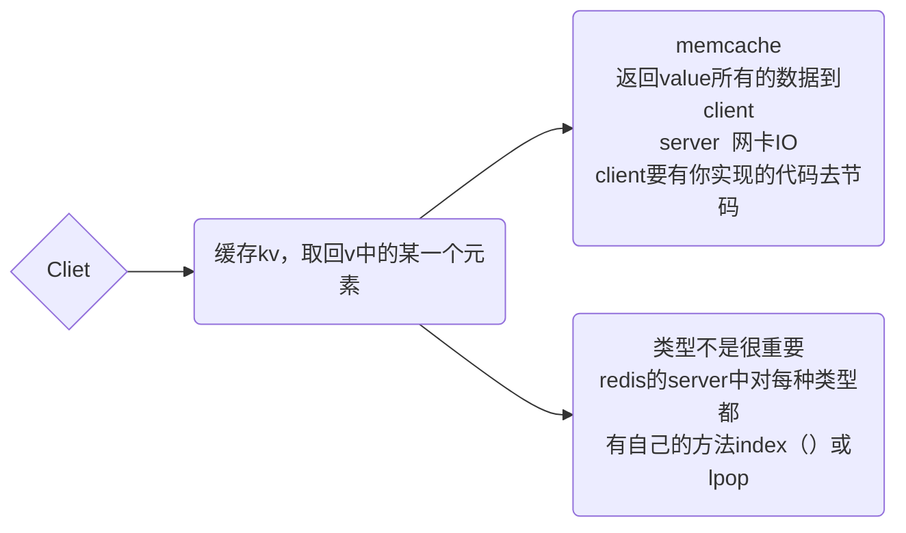

##### 原理：计算向数据移动

#### 3、安装

##### 1、配置：

centos 6.x

redis 官网5.x

##### 2、官网

http://download.redis.io/releases/redis-5.0.5.tar.gz

##### 3、安装步骤

1，yum install wget

2,cd ~

3,mkdir soft

4,cd soft

5,wget  http://download.redis.io/releases/redis-5.0.5.tar.gz（wget+软件地址下载）

6,tar xf  redis...tar.gz

7,cd redis-src

8,看README.md（任何软件可用）

9, make 

​	 ....yum install gcc （装编译器）

​	.... make distclean（出错后，清一下）

10,make

11,cd src  ....生成了可执行程序

12, cd ..

13,make install PREFIX=/opt/mashibing/redis5（把可执行程序这个文件放到了指定路径）

14,vi /etc/profile（把它变成sever服务，追加到环境变量）

​	...  export REDIS_HOME=/opt/mashibing/redis5

​	...  export PATH=$PATH:$REDIS_HOME/bin

​	..source /etc/profile

15,cd utils

16,./install_server.sh （可以执行一次或多次） （默认端口号6379）(可重复装多个实例，端口号不一致用于区分)

​	  a) 一个物理机中可以有多个redis实例（进程），通过port区分

​	  b) 可执行程序就一份在目录，但是内存中未来的多个实例需要各自的配置文件，持久化目录等资源

​	  c) service  redis_6379 start/stop/stauts   >  linux  /etc/init.d/**** （常识）

​	  d)脚本还会帮你启动！(service redis_6379 status)

17,ps -fe | grep redis （验证）

#### 4、理论

##### 1、插曲

1、 BIO时期

早期因为socket在这个时期是blocking     


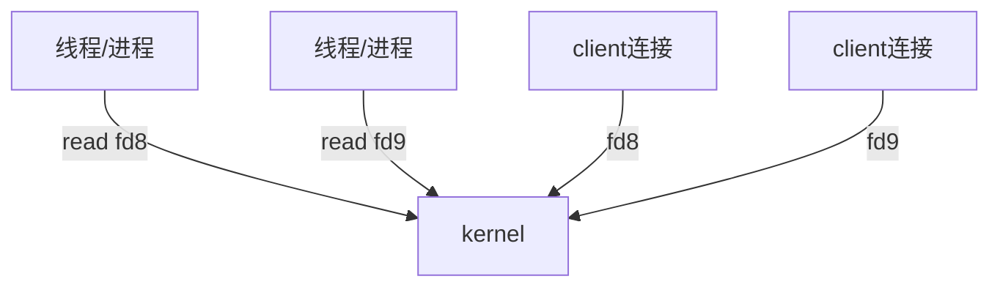

2、同步非阻塞  NIO

如果有1000fd 代表用户进程轮询调用1000次kernel

问题：（成本问题）

轮询发生在用户空间

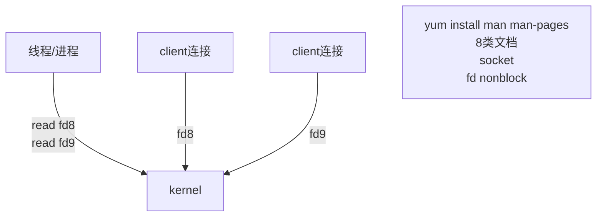

3、多路复用  NIO   用户态    内核态

内核的发展让系统复杂度降低

更精准的系统调用

问题：fd相关数据考来考去

[具体参考：Redis前无古人后无来者]: D:\IT\BigData\node\BigDataArchitect-master\BigDataArchitect-master\bigdata-redis\node\01Redis前无古人后无来者.pos

4、多路复用   NIO（伪AIO）

增加了共享空间：通过mmap内核实现

[具体参考：Redis前无古人后无来者]: D:\IT\BigData\node\BigDataArchitect-master\BigDataArchitect-master\bigdata-redis\node\01Redis前无古人后无来者.pos

5、kernel

​      kafuka

[具体参考：Redis前无古人后无来者]: D:\IT\BigData\node\BigDataArchitect-master\BigDataArchitect-master\bigdata-redis\node\01Redis前无古人后无来者.pos


##### 2、思维逻辑

1、redis单进程，单线程，单实例   并发很多的请求     如何变得很快的呢？

运用了epoll   （“顺序”性：每连接内的命令顺序）

与nginx类似

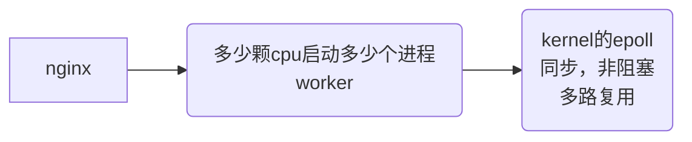

<font color='Red'> 注：只有windows有AIO，Linux只有NIO </font>>

2、cpu只有1颗

​      JVM: 一个线程的成本 1MB

​		1，线程多了调度成本CPU浪费

​		2，内存成本

3 redis默认16个库（16个独立的区域，隔离的，可配置）

## 3、redis使用

###         1、通用

​	1、@generic（通用组，全局，基本配置）：KEY（面向key）：DEL（删除） 、EXISTS（是否存在）、EXPIRE（存活时间）、KEYS（筛选key）、MOVE（移动）、OBJECT（查询Key自身的object定义）、PERSTST（持久化）、TYPE、FLUSHDB（慎用，删库跑路）。

​	2、KEY：type：描述的value的类型。  encoding：OBJECT   encoding  k2  （编码）

​	3、二进制 安全     字节流*  （redis  hbase   （一个字符一个字节））  字符流

​	4、编码不影响数据存储，存储字符长度与当前编码集有关，存储之后不会改变，当改变当前编码集会报乱码，因为底层是按字节存的。

​	5、redis不存在数据类型，在用户端要沟通好编码和解码，

### 	2、五种基本类型

#### 	1、@String

##### 		1、字符串

例如：

set k1（没有类型） hallo

get k1

<font color=red > set k1 ooxx   nx   (nx(新建)：只有当K1不存在的时候才去设置，使用场景：分布式锁)</font>>

<font color=red>  set k2 hello  xx (xx(更新):只有K2存在的时候才能操作)</font>>

mset k3 a  k4 b

mget k3 k4

APPEND  k1 "world"(追加字符)

GETRANGE k1  6  10（去特定位置的字符串，从0开始）

注：正反向索引（正0，1，2）（反：-2 ，-1）（0到-1，全选）

SETRANGE K1  6(偏移量)   mas   （从偏移量处覆盖）

STRLEN  k1（查询字符段长度）

##### 		2、数值

INCRBY  k1   22（加22）

DECRBY k1   22（减22）

INCRBYFLOAT  k1   0.5（加0.5）

<font color=red> SET k1 a,   GETSET k1 b,   结果：返回a，替换为b（减少了一次IO通信）</font>>

MSETNX k1 a  k2 b  （原子性操作，一个失败，全部返回）

抢购，秒杀，详情页，点赞，评论

规避并发下，

对数据库的事务操作

完全由redis内存操作代替

##### 		3、bitmap

setbit  k1 1 1   （k1长度为1    get@   ASCLL码    二进制8位为一个字符）

字符集 ascii    其他一般叫做扩展字符集

扩展： 其他字符集不在对ascii重编码

0xxxxxxx    你自己写一个程序，字节流读取，每字节判断

redis-cli--raw (会匹配当前客户端的字符集，不加--raw，则默认16进展) 

bitcount k1 0  1（在01的范围内1出现的次数）

bitpos  k1 1 0 0（字节的范围）（返回1在二进位的首次位置，而非字节）

bitop  and  andkey  k1 k2（按位与 ，全一则一）

bitop   or orkey   k1 k1（按位或，有一则一）

1,有用户系统，统计用户登录天数，且窗口随机

​		setbit sean 1 1

​		setbit sean 7 1

​		setbit sean 364 1

​		STRLEN sean

​		BITCOUNT sean -2 -1

2，京东就是你们的，618做活动：送礼物

​		大库备货多少礼物

​		假设京东有2亿用户

​		僵尸用户         冷热用户/忠诚用户

​		活跃用户统计！随即窗口

​		比如说 1号~3号 连续登录要   去重

​		setbit 20190101  1 1

​		setbit 20190102  1 1

​		setbit 20190102  7 1

​		bitop or  destkey 20190101 20190102

​		BITCOUNT destkey 0 -1 

#### 	2、@List

链表。有环的和无环的一般都是无环双向链表      具有正负索引

对一个链表进行增删改查

​	Lpush  k1  a b c d（从左边添加元素到K1，存储顺序：dcba）

​	Lpop k1（结果d）

​	Rpush k2  a  b c  d（从右边添加元素到K2，存储顺序：abcd）

​	Rpop k2 （结果d）

​	LRANGE（k1，k2） 0  -1    （返回结果：dcba。abcd）

​	LINDX  k1  2（返回结果：c     根据索引取值）

​	LREN  k1   2    a （移除最先出现的 2个a，2是前两个，-2是后两个）

​	LINSER   k1   after/before  6   a   （在元素6的后或前面插入a，如果有两个元素6，默认在第一个6后操作）

​	LTRIM    k1  0   -1（一个元素也没删除）（会对两端进行删除）

栈  ：同向命令

队列 ：反向命令

数组：索引取值

阻塞，单播队列    FIFO   （blpop  ooxx   0    阻塞弹出，如果有数据就弹出，没有就阻塞，可以指定阻塞时间，支持消息订阅）

#### 	3、@Set

​	去重，无序(随机)

​	sadd  k1  a b c d a a（添加a b c d）

​	smembers k1(查询)

​	srem k1  a b（删除a b）

​	k2（12345）k3（45678）

##### 1、交并差集

​	sinter  k2 k3  （4 5）

​	sinterstore  dest  k2  k3    smembers  dest（4 5）

​	sunion K2 K3(并集)

​	sdiff k2 k3（123）  sdiff  k3 k2（678）（外差）

​	集合操作相当多

##### 2、随机事件

srandmember：

​	SRANDMEMBER key count

​	正数：取出一个去重的结果集（不能超过已有集）

​	负数：取出一个带重复的结果集，一定满足你要的数量

​	如果：0，不返回

​	场景：抽奖：10个奖品      用户： <10  >10    中将：是否重复      解决家庭争斗！

spop：    取出1个

#### 	4、@sorted_set

##### 1、前置知识

​	去重且排序（数值序和字典序）

​	元素与分值维度

​	分值为1，按名称的字典排序

​	索引

​	物理内存：左小右大，不随命令发生变化

##### 2、命令

​	Z开头

​	zadd k1 8 apple 2 banana 3 orange

​	zrange  k1  0   -1（分值从低到高好）

​	zrevrange（分值从高到低）

​	zrange  k1  0   -1 withscoes（取出全部）

​	zrangebyscore  k1  3   8（按分值去取）

​	zscore  k1  apple（元素取分值）

​	zrank   k1  apple（取出排名，从零开始）

​	ZINCRBY  k1 2.5  banana   (分值增加，排行榜)

##### 3、集合操作

​	k1（80tom，60sean   70baby）

​	k2（60tom   100sean   40yiming）

​	ZUNIONSTORE   (目标k)unkey（k的数量）2  k1 k2    （权重）weights1  0.5   

​	ZUNIONSTORE   (目标k)unkey（k的数量）2  k1 k2    （聚合）aggregate max（并集）

​	也可以取交集

排序是怎么实现的增删改查的速度？（<font color=red>存储结构     skip list  跳跃表    类平衡树</font>）

在数据量大，增删改查频繁下，平均值最优

随机造层：牺牲存储空间换取查询速度

指针改变

​	

#### 5、@Hash

mao（k—v）

命令：字符串命令前加H

hset sean  name  lihua

hmset  sean   age   18   address   bj

hget sean  name

hmget  name  age

hkeys  sean

hvals sean

hgetall  sean

hincrbyfloat  sean  age  0.5（没有减法，可以加负数）

应用场景：点赞，收藏，详情页

## 4、redis进阶(单机)

### 1、redis进阶使用

#### 1、管道（pipelining）

啤酒理论

##### 方法一

yum install nc

nc localhost 6379

keys *

##### 方法二

echo -e ” set k2  99\nincr k2 \n get k2“|nc localhost 6379

#### 2、从文件中批量插入数据

#### 3、redis发布订阅

例子：直播聊天室

@pubsub

publish  ooxx  hallo

redis_cli   SUBSCRIBE  ooxx

(首先客户端要开启通道，只要通道中出现消息，所有的订阅者都能收到订阅，监听之后才能收到)

看到历史聊天记录

发布订阅的场景如下：

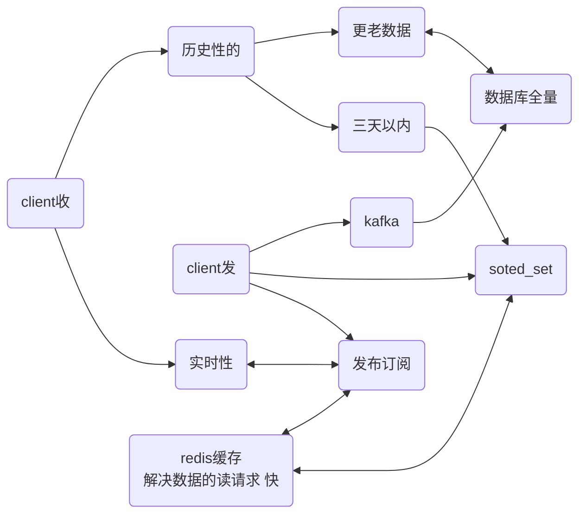

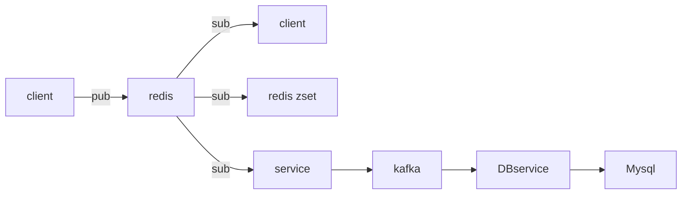

#### 4、redis事务

@transactions

redis是单进程

谁的exec（执行事务）先到达，先执行谁的事务

mutli：开启事务

discard：取消事务

watch:（监控）  乐观锁，watch k1 在mutli之前 （如果k1被修改，返回为空）

redis不支持回滚

#### 5、redis模块 redisbloon(bloon过滤器)

##### 1、安装、

1、访问redis.io

2、modules

3、访问RedisBloom的github

   https://github.com/RedisBloom/RedisBloom

4、linux中wget *.zip

5、yum install unzip

6、unzip *.zip

7、make

8、cp bloom.so /opt/mashibing/redis5/

9、redis-server --loadmodule /opt/mashibing/redis5/redisbloom.so

10 、redis-cli 

11、bf.add ooxx abc

bf.exits  abc

bf.exits sdfsdf

12、cf.add  # 布谷鸟过滤器

##### 2、作用

概率解决问题

不可能百分百阻挡恶意请求

\>1%

##### 3、原理

1，你有啥

2，有的向bitmap中标记

3，请求的可能被误标记

4，但是，一定概率会大量减少放行：穿透

5，而且，成本低

##### 4、方法

BF，CF

##### 5、其他实现

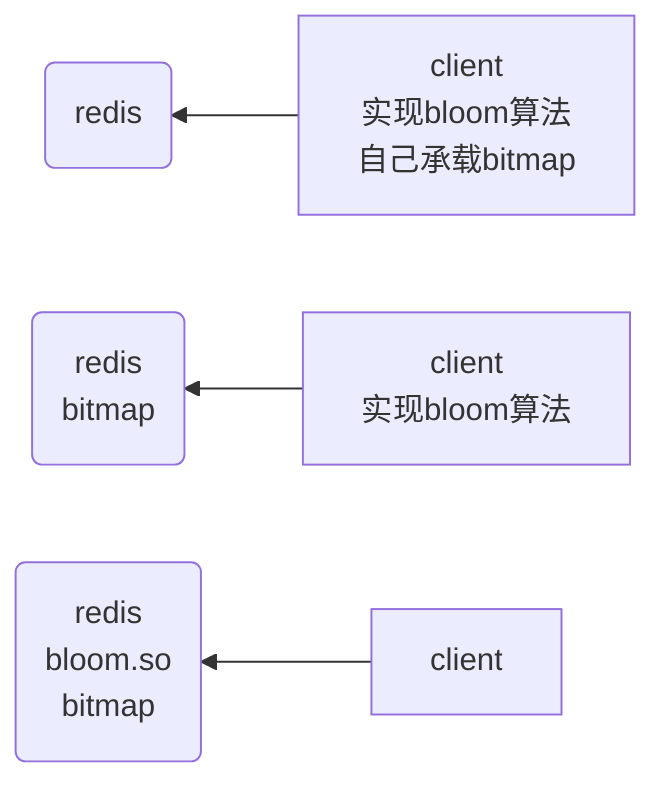

##### 6、过滤器

bloom

布隆过滤器

counting bloom

cukcoo

布谷鸟过滤器

##### 7、情况

情况一

​	1，穿透了，不存在

​	2，client，增加redis中的key，value标记，下一次命中不走过滤器，客户端自己处理

情况二：

​	1，数据库增加了元素

​	2，完成元素对bloom的添加

### 2、redis作为数据库/缓存的区别

#### 1、区别

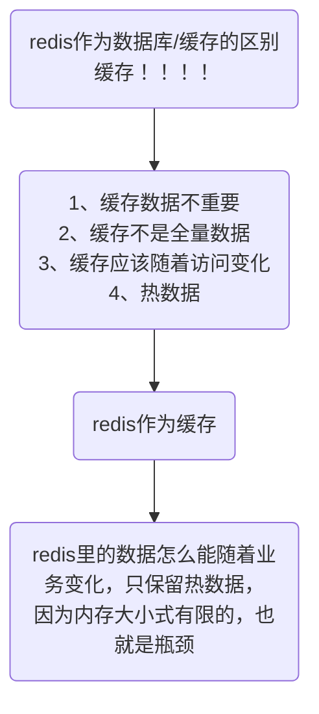

#### 2、逻辑

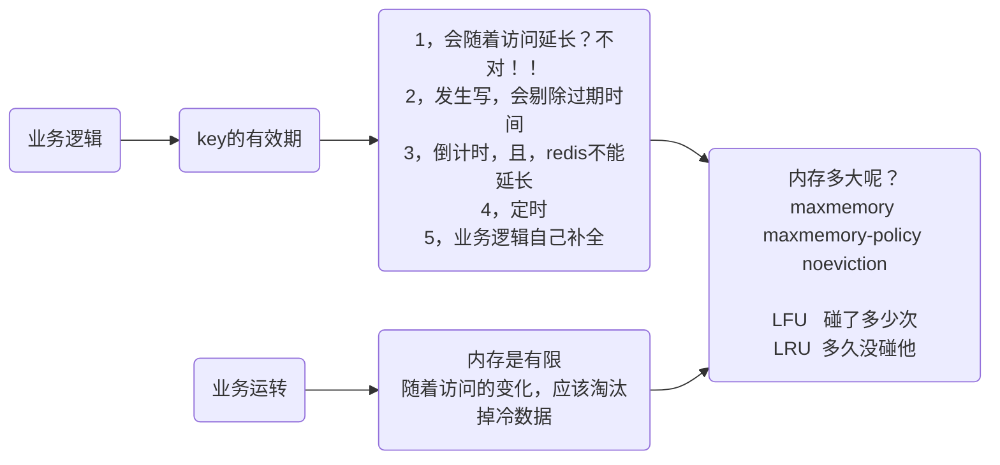

过期原理：

​			1，被动访问时判定

​			2，周期轮询判定（增量）

*，目的，稍微牺牲下内存，但是保住了redis性能为王！！！！

参考配置文档：etc/redis/6379.conf

include

loadmodule

参考网站回收策略

#### 3、命令

ttl k1,检查多少秒过期

expire   k1  50(五十秒后过期)

expireat k1  时间戳（定时）

time （取时间戳 ）

### 3、缓存常见问题，面试回答思路

#### 1、常见问题

击穿  雪崩    穿透     一致性（双写）

#### 2、缓存，内存，数据库

缓存：数据可以丢 急速！

数据库：数据绝对不能丢的 速度+持久性

内存：掉电易失！

redis+mysql 》 数据库 《 不太对

### 4、redis的持久化

单点持久化

#### 1、存储层

​	1、快照/副本

​	2、日志

#### 2、RDB

##### 	1、类型

阻塞式：快照期间redis不对外提供服务

非阻塞式：

1、非阻塞redis继续堆外提供服务

2、将数据落地

##### 	2、知识补充

###### 1、管道：

​	1，衔接，前一个命令的输出作为后一个命令的输入

​	2，管道会触发创建【子进程】

​	echo $$ |  more

​	echo $BASHPID | more

​	$$优先级 高于 | 

###### 2、父子进程

使用linux的时候：

命令pstree

​	父子进程

​		父进程的数据，子进程可不可以看得到？

思想：

​	常规思想，进程是数据隔离的！

​	进阶思想，父进程其实可以让子进程看到数据！

linux中

​	export的环境变量，子进程的修改不会破坏父进程

​	父进程的修改也不会破坏子进程

创建子进程的速度应该是什么程度

​	如果父进程是redis，内存数据比如10G

​		1，速度

​		2，内存空间够不够

##### 3、 RDB

​	1、时点性

​	2、save

​		明确：比如，关机维护

​	3、bgsave

​		fork   创建子进程

​	4、配置文件中给出bgsave的规则： save这个标识

​		save 900 1

​		save 300 10

​		save 60 10000

​		dbfilename dump.rdb

​		dir /var/lib/redis/6379 

​	5、弊端

​		1、不支持拉链只有一个dump.rdb	

​		2、丢失数据相对多一些      时点与时点之间窗口数据容易丢失      8得到一个rdb，9纲要洛一个rdb，挂机了

​		3、优点：类似java中的序列化    恢复的速度相对快

#### 3、ADF

##### 1、AOF  redis的写操作记录到文件中

###### 	1、丢失数据少

###### 	2、redis中，RDB和AOF可以同时开启

​		如果开启了AOF   只会用AOF恢复

​		4.0以后：AOF中包含RDB全量，增加记录新的写操作

​	情景：	redis运行了10年

​			开启了AOF

​			10年头，redis挂了

​			1，AOF多大：很大，10T

​			*，恢复，会不会溢出

​			2，恢复要多久：恢复用5年

###### 	3、AOF中包含RDB全量，增加记录新的写操作

​		日志，优点如果能保住，还是可以用的

​		结果：设计一个方案让日志，AOF足够小

​			1、hdfs，fsimage+edits.log      让日志只记录增量     合并的过程

​			2、4.0以前

​				重写

​				删除抵消的命令    合并重复的命令

​				最终也是一个纯指令的日志文件

​			3、4.0以后

​				重写

​				将老的数据RDB到aof文件中       将增量的以指令的方式Append到AOF

​				AOF是一个混合体     利用了RDB的快     利用了日志的全量

###### 	4、原点：redis是内存数据库

​		写操作会触发IO

​			1、APPND ONLY MOOD（配置文件）

​				appendonly yes

​			       appendfilename "appendonly.aof"

​			2、自动ADF重写（BGREWRITEAOF)

​				 auto-aof-rewrite-percentage 100

​			       auto-aof-rewrite-min-size 64mb

​			3、 三个配置项

​				appendfsync always

​				appendfsync everysec(数据相对丢失最少)

​				appendfsync no 

​			redis-->kernel fd8 buffer-->磁盘

ps -fe|grep redis(进程)

GENERAL：

​	daemonize  no(不让他变成后台服务，静默运行，让他可以在前台阻塞执行)

​	日志文件路径注释掉（让他显示在屏幕上，而不是写进日志）

appendonly  yes

混合新特性：aof-use-rdb-preamble no

redis-server   /etc/redis/6379.comf

redis-cli

appendonly。aof

*:几个元素组成$：几个字符或字节组成

日志：var/lib/redis

dgsave：dump.rdb:redis-check-rdb dump.rdb

老版本：清垃圾日志：BGREWRITEAOF：将重复操作的删除掉 

新版本：aof-use-rdb-preamble yes：增量日志加全量实点数据

误操作不要触发：BGREWRITEAOF(覆盖掉)，触发之后历史数据消失，只有最新数据

退出：Ctrl C

## 5、redis  集群

### 1、前置知识

#### 1、redis   单机   单进程  缓存   数据库-->RDB  AOF

#### 2、单机、单节点、单实例

​	1，单点故障

​	2，容量有限

​	3，压力

​	解决：	AKF拆分（微服务拆分的第一原则）

​			X：全量，镜像   读写分离 ，一写全读（X）

​			Y：业务，功能   数据分类存储（Y）

​			Z：优先级，逻辑再拆分

#### 3、新问题

​	1、通过AKF

​		一变多

​		数据一致性！！！！

​		所有节点阻塞直到数据全部一致

​		*，同步方式阻塞方式：强一致性！

​		破坏可用性！反问自己：为什么一变多，解决可用性

​		*，通过异步方式：1，容忍数据丢失一部分

​	2、强一致性  破坏可用性

​		弱一致性  丢失数据

​	3、+kafka   可靠，集群   响应速度够快

​		最终数据会一致

​		取数据时候，有可能在一致性之前取到不一致的数据      强调：强一致性

### 2、集群的主的高可用

#### 1、问题与解决

主备-->主从复制-->主  读写   自己又是一个：单点

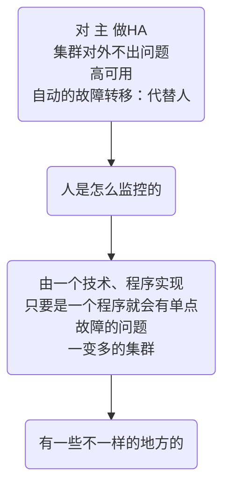

#### 2、如何监控（paxos算法）

参考HDFS的HA，paxos算法，Zookeeper，CAP原则

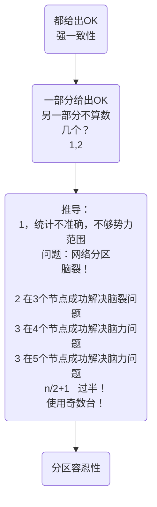

### 3、主从复制

redis默认异步复制（第二种）：低延迟，高性能

老版本：SLAVVEOF  主机+端口号

新版本：REPLICAUF 主机+端口号

主从复制配置：

​	replica-serve-stale-data yes

​	replica-read-only yes

​	repl-diskless-sync no

​	repl-backlog-size 1mb 

​	#增量复制

​	min-replicas-to-write 3

​	min-replicas-max-lag 10

需要人工维护主的故障问题

### 4、单节点的容量问题

#### 1、解决方法（发生在客户端）

##### 1、数据可以分类，交集不多

​	逻辑：业务拆分

##### 2、数据没办法划分拆解

​	算法：

​	hash+取模    modula

​	弊端：

​	取模的数必须固定

​	%3     %4   %10

​	影响分布式下的扩展性

##### 3、数据没办法划分拆解

​	逻辑：random     

​	  lpush   rpop

​	消息队列   kafuak

##### 4、数据没办法划分拆解

​	逻辑：

​	kemata     一致性哈希     没有取模    data，node

​        hash：

​	crc16   crc32   fnv    md5   [映射]算法

​	规划一个环形  哈希环-->虚拟节点-->解决数据倾斜问题

#### 2、哈希环（缓存）

优点：

你加节点，的确可以分担其他节点的压力，不会造成全局洗牌

缺点：

新增节点造成一小部分数据不能命中

1，问题，击穿，压到mysql

2，方案：没去取离我最近的2个物理节点

更倾向于 作为缓存，而不是数据库用！！！！

#### 3、redis 的连接成本很高

问题：

redis

的连接成本很高

对server端造成的

解决：+proxy（代理层）无状态    gethub  twemproxy

​		代理层：

​		逻辑实现！

​		modula  random   kemata

关注代理成性能

反向代理与负载均衡

更进一步：

无论企业后面技术多么复杂对于客户端，是透明的

​		引入  LVS （VIP）集群和 nginx proxy集群

​		引入keepalived进行监控，保障集群的高可用

弊端：3个模式不能做数据库用

预分区

#### 4、预分区（redis Cluster模式）

16384个槽位   无主模型  CRC16算法

+槽位概念

client   proxy    算法    如果取模 是10      模数值的范围：0,1,2,3,4，。。。9

mapping  0,1,2

mapping   5,6,7

mapping   3,4,8,9

redis客户端增加了一个取模算法和所有人的映射关系

问题：

​	数据分治

​	聚合操作很难实现

​	事务

​	交集

hash tag    {oo}k1   {oo}k2

### 5、redis 集群代理搭建

predixy

twemproxy

redis自身

#### 1、搭建twemproxy

在soft目录下创建twemproxy的空目录

git  clone   GitHub

yum update nss （升级）

yum install automake   libtool

```html
autoreconf -fvi
```

yum  search autoconf（ 出现版本过低）

​	仓库版本过低

​	opsx.aliyun    epel

​	cd etc/yum.reps.d/    epel指令

​	yum clean  all（清缓存）

yum  search autoconf

yum install  最新版例如：autoconf268

autoreconf268 -fvi

执行完多了一个configure

```html
./configure 
```

```html
make
```

src的目录有nutcracker

cd..   scripts  nutcracker.init

shell命令：D：删除以下全部

命令：

​	keys*（不支持）

​	watch  k1（不支持）

​	MULTL  事务（不支持）

#### 2、搭建predixy

1、github  relenses

2、创建新目录

wget 命令（下载）

tar xf 文件（解压）

配置：参考GitHub

主配置文件

哨兵的配置文件

shell命令：（开启命令模式）。（光标的位置）,$(最后一行)y(复制)  S（查找替换）/#//（#替换为空）

group的名字：

​	哨兵（26379）的配置文件中 sentinel monitor  group名字  127.0.0.1   36379  2

​							sentinel monitor  group名字  127.0.0.1   46379  2

​	哨兵（26380）的配置文件中 sentinel monitor  group名字  127.0.0.1   36379  2

​							sentinel monitor  group名字  127.0.0.1   46379  2

​	哨兵（26381）的配置文件中 sentinel monitor  group名字  127.0.0.1   36379  2

​							sentinel monitor  group名字  127.0.0.1   46379  2

redis-sever 26379.conf  --sentinel(启动哨兵模式)

#### 3、redis自身

redis安装目录  utils  create-cluster(创建集群)

vi  REANDME\

./create-cluster start(跑起来6个redis)

./create-cluster create （分赃，分槽位）

redis -cli -p 30001

redis -cli -c -p 30001（专用客户端）

set {oo}k1（用oo进行槽位计算）

可以开启监控和事务了

./create-cluster stop

redis -cli  --cluster help

可以手工进行创建集群

槽位移动：reshard  127.0.0.1:30001 （解决数据倾斜）

移动量，移到id，被移到id done（结束）

info  check

## 6、面试常问

击穿，穿透，雪崩，分布式锁，API  （jedis，luttce，springboot：low/high level）

### 1、击穿，穿透，雪崩

#### 	1、击穿

befor：肯定发生了高并发

KEY的过期造成并发访问数据库

由于key的过期时间（冷数据与热数据），数据刚被清掉就被一大批流量访问，当redis缓存没有时，会请求数据据库。

解决：

并发有了：阻止并发到底DB

redis里面又没有KEY

redis单进程，单实例

​	setnx() -> 锁

​	1，get key（都去取key）

​	2，setnx（）

​	3-1，ok，去  DB（得到锁的去数据库）

​	3-2，false，sleep -> 1（没得到锁的睡眠 ）

问题：

1，如果第一个人挂了？

可以设置锁的过期时间

2，没挂，但是，锁超时了。。。、

多线程

一个线程取DB

一个线程监控是否取回来。更新锁时间

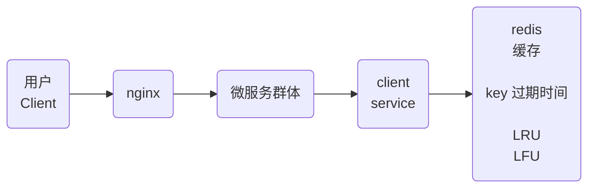

#### 2、穿透

从业务接收查询的是你系统根本不存在的数据

解决：布隆过滤器

​	client包含

​	算法  bitmap ->redis  无状态

​	redis集成布隆

问题:

​	不能删除

​	布谷鸟

​	空key

#### 3、雪崩

雪崩-->击穿

1、大量的key同时失效

2、间接造成大量的访问到达DB

解决：随机过期时间

1、零点

​	1、强依赖击穿方案（流量放过）

​	2、业务层加判断  零点延时。。。（流量阻断）

2、时点性无关

### 2、分布式锁

1，setnx

2，过期时间

3，多线程（守护线程）延长过期

redisson 

zookeeper 做分布式锁！-->跳到ZooKeep

### 3、API

jedis，luttce，springboot：low/high level

#### 1、jedis

参考gethub

#### 2、luttce

参考github

#### 3、springboot

参考spring官网，springdata和springboot

connection Modes

RedisTemolate

redis安全模式CONFIG GIT*

protected-mode（禁止远端访问。只允许本机访问）

CONFIG set protected-mode  no（临时修改）

高阶API

@Autowired

RedisTemplate

StringRedisTemplate

低阶API

RedisConnection com= redisTmeplata.getConnectionFactory().getConnection;

conn.set("a".getBytes(),"b".getBytes())

#### 4、low/high level
